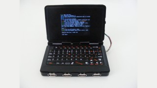
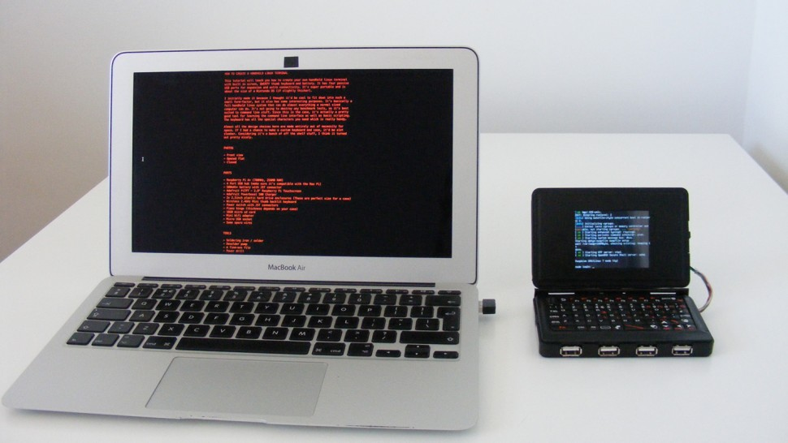

# [Gizmodo](http://m.gizmodo.uol.com.br/)

### [Linux](http://m.gizmodo.uol.com.br/linux/)

# [Este cara construiu um dispositivo portátil que roda Linux em linha de comando](http://m.gizmodo.uol.com.br/portatil-linux-linha-comando/)

Por: [Rodrigo Ghedin](http://m.gizmodo.uol.com.br/author/rodrigo/ "Posts de Rodrigo Ghedin")

13 de janeiro de 2015 às 13:50

COMPARTILHE 

 134 

 0

O Linux é sensacional. Ele move boa parte da web e é a base de coisas que usamos no dia a dia, como o Android e diversos modelos de roteadores. Apesar disso, as distribuições mais amigáveis não são tão populares. Linha de comando, então? “Não sou ráquer”, diria sua primo que faz Direito ao ver aquelas letrinhas brancas num fundo preto. Não é surpresa, pois, que dispositivos portáteis rodando distros não muito amigáveis não existam. Eu, pelo menos, não me recordo de nenhum produto comercial que chegue perto de lembrar o projeto que Chris Robinson desenvolveu. Ele criou uma espécie de Nintendo DS que roda Linux em linha de comando.

Todo o trabalho de Chris [está documentado nesta página](http://n-o-d-e.net/post/107977286006/how-to-create-a-handheld-linux-terminal). Ele fornece as instruções, tanto do hardware (baseado no Raspberry Pi), quanto no software (a distro [Raspbian](http://www.raspbian.org/)). Como você vê na foto acima, o resultado é meio desengonçado, mas totalmente funcional. E o mais curioso é que ele conta com quatro (!) portas USB na frente, o dobro do que tenho disponível no meu notebook :-/

Não parece ser um trabalho simples, [apesar do guia ser bem detalhado](http://n-o-d-e.net/post/107977286006/how-to-create-a-handheld-linux-terminal). É preciso lidar com a interface em linha de comando do Linux, e também ter alguma habilidade manual para soldar, desmontar e montar as peças que formam o dispositivo. Chris diz que a motivação inicial para o projeto foi por ter achado que seria legal criar um computador tão pequeno, mas que depois de pronto, encontrou utilidades para ele. É, por exemplo, uma boa ferramenta para aprender Linux em CLI e scripting básico. O teclado contempla todos os caracteres especiais, então não é preciso fazer malabarismos (ou ficar chupando o dedo) com algum menos óbvio.

Alguém aí encara o desafio? [[N O D E](http://n-o-d-e.net/post/107977286006/how-to-create-a-handheld-linux-terminal)]

  
VOLTAR AO TOPO

[VISITE A VERSÃO COMPLETA](http://www.gizmodo.com.br/portatil-linux-linha-comando/?modeview=full "Versão completa")
