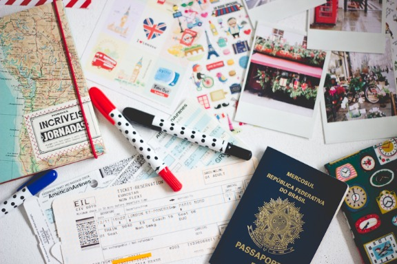
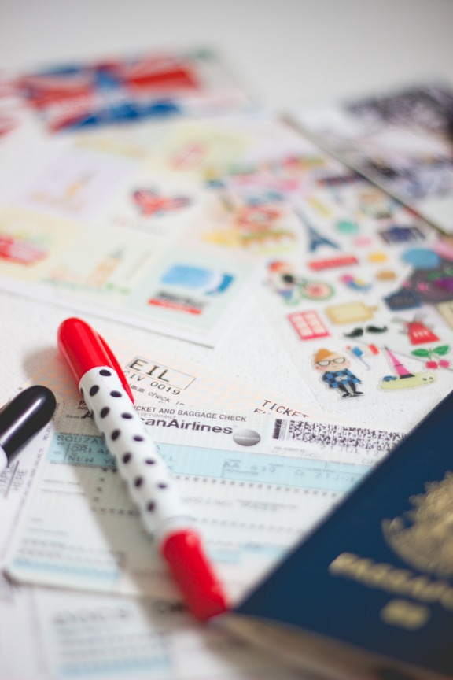
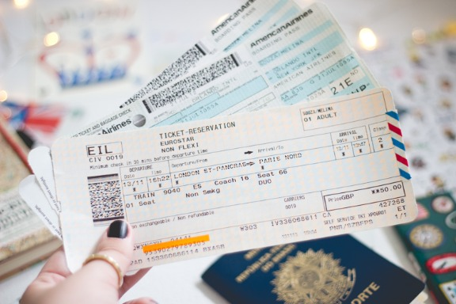

# Viagem internacional: comprando passagens!

Arquivado em: [Diário de viagem](http://melinasouza.com/category/diario-de-viagem/)

Assim que anunciei a minha viagem para Londres, comentei que iria fazer alguns posts com dicas para organizar uma viagem internacional. No primeiro post falei sobre [passaporte e visto](http://melinasouza.com/2014/09/03/passaporte-e-visto/) e hoje vou falar sobre passagens. Pedi para vocês deixarem as suas dúvidas nos comentários, selecionei e pedi para a minha amiga **Sarah Dianovsky** me ajudar a responder.

A Sarah é gerente na TAM Viagens. Foi com ela que comprei minhas passagens para Londres e também para viagens que fiz pelo Brasil mesmo. Super recomendo!

**QUAL A MELHOR FORMA DE PESQUISAR OS PREÇOS DAS PASSAGENS?**

Você pode fazer por duas formas: procurar uma profissional especializado para fazer a pesquisa para você (agente de viagens) ou fazer por conta própria.

Caso você seja um viajante de primeira viagem ou tiver menos de 18 anos e vai viajar sozinho, a primeira opção é mais recomendada. O agente ficará responsável por procurar o melhor vôo, com menor preço e acompanhará sua reserva até a viagem. Assim você evitará surpresas de qualquer tipo como alteração de horários que não foram avisados, cancelamentos errôneos dos seus vôos e te auxiliar em solicitações especiais como comida vegetariana, sem glúten ou sem lactose, acompanhamento especial de menores, auxílio especial para embarque, cadeira de rodas etc. O agente também irá te orientar sobre documentações necessárias para a viagem e te dará dicas para aproveitar melhor o seu destino. Essa é a forma mais segura de programar sua viagem.

Para começar sua pesquisa sozinho, você deve, inicialmente, procurar quais companhias aéreas voam para o destino escolhido. Algumas companhias “revendem” as passagens das companhias parceiras, mas sempre dê preferência para as “donas” dos vôos, porque elas costumam fazer o melhor preço. Com a lista das companhias que voam para o local de destino, você pode optar por comprar as passagens em “sites agências de viagens” como [Submarino Viagens](http://www.submarinoviagens.com.br/passagens/selecionarvoo?SomenteIda=false&Origem=Sao%20Paulo%20/%20SP,%20Brasil,%20Todos%20os%20aeroportos%20(SAO)&Destino=Miami%20/%20FL,%20Estados%20Unidos%20(MIA)&Origem=Miami%20/%20FL,%20Estados%20Unidos%20(MIA)&Destino=Sao%20Paulo%20/%20SP,%20Brasil,%20Todos%20os%20aeroportos%20(SAO)&Data=13/05/2015&Data=20/05/2015&NumADT=1&NumCHD=0&NumINF=0&SomenteDireto=false&Hora=&Hora=&selCabin=&Multi=false&Cia&AffiliatedID=778&utm_source=pampa&utm_medium=Link_Texto&utm_campaign=passagem_sao_paulo_miami&s_cid=passagem_sao_paulo_miami) e [Decolar](http://www.decolar.com/), ou comprar diretamente no site da companhia aérea. A Sarah recomenda a segunda opção, pois a maioria desses sites tipo agências cobram taxas extras do próprio site, além das taxas da companhia aérea para remarcações e reembolso, ou seja, cobrará a mais sem necessidade. Diretamente com a companhia você evita esse risco.

**COM QUE ANTECEDÊNCIA É BOM COMPRAR AS PASSAGENS?**

A melhor época é de 6 a 8 meses antes da sua viagem. Mais do que isso você pode não encontrar tarifas promocionais (e muito próximo da viagem provavelmente também não). Uma dica importante é sempre dar preferência para viajar em baixa temporada, ou seja, fora de feriado e das férias escolares do seu país de origem (para as passagens, a regra de baixa e alta temporada segue sempre a origem do vôo). A baixa temporada é a melhor de viajar, porque como o fluxo de viagens diminui, as companhias aéreas tendem a fazer melhores preços para estimular a venda e, além disso, a quantidade de turistas será menor e você irá enfrentar menos filas, menos confusões e poderá aproveitar ainda mais as atrações/pontos turísticos.

**QUAIS AS VANTAGENS E DESVANTAGENS DE COMPRAR PASSAGENS COM ESCALAS?**

Existem dois tipos de “pausas” no seu vôo: a **escala** e a **conexão**. Na escala, o seu avião vai parar em uma cidade no “meio” do caminho e você não vai precisar sair do avião (vai seguir a viagem nele mesmo). Já na conexão, quando o seu avião parar você terá que sair da aeronave e embarcar em outra. Se a sua conexão for fora do país de origem, você precisará passar pela imigração e terá que pegar sua bagagem para possível inspeção (e depois despachá-la novamente).

A única vantagem é no preço. Só compre passagens com escala/conexão caso não exista vôos diretos e/ou se o preço estiver muito atrativo. É bom pensar se a diferença no preço vale o estresse de ter que mudar de aeronave e passar pela imigração, por exemplo. Vôos internacionais já são cansativos por si só e se você viajar pensando “nossa, daqui a pouco vou ter que descer e passar pela imigração! Tomara que eles não queiram abrir a minha mala e bagunçar tudo!” você já não consegue relaxar tanto.

A desvantagem é o risco de perder o seu segundo vôo e só ter vôo para o destino no dia seguinte. Nesse caso você vai ter que dormir na cidade, atrasar sua viagem e talvez perder algo que já estava planejando fazer assim que chegasse (excursão ou algum compromisso). É bom sempre levar isso em consideração caso compre passagens com conexão. O ideal é contar com 1 ou 2 dias de folga para não perder nenhuma atração da sua viagem caso tenha problemas no vôo.

**ALGUMA DICA PARA COMPRAR PASSAGENS MAIS BARATAS?**

Baixa temporada, monitoramento e flexibilidade. Se você quer preços melhores, procure sempre viajar nessa época (março à maio/ setembro à novembro). Você também precisa ficar monitorando a data que você quer viajar e não ter medo de fechar quando a oportunidade aparecer. Fique de olho todos os dias (ou sempre que possível) na sua passagem, verificando a variação de preços e testando várias datas possíveis. Quanto mais flexível for a sua disponibilidade para vôos e datas será mais fácil para conseguir o melhor preço.

Uma dica muito boa e que pode fazer muita diferença é acompanhar o site [**Melhores Destinos**](http://www.melhoresdestinos.com.br/). Lá você sempre encontra promoções de todas as companhias aéreas, mas tem que ser rápido porque as promoções acabam num piscar de olhos.

**PASSAGENS PARA ESTUDANTES (INTERCAMBISTAS, POR EXEMPLO) TÊM UM PREÇO DIFERENCIADO?**

A Sarah não trabalha com esse tipo de passagens, mas o que ela acha vantajoso é a remarcação sem custo (muito bom para quem ainda não tem data certa para voltar). Caso você já tenha a sua volta programada, você pode comprar uma passagem normal em uma promoção com preço mais baixo.

**DICAS IMPORTANTES:**

**1.** Na hora de escolher sua passagem, evite conexões fora do seu país de origem, pois caso contrário você terá que passar pela imigração e, se demorar mais do que o esperado, há o risco de perder o seu segundo vôo. Fique muito atento ao tempo de conexão (o recomendado é de três horas). É tranquilo caso a conexão aconteça no seu país de origem, pois você só terá que trocar de avião e mais nada.

**2.** Nunca compre os trechos da sua viagem separados. Por exemplo, se você vem de Las Vegas, fará conexão em Miami e depois irá para o Rio de Janeiro, compre todos os trechos Las Vegas > Miami > Rio de Janeiro no mesmo bilhete e reserva. Pode até usar duas companhias aéreas, mas compre tudo junto fazendo uma pesquisa só. Se por algum motivo na hora da viagem o seu vôo Las Vegas > Miami atrasar ou cancelar, a companhia aérea terá a responsabilidade de remarcar a ajustar sua viagem por completa até o destino final (no caso, Rio de Janeiro). Caso você compre separado e isso aconteça, você terá que fazer tudo sozinho e provavelmente terá que pagar pela remarcação, pois, nesse caso, a companhia não tem obrigação de auxiliar nem de remarcar. Melhor evitar esse estresse!

Uma outra vantagem de comprar o vôo todo junto é que em todos os trechos você terá a franquia de bagagem internacional (2 malas de 32kg). Por exemplo, se você comprar separado um trecho interno nos EUA e não tiver a franquia de bagagem inclusa, terá que pagar à parte e sairá caro (trechos internos na Europa também não tem franquia de bagagem inclusa). Leve isso em consideração porque a economia comprando o trecho separado pode sair bem mais cara tendo que pagar a franquia de bagagem (além dos possíveis problemas na hora da conexão).

**3.** Programe sua viagem evitando futuras remarcações e tenha certeza das datas antes de comprar. Quando você precisa mudar os vôos, todas remarcações possuem multa (em torno de 200 dólares), além da possibilidade de ter que pagar diferença de tarifa. Você pode se surpreender com o valor final (pode ser quase metade do valor da passagem que você comprou).

**4.** Fique sempre atento e consulte sua reserva sempre que possível até a viagem. As companhias aéreas podem mudar seu vôo, horário e/ou data e não te avisar (!), pois por algum motivo pode não ter conseguido entrar em contato com você. Então, para evitar surpresas indesejadas, seja precavido e consulte seu vôo via *call center* ou pelo site da própria companhia.

**5.** Nunca compre sua volta separada da sua ida ou vice-versa. As companhias aéreas possuem preço e desconto especiais para compra de passagem “round trip”, ou seja, ida e volta. Quando você pesquisa somente ida ou somente volta (one way), você vai descobrir que o valor é maior ou igual ao preço da “round trip”. Somente nas viagens com milhas ou pontos que o valor é o mesmo comprando trechos juntos ou separados. Caso você só tenha pontos/milhas para um trecho e precise pagar pelo outro, é recomendado que você deixe para usá-las em outra oportunidade em que seja o suficiente para todos os trechos.

**MINHA EXPERIÊNCIA:**

Quando decidi que iria me dar de presente um mês de férias em Londres, entrei no site [Decolar](http://www.decolar.com/) e fiquei monitorando os preços das passagens dos dias 01/10 até 31/10 e de 01/11 até 30/11. Quando percebi que o valor desse trecho no mês de Outubro tinha aumentado bastante, entrei em contato com a Sarah e pedi pra ela me auxiliar com as passagens para o mês de Novembro (o preço ainda estava bom). Ela verificou todos os preços para o período de um mês e fechamos a saída no dia 03/11 e a volta no dia 02/12 por 899,00 dólares mais as taxas (não lembro quanto saiu o preço final com a cotação do dólar na época). Esse foi o valor para os trechos Curitiba > São Paulo > Londres e Londres > São Paulo > Curitiba.

Foi tudo super tranquilo e, mais ou menos duas semanas antes da minha viagem, recebi um e-mail avisando que o trecho Curitiba > São Paulo tinha sofrido uma pequena alteração no horário (uma hora mais ou menos). No e-mail foi pedido que eu confirmasse o recebido e se estava tudo ok com a alteração. Não tive problema em nenhum dos trechos (tanto na ida quanto na volta) e confesso que, por ter comprado com agente, fiquei ainda mais tranquila porque sabia que se tivesse qualquer problema eu não teria que resolver tudo sozinha.

Como já disse no começo do post, super recomendo a **Sarah Dianovsky**. Além de excelente profissional ela é uma pessoa incrível (me ajudou a responder as perguntas de vocês, deu dicas e ainda se dispôs a responder mais perguntas sobre o assunto caso vocês tenham mais dúvidas). Quem quiser comprar passagens com ela pode entrar em contato por telefone **(21) 3553-4005**, Nextel **(21) 7751-8410**, por e-mail **sarah.dianovsky@agentetamviagens.com.br** ou pessoalmente na **TAM Viagens** do **Shopping Downtown** (Av. das Américas, 500 Bl 06, Loja117 – Barra da Tijuca).

Espero que tenham gostado do post e, **caso tenham mais dúvidas sobre passagens, por favor deixe nos comentários** que eu e a Sarah iremos responder.

O próximo assunto será **Seguro de Viagens**. Por favor, **deixem suas dúvidas sobre o tema** nos comentários para que eu possa produzir um conteúdo legal e ajudar vocês.

Para acompanhar o meu dia-a-dia é só me seguir no [**instagram**](http://instagram.com/melinwonderland) ;)

Obrigada por tudo, pessoal!

ps: Sah, muito obrigada pela ajuda! Você é incrível!

****[Youtube](http://www.youtube.com/aseriesofserendipity) **❤****** **[Instagram](http://instagram.com/melinwonderland/) **❤******[Twitter](https://twitter.com/melinwonderland) ❤ [Facebook](https://www.facebook.com/melinasouza) ❤ [Bloglovin’](http://www.bloglovin.com/en/blog/3479451) **❤ [Pinterest](http://www.pinterest.com/melinwonderland/) **❤**[Tumblr](http://aseriesofserendipity.tumblr.com/) **❤ [Goodreads](https://www.goodreads.com/user/show/17370552-melina-souza) **❤** [Flickr](http://www.flickr.com/photos/melinwonderland)******
