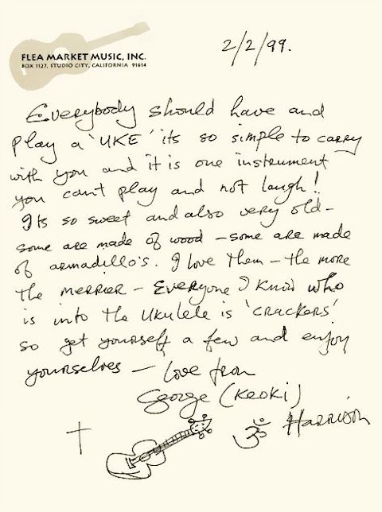

# [George Harrison Explains Why Everyone Should Play the Ukulele, With Words and Music](http://www.openculture.com/2014/08/george-harrison-explains-why-everyone-should-play-the-ukulele-with-words-and-music.html "Permanent Link to George Harrison Explains Why Everyone Should Play the Ukulele, With Words and Music")

in *[Music](http://www.openculture.com/category/music)* | August 5th, 2014 [3 Comments](http://www.openculture.com/2014/08/george-harrison-explains-why-everyone-should-play-the-ukulele-with-words-and-music.html#comments "Comment on George Harrison Explains Why Everyone Should Play the Ukulele, With Words and Music")

George Harrison loved the ukulele, and really, what’s not to love? For its dainty size, the uke can make a powerfully cheerful sound, and it’s an instrument both beginners and expert players can learn and easily carry around. As Harrison’s old friend [Joe Brown remarked](http://www.telegraph.co.uk/culture/culturevideo/musicvideo/10348225/Joe-Brown-on-ukuleles-and-George-Harrison.html), “You can pick up a ukulele and anybody can learn to play a couple of tunes in a day or even a few hours. And if you want to get good at it, there’s no end to what you can do.” Brown, once a star in his own right, met Harrison and the Beatles in 1962 and remembers being impressed with the fellow uke-lover Harrison’s range of musical tastes: “He loved music, not just rock and roll…. He’d go crackers, he’d phone me up and say ‘I’ve got this great record!’ and it would be Hoagy Charmichael and all this Hawaiian stuff he used to like. George was not a musical snob.”

“Crackers” may be the perfect word for Harrison’s uke-philia; he uses it himself in the adorable note above from 1999. “Everyone I know who is into the ukulele is ‘crackers,’” writes George, “you can’t play it and not laugh!” Harrison remained upbeat, even during his first cancer scare in 1997, the knife attack at his home in 1999, and the cancer relapse that eventually took his life in 2001. The ukulele seemed a sweetly genuine expression of his hopeful attitude. And after Harrison’s death, it seemed to his friends the perfect way to memorialize him. Joe Brown closed the Harrison tribute concert at Royal Albert Hall with a uke version of “I’ll See You In My Dreams,” and Paul McCartney remembered his friend in 2009 by [strumming “Something” on a ukulele at New York’s Citi Field](https://www.youtube.com/watch?v=Cr03NK3_Akc).

In his remarks, McCartney fondly reminisced: “Whenever you went round George’s house, after dinner the ukuleles would come out and you’d inevitably find yourself singing all these old numbers.” Just above, see Harrison and an old-time acoustic jazz ensemble (including Jools Holland on piano) play one of those “old numbers”—“Between The Devil and Deep Blue Sea”—in 1988. The song eventually wound up on his last album, the posthumously released [*Brainwashed*](http://www.allmusic.com/album/brainwashed-mw0000230837). Just below, see Harrison, McCartney, and Ringo Starr sing a casually harmonious rendition of the 1927 tune “Ain’t She Sweet” while lounging picnic-style in a park.

In Hawaii, where Harrison owned a 150-acre retreat, and where he was known as Keoki, [it’s said](http://unofficialkamakaukulele.wordpress.com/2012/03/10/george-harrison/) he bought ukuleles in batches and gave them away. The story may be legend, but it certainly sounds in character. He was a generous soul to the end. Just below, see Harrison strumming and whistling away in a home video made shortly before his death. You can hear the hoarseness in his voice from his throat cancer, but you won’t hear much sadness there, I think.

**Related Content:**

[Musicians Re-Imagine the Complete Songbook of the Beatles on the Ukulele](http://www.openculture.com/2013/02/musicians_re-imagine_the_complete_songbook_of_the_beatles_on_the_ukulele.html)

[Ravi Shankar Gives George Harrison a Sitar Lesson … and Other Vintage Footage](http://www.openculture.com/2012/12/ravi_shankar_rip_gives_george_harrison_a_sitar_lesson_and_other_vintage_footage.html)

[George Harrison Wrote His Last Letter to Austin Powers Creator Mike Myers, Asking for a Mini Me Doll (2001)](http://www.openculture.com/2014/07/george-harrison-wrote-his-last-letter-to-mike-myers.html)

[*Josh Jones*](http://about.me/jonesjoshua)*is a writer and musician based in Durham, NC. Follow him at [@jdmagness](https://twitter.com/jdmagness)*

##### Comments (3)

You can skip to the end and leave a response. Pinging is currently not allowed.

1. *Angel Sanchez Borges says . . .* |
   August 6, 2014 /
   10:03 am

   Peanuts frame (In Spanish):

   <http://otrasmusicas.org/banjo.jpg>

   salúd !
2. *Garett Barr says . . .* |
   November 2, 2014 /
   4:41 pm

   Does anyone have a hi res version of this picture? I would love to print it and put it on the wall of my studio.
3. *Elaine rose says . . .* |
   December 27, 2014 /
   5:07 pm

   Have just found your face book page. It looks really interesting and I’ll be visiting ng frequently.
