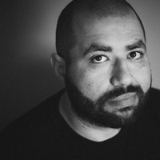
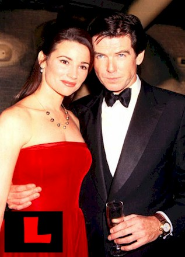
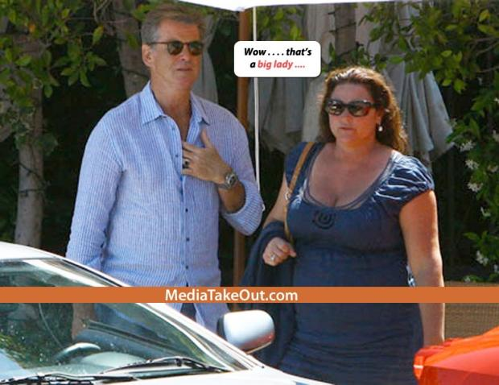
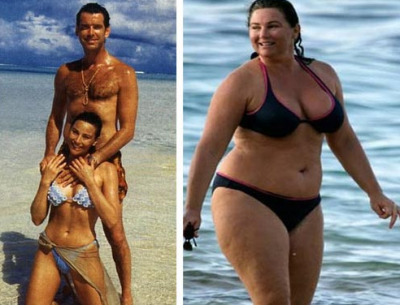
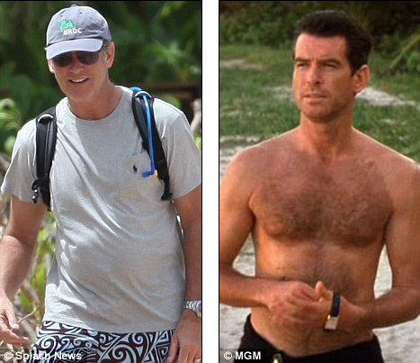
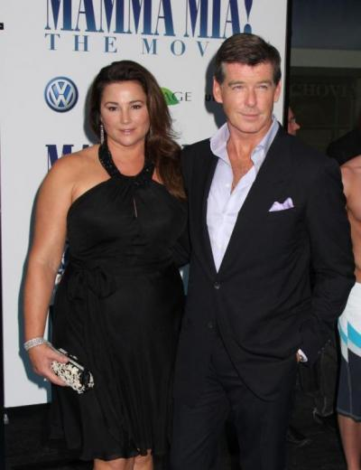

# E se a sua mulher engordasse?

[Alex Castro](http://www.papodehomem.com.br/autores/alex-castro#artigos)

[Mulheres](http://www.papodehomem.com.br/colecoes/mulheres), [Corpo são](http://www.papodehomem.com.br/colecoes/corpo), [Melhor do PdH](http://www.papodehomem.com.br/colecoes/melhor-do-pdh)

- [**32281**

  likes](http://www.papodehomem.com.br/pierce-brosnan-e-gordofobia#)
- [**14**

  tweets](http://www.papodehomem.com.br/pierce-brosnan-e-gordofobia#)
- [**0**

  google +](http://www.papodehomem.com.br/pierce-brosnan-e-gordofobia#)
- [**260**

  comentários](http://www.papodehomem.com.br/pierce-brosnan-e-gordofobia#disqus_thread)

E se, ainda por cima, você fosse um homem muito bonito? Pois foi o que aconteceu com Pierce Brosnan.

**E aí?**

Aí nada, né? Por que é que tem que ser alguma coisa?

Antigamente, em 1997.

Brosnan e Keely Shaye Smith estão juntos há quinze anos e tem dois filhos, um nascido em 1997 e o outro em 2001. Olha a foto. Duas pessoas lindas, mais que eu e você.

Parece que Keely nunca perdeu os quilos que ganhou com o segundo filho. Ou vai ver nem tentou. Ou vai ver não quis. O fato é que, de lá pra cá, ela engordou. *(E ele também, claro, quem não engorda com a idade?)*

Naturalmente, isso tudo seria uma não-questão *(me perdoem por estar falando nisso!)* se a imprensa-abutre de celebridades não tivesse caído em cima.

De repente, todo mundo tem opinião. *(Até eu, aqui escrevendo esse texto morto de vergonha.)*

Legendas nojentas.

Tem gente dando parabéns ao Brosnan por não ter trocado ["o mamute que ele chama de esposa"](http://celebrityodor.com/2010/01/20/pierce-brosnans-hot-wife-fail/) por uma piriguete mais jovem e mais magra.

Outras pessoas dão os parabéns a ela por ir contra os [padrões de beleza anoréxicos](http://www.dailymail.co.uk/tvshowbiz/article-509208/Pierce-Brosnan-shows-Bond-girl-wife.html) de Hollywood.

Alguns a parabenizam "[por ser sincera a quem é](http://www.thehollywoodgossip.com/gallery/keely-shaye-smith/)" (?).

Outros escrevem manchetes como "[Brosnan posa com sua controversa esposa](http://www.thehollywoodgossip.com/2008/07/pierce-brosnan-poses-with-controversial-wife-keely-shaye-smith/)" *(sim, a controvérsia é que ela engordou, nenhuma outra)* e apontam que ela está sendo acusada de ser um mau-exemplo por não estar saudável *(fica implícito que estar acima do peso significa não estar saudável)*.

Por fim, o site **Celebridades Engordando***(sim, isso existe)* fez a piada: ["não é exatamente a bond girl com quem sonhamos!"](http://celebritiesgettingfat.com/2011/08/has-james-bonds-wife-let-herself-go/)

Ontem e hoje.

Sobre esse não-assunto ao cubo, os dois já foram forçados a se pronunciar.

Para uma revista masculina, Brosnan afirmou que sua mulher é deslumbrante ("[stunning](http://news.lalate.com/2008/01/19/pierce-brosnan-wife-keely-shaye-smith-pictures-i-love-my-wifes-curves/)") e que adora suas curvas.

Para uma revista feminina, Keely afirmou que nunca "[foge de suas curvas](http://www.dailymail.co.uk/tvshowbiz/article-509208/Pierce-Brosnan-shows-Bond-girl-wife.html)", nem usa roupas largas, mas que procura valorizar o pescoço, o colo e os ombros.

Ou seja, daqui a pouco teremos que dar coletivas para explicar nossos corpos:

> "Aqui Beltrano da Silva, do Globo. Você não tem vergonha de estar tão feia ***[gordo é feio?]*** e doente***[gordo é doente?]*** tendo um marido tão lindo e saudável? Que exemplo está dando para a juventude?"

> "Aqui Fulana Pessoa, da Folha. O que você acha de estar sendo considerado um exemplo para os homens de sessenta anos por não ter sumariamente largado sua esposa quando ela engordou?"

Meu deus do céu. São os elogios que me embrulham o estômago.

E o pior de tudo: é tão absurdamente comum que homens bem-sucedidos de cinquenta e sessenta [abandonem as companheiras](http://www.interney.net/blogs/lll/2009/10/22/machismo_e_economia/ "Falhamos com nossas mulheres") com quem estão desde os vinte, que a repórter hipotética não estaria nem errada.

Dá quase pra imaginar um sessentão olhando por cima da própria pança para a barriguinha da esposa e pensando:

> Bem, se o Bond, que é o Bond!, **tolera** isso, por que não eu, né?

Brosnan entre 1999 e 2011 também ganhou seus quilinhos.

E sim, eu sei que também estou colocando lenha nessa fogueira. Não queria falar nisso. Estou há um mês com esse texto na ponta dos dedos e, todo dia, era uma batalha para não dar ressonância a essa palhaçada.

> Boa noite. Meu nome é Alex Castro e eu... **[lágrimas nos olhos]** estou há 28 dias sem dar publicidade ao ganho de peso de Keely Shaye Smith!

Mas, enfim, hoje todo o esforço foi por água abaixo. Caíram dois textos, ficou faltando post, o [Jader](http://papodehomem.com.br/author/jader-pires/ "Textos do bróder Jader") bateu aqui correndo e gritou:

> "Alex, o que você tem aí na gaveta pra colocar no ar AGORA?"

Então, sob protestos e relutantemente, sem conclusão e sem estender muito, aqui vai.

*(Sobre a epidemia social de homens mais velhos largando suas esposas para casar com mulheres mais novas, dêem uma olhada no meu artigo: [Falhamos com nossas mulheres](http://www.interney.net/blogs/lll/2009/10/22/machismo_e_economia/ "Falhamos com nossas mulheres").)*

Um casal aparentemente feliz. Se deixarem.

---

*publicado em 08 de Fevereiro de 2012, 12:05*
