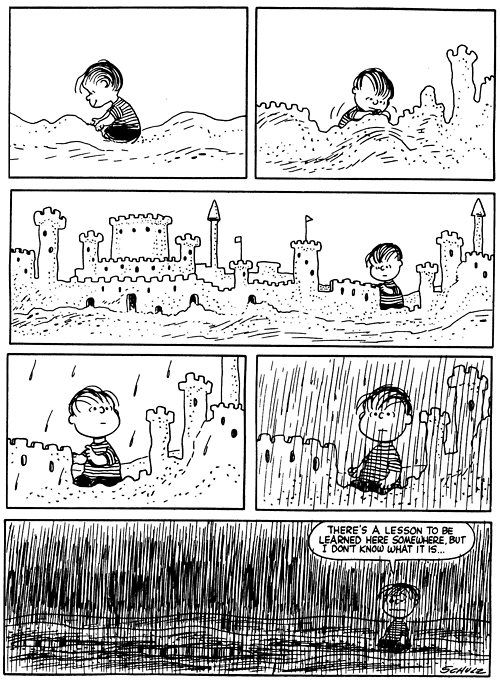

# Já parou pra pensar no que vai te fazer sofrer em 2015?

[Luciano Ribeiro](http://www.papodehomem.com.br/autores/lucianoribeiro#artigos)

[Mente e atitude](http://www.papodehomem.com.br/colecoes/atitude)

- [**341**

  likes](http://www.papodehomem.com.br/ja-parou-pra-pensar-no-que-vai-te-fazer-sofrer-em-2015#)
- [**0**

  tweets](http://www.papodehomem.com.br/ja-parou-pra-pensar-no-que-vai-te-fazer-sofrer-em-2015#)
- [**0**

  google +](http://www.papodehomem.com.br/ja-parou-pra-pensar-no-que-vai-te-fazer-sofrer-em-2015#)
- [**4**

  comentários](http://www.papodehomem.com.br/ja-parou-pra-pensar-no-que-vai-te-fazer-sofrer-em-2015#disqus_thread)

No final do ano passado eu escrevi um texto, desses que a gente faz pensando em como andou a vida.

Foi um pequeno apanhado do que passava pela minha cabeça e como eu me sentia em relação aos planos e promessas que estava fazendo pra mim mesmo naquele momento.

Agora, um ano depois, vejo que o raciocínio ainda se aplica.

Como fiz o exercício de voltar a esse texto, venho humildemente sugerir que você também olhe de novo (basta trocar as datas onde for necessário) e pense em tudo o que você sofreu tentando ser feliz, atingir sonhos, metas e objetivos.

Enquanto a gente segue nesse *modus operandi*, eu também vou junto, com uma pequena esperança de que a gente se libere desse ciclo.

Feliz 2015!

\* \* \*

O ano, como as pessoas, têm seu momento de senilidade, quando o futuro é curto e o fim é inevitável.

2013 está nessa fase.

Seus
últimos dias se aproximando e o hábito de fazer checagens ficando cada
vez mais urgente. É quando a gente olha pra trás e começa a perceber que
não emagreceu os quilos que prometeu, que a academia foi ficando pra
depois, que não produziu os textos que queria, não conseguiu ler mais,
nem ver filmes, muito menos viajar.

O tempo, esse danado, foi
passando e não deu a mínima aos planos. Enquanto seguimos fazendo o que
de mais urgente aparece na nossa frente, nossas ambições de melhoria da
vida vão sendo deixadas de lado.

Além de mim e de você, quantas outras pessoas não devem ter passado pelo mesmo?

Talvez,
o chefe escroto tenha prometido pegar mais leve. Talvez, alguém próximo
tenha prometido assumir a responsabilidade sobre as próprias falhas, ao
invés de colocar a culpa em alguém. Talvez, o casamento tenha sido foco
da promessa de alguma das partes: "agora vai"!

Mas nem tudo é desastre, nem tudo é catástrofe. Às vezes as coisas dão certo.

Um
filho pode ter nascido. Um casamento pode ter se feito com uma bela
cerimônia. Muitos amigos podem ter sido visitados. Ou, quem sabe, até
aquelas promessas mais bobas que a gente nunca cumpre podem ter sido
levadas a cabo, até o fim. Empregos, carros, casas novas, mudanças. Você
pode ter conhecido alguém que fez esse coraçãozinho bobo sacolejar no
peito. Sim, bons desfechos podem ter ocorrido.

Mas, também devemos
lançar um olhar mais sincero a essas histórias que vamos contar sobre o
ano que vai nos deixando. Sabemos que cada felicidadezinha, cada
pequena vitória, cada suspiro de alívio vem acompanhado de algumas gotas
de suor escorrendo pela testa. A gente sofre tentando ser feliz.

É
aí que a gente começa a se ver repetindo aquilo que fez no começo do
ano e as promessas de 2013 se transformam nas promessas de 2014. Afinal,
é uma nova chance que surge.

Nada mais justo do que tentar outra vez.

Mas, aqui, queria propor um lembrete, para antes de girarmos novamente a roda do tempo.

Já parou pra pensar que as suas apostas e promessas serão as razões pelas quais você vai sofrer em 2014?

---

*publicado em 29 de Dezembro de 2014, 00:05*
