# Livros para se comprar no natal e fazer a familia feliz

Tem livro para os pais, pro irmão e pra irmã. Também tem uma lista do que comprar para os primos e tios.

[[anexo ausente]](http://www.papodehomem.com.br/autores/filipe-laredo#artigos)

[Filipe Larêdo](http://www.papodehomem.com.br/autores/filipe-laredo#artigos)

[Listas](http://www.papodehomem.com.br/colecoes/listas), [Cultura e arte](http://www.papodehomem.com.br/colecoes/cultura)

- [**1**

  likes](http://www.papodehomem.com.br/livros-para-se-comprar-no-natal-e-fazer-a-familia-feliz#)
- [**0**

  tweets](http://www.papodehomem.com.br/livros-para-se-comprar-no-natal-e-fazer-a-familia-feliz#)
- [**0**

  google +](http://www.papodehomem.com.br/livros-para-se-comprar-no-natal-e-fazer-a-familia-feliz#)
- [**3**

  comentários](http://www.papodehomem.com.br/livros-para-se-comprar-no-natal-e-fazer-a-familia-feliz#disqus_thread)

O natal chegando e você quer dar de presente um livro para aquele parente que é apaixonado por literatura. Porém, apesar de todo o carinho e amor que você sente, não faz nem ideia de por onde começar.

Fique tranquilo, nós preparamos uma lista que vai ajudar na sua busca pelo livro perfeito, direcionando-o para o tipo de parente que você quer presentear nas festas de fim de ano.

### Pai e mãe

#### 1. *[Peixe grande](http://www.livrariacultura.com.br/p/peixe-grande-5069704)* (Daniel Wallace)

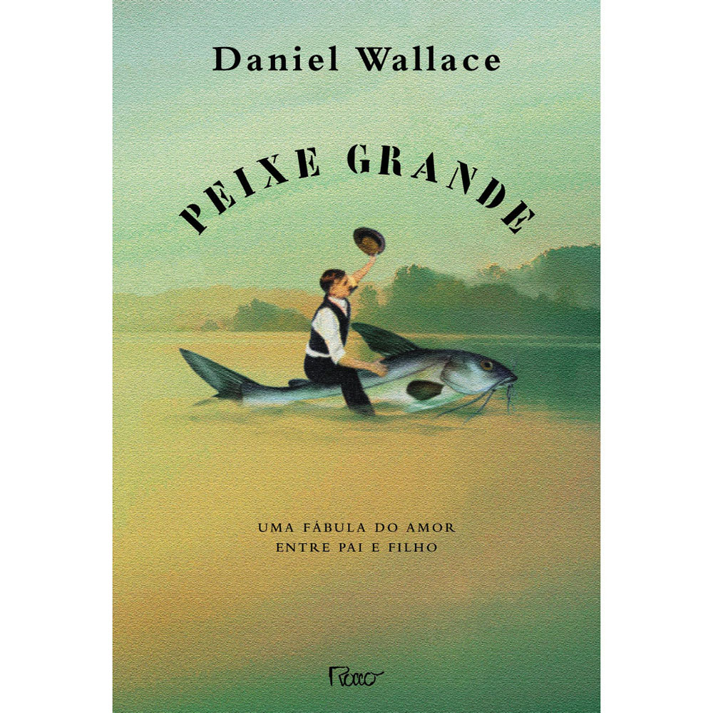

Histórias contadas pelos pais são comuns nas relações familiares durante a infância. Muitas delas pareceriam absurdas se escutadas por outros adultos, mas para as crianças elas são fantásticas e totalmente verossímeis.

Nessa fábula de amor entre pai e filho, o escritor [Daniel Wallace](http://en.wikipedia.org/wiki/Daniel_Wallace_%28author%29) nos mostra, por meio da narrativa do filho protagonista, a história da maneira que seu pai lhe contou.

#### 2. *[A vida de Pi](http://pt.wikipedia.org/wiki/Life_of_Pi)* (Yann Martel)

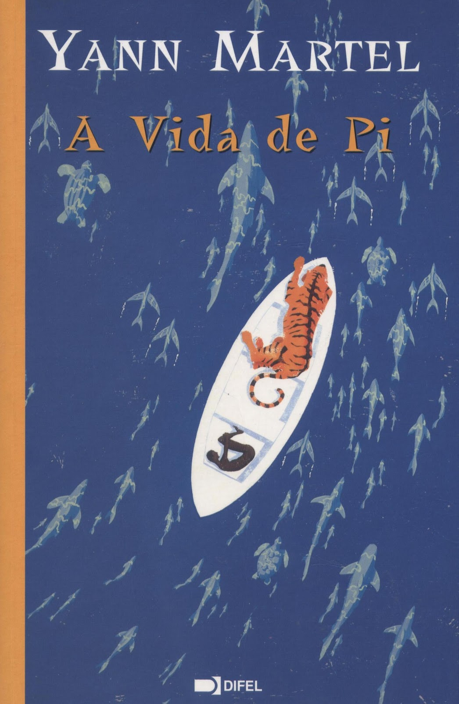

Tudo começa quando a família de um garoto indiano decide abandonar seu país para morar no Canadá e embarca em um cargueiro que está transportando os animais do zoológico para os EUA.

Contudo, uma tempestade os atinge e o navio afunda, restando apenas cinco sobreviventes: Pi (o garoto de dezesseis anos), uma zebra, um orangotango, uma hiena e um tigre de Bengala, que precisam dividir o espaço de um pequeno barco.

#### 3. *[O iluminado](http://pt.wikipedia.org/wiki/O_Iluminado_%28livro%29)* (Stephen King)

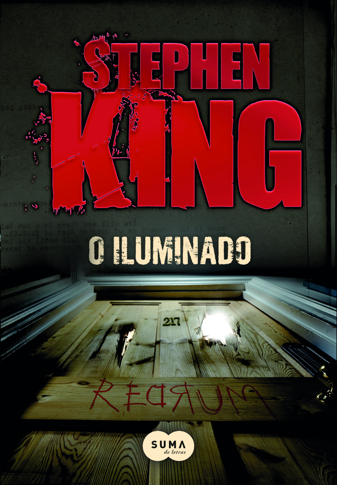

"O filme do Kubrick é uma obra de arte", alguém certa vez que lhe disse.

Concordamos, não?

Mas nem todos sabem que o criador da história odiou a adaptação cinematográfica. Então, qual das versões é melhor? Esse é um desafio digno para aquele pai ou mãe que adora cinema e literatura e tem preconceito contra o escritor norte-americano.

Vá fundo e desafie seus progenitores, pois tenha certeza, [Stephen King](http://www.papodehomem.com.br/stephen-king-homens-que-voce-deveria-conhecer-38/) não é conhecido como o "mestre do terror" por poucos motivos.

#### 4. *[O livro da Filosofia](http://www.saraiva.com.br/o-livro-da-filosofia-3678158.html)* (vários autores)

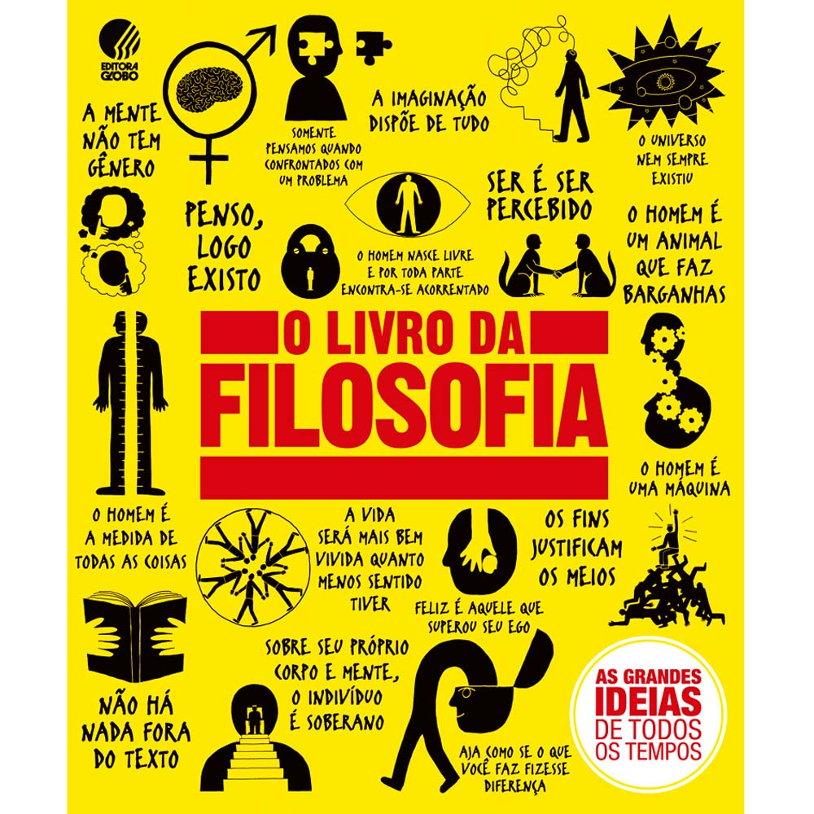

Dizem os especialistas que a filosofia vai sendo consumida com o tempo e pessoas mais velhas tendem a gostar cada vez mais dessa fonte de conhecimento puro.

Dessa forma, alguns pais irão adorar receber esse livro ilustrado com quase todas as referências históricas da filosofia.

#### 5. *[O jogo da amarelinha](http://pt.wikipedia.org/wiki/O_Jogo_da_Amarelinha)* (Julio Cortázar)

Um clássico da literatura latinoamericana, esse livro argentino lançado em 1963 não é fácil. Para degustá-lo plenamente, o leitor precisa ter uma bagagem literária um tanto vasta, de modo a conseguir se ajustar à transgressão de estilo e linguagem que [Cortázar](http://pt.wikipedia.org/wiki/Julio_Cort%C3%A1zar) implantou nesse "antirromance".

É uma leitura indispensável, e se o seu pai ou mãe ainda não leu, certamente não podem passar mais nem um minuto sem tê-lo em mãos.

### Para irmão e irmã

#### 1. *[O lobo do mar](http://pt.wikipedia.org/wiki/O_Lobo_do_Mar)* (Jack London)

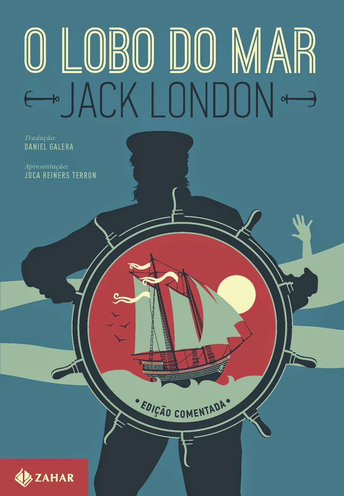

Como uma boa pessoa que eu sei que você é, ama o seu irmão ou irmã, apesar de às vezes querer matá-lo. Os motivos são diversos, mas normalmente você gostaria que ele amadurecesse um pouco mais.

Então vai lá na livraria e compra um dos clássicos do [Jack London](http://pt.wikipedia.org/wiki/Jack_London) em uma edição primorosa da Editora Zahar. Nesse livro, o personagem, não acostumado com a dificuldades da vida, é obrigado a servir de tripulante em um barco caçador de baleias.

Pois é. Nada mais engrandecedor do que passar uma boa temporada sofrendo as agruras do mar.

#### 2. *[O Silmarillion](http://pt.wikipedia.org/wiki/O_Silmarillion)* (J. R. R. Tolkien)

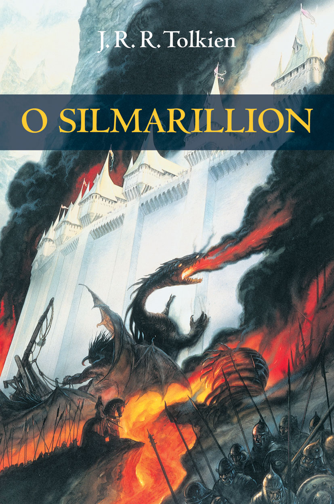

Seu irmão ou irmã é nerd e adorou todos os filmes da série *Senhor dos anéis* e *O hobbit*? Também já leu os respectivos livros e disse estar apaixonado pelo escritor sul-africano? Então chegou a hora de dar um upgrade nerdístico nele e separa-lo das crianças.

Compra essa verdadeira Bíblia do mundo tolkeniano e presenteia o seu irmão querido. Com ele, nerd nenhum vai esquecer a origem dos elfos e as razões para os anões os odiarem tanto.

#### 3. *[O dia em que troquei meu pai por dois peixinhos dourados](http://www.rocco.com.br/index.php/livro?cod=2487)* (Neil Gaiman e Dave Mckean)

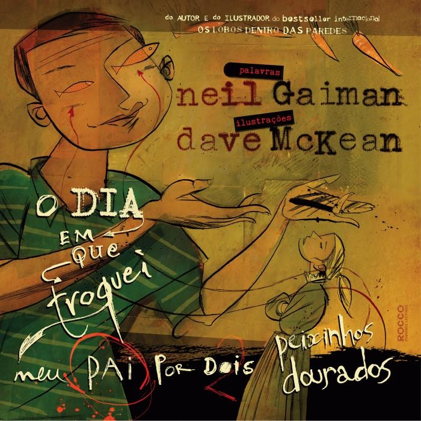

Todos nós, alguma vez na vida, já sentimos uma raiva ou insatisfação contra nossos pais, especialmente o do gênero masculino.

Pois é nessa linha que o famoso escritor [Neil Gaiman](http://pt.wikipedia.org/wiki/Neil_Gaiman) se reuniu novamente com o ilustrador [Dave Mckean](http://pt.wikipedia.org/wiki/Dave_McKean). Conhecidos pela parceria em *[Sandman](http://pt.wikipedia.org/wiki/Sandman_(revista_em_quadrinhos))*, os dois não produziram uma história infantil tradicional, mas sim uma bem complicada, comum aos tempos atuais, quando os leitores mirins se acostumaram com tramas mais complexas.

Presente ideal para seu irmã ou irmã que está com raiva dos pais.

#### 4. *[Quadrinhos A2](http://www.quadrinhosa2.com/)* (Paulo  Crubim e Cristina Eiko)

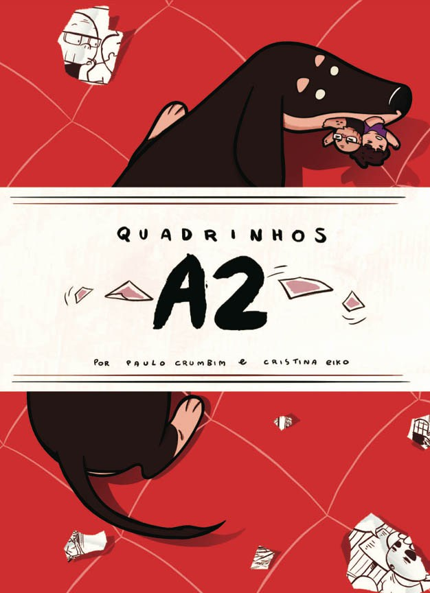

Seu irmão ou irmã acabou de começar um namoro e não tem muito tempo pra ler. Está tão apaixonado(a) que não consegue pensar em mais nada.

Entendo.

A solução, nesse caso, é dar um presente divertido e que possa ser lido pelos dois ao mesmo tempo, que os faça rir e se emocionar sem ser exagerado. Vai certeiro, esse é o livro certo pra eles.

#### 5. *[Tocando a distância](http://www.saraiva.com.br/tocando-a-distancia-ian-curtis-e-joy-division-7514619.html)* (Deborah Curtis)

Poucos na história do rock fizeram tanto estrago em tão pouco tempo como o [Joy Division](http://pt.wikipedia.org/wiki/Joy_Division) e é inadmissível que o seu irmão ou irmã, que gosta tanto do estilo, não saiba disso.

Que tal resolver essa situação e dar de presente uma biografia do vocalista [Ian Curtis](http://pt.wikipedia.org/wiki/Ian_Curtis) escrito pela própria esposa?

Assim o seu amado irmão vai saber que, com apenas um disco lançado durante a vida, esse inglês influenciou uma parte considerável dos roqueiros modernos com sua poesia.

### Tio/tia e primo/prima

#### 1. *[O lugar sem limites](http://editora.cosacnaify.com.br/ObraSinopse/1180/O-lugar-sem-limites-.aspx)* (José Donoso)

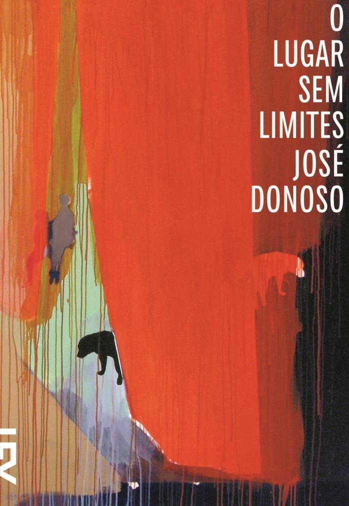

Sabe aquele tiozão ou tiazona que adora literatura e é apaixonado pelo Garcia Márquez? Talvez ele conheça a fama que esse escritor chileno adquiriu na carreira e que o adiantou no tempo às críticas especializadas.

Mas caso não conheça, então chegou a hora de você impressioná-lo indicando esse romance de alto calibre no qual profundos sentimentos explodem na trama da personagem principal, uma travesti chamada Manuela, que vive em El Olivo, uma pequena cidade do interior do Chile.

#### 2. *[Foras da lei barulhentos, bolhas raivosas e algumas outras...](http://editora.cosacnaify.com.br/ObraSinopse/1431/Foras-da-lei.aspx)* (Vários autores)

O livro é lindo e a edição brasileira, impecável. Só por essas qualidades ele merece ser lido.

Mas como a lista é para presentes aos familiares, então vamos lá. Esse livro é perfeito para aquele seu primo ou aquela sua prima que não gosta muito de ler ou que está começando a avançar na literatura, pois é cheio de ilustrações e quadrinhos.

E se a pessoa questionar que não conhece muito os autores, basta dizer que tem um conto do Neil Gaiman e a tarefa de convencê-lo estará praticamente concluída.

#### 3. *[Alta fidelidade](http://www.companhiadasletras.com.br/detalhe.php?codigo=13324)* (Nick Hornby)

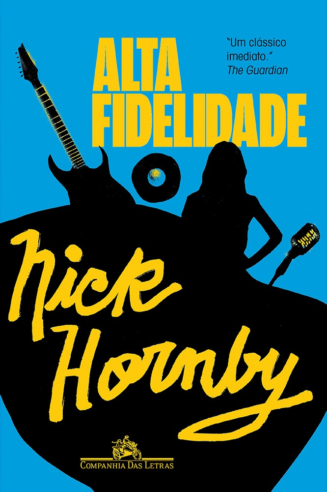

Esse serve para os mais velhos e os mais novos. É indicado para aquele parente que adora música e gosta de ler romances.

A trama é simples: o protagonista é dono de uma loja de discos e acabou de passar por término de relacionamento. Porém, o que torna o livro genial é a maneira como o personagem interage com o leitor, dando doses frequentes de referências musicais para repensar sua vida e monta listas de acontecimentos, como um top 5 das melhores namoradas que já teve.

#### 4. *[Zazie no metrô](http://editora.cosacnaify.com.br/ObraSinopse/11323/Zazie-no-metr%C3%B4.aspx)* (Raymond Queneau)

De teor surrealista, o livro do escritor francês conta uma história pesadíssima, mas com uma linguagem cômica e leve.

Zazie é uma menina de idade desconhecida, que vem do interior para se hospedar na casa do tio, que é travesti e dançarino de boate. No meio da história, surgem policiais pedófilos, um papagaio falante e uma taxista maluco.

Tudo isso já seria complicado se Zazie apenas visse os acontecimentos. Contudo ela é bastante ativa e malandra, manipulando muito bem tudo o que se passa ao redor.

#### 5. *[Dias perfeitos](http://www.companhiadasletras.com.br/detalhe.php?codigo=13671)* (Rafael Montes)

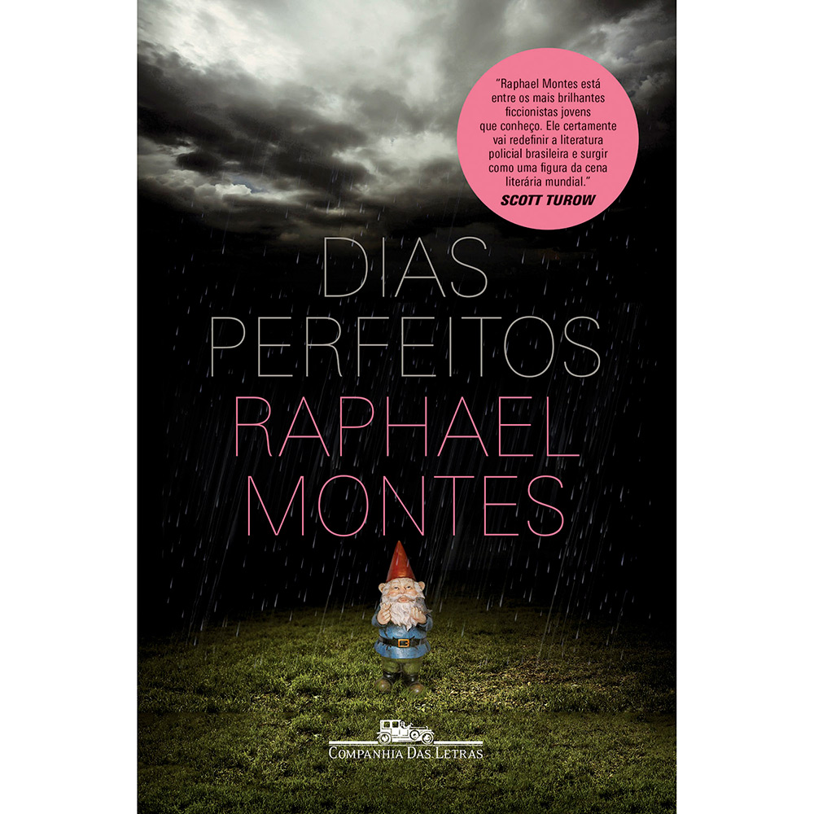

Seu primo ou prima está começando a gostar de histórias de suspense e terror? Então esse livro é um excelente presente.

Explico. A história é boa, os personagens são carismáticos, o autor manda muito bem nas ações e, principalmente, a narrativa é dinâmica. Além disso, é um thriller genuinamente nacional, com todas as características e ambientações tipicamente brasileiras.

Vai lá. Faz bonito e avisa que foi a gente que deu as dicas.

---

*publicado em 23 de Dezembro de 2014, 00:00*
