# Effort in the Application: sites that got our attention and got Basecampers their jobs

[Mig Reyes](https://signalvnoise.com/writers/mig) *wrote this on* Jan 23
[Discuss](https://signalvnoise.com/posts/3845-effort-in-the-application-sites-that-got-our-attention-and-got-basecampers-their-jobs#add_comment)

## We’re really proud of the small-but-mighty team we’ve built here at Basecamp. [Hiring](http://basecamp.com/jobs/) is hard. Likewise, landing a great job is hard. In a sea of resumes, effort rises to the top.

Here are a few of the websites and commissioned challenges that helped these Basecampers score their job here. *Note: our company was called 37signals before we became Basecamp in 2013.*
  
Ryan Singer (Designer, Product Manager) was one of a few designer candidates that Jason picked in 2003 for a chance to join 37signals to work on client projects. The design challenge? Redesign [the Verizon Wireless homepage](https://signalvnoise.com/archives/000306.php). Ryan showed a great sense of clarity despite little to no direction, and he’s been at Basecamp ever since.

[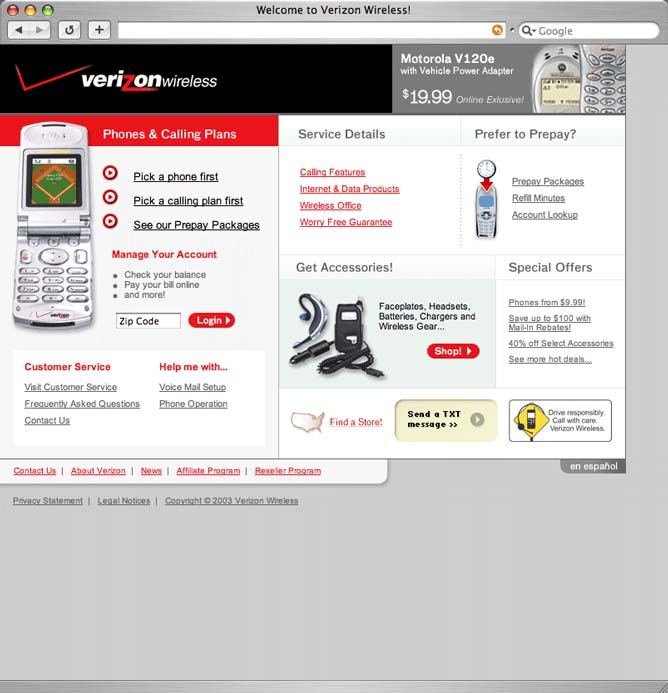](https://signalvnoise.com/archives/000306.php)

  
Jamie Dihiansan (Designer) met Jason early on in his career. 37signals wanted Jamie to apply for a new design position, but he wasn’t ready for it. Years later, timing finally worked out and Jamie applied for a new design position with a [carefully crafted letter](http://asianmack.com/backpackit/) and a [Backpack redesign](http://asianmack.com/backpackit/backpackit.html).
  
[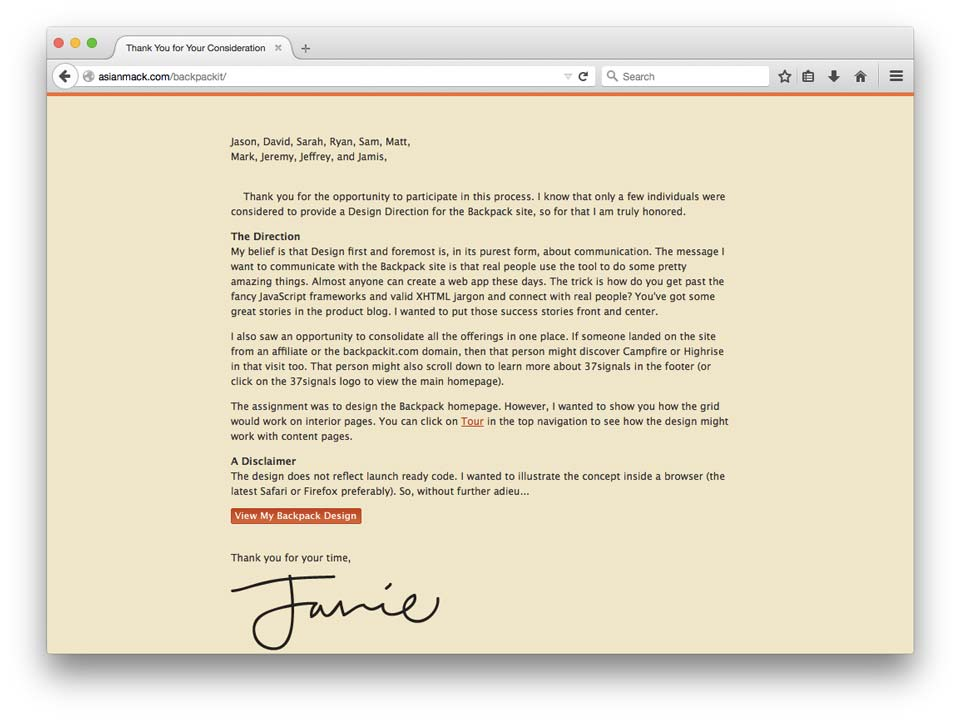](http://asianmack.com/backpackit/)
  
Jason Zimdars (Designer) was quick to respond to [this job posting](https://signalvnoise.com/posts/1076-were-looking-for-a-designer-who-wants-to-kick-our-ass-and-change-our-game). Turns out, JZ didn’t get the job, Jamie (above) did. Despite that, JZ still had great work and kept in touch. When 37signals had room for a new designer role, we asked him to apply and he came back with the [new gold standard in applying to a job](http://jasonzimdars.com/svn/).
  
[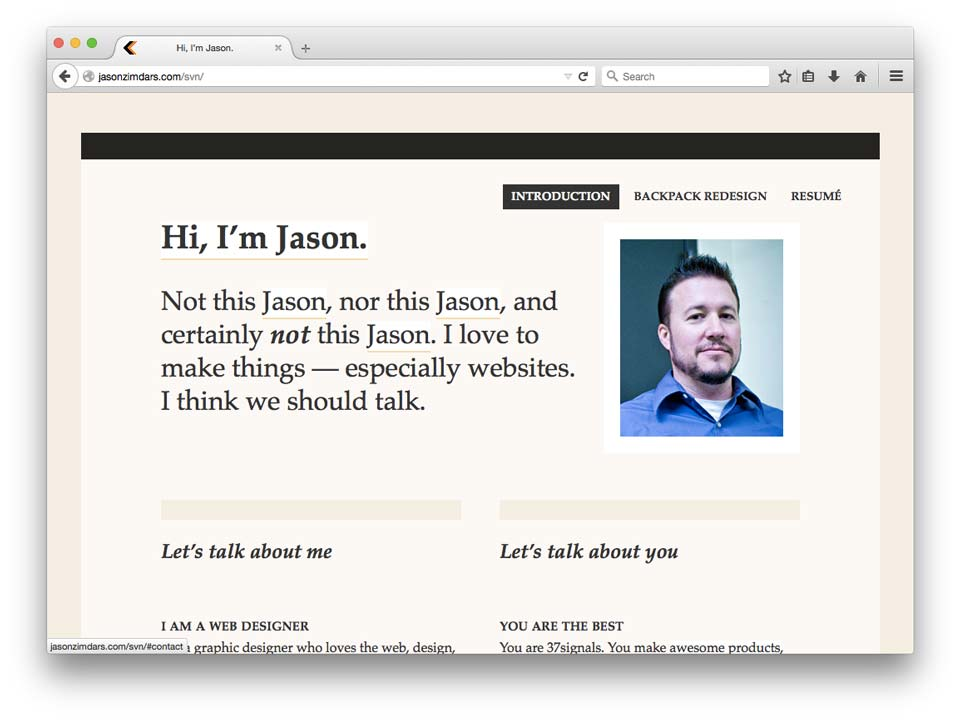](http://jasonzimdars.com/svn/)
  
Ann Goliak (Support, QA) was a librarian when she first came across a Support position on our blog. Two hours later, she shot us an email and quickly forgot about it—she didn’t think she’d hear back. A month later, she heard back from us and whipped up a meaty page on [why she’s a great fit](http://www.anngoliak.com/37signals.html).
  
[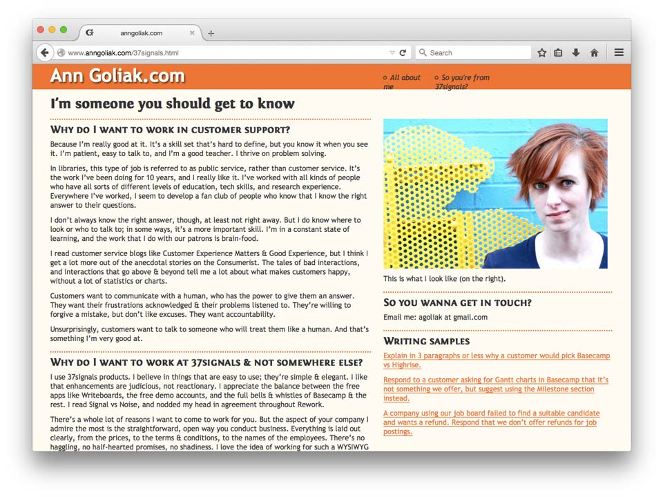](http://www.anngoliak.com/37signals.html)
  
Nick Quaranto (Programmer) wanted to move back home. Working remotely seemed like the best way to do that. Nick applied to 37signals out of the blue, thinking it was a longshot. But a [descriptive site showcasing his passion](http://quaran.to/signal/) convinced us otherwise.
  
[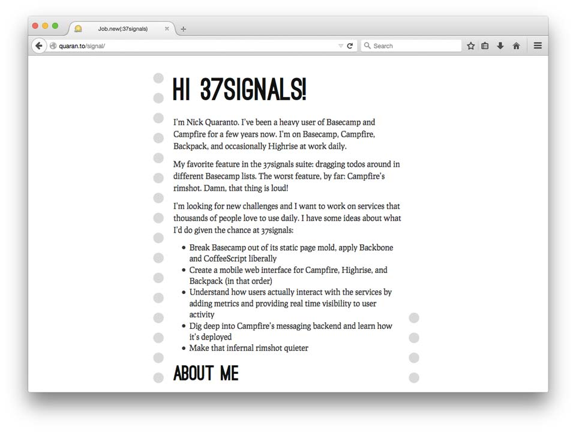](http://quaran.to/signal/)
  
John Williams (Ops) was tipped by his brother that there was an ops opening on the 37signals Job Board. John rose to the top with [a personal site that gave him an extra edge](http://johnwants37signals.veloshots.com/) over all of the other candidates.
  
[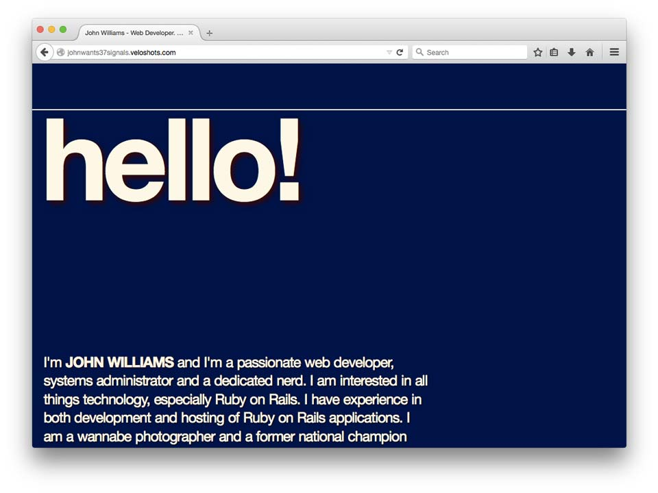](http://johnwants37signals.veloshots.com/)
  
Trevor Turk (Programmer) was working as a contractor during a short stint in London when he came across a programmer job posting on our blog. He worked up a [straight-to-the-point page](http://trevorturk.com/37signals/) to toss his hat in the ring. Turns out, it was everything he needed to do to join the team.
  
[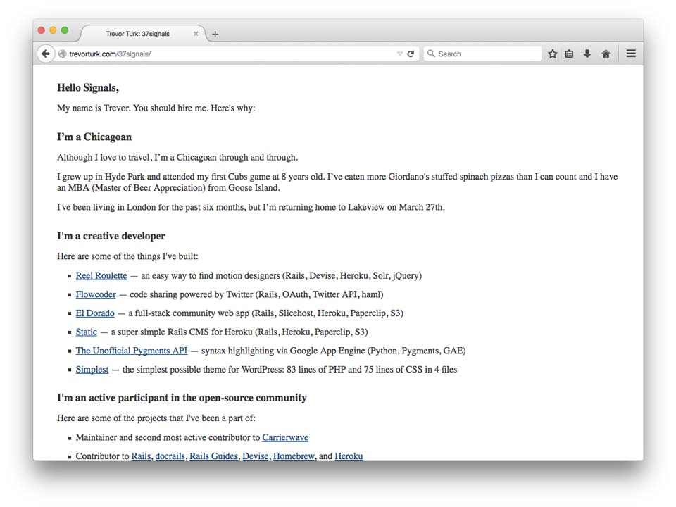](http://trevorturk.com/37signals/)
  
Jonas Downey (Designer) reached out to Jason after he tweeted about a new design role within 37signals. Jonas interviewed, but ultimately didn’t get the job. A half-year later, another design role opened up. Jonas [applied again](http://jonas.do/projects/37s-application), knocked his [design challenge](http://jonas.do/projects/37s-application/basecamp-redesign/) out of the park, and he’s been a happy Basecamper since.
  
[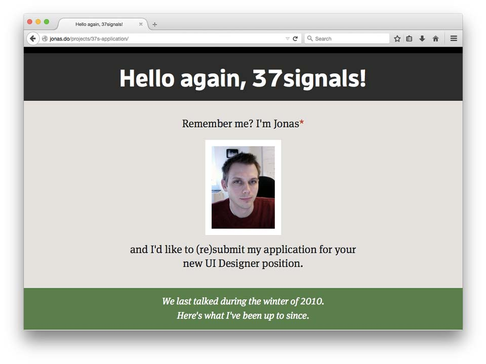](http://jonas.do/projects/37s-application)
  
Joan Stewart (Support) was a librarian, a Backpack user, and a regular Signal v. Noise reader. Knowing that Ann was a librarian, Joan thought “if she could work at 37signals, so could I.” She took the time to [whip up her own page](https://dl.dropboxusercontent.com/u/695560/37signals/index.html), and now Joan is a happy Basecamper, too.
  
[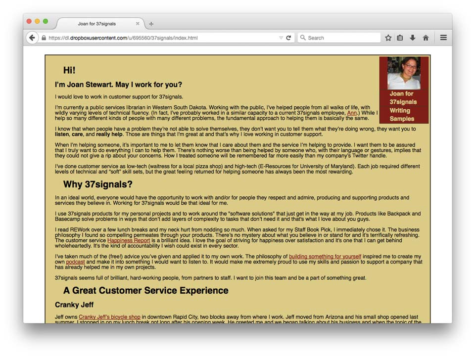](https://dl.dropboxusercontent.com/u/695560/37signals/index.html)
  
Shaun Hildner (Video Producer) was quick to shoot an email to Jason after seeing him tweet that 37signals was looking for a video producer. [His reel](https://vimeo.com/25537367) got him an interview, and his [test got him the job](https://vimeo.com/27663763).
  
[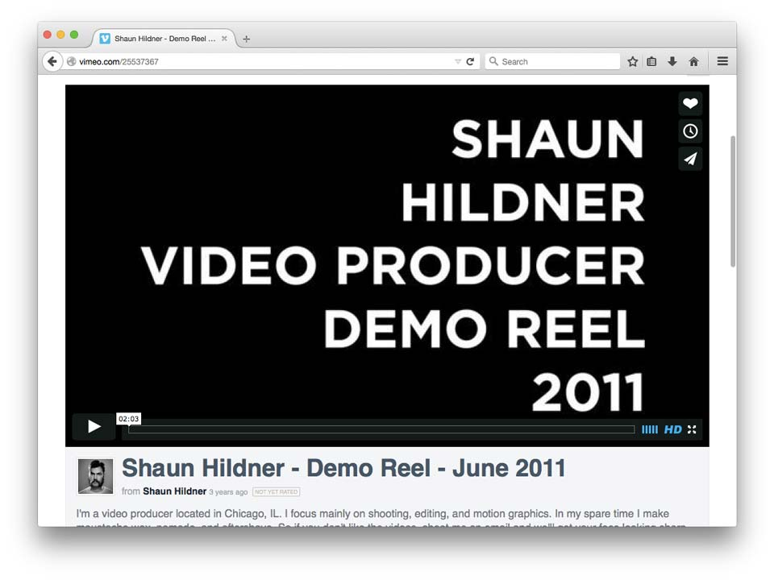](https://vimeo.com/25537367)
  
Mig Reyes—that’s me!—(Designer) dropped an email to Jason looking for a written recommendation when he was applying for a totally different job in Chicago. Jason offered, “would you be up for working with us at 37signals instead?” A few meetings with the team in Chicago and [a design test to boot](http://mig.io/makes/37signals), Mig became the next Basecamper.
  
[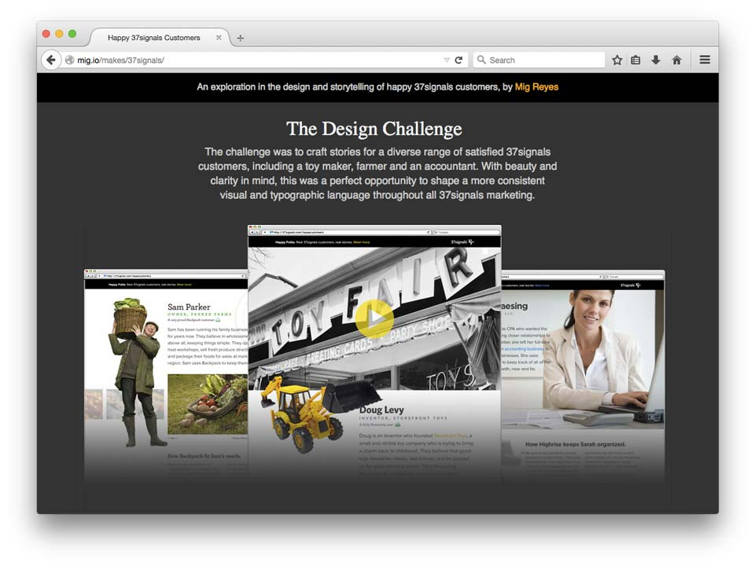](http://mig.io/makes/37signals)
  
Dan Kim (Programmer) was just about finished taking an advanced and class at The Starter League. He emailed Jason if there were any opportunities, but there weren’t at the time. When we started to work on Know Your Company, Jason reached out. Then after a couple of lunches and a [test project](http://dankim.org/honcho/), Dan became a Basecamper.
  
[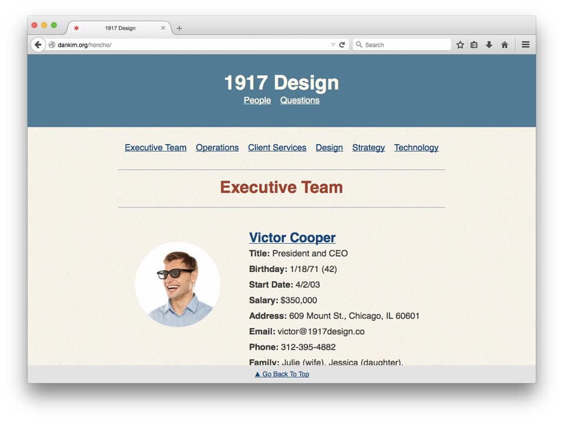](http://dankim.org/honcho/)
  
Jim Makenzie (Support, Programmer) noticed he hadn’t seen recent Signal v. Noise posts after updating his reader. Out of curiosity, he visited our blog in his browser and stumbled upon [this job post](https://signalvnoise.com/posts/3166-across-the-pond-join-the-37signals-customer-support-team.) and sent us a [strong pitch](http://jimmackenzie.co.uk/37.html) and [some work](http://jimmackenzie.co.uk/about37.html) on why we should hire a stranger from the UK.
  
[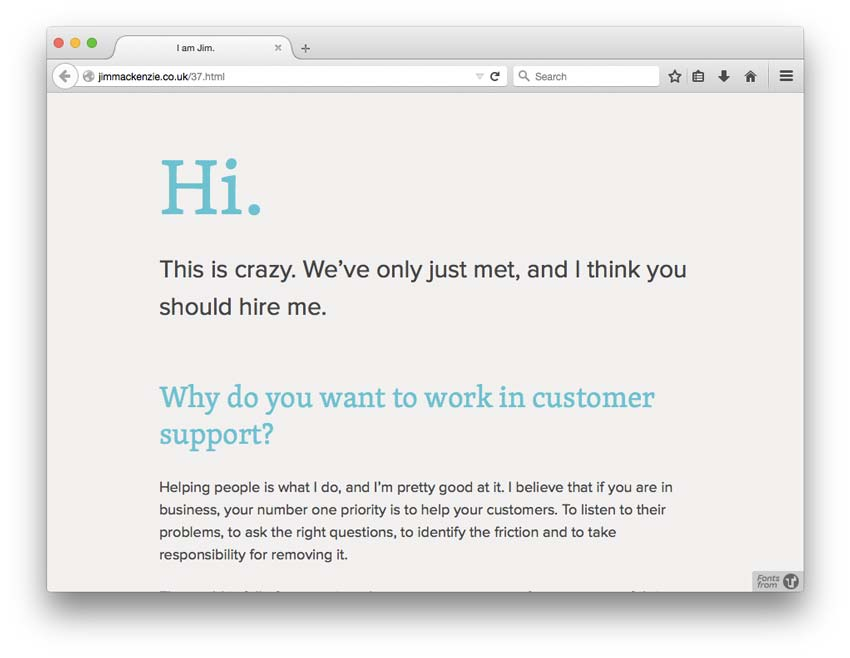](http://jimmackenzie.co.uk/37.html)
  
Conor Muirhead (Designer) had a coworker mention that Basecamp was hiring a product designer. Considering a job switch himself, Conor pulled the trigger on [firing off this email](http://basecamp.conor.cc/basecamp_application/) to Jason. Conor’s effort put him into consideration for the job, and he followed it all the way through with his fully thought out [design challenge](http://basecamp.conor.cc/).
  
[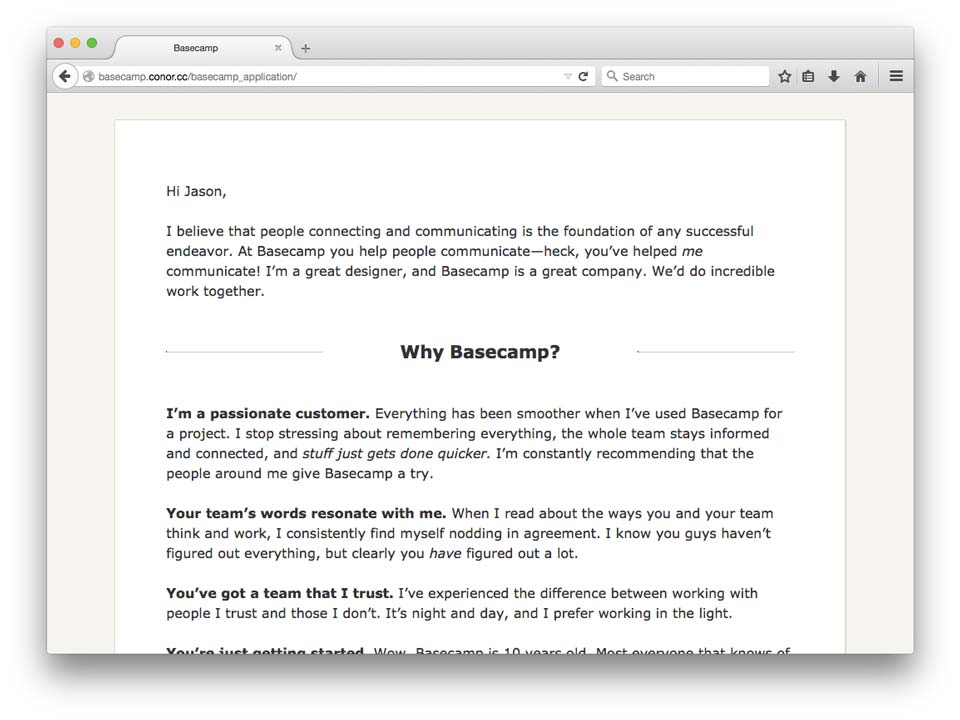](http://basecamp.conor.cc/basecamp_application/)
  
James Glazebrook (Support) was tipped by Natalie, already one of Basecamp’s very own Support team members, that we were hiring someone to cover European hours. James had read REWORK before, so he knew we valued applicants going above and beyond. The result? [37 reasons why we should hire him](http://37-reasons.tumblr.com/).
  
[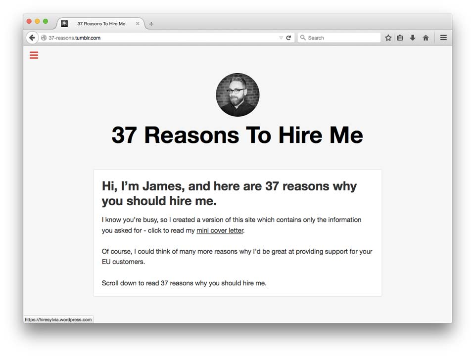](http://37-reasons.tumblr.com/)
  
Sylvia Chong (Support) planned on starting a food blog with a friend. Knowing they needed a good way to keep track of progress, her friend recommended using Basecamp together. Sylvia loved using Basecamp, so much so that she wondered if there were any jobs here. Luck and timing were in her favor, there was a perfect-sounding spot for her on our Support team. She finished [her convincing site](https://hiresylvia.wordpress.com/) a week and a half later, and now we’re glad she’s on the team.
  
[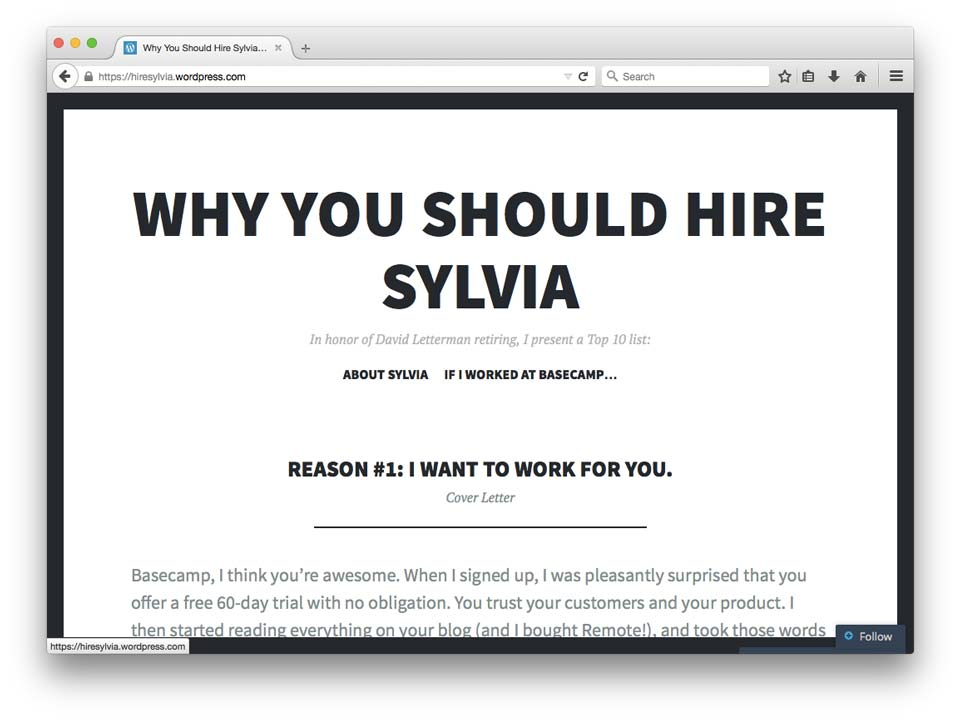](https://hiresylvia.wordpress.com/)
  
And of course, the [original 37signals Manifesto](http://37signals.com/manifesto) that helped land us plenty of our former clients when we were a web consulting agency.
  
[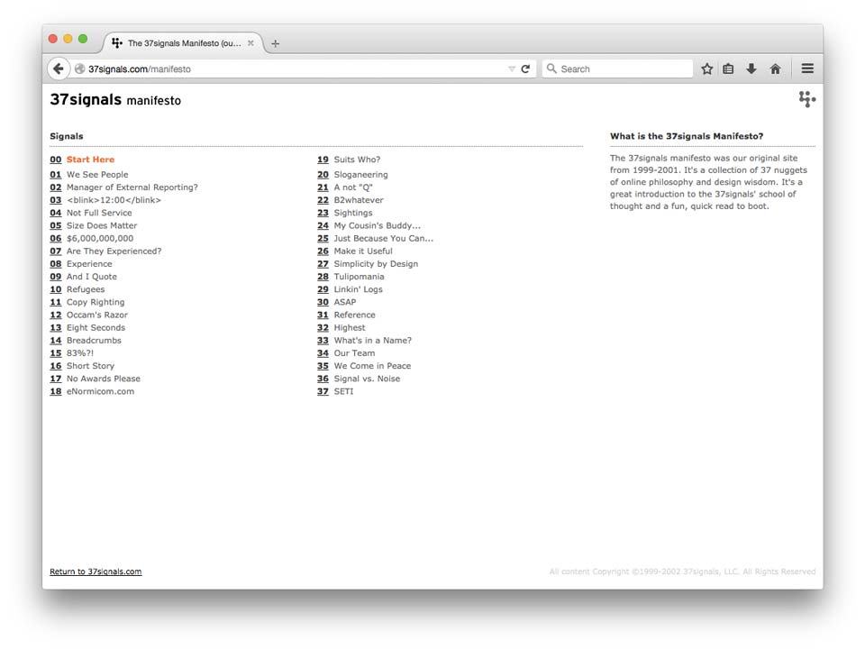](http://37-reasons.tumblr.com/)
  
By the way, we’re hiring a [programmer to lead Android](https://basecamp.com/jobs/android) and a [designer to do brand and marketing](https://signalvnoise.com/posts/3841-basecamp-is-hiring-another-marketing-designer). If you’d like to join the [team](https://basecamp.com/team/), reach out to us!
