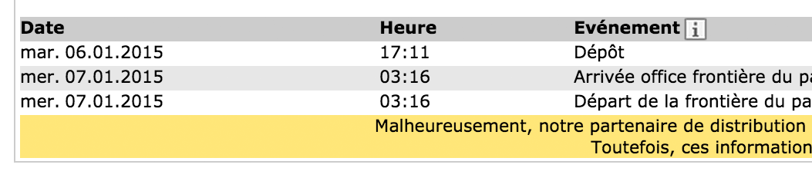
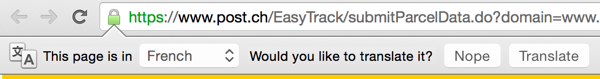
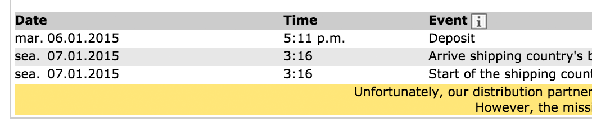

# Google shows you a good time

I ordered something from overseas and checked the tracking number to see when I might receive the shipment. The results looked like this:

Since the page wasn’t in English, and Google knew I was an English speaker, Google offered to translate it for me:

So I did. Then it looked like this:

The special part… Check out the time column. They “translated” 24-hour time into 12-hour time. They knew I was in the US and that’s our preference for displaying time. So they didn’t only translate the words into English, they went the extra step and translated the time format to match expectations. They certainly didn’t have to do that, but I definitely noticed that they did.

Delightful attention to detail, and thorough definition of translation. Well done.

[Jason Fried](https://signalvnoise.com/writers/jf) wrote *this on* Jan 07
*There are* 6 comments.

## About Jason Fried

Jason co-founded Basecamp back in 1999. He also co-authored [REWORK](http://37signals.com/rework), the New York Times bestselling book on running a "right-sized" business. Co-founded, co-authored... Can he do anything on his own?

Read all of [Jason Fried’s posts](https://signalvnoise.com/writers/jf), and [follow Jason Fried on Twitter](http://twitter.com/jasonfried).
