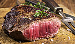
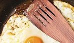
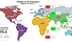
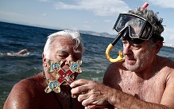

# Porridge could be key to a long and healthy life, says Harvard University

## Eating porridge, brown rice or corn each day could protect the heart against disease, Harvard University has found

|  |  |  |  |  |  |  |  |  |  |  |  |  |  |  |  |  |  |  |  |  |  |  |  |  |  |  |  |  |  |  |  |  |  |  |  |  |  |  |  |
| --- | --- | --- | --- | --- | --- | --- | --- | --- | --- | --- | --- | --- | --- | --- | --- | --- | --- | --- | --- | --- | --- | --- | --- | --- | --- | --- | --- | --- | --- | --- | --- | --- | --- | --- | --- | --- | --- | --- | --- |
| |  |  |  |  |  |  | | --- | --- | --- | --- | --- | --- | | |  |  |  |  | | --- | --- | --- | --- | |  | 261b7dad731807fd621171c080440c0b.png |  |  | | 9K | | |  |  |  |  |  |  | | --- | --- | --- | --- | --- | --- | | |  |  |  |  | | --- | --- | --- | --- | |  | 02514291520dfdb95c9cdafb3e68409e.png |  |  | | 860 | | |  |  |  |  |  |  | | --- | --- | --- | --- | --- | --- | | |  |  |  |  | | --- | --- | --- | --- | |  | a97f703ce342d20374dc9fb8a730fd8e.png |  |  | | 6 | | |  |  |  |  |  |  | | --- | --- | --- | --- | --- | --- | | |  |  |  |  | | --- | --- | --- | --- | |  | 73a3b94837f39152da2ec5e9ed92324c.png |  |  | | 44 | | |  |  |  |  |  |  | | --- | --- | --- | --- | --- | --- | | |  |  |  |  | | --- | --- | --- | --- | |  | 7541431b51098014b5ff2e28f17a853a.png |  |  | | 10K | | |  |  |  |  | | --- | --- | --- | --- | |  | 9f9552b6804f1a8f8a39579272e3e8af.png | Email |  | |

Youngsters who eat oats regularly are 50 per cent less likely to be overweight, one study of 10,000 children found Photo: Tim Hill/ Alamy

By [Sarah Knapton](http://www.telegraph.co.uk/journalists/sarah-knapton/ "Sarah Knapton"), Science Editor

4:28PM GMT 05 Jan 2015

[anexo ausente][426 Comments](http://www.telegraph.co.uk/health/healthnews/11325968/Porridge-could-be-key-to-a-long-and-healthy-life-says-Harvard-University.html#disqus_thread)

A small bowl of porridge each day could be the key to a long and healthy life,
after a major study by Harvard University found that whole grains reduce the
risk of dying from heart disease.

Although whole grains are widely believed to be beneficial for health it is
the first research to look at whether they have a long-term impact on
lifespan.

Researchers followed more than 100,000 people for more than 14 years
monitoring their diets and health outcomes.

Everyone involved in the study was healthy in 1984 when they enrolled, but
when they were followed up in 2010 more than 26,000 had died.

However those who ate the most whole grains, such as porridge, brown rice,
corn and quinoa seemed protected from many illnesses and particularly heart
disease.

## Related Articles

- 
- [Porridge 'could protect' against cancer and heart disease](http://www.telegraph.co.uk/health/healthnews/10705769/Porridge-could-protect-against-cancer-and-heart-disease.html)

  19 Mar 2014
- [Viagra could soon be used for heart disease patients: researchers](http://www.telegraph.co.uk/health/healthnews/11172344/Viagra-could-soon-be-used-for-heart-disease-patients-researchers.html)

  20 Oct 2014
- [Yoga just as good as aerobics for cutting heart disease risk](http://www.telegraph.co.uk/news/science/science-news/11294714/Yoga-just-as-good-as-aerobics-for-cutting-heart-disease-risk.html)

  16 Dec 2014
- [Pioneering new injection to cure heart failure without need for major surgery](http://www.telegraph.co.uk/health/healthnews/11027207/Pioneering-new-injection-to-cure-heart-failure-without-need-for-major-surgery.html)

  11 Aug 2014

Oats are already the breakfast of choice for many athletes and also for
dieters, who find the high fibre levels give them energy for longer.

But scientists found that for each ounce (28g) of whole grains eaten a day –
the equivalent of a small bowl of porridge – the risk of all death was
reduced by five per cent and heart deaths by 9 per cent.

“These findings further support current dietary guidelines that recommend
increasing whole-grain consumption,” said lead author Dr Hongyu Wu of
Harvard School of Public Health.

“They also provide promising evidence that suggests a diet enriched with whole
grains may confer benefits towards extended life expectancy.”

The findings remained even when allowing for different ages, smoking, body
mass index and physical activity.

Whole grains, where the bran and germ remain, contain 25 per cent more protein
than refined grains, such as those that make white flour, pasta and white
rice.

Previous studies have shown that whole grains can boost bone mineral density,
lower blood pressure, promote healthy gut bacteria and reduce the risk of
diabetes. One particular fibre found only in oats – called beta-glucan – has
been found to lower cholesterol which can help to protect against heart
disease. A bioactive compound called avenanthramide is also thought to stop
fat forming in the arteries, preventing heart attacks and strokes.

Whole grains are also widely recommended in many dietary guidelines because
they contain high levels of nutrients like zinc, copper, manganese, iron and
thiamine. They are also believed to boost levels of antioxidants which
combat free-radicals.

The new research suggests that if more people switched to whole grains,
thousands of lives could be saved each year. Coronary heart disease is
Britain’s biggest killer, responsible for around 73,000 deaths in the UK
each year. Around 2.3 million people are living with the condition and one
in six men and one in 10 women will die from the disease.

Health experts said the study proved that whole grains were beneficial to
health

Victoria Taylor, Senior Dietician at the British Heart Foundation, said: “This
is an interesting study and reinforces existing dietary recommendations to
eat more foods high in fibre.

“People with a higher intake of whole grains also tended to have a healthier
overall lifestyle and diet so it might not be the whole grains alone that
are having the benefit in relation to cardiovascular disease.

“But at this time of year when we are all making resolutions to eat better,
switching to whole-grain versions of bread, breakfast cereals, pasta and
rice is a simple change to make.”

The research is published [in
the journal JAMA: Internal Medicine.](http://archinte.jamanetwork.com/article.aspx?articleid=2087877)

How to Cook Porridge with Maple Syrup and Bananas

02:12

## [Health News](http://www.telegraph.co.uk/health/healthnews/)

- ### [News »](http://www.telegraph.co.uk/news/)
- ### [UK News »](http://www.telegraph.co.uk/news/uknews/)
- ### [Science »](http://www.telegraph.co.uk/news/science/)
- ### [Science News »](http://www.telegraph.co.uk/news/science/science-news/)
- ### [Health »](http://www.telegraph.co.uk/health/)

In Health News

### [Living proof: the secret of healthy ageing](http://www.telegraph.co.uk/health/healthnews/11199403/Secret-of-healthy-ageing-discovered-in-ground-breaking-35-year-study.html)

### [Why olive oil should be kept out of the frying pan](http://www.telegraph.co.uk/health/dietandfitness/10970070/Why-olive-oil-should-be-kept-out-of-the-frying-pan.html)

### [Ebola outbreak in pictures](http://www.telegraph.co.uk/news/worldnews/ebola/11153745/Ebola-outbreak-in-pictures.html)

### [Do homemade remedies work?](http://www.telegraph.co.uk/health/healthpicturegalleries/11146577/Chicken-soup-and-talcum-powder-do-homemade-remedies-work.html)

### [Plaque attack](http://www.telegraph.co.uk/news/picturegalleries/howaboutthat/11067916/Plaque-attack-Close-up-images-of-teeth-reveal-what-lives-in-your-mouth.html)

|  |  |  |  |  |  |  |  |  |  |  |  |  |  |  |  |  |  |  |  |  |  |  |  |  |  |  |  |  |  |  |  |  |  |  |  |  |  |  |  |
| --- | --- | --- | --- | --- | --- | --- | --- | --- | --- | --- | --- | --- | --- | --- | --- | --- | --- | --- | --- | --- | --- | --- | --- | --- | --- | --- | --- | --- | --- | --- | --- | --- | --- | --- | --- | --- | --- | --- | --- |
| |  |  |  |  |  |  | | --- | --- | --- | --- | --- | --- | | |  |  |  |  | | --- | --- | --- | --- | |  | 261b7dad731807fd621171c080440c0b.png |  |  | | 9K | | |  |  |  |  |  |  | | --- | --- | --- | --- | --- | --- | | |  |  |  |  | | --- | --- | --- | --- | |  | 02514291520dfdb95c9cdafb3e68409e.png |  |  | | 860 | | |  |  |  |  |  |  | | --- | --- | --- | --- | --- | --- | | |  |  |  |  | | --- | --- | --- | --- | |  | a97f703ce342d20374dc9fb8a730fd8e.png |  |  | | 6 | | |  |  |  |  |  |  | | --- | --- | --- | --- | --- | --- | | |  |  |  |  | | --- | --- | --- | --- | |  | 73a3b94837f39152da2ec5e9ed92324c.png |  |  | | 44 | | |  |  |  |  |  |  | | --- | --- | --- | --- | --- | --- | | |  |  |  |  | | --- | --- | --- | --- | |  | 7541431b51098014b5ff2e28f17a853a.png |  |  | | 10K | | |  |  |  |  | | --- | --- | --- | --- | |  | 9f9552b6804f1a8f8a39579272e3e8af.png | Email |  | |

Promoted stories

[5 Apps That Will Help You Become a More Productive Person](https://www.workintelligent.ly/technology/mobile/2014-10-22-new-mobile-apps-for-business/?utm_campaign=ContentSyndication&utm_medium=NativeAd&utm_source=OutBrain&utm_content=&utm_term=productivity+mobile+apps)
Work Intelligently by Ricoh

[Why the Mac vs. PC Battle Doesn't Matter Anymore](https://www.workintelligent.ly/technology/it/2014-11-18-mac-or-pc-discussion/?utm_campaign=ContentSyndication&utm_medium=NativeAd&utm_source=OutBrain&utm_content=&utm_term=mac+pc)
Work Intelligently by Ricoh

[Out With the Carbs. In With the Protein. Sign Up For Our…](http://www.thefinancialist.com/out-with-the-carbs-in-with-the-protein/)
The Financialist by Credit Suisse

[How to Increase Testosterone Levels Naturally](http://learni.st/users/jacobvp/boards/81367-how-to-increase-testosterone-levels-naturally?utm_source=outbrain&utm_medium=paid_cpc&utm_campaign=health_fitness)
Learnist

[Eggs, Cholesterol and Weight Loss](http://www.diabetescare.net/slideshow/eggs-cholesterol-weight-loss?utm_source=Outbrain-2)
DiabetesCare.net

[How to Stretch before Running](http://learni.st/users/erica.jackson.31/boards/43212-how-to-stretch-before-running?utm_source=outbrain&utm_medium=paid_cpc&utm_campaign=health_fitness)
Learnist

[Live Long & Prosper -- But How Long?](http://www.allanalytics.com/author.asp?doc_id=274020&_mc=sem_otb_edt_allan)
AllAnalytics

[7 Important Numbers People with Diabetes Need to Know Clara…](http://www.diabetescare.net/authors/clara-schneider/7-important-numbers-people-with-diabetes-need-to-know?utm_source=Outbrain-2)
DiabetesCare.net

[All you need to know about classic cars](http://www.classiccarshq.co.uk/need-know-classic-cars/?outbrain)
Classic Cars HQ

[Can Dogs Teach Us How to Live Long Lives?](http://www.vetstreet.com/our-pet-experts/can-dogs-teach-us-how-to-live-long-lives?WT.mc_id=Outbrain;PremiumINT)
Vetstreet

[North Korean leader's sister weds son of close aide Choe:…](http://asia.nikkei.com/Politics-Economy/Policy-Politics/North-Korean-leader-s-sister-weds-son-of-close-aide-Choe-Yonhap)
Nikkei Asian Review

[Kim holds on tightly to nuclear card](http://asia.nikkei.com/Politics-Economy/International-Relations/Kim-holds-on-tightly-to-nuclear-card)
Nikkei Asian Review

[Recommended by](http://www.telegraph.co.uk/health/healthnews/11325968/Porridge-could-be-key-to-a-long-and-healthy-life-says-Harvard-University.html?lang=en&utm_campaign=10today&flab_cell_id=2&flab_experiment_id=19&uid=199439643&utm_content=article&utm_source=email&part=s1&utm_medium=10today.0106&position=5&china_variant=False#)

Top news galleries

### [Celebrity Big Brother winners 2001-2014: in pictures](http://www.telegraph.co.uk/culture/tvandradio/big-brother/11321719/Celebrity-Big-Brother-the-winners.html)

[Big Brother](http://www.telegraph.co.uk/culture/tvandradio/big-brother/)

Ahead of Celebrity Big Brother 2015, we look back at the previous winners of
the reality TV show

[3 Comments](http://www.telegraph.co.uk/culture/tvandradio/big-brother/11321719/Celebrity-Big-Brother-the-winners.html#disqus_thread)

### [Epiphany celebrations](http://www.telegraph.co.uk/news/picturegalleries/worldnews/11328159/Epiphany-Day-celebrations-across-Europe.html)

Christians across Europe celebrate the feast of Epiphany

### [Pictures of the day](http://www.telegraph.co.uk/news/picturegalleries/picturesoftheday/11327028/Pictures-of-the-day-6-January-2015.html)

**In pics:** Puff the chilly blackbird, dancing giraffes and the Dakar Rally

### [Dakar Rally 2015](http://www.telegraph.co.uk/motoring/picturegalleries/11327771/Dakar-Rally-2015-The-worlds-toughest-off-road-race-in-pictures.html)

**In pics:** The world's toughest off-road race in South America

[5 Comments](http://www.telegraph.co.uk/motoring/picturegalleries/11327771/Dakar-Rally-2015-The-worlds-toughest-off-road-race-in-pictures.html#disqus_thread)

### [Welcome to Floyd Mayweather's world of excess](http://www.telegraph.co.uk/men/the-filter/11327415/Welcome-to-Floyd-Mayweathers-world-of-excess.html)

Ever wondered what it's like to be the world's highest-paid sportsman? Then
take a peak inside the Instagram life of boxer Floyd Mayweather,
multi-millionaire and champion of things ...

### [Celebrity sightings](http://www.telegraph.co.uk/news/picturegalleries/celebritynews/10229297/Celebrity-sightings-a-look-at-who-is-doing-what-and-where.html)

Featuring Lena Dunham, Emma Stone and Alicia Vikander

### [David Gandy: how I became a model detective](http://www.telegraph.co.uk/men/fashion-and-style/11327149/David-Gandy-how-I-became-a-model-detective.html)

In model **David Gandy**'s latest project he plays a hard-boiled detective
in a series of darkly comic images by photographer Rich Hardcastle. He
explains how the images came about

[4 Comments](http://www.telegraph.co.uk/men/fashion-and-style/11327149/David-Gandy-how-I-became-a-model-detective.html#disqus_thread)

### [Matt cartoons](http://www.telegraph.co.uk/news/picturegalleries/11243593/Matt-cartoon.html)

Enjoy all of Matt's cartoons from the last 30 days

### [AirAsia victims' items recovered](http://www.telegraph.co.uk/news/picturegalleries/worldnews/11317419/AirAsia-plane-found-in-Java-Sea-in-pictures.html)

**In pics:** Wreckage and bodies from the missing AirAsia flight have been
found.

### [Box office hits in 2014](http://www.telegraph.co.uk/culture/culturepicturegalleries/11326902/The-top-10-grossing-films-of-2014-in-the-UK-in-pictures.html)

**In pics:** The top 10 grossing films of 2014 in the UK

[2 Comments](http://www.telegraph.co.uk/culture/culturepicturegalleries/11326902/The-top-10-grossing-films-of-2014-in-the-UK-in-pictures.html#disqus_thread)

### [Ladies romantically linked to Prince Andrew](http://www.telegraph.co.uk/news/uknews/theroyalfamily/11326473/Ladies-who-have-been-romantically-linked-with-Prince-Andrew-in-pictures.html)

Prince Andrew has had no shortage of girlfriends, either before or after his
marriage

### [In pictures: Twelfth Night celebrations](http://www.telegraph.co.uk/expat/expatpicturegalleries/11325350/In-pictures-Twelfth-Night-celebrations.html)

A colourful pageant to mark the end of the Christmas season took place in
London, drawing on rich history and tradition

[4 Comments](http://www.telegraph.co.uk/expat/expatpicturegalleries/11325350/In-pictures-Twelfth-Night-celebrations.html#disqus_thread)

### [From Iran to Waterloo: 10 train trips you must take in 2015](http://www.telegraph.co.uk/travel/journeysbyrail/11326092/Rail-holidays-10-unmissable-new-train-journeys-for-2015.html)

New or improved rail trips you should find time for this year, including
journeys through the Middle East and northern Europe

[Comment](http://www.telegraph.co.uk/travel/journeysbyrail/11326092/Rail-holidays-10-unmissable-new-train-journeys-for-2015.html#disqus_thread)

### [The 30 best TV detectives and sleuths](http://www.telegraph.co.uk/culture/culturepicturegalleries/10132322/30-best-TV-detectives-and-sleuths.html)

[TV](http://www.telegraph.co.uk/culture/tvandradio/)

As Broadchurch returns to ITV, **Martin Chilton** picks his 30 favourite TV
cops and sleuths

### [Madonna Rebel Heart memes](http://www.telegraph.co.uk/news/celebritynews/madonna/11325870/Madonna-criticised-for-memes-of-her-Rebel-Heart-album-In-pictures.html)

Madonna posts altered photos

### [Pictures of the day](http://www.telegraph.co.uk/news/picturegalleries/picturesoftheday/11324996/Pictures-of-the-day-5-January-2015.html)

Bendy contortionists, high heel slacklining and the Harbin ice festival

### [London Zoo annual stocktake](http://www.telegraph.co.uk/news/earth/earthpicturegalleries/11325634/London-Zoo-holds-its-annual-stocktake-In-pictures.html)

From cheeky monkeys to terrifying tarantulas

[4 Comments](http://www.telegraph.co.uk/news/earth/earthpicturegalleries/11325634/London-Zoo-holds-its-annual-stocktake-In-pictures.html#disqus_thread)

### [GQ magazine's 10 most stylish men 2015](http://www.telegraph.co.uk/men/fashion-and-style/11325361/GQ-magazines-10-most-stylish-men-2015.html)

GQ magazine has published its annual list of the 50 most stylish men, 'a
celebration of Britain's sartorial culture'. Here are the top ten...

[29 Comments](http://www.telegraph.co.uk/men/fashion-and-style/11325361/GQ-magazines-10-most-stylish-men-2015.html#disqus_thread)

### [Prince Andrew's scandal](http://www.telegraph.co.uk/news/uknews/theroyalfamily/11325163/Prince-Andrew-scandal-His-past-controversies-in-pictures.html)

**In pics:** The Duke of York’s past controversies

### [Hoegh Osaka aground](http://www.telegraph.co.uk/news/picturegalleries/uknews/11325334/Hoegh-Osaka-cargo-ship-aground-on-Bramble-Bank-in-the-Solent-in-pictures.html)

**In pics:** Car transporter cargo ship ran aground on Bramble Bank in
Solent

[Ads by Google](https://www.google.com/adsense/support/bin/request.py?contact=abg_afc&gl=US&hideleadgen=1 "About Google Ads")

- #### [Ultrafarma](http://www.googleadservices.com/pagead/aclk?sa=L&ai=C9HibQV6sVJ-dOdDP0AGPvoCAD4fZo5sG35KFkewBydyurGQQASCGzu8MKANgzcDngJwDoAGx2PzhA8gBAakCXyhcNNrXmD6oAwGqBL0CT9DxlLZUSv7R3pIPe2CyTJR5f6EZBjSH3w6lTjj7A1IR4o_PbUtMXpIcZDEoZ_WAXr6cJTHRGqXy1WLsUkVHmYmZ2cMbnrgxE8klXUYTGwOsJuwDfoaSjaW2aVFHSZlei7xRzspgGDpZSJmeNc2zcPYkPwjlPOdZcEYWNAkXK31c0F2-hPFhoSWC4SmrnPLWplc1c5Nnk3WVHdRtjmQs9EHNvUhREemLxcc91i5Z1j2RcSAg3XiFtYrEUFT7htvjGyMxIdCj1RJ9ti--iMZMOV4TIdaG9xWDqWeKrIC0SQjVE9YWyfmJvZRYnbOND8M1BO-UZkdZ6HDDCdf7wheJsIyk5blFz4Xay9BN7xVLEMhV0yLz0JBzpB0Cd2DlRdVXAbWF6uw4BpmrQsusiUMdk8092yvVqaDbxxQIMtiIBgGAB7engx4&num=1&cid=5GjKIkWWcb-7w27yJ7VgZcUW&sig=AOD64_2NfMc2VmHqbSkT3D8LQUO2tLmSLQ&client=ca-telegraph_uk_300x250&adurl=http://www.ultrafarma.com.br/categoria-231/ordem-1/Promocoes.html)

  Medicamentos Genéricos Ultrafarma. Compre Online ou Televendas!

  [www.ultrafarma.com.br](http://www.googleadservices.com/pagead/aclk?sa=L&ai=C9HibQV6sVJ-dOdDP0AGPvoCAD4fZo5sG35KFkewBydyurGQQASCGzu8MKANgzcDngJwDoAGx2PzhA8gBAakCXyhcNNrXmD6oAwGqBL0CT9DxlLZUSv7R3pIPe2CyTJR5f6EZBjSH3w6lTjj7A1IR4o_PbUtMXpIcZDEoZ_WAXr6cJTHRGqXy1WLsUkVHmYmZ2cMbnrgxE8klXUYTGwOsJuwDfoaSjaW2aVFHSZlei7xRzspgGDpZSJmeNc2zcPYkPwjlPOdZcEYWNAkXK31c0F2-hPFhoSWC4SmrnPLWplc1c5Nnk3WVHdRtjmQs9EHNvUhREemLxcc91i5Z1j2RcSAg3XiFtYrEUFT7htvjGyMxIdCj1RJ9ti--iMZMOV4TIdaG9xWDqWeKrIC0SQjVE9YWyfmJvZRYnbOND8M1BO-UZkdZ6HDDCdf7wheJsIyk5blFz4Xay9BN7xVLEMhV0yLz0JBzpB0Cd2DlRdVXAbWF6uw4BpmrQsusiUMdk8092yvVqaDbxxQIMtiIBgGAB7engx4&num=1&cid=5GjKIkWWcb-7w27yJ7VgZcUW&sig=AOD64_2NfMc2VmHqbSkT3D8LQUO2tLmSLQ&client=ca-telegraph_uk_300x250&adurl=http://www.ultrafarma.com.br/categoria-231/ordem-1/Promocoes.html)
- #### [Teff grain and flour](http://googleads.g.doubleclick.net/aclk?sa=L&ai=Cs3mfQV6sVJ-dOdDP0AGPvoCAD66nlsUC_ojBpuEBwI23ARACIIbO7wwoA2DNwOeAnAPIAQGpArirMxR5BrQ-qAMBqgS3Ak_QocmSVEn-0d6SD3tgskyUeX-hGQY0h98OpU44-wNSEeKPz21LTF6SHGQxKGf1gF6-nCUx0Rql8tVi7FJFR5mJmdnDG564MRPJJV1GExsDrCbsA36Gko2ltmlRR0mZXou8Uc7KYBg6WUiZnjXNs3D2JD8I5TznWXBGFjQJFyt9XNBdvoTxYaElguEpq5zy1qZXNXOTZ5N1lR3UbY5kLPRBzb1IURHpi8XHPdYuWdY9kXEgIN14hbWKxFBU-4bb4xsjMSHQo9USfbYvvojGTDleEyHWhvcVg6lniqyAtEkI1RPWFsn5ib2UWJ2zjQ_DNQTvlGZHWehwwwnX-8IXibCMpOW5Rc-F2vvTmrCwZTDJtoWSTzN7fIQdH3-K7o3SVwGXjOroOAa5-kLLrIlDTZXNKN79Hn68gAe2sPkb&num=2&sig=AOD64_1PcQbZhv_bz0H-d3MOyrtBluAELw&client=ca-telegraph_uk_300x250&adurl=http://www.milletsplace.com)

  One business, one focus, one specialty: teff grain

  [www.milletsplace.com](http://googleads.g.doubleclick.net/aclk?sa=L&ai=Cs3mfQV6sVJ-dOdDP0AGPvoCAD66nlsUC_ojBpuEBwI23ARACIIbO7wwoA2DNwOeAnAPIAQGpArirMxR5BrQ-qAMBqgS3Ak_QocmSVEn-0d6SD3tgskyUeX-hGQY0h98OpU44-wNSEeKPz21LTF6SHGQxKGf1gF6-nCUx0Rql8tVi7FJFR5mJmdnDG564MRPJJV1GExsDrCbsA36Gko2ltmlRR0mZXou8Uc7KYBg6WUiZnjXNs3D2JD8I5TznWXBGFjQJFyt9XNBdvoTxYaElguEpq5zy1qZXNXOTZ5N1lR3UbY5kLPRBzb1IURHpi8XHPdYuWdY9kXEgIN14hbWKxFBU-4bb4xsjMSHQo9USfbYvvojGTDleEyHWhvcVg6lniqyAtEkI1RPWFsn5ib2UWJ2zjQ_DNQTvlGZHWehwwwnX-8IXibCMpOW5Rc-F2vvTmrCwZTDJtoWSTzN7fIQdH3-K7o3SVwGXjOroOAa5-kLLrIlDTZXNKN79Hn68gAe2sPkb&num=2&sig=AOD64_1PcQbZhv_bz0H-d3MOyrtBluAELw&client=ca-telegraph_uk_300x250&adurl=http://www.milletsplace.com)
- #### [Echocardiography Online](http://www.googleadservices.com/pagead/aclk?sa=L&ai=CU5aPQV6sVJ-dOdDP0AGPvoCAD6voleAD84nbqDrAjbcBEAMghs7vDCgDYM3A54CcA6ABzZ2r5QPIAQGpArirMxR5BrQ-qAMBqgS6Ak_Q4ZGRVEj-0d6SD3tgskyUeX-hGQY0h98OpU44-wNSEeKPz21LTF6SHGQxKGf1gF6-nCUx0Rql8tVi7FJFR5mJmdnDG564MRPJJV1GExsDrCbsA36Gko2ltmlRR0mZXou8Uc7KYBg6WUiZnjXNs3D2JD8I5TznWXBGFjQJFyt9XNBdvoTxYaElguEpq5zy1qZXNXOTZ5N1lR3UbY5kLPRBzb1IURHpi8XHPdYuWdY9kXEgIN14hbWKxFBU-4bb4xsjMSHQo9USfbYvvojGTDleEyHWhvcVg6lniqyAtEkI1RPWFsn5ib2UWJ2zjQ_DNQTvlGZHWehwwwnX-8IXibCMpOW5Rc-F2rPTTacVgVw8koWSq9CQl0f26bSLE47UqgKzeOnIzAW5X0HLCYpDuJDNyN4rNak7rhHgiAYBgAeb4tQa&num=3&cid=5GjKIkWWcb-7w27yJ7VgZcUW&sig=AOD64_23W9PMOXfHa42ERGumSvS9Tosc2g&client=ca-telegraph_uk_300x250&adurl=http://123sonography.com/)

  Learn echo from home with our new online course. Award winning site!

  [www.123sonography.com/Echo-Course](http://www.googleadservices.com/pagead/aclk?sa=L&ai=CU5aPQV6sVJ-dOdDP0AGPvoCAD6voleAD84nbqDrAjbcBEAMghs7vDCgDYM3A54CcA6ABzZ2r5QPIAQGpArirMxR5BrQ-qAMBqgS6Ak_Q4ZGRVEj-0d6SD3tgskyUeX-hGQY0h98OpU44-wNSEeKPz21LTF6SHGQxKGf1gF6-nCUx0Rql8tVi7FJFR5mJmdnDG564MRPJJV1GExsDrCbsA36Gko2ltmlRR0mZXou8Uc7KYBg6WUiZnjXNs3D2JD8I5TznWXBGFjQJFyt9XNBdvoTxYaElguEpq5zy1qZXNXOTZ5N1lR3UbY5kLPRBzb1IURHpi8XHPdYuWdY9kXEgIN14hbWKxFBU-4bb4xsjMSHQo9USfbYvvojGTDleEyHWhvcVg6lniqyAtEkI1RPWFsn5ib2UWJ2zjQ_DNQTvlGZHWehwwwnX-8IXibCMpOW5Rc-F2rPTTacVgVw8koWSq9CQl0f26bSLE47UqgKzeOnIzAW5X0HLCYpDuJDNyN4rNak7rhHgiAYBgAeb4tQa&num=3&cid=5GjKIkWWcb-7w27yJ7VgZcUW&sig=AOD64_23W9PMOXfHa42ERGumSvS9Tosc2g&client=ca-telegraph_uk_300x250&adurl=http://123sonography.com/)

[How we moderate](http://my.telegraph.co.uk/aboutus/mytelegraph/12/moderation-faqs/)

[blog comments powered by Disqus](http://disqus.com/)
