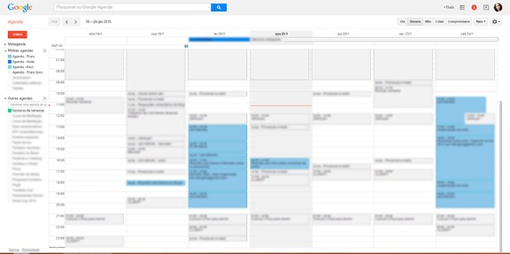
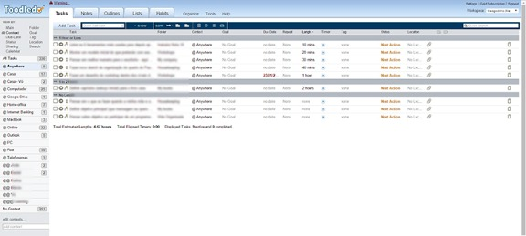
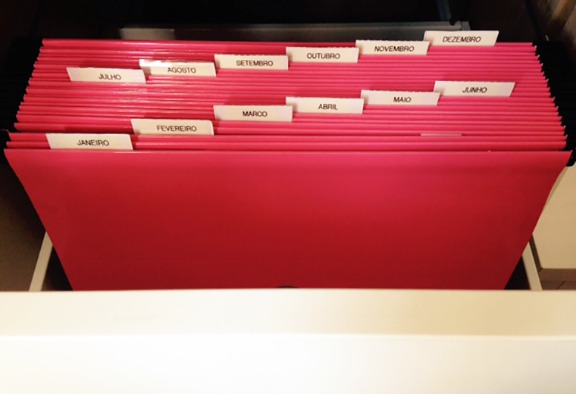
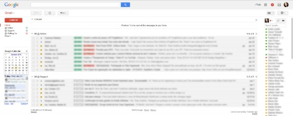
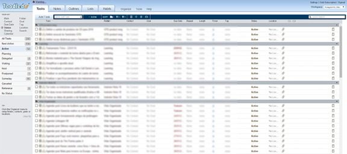
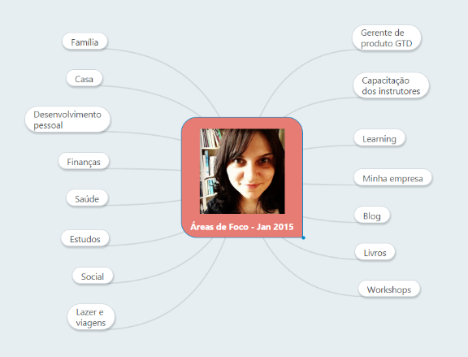

# Como estou organizando meu sistema GTD atualmente

Depois de tudo o que vem acontecendo, muitas pessoas estão chegando no meu blog por causa do assunto [GTD](http://vidaorganizada.com/gestao-do-tempo/gtd/duvida-respondida-como-comecar-gtd/ "Dúvida respondida: como começar no GTD?"), que é um dos meus preferidos. Começaram a aparecer comentários em posts mais antigos com dúvidas sobre como eu tenho utilizado meu sistema atualmente, então achei mais fácil escrever um post explicando de maneira geral.

O GTD trabalha com horizontes de foco, que são:

- Pé no chão – Agenda / Tarefas
- Nível 1 – Projetos
- Nível 2 – Áreas de foco
- Nível 3 – Objetivos
- Nível 4 – Visão
- Nível 5 – Propósito

Para quem quiser saber mais, recomendo a leitura do livro “A arte de fazer acontecer”, que dá origem ao método. Aqui no blog eu passo a minha visão do GTD, como não poderia deixar de ser. Sempre recomendo a leitura na fonte original porque aqui é só um complemento.

Minha organização é pautada messes níveis, então.

### Agenda

Como agenda, eu utilizo o Google Calendar, pela facilidade de manuseio e possibilidade de compartilhamento. Meu marido tem uma agenda lá também e, para a gente, facilita muito.

Já expliquei em outro post como utilizo o [esquema de duas cores](http://vidaorganizada.com/produtividade/dicas-para-facilitar-o-dia-a-dia-com-relacao-a/agenda/hack-para-agenda-duas-cores/ "Hack para agenda: duas cores") na agenda, algo que é fundamental na minha organização. Utilizo a minha agenda para:

- Compromissos com data e hora (reuniões, consultas, aulas, treinamentos, workshops)
- Lembretes
- Controle de prazos
- Vencimento de contas
- Estimativa de tempo (insiro tempos que passo me deslocando e consigo visualizar quanto tempo tenho todos os dias para trabalhar em outras atividades)

Uma boa prática (funciona para algumas pessoas, outras não) é inserir, durante a revisão semanal apenas, as tarefas que você precisa executar naquela semana que tenham duração de mais de meia hora ou demandam atenção total. Comigo não funciona tão bem porque trabalho com criatividade e prefiro trabalhar com as listas de contextos mesmo e os espaços na agenda, em vez de inserir as atividades nela. Porém, já fiz o teste e funciona bem para a execução, porque tendemos a dar prioridade ao que está na agenda. Abaixo eu mostro como gerencio as minhas tarefas.

Não gosto de habilitar notificações e faço isso somente em situações bem específicas, como quando preciso dar um telefonema em determinado horário ou tomar remédios controlados.

Meu dia de trabalho se divide em média em: 30% para tarefas planejadas, 30% definindo meu trabalho (processando, revisando, organizando) e 40% em tempo dedicado às demandas do dia e outros imprevistos.

### Tarefas

Eu utilizo o Toodledo para gerenciar minhas listas de tarefas. No GTD, as listas de ações são organizadas por contextos, ou seja, as situações onde você estará inserido no seu dia a dia para executar aquelas tarefas.

Vivo mudando meus contextos para que se adequem às minhas necessidades do momento; às vezes tenho muitos, às vezes prefiro trabalhar com poucos.

No geral, coloco datas (prazos) nas tarefas somente quando esses prazos são reais, e não como “lista de desejos”. Logo, poucas tarefas realmente têm datas.

Minha ordem de execução é a seguinte:

1. Tarefas do dia (com data)
2. Tarefas no contexto em que estou inserida, de acordo com meu tempo disponível e nível de energia

### Tickler

O tickler é um conceito do GTD que serve para você atribuir dados a dias e meses. Você pode inserir compromissos, tarefas e informações no geral, dependendo de como você preferir utilizar ([leia mais aqui](http://vidaorganizada.com/gestao-do-tempo/gtd/o-que-e-o-tickler-e-como-funciona/ "O que é o tickler e como funciona?")). Hoje eu utilizo somente para arquivos de suporte. Exemplo: pauta impressa que tenho que levar em uma reunião no dia X, ingressos para um show que só acontecerá em abril, lista de perguntas para fazer na próxima consulta com o pediatra, documentos que precisarei levar no dia de uma viagem internacional e por aí vai.

O tickler pode ser tanto digital quanto físico. Eu tenho os dois. O físico, deixo em uma gaveta de pastas suspensas no meu home-office. Apesar de não usar tanto, ainda é útil. O digital, eu mantenho no Evernote. Dá para fazer com a agenda do Google, pois ela suporta o upload de arquivos, mas prefiro centralizar tudo no Evernote mesmo.

Não estou mais usando todo o meu sistema no Evernote e, por isso, minha configuração atual está diferente da do [guia](http://vidaorganizada.com/gestao-do-tempo/gtd/guia-definitivo-vida-organizada-para-usar-o-gtd-evernote-introducao/ "Guia definitivo do Vida Organizada para usar o GTD no Evernote – Introdução"). Atualmente, tenho um caderno chamado “Incubate stuff” onde insiro essas notas que posso precisar, e aí sim utilizo as tags para fazer isso. Caso tenha dúvida, por favor, verifique como faço no guia linkado acima, onde explico detalhadamente.

### E-mails

Os e-mails fazem parte das demandas diárias e, como tal, são nível pé no chão como as tarefas e a agenda. Depois do curso do Fundamentals, eu estou utilizando somente quatro pastas de e-mails no meu Gmail:

- @ Action – Para tudo o que demanda ação
- @ Support – Todos e-mails que, de alguma forma, contêm informações úteis para ações ou projetos
- @ Waiting for – Todos os e-mails que solicitei algo para alguém e estou aguardando resposta
- File – Arquivo (todos os e-mails que não demandam qualquer tipo de ação)

É importante perceber que o e-mail acaba virando outra lista de tarefas. Isso foi dito no curso, inclusive. O modo de gerenciar é diferente.

Eu costumo coletar o que está na pasta @ Action e processar como tarefa no Toodledo porque, para mim, esse replique funciona. Quem não sentir necessidade, não precisa e só a pasta é suficiente. O mesmo vale para a pasta de @ Waiting for.

Em @ Support, os e-mails ficam muito rápido. No geral, eles logo são arquivados.

Uma vez por ano, reviso a pasta de arquivo para enviar as informações relevantes para o Evernote e deleto o que não preciso mais guardar. Vale citar que, no dia a dia, se eu receber algo importante de cara que quero guardar, como faturas ou notas fiscais, já encaminho diretamente para o Evernote através da minha conta de e-mail do programa. No geral, o que fica arquivado no e-mail então são somente aqueles e-mails como confirmações, por exemplo. O que é arquivo importante eu já tenho o costume de arquivar direto no Evernote, caso precise em um futuro próximo.

Processo meus e-mails duas vezes por dia (às vezes, somente uma, dependendo dos meus compromissos no dia). Quando estou ministrando um treinamento das 8 às 18h, por exemplo, costumo acessar meus e-mails pelo celular para verificar se há algo urgente. Se sim, respondo ali mesmo ou ligo para a pessoa. Se não, vejo mais tarde, em casa, ou no dia seguinte mesmo.

Uma coisa que tem me ajudado bastante no trato com os e-mails é utilizar a caixa de entrada prioritária do Gmail (vá em Configurações > Caixas de entrada > Caixa prioritária). Deixo assim:

1. Não lidos
2. @ Action
3. @ Support
4. Everything else

Assim, consigo visualizar na caixa de entrada mesmo todos os e-mails que demandam algum tipo de ação e também seus arquivos de suporte. Tem funcionado bem!

Para mim, o fundamental com relação aos e-mails é diferenciar o que demanda ação do que não demanda, assim como ter uma lista de tudo o que eu pedi para outra pessoa (fica mais fácil de cobrar) e um inventário dos arquivos que estou utilizando no momento.

### Mensagens e notificações tipo What’s App

Acho que enviar mensagens pelo Facebook, Twitter ou What’s App facilita muito a vida em termos de rapidez e praticidade, mas complica em outros aspectos porque são mais caixas de entrada para verificar.

O que tenho feito e que tem funcionado é estabelecer períodos de checagem, assim como faço com os e-mails. Desabilitei as notificações no meu celular e vejo nas pausas durante o dia de trabalho (What’s App), geralmente a cada 1h30. Nas redes sociais, costumo olhar apenas uma vez por dia.

Só entro no Skype quando tenho alguma reunião específica agendada com alguém. Não atendo chamados, então meu modelo de trabalho me permite fazer isso. Não preciso estar disponível o tempo inteiro.

### Projetos

Para gerenciar meus projetos, eu utilizo o Toodledo. Minha conta é Golden, o que me permite acesso a uma série de recursos, como sub-tarefas e denominação de status. Quando crio um projeto, as próximas ações dele são as sub-tarefas e, o status, Active. Assim, se eu clicar para visualizar minhas to-dos no sistema dentro de Status > Active, tenho um inventário de todos os meus projetos. Quando essa tela abre, eu clico também no título da coluna “Folder”, que me mostra os projetos listados de acordo com as áreas de foco.

Como vocês podem ver no print acima, atualmente eu tenho 54 projetos em andamento. O David fala que uma pessoa normal costuma ter entre 30 e 100 projetos em andamento, então tomo isso como parâmetro de piso e teto. Pela minha experiência pessoal, sei que, se eu estiver com muitos projetos (de 60 a 90), consigo executar bastante coisa, mas a vida fica corrida. Portanto, tento ficar entre 30 e 50, mas às vezes passa. Tenho muitos projetos pequenos também. Enfim, concordo com o David quando ele diz que não importa a quantidade, desde que esteja sob controle.

Porém, citei a coisa dos números porque estou adotando uma estratégia legal: só insiro um projeto novo da lista Algum dia / Talvez se eu estiver com menos de 30 projetos. Na revisão semanal, o David recomenda que a gente seja criativo e revise a lista de Someday / Maybe para ver se algo pode virar um projeto. Pois bem, eu fazia isso sem critério. Logo, meu critério atual é ter menos de 30. Ou seja, se eu tiver 29 projetos, pego UM da minha lista de Algum dia / Talvez para trabalhar. Se estiver com 25, posso pegar mais cinco. No final do ano passado eu cheguei a listar 28, então pude inserir novos projetos.

É claro que há projetos que não temos escolha, especialmente de trabalho, que caem no nosso colo. Por isso mesmo a lista acaba crescendo e indo para 50, 60 projetos. Só que vale a pena cada um encontrar seu limite pessoal para saber quanto se tem muito projeto, revisar e priorizar. Pode ser que algum projeto atual possa ser adiado ou até mesmo cancelado.

A diretriz do David Allen para revisão dos projetos é fazer isso uma vez por semana. Logo, é importante ter uma lista com todos os projetos em andamento para facilitar essa revisão.

Algo que estou estruturando atualmente é o manuseio de arquivos de suporte a projetos e informações de referência. No geral, mantenho as informações no Toodledo (tem um status que é “Reference”) e os arquivos no Evernote, mas ainda não estou satisfeita e estou estudando melhores usos.

### Áreas de foco

Depois do curso do David, estou “pirando menos” com relação às áreas de foco. Eu estava utilizando as Notes do Toodledo para escrever a respeito, mas mudei. Hoje, gerencio de duas maneiras:

**1.** Tenho um mapa mental com minhas áreas de foco, que reviso e atualizo mensalmente (de acordo com a recomendação do David em “Making it all work”):

Este mapa serve para revisão e reflexão. Será que estou equilibrando todas as minhas áreas de foco? Será que não é hora de dizer adeus a alguma delas ou olá para outra?

A ferramenta utilizada para manusear mapas mentais é o [Mind Meister](http://mindmeister.com/).

**2.** Utilizo as áreas de foco para organizar meus projetos e tarefas no Toodledo, de acordo com o que o programa chama de “Folder”. Ou seja, se eu clicar na pasta “Casa”, o Toodledo me listará todas as próximas ações, projetos, algum dia / talvez etc que sejam relacionados a essa área de foco. Já organizo assim há muitos anos e é o que funciona para mim.

### Objetivos, visão e propósito

Tenho listado meus objetivos no próprio Toodledo, na área de Goals. no momento, estou utilizando somente os “short-terms” para facilitar. Costumo linkar os objetivos aos projetos e tarefas que sejam relacionados.

Visão e propósito estou gerenciando na guia Outlines, com listas.

Os objetivos de curto prazo eu reviso a cada estação (sazonalmente). Visão e propósito, reviso anualmente ou quando sentir necessidade de uma reestruturada.

### Referência

No geral, todo o meu sistema pode ser resumido em duas coisas: se demanda ação, está no Toodledo; se é referência, está no Evernote. Todo o meu arquivo de referência está lá. Mudei o caderno “Processed” para o nome “General reference” e, dentro, as notas de referência, organizadas pelas tags dos assuntos.

Outra coisa que está no meu Evernote é um caderno “Read / Review” (o famoso ler / revisar do GTD), que mantenho offline no celular para ler os artigos que coleto do meu Feedly.
