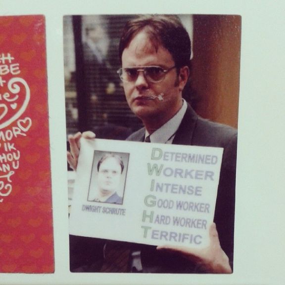

# Como eu me sinto depois de 7 meses trabalhando em casa como autônoma

Em junho de 2014, eu bati meu cartão pela última vez na empresa onde trabalhava e encarei de frente o desafio de ser autônoma e trabalhar em casa (ou de onde eu quisesse). Eu tinha um emprego estável, que pagava as minhas contas e sustentava a minha família, e pela primeira vez em muitos anos me senti segura para fazer essa transição mesmo com aluguel, financiamento de carro e outras contas batendo à porta.

Como vocês podem imaginar, essa decisão não foi tomada da noite para o dia. A insatisfação vinha de um bom tempo – com tudo relacionado à minha vida profissional. Eu estava prestes a lançar um livro em agosto e não tinha como dedicar mais do meu escasso tempo a algo que era realmente importante para mim. Também sentia que eu tinha oportunidades legais de crescimento investindo em algo não só que eu amo, mas que é uma demanda mundial (“todo mundo quer ter uma vida organizada”, já dizia uma colega da pós-graduação). Mesmo assim, juntar tudo, prender a respiração e dar um mergulho não é fácil, mas eu fiz.

Hoje, alguns meses depois, consigo olhar um pouco para trás e fazer um balanço de como têm sido os meus dias trabalhando em casa e por conta própria.

A primeira coisa que eu gostaria de dizer, e que vocês já devem imaginar, é que não é fácil. Não apenas pela preocupação de não ter o salário certinho na conta todo mês, mas porque existem pessoas que dependem de você e da sua competência para fazer acontecer. Além do que, o modelo tradicional de trabalho das 8 às 18h está enraizado na nossa cabeça de tal forma que é difícil a gente mesmo se acostumar com a rotina e, além disso, convencer os familiares. Meu marido até hoje acha que eu tenho que trabalhar das 9 às 18h, mesmo que eu tenha perdido a minhã inteira fazendo compras no supermercado, por exemplo…

Outras coisas que eu percebi e aprendi:

- **Cada pessoa tem um ritmo** e deve construir uma rotina que se adeque a ele. Eu tentei acordar cedo muitas vezes e perdia a manhã inteira em estado letárgico, sem conseguir produzir. Lembrem-se que eu trabalho com criação, conteúdo e ideias, então estar inspirada é fundamental. Ainda gosto de tentar acordar cedo, mas uso esse período do dia pra atividades mais rotineiras e que não demandem criatividade, apenas por me conhecer melhor.
- **Tem que tomar muito cuidado para a rotina não virar uma coisa anti-produtiva**. E sim, aqui é a Thais, usuária de GTD há mais de oito anos, que está falando. Como os horários se confundem, é muito fácil parar um pouco para almoçar e aproveitar para lavar a louça, arrumar aqui e ali, navegar na Internet e depois ter que ficar terminando pendências de noite. Nada contra fazer isso, desde que você tenha se programado. Acho que a grande chave (e que tem funcionado para mim) é descobrir os períodos de maior e menor energia e designar atividades específicas para eles. Por exemplo, não vou programar de escrever um post para o blog em um momento que estarei cansada. E é difícil entender isso – a gente vai aprendendo com o tempo mesmo.
- **Os horários se misturam e isso é ok, contanto que você se organize**. Uma das grandes vantagens de ser autônoma é essa liberdade de poder fazer o seu próprio horário (exceto quando se tem reuniões e outros compromissos, claro). A primeira vez que eu fui ao médico em uma quarta-feira à tarde e não precisei pedir atestado foi de uma libertação tremenda para mim. Não preciso dar satisfação para ninguém, eu pensei. Mas aí não pode achar que você não usará parte da sua noite, quando a maioria das pessoas chegou do serviço e está descansando, para trabalhar também. Não existe feriado e final de semana para mim. Como o que eu ganho depende da minha “produção”, e eu amo o que eu faço, trabalho não é algo enfadonho, cansativo e chato. Faz parte da minha vida. Eu realmente preciso me cuidar para equilibrar o tempo que passo trabalhando com as minhas outras atividades pessoais, mas já não me cobro tanto com relação a turnos ou horários.
- Apesar de os horários se misturarem, **é importante descansar**. Você pode não ter um final de semana como as outras pessoas, mas pode determinar que segunda de manhã você vai descansar ou vai tirar a quinta de folga. É fundamental fazer isso e refrescar a cabeça um pouco. Só trabalhar direto, sem a sensação de descanso, a médio prazo começa a se mostrar uma alternativa não muito saudável e viável. Delegar algumas tarefas pode ajudar, mas isso só é possível com o tempo (e à medida que você vai ganhando mais dinheiro a ponto de poder pagar outras pessoas para fazerem coisas para você).
- Apesar de eu não ter que dar satisfação a ninguém e não ter “chefe”, **todo cliente é meu chefe**. Se eu der alguma mancada ou não cumprir algum prazo, posso perder o cliente e, por fim, o meu “salário” que viria dali, sem vínculo nenhum.
- **Cada setor tem as suas sazonalidades** e dificilmente alguém contará isso para você – você vai acabar descobrindo sozinho/a. Há períodos em que você vai trabalhar muito e ganhar bem, como haverá períodos em que você trabalhará pouco e receberá quase nada. Tem que existir um equilíbrio e um planejamento para essas épocas, para você não desanimar e se desesperar.
- **As pessoas que continuam no mesmo ritmo de trabalho convencional vão estranhar** quando você estiver trabalhando em um feriado ou durante a viagem para a praia. Faz parte do seu trabalho explicar e esclarecer sobre o seu novo modelo. É tudo novidade para elas.
- Elas também vão estranhar e podem fazer comentários maldosos se você estiver no cinema em uma terça-feira à tarde. Isso é uma desvantagem, porém, estar no cinema em uma terça à tarde é uma enorme vantagem que você tem! Aprenda a lidar.
- **Quanto mais dinheiro você tiver conseguido juntar para fazer essa transição, melhor**. Isso vai te deixar menos preocupado/a e ansioso/a.
- Fazer o que se ama é maravilhoso, mas muitas vezes “o que se ama” é ter essa flexibilidade e trabalhar com coisas aparentemente bobas que ninguém ama, como produzir conteúdo para uma empresa de sacos plásticos ou gerenciar contatos para uma PR. São apenas exemplos. **Quando pensar em fazer o que você ama, veja se está relacionado ao O QUÊ do seu ofício ou ao COMO**.
- Você vai sentir medo e vontade de abraçar todas as oportunidades que surgirem, para evitar ficar sem trabalho e sem dinheiro. Isso pode te tirar do foco, ou talvez você o perca. Aproveite esse período para se conhecer melhor e ver o que você quer fazer. [Ter uma missão pessoal](http://vidaorganizada.com/produtividade/desenvolvimento-pessoal-profissional/como-encontrar-sua-missao-pessoal/ "Como encontrar sua missão pessoal") ajuda a decidir.
- **Trabalhar em casa não significa, literalmente, trabalhar em casa**. Significa que você pode trabalhar de qualquer lugar. Ficar muito em casa pode te deixar meio deprê e desanimado/a. Procure almoçar fora ou dar uma volta na hora do almoço, conversar com outras pessoas, fazer as reuniões pessoalmente, trabalhar em uma cafeteria ou em um espaço de coworking. Não precisa ser todos os dias, mas pode ajudar variar os ares de vez em quando.
- **É praticamente impossível convencer todo mundo logo de cara que, porque você está casa, não significa que você esteja disponível**. Estabeleça regras como “se eu estiver com o fone, estou concentrada/o, não me interrompa” ou “quando eu estiver em reunião, vou colocar um post-it amarelo na porta”. Estar em casa foi uma grande novidade tanto para o meu marido quanto para o meu filho, e a minha dedicação ao trabalho no começo foi muito estressante, pois precisava parar a todo momento. Aos poucos, todo mundo vai se acostumando.
- **Não pire – pense em soluções**. Se você não consegue se concentrar no home-office, vá para a sala ou para a cozinha. Se tiver quintal, vá para o quintal, ou varanda. Se sua cadeira machuca as suas costas, pesquise e economize para comprar um modelo novo. Se você tem muito papel, tire um dia para organizar tudo. É muito importante que o seu local de trabalho esteja organizado e limpo, para você não desanimar de trabalhar ali.
- **Estabeleça suas prioridades e torça para que as pessoas não pensem mal de você**. De verdade, as pessoas ficam chocadas quando eu digo que não deixo ligada a notificação do What’s App! Ou que não posso sair em uma sexta à noite porque estou trabalhando no meu novo livro. É outro ritmo – repita o mantra até você assimilar e parar de se sentir culpada/o pelo estranhamento dos outros. Falar não faz parte – você que gerencia seu tempo agora, e não um relógio de ponto. Logo, precisa ser criterioso/a.

No geral, o que eu realmente sinto depois desses meses é que não é fácil, que a rotina deve ser adaptada ao estilo de cada um e que é muito fácil se deixar levar pela falta de foco. Porém, com organização e um pouco de disciplina, mas principalmente de auto-conhecimento, eu não consigo me imaginar trabalhando de outra maneira que não assim daqui para a frente. Tem um pouco de ser artista nesse meio todo, porque você colhe o resultado de um trabalho que você fez por merecer, e não aquilo que alguém acha que você merece. É muito satisfatório e feliz, mas também não acho que seja para todo mundo. Cada um tem seu grau de importância para determinados fatores. Por exemplo, para mim, ter estabilidade no emprego foi importante durante muitos anos, e acho ok que isso seja um parâmetro, especialmente quando se tem uma família que depende de você. Hoje, penso que a estabilidade deve ser construída por mim – é outra visão do mesmo todo. E estou bem com isso.
