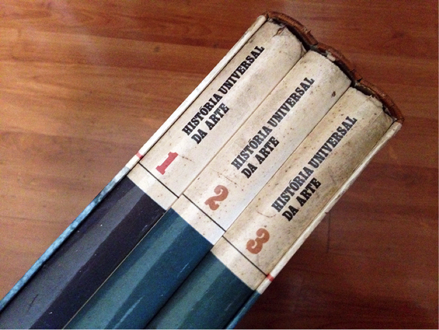

16 *Jan 2015*

## Como vender as coisas que você não vai usar mais na Internet

Sempre falo aqui no blog que não é possível organizar coisas que não servem mais para nós. Ou seja, se a gente quer começar a se organizar, o primeiro passo é selecionar o que deve ficar na nossa casa (e em toda a nossa vida – vale de objetos a relacionamentos). Mas como saber o que não serve mais?

Eu costumo recomendar aos leitores que guardem as coisas somente se elas obedecerem algum desses critérios:

1. É algo que você usa muito (ex: seu sapato preferido)
2. É algo que você não usa tanto, mas pode sempre precisar (ex: abridor de garrafas, vestido de festa)
3. É algo que você ama e te deixa feliz sempre que você olha (ex: um quadro, um objeto de decoração, um colar deixado pela sua avó)

Do contrário, com raríssimas exceções, esse objeto acaba virando inútil para nós. E por quê? Porque a nossa casa deve ser vista como um refúgio, um espaço sagrado mesmo. Existem milhões de coisas no mundo – imagine se quiséssemos trazer para dentro do nosso lar tudo o que a gente achasse que valeria a pena trazer? Nem teria como. Então a gente tem que selecionar e fazer uma verdadeira curadoria pessoal daquilo que realmente precisamos e/ou queremos ter.

Vale lembrar dos motivos para fazer isso. Primeiro, que guardar algo que você não use ocupa um espaço que poderia ser liberado para outros mais importantes. Segundo, que alguém pode estar precisando desse objeto em algum lugar. Terceiro, que se você não gosta de um objeto e o mantém ali, toda vez que você olha para ele, isso te causa um mal-estar inconsciente, que ninguém merece ter na própria casa.

Sempre que eu falo sobre desapegar aqui no blog alguns leitores me perguntam como fazer para se desfazer de tais objetos.

Agora, é claro que você pode pensar em vender, caso não tenha para quem doar ou dar de presente. E aí então surgiu a [OLX](http://bit.ly/14D1sPO).

Basicamente, [OLX](http://bit.ly/14D1sPO) é um site onde você pode vender as suas coisas sem qualquer burocracia. Basta se cadastrar (o que é bem rápido), anunciar e pronto, já está vendendo.

Para ilustrar o post, eu escolhi uma coleção minha de livros que, infelizmente, já não tem lugar na minha estante. Com quase 800 livros, estou começando a desapegar e a querer manter comigo somente aqueles que pretendo consultar alguma vez nos próximos anos, que gosto muito ou que ainda pretendo ler.

“História universal da arte”, G. Pischel, 3 volumes

Os livros vêm dentro de uma caixa (também com papel cartonado grosso) e a frente da caixa é igual à capa do volume 1.

São livros antigos, que já vieram assim para mim, mas são perfeitamente manuseáveis e ficarão lindos em qualquer sala, mesa de centro ou estante com livros de arte.

Para cadastrar um produto na OLX, basta seguir os seguintes passos:

1 – Acesse o site da [OLX](http://bit.ly/14D1sPO) e clique em “Publicar anúncio”. Esse procedimento é gratuito.

2 – Abrirá uma página onde você deverá inserir os dados sobre o objeto que deseja vender. Primeiro, selecione a categoria. Eu coloquei “Música, arte e lazer” e, depois, “Livros, revistas, músicas e filmes”. Depois, é hora de inserir o título do anúncio, as fotos, a descrição e o preço. O que eu mais gosto na hora de inserir as fotos é que dá para selecionar todas de uma vez e inserir – não precisa ficar clicando para abrir uma por uma.

3 – Coloque o preço desejado. Um recurso bastante interessante é marcar a caixinha “Topo negociar”. Ou seja: você abre o preço para negociação. Quem for comprar pode te fazer uma proposta em vez de fechar o anúncio só porque o preço não está tão bom.

5 – Verifique se todas as informações estão corretas e clique em “Publicar anúncio grátis”.

Pronto! Agora, seu anúncio está prontinho para milhares de pessoas.

Escrito por [Thais Godinho](http://vidaorganizada.com/sobre/ "Thais Godinho")

em [Posts patrocinados](http://vidaorganizada.com/categoria/sobre/sobre-o-blog/posts-patrocinados/ "Posts patrocinados")

- [0 comentários](http://vidaorganizada.com/sobre/sobre-o-blog/posts-patrocinados/como-vender-as-coisas-que-voce-nao-vai-usar-mais-na-internet/#comments)
