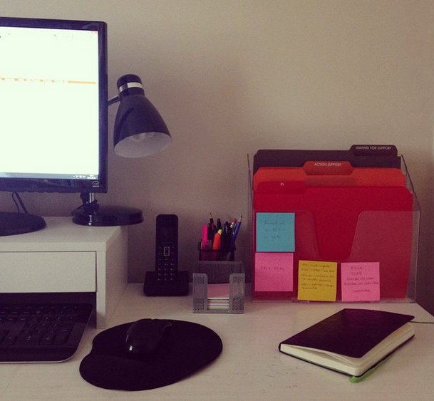

17 *Jan 2015*

## Encontrando nosso limite de “ter menos coisas”

É muito comum, quando falamos sobre simplicidade voluntária, associar ao conceito minimalista de ter menos coisas. Muitas pessoas chegam até mesmo a dizer que não conseguem simplificar a vida porque não se imaginam vivendo em uma casa vazia, porque gostam das coisas… mas epa, peraí! Quem disse que ser minimalista significa ter poucas coisas?

Ser minimalista significa ter o mínimo necessário para viver bem. Isso varia de pessoa para pessoa.

Outro ponto é que nem todo mundo que busca simplificar a vida precisa necessariamente ser minimalista, apesar de uma coisa estar sim ligada à outra, pelo menos conceitualmente. Afinal, se queremos simplificar, para que vamos complicar tendo coisas além do que precisamos? É mais coisa para limpar, cuidar, guardar, ocupar espaço.

Penso que, por fim, trata-se mais de pensar sobre as coisas que temos. Falo muito aqui no blog que não é possível organizar tralha, justamente porque não adianta organizarmos tudo o que temos dentro de caixas se ali dentro tem objetos que não usamos, embalagens vazias, papéis que deveriam ter ido para o lixo etc. Faz parte do processo de organização essa seleção do que será guardado também. Se não, isso não é organização, é arrumação.

Thoreau disse que se sentia orgulhoso por todas as coisas dele caberem em um único carrinho de mão. Se pararmos para pensar, precisaaar mesmo, só precisamos de poucas coisas. Porém, amplie esse círculo. Há outras coisas que também precisamos. Sim, em teoria, precisamos apenas de um copo em casa, que podemos ir lavando e usando, lavando e usando. Mas isso é confortável para nós? Não. Qual o nosso limite? Aí é que está. Cada um tem o seu. Então o que cada um tem que pensar é: quantos copos eu preciso ter na minha casa? Pode ser que você more sozinho e só precise de um mesmo, ou de quatro, caso receba visitas. Ou talvez você more em uma casa com uma família de 10 pessoas e precise de muitos copos. Ou talvez more apenas com seu companheiro ou companheira mas receba sempre muitos amigos em casa, então precisa de mais. Dei o exemplo do copo porque é o mais simples possível, mas a ideia é ampliar para toda a casa.

Por exemplo, você adora caderninhos. Mesmo amando muito esses objetos adoráveis, no geral, acaba usando um depois do outro, certo? Usa um até acabar e só depois usa o segundo. Então para que manter um estoque com cinco ou seis caderninhos em branco em casa? Não é mais fácil comprar um novo somente quando terminar de preencher um inteiro?

São apenas questionamentos. O mesmo vale para roupas, sapatos, pratos, panelas, computadores.

E aí a gente cai na questão das coleções também. Coleção não é utilidade, mas apreciação. É um hobby. Se você tem uma coleção que gosta muito, é óbvio que se desfazer dela deixará você um pouco infeliz. Ninguém está pedindo para você ter uma casa vazia, sem nada que represente as memórias da sua vida. Não. A ideia é apenas que você repense o que você vem guardando, para avaliar se tem mesmo sentido guardar tudo isso.

Portanto, quando se deparar com algum objeto na sua casa, pergunte-se sempre:

- Eu uso esse objeto?
- Em que situações?
- Há quanto tempo eu usei pela última vez?
- Pretendo usar no próximo ano, em algum momento?
- Eu amo esse objeto?
- Eu abro um sorriso toda vez que olho para ele?
- Alguém da minha família usa ou gosta muito desse objeto?
- O espaço que esse objeto ocupa na minha casa vale a pena?

Mesmo que você fique em dúvida com uma série deles e acabe guardando a maioria, você conseguirá selecionar algumas coisas que não se enquadram nas perguntas acima. Aí você pode vender, doar, dar de presente, reciclar, reutilizar ou até mesmo jogar no lixo. Fazendo essa análise de tempos em tempos, você vai fazendo uma curadoria do que precisa ficar na sua casa com o passar dos anos.

Fecho o post com uma frase da Danuza Leão que gosto muito, e que tem tudo a ver com o post: “Passei metade da minha vida usando meu dinheiro para acumular coisas, e agora passo a outra metade me desfazendo delas”. Reflita!

Escrito por [Thais Godinho](http://vidaorganizada.com/sobre/ "Thais Godinho")

em [Minimalismo e simplicidade](http://vidaorganizada.com/categoria/organizacao-pessoal/minimalismo-simplicidade/ "Minimalismo e simplicidade")

- [12 comentários](http://vidaorganizada.com/organizacao-pessoal/minimalismo-simplicidade/encontrando-nosso-limite-de-ter-menos-coisas/#comments)
