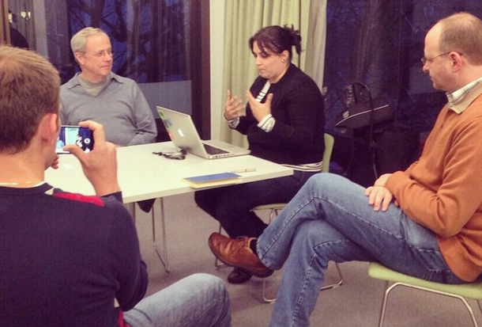

19 *Jan 2015*

## GTD Fundamentals – aprendizados do curso

Na semana passada, fui convidada pelo Daniel ([Call Daniel](http://www.calldaniel.com.br/)) para ir à Amsterdam conhecer pessoalmente (!) o David Allen (criador do método GTD) e participar do primeiro dia do curso GTD Fundamentals. Além de me apaixonar pela cidade, pude aprender muito sobre o novo ensino do GTD e quis compartilhar aqui com vocês, como sempre!

Em resumo, David Allen não se contenta em ser o cara que criou o método de produtividade definitivo – ele quer deixar um legado. Às vésperas de completar 70 anos de idade, ele resolveu investir seu dinheiro em uma formação aprofundada de multiplicadores do GTD, com a definição de três cursos (e certificações); Fundamentals, Projects & Priorities, Focus & Direction. Além dos cursos de formação, haverá também turmas abertas com a mesma aplicação, mas para quem quiser simplesmente aprender a usar o GTD, e não ensinar. Por enquanto, a maioria é nos Estados Unidos ([clique aqui para ver todas as datas disponíveis](http://gettingthingsdone.com/events/)).

O Daniel foi para lá para tirar as certificações 1 e 2 (Fundamentals e Projects). O curso do nível 3 ainda não está pronto, mas estará em breve. Eu participei do primeiro dia do Fundamentals como convidada, mas pretendo tirar as duas certificações ainda este ano também, igualmente pela Call Daniel (parceira exclusiva da David Allen Co. no Brasil).

Mesmo participando somente de um único dia, a minha mente ficou fervilhando! Essa viagem foi uma experiência tão incrível para mim que fico brincando que existe a Thais A.D. (antes do David) e D.D. (depois do David). Eu já uso o GTD há oito anos, mas o David deu uma renovada legal no ensinamento do método para este curso, mudando oficialmente o nome dos cinco passos (coletar, processar, organizar, revisar e executar passaram a ser capturar, clarear, organizar, refletir e engajar).

Na entrevista que fiz com ele (os vídeos estão sendo editados e legendados para colocarmos no ar o mais breve possível), perguntei sobre o motivo dessa mudança e a resposta foi bem legal. Ele disse que, antes, a nomenclatura dos passos remetia a algo muito mecânico e operacional (coletar, processar, executar). Agora, eles representam melhor a ideia que ele quis passar. É uma nomenclatura mais intelectual, mais ligada ao trabalho da mente que ao operacional. Realmente, faz muito mais sentido.

Márcio, David, eu, Daniel

No geral, foram muitos aprendizados mesmo nesse curso e com os papos que tivemos com o David no geral. Vou tentar resumir neste post alguns pontos específicos, mas com certeza todos eles (e outros) gerarão muitos posts futuros depois.

# Sobre a captura de ideias (antiga coleta), existem **mil ferramentas** e é ok usar várias, desde que isso faça sentido para você e não te atrapalhe. O David prefere fazer a captura no papel, e eu também (é mais rápido e menos complicado).

# É fundamental **ter um instrumento de captura perto de cada telefone e em cada estação de trabalho** (no escritório e em casa, por exemplo). E ter sempre com você uma forma de capturar as ideias.

# **Ter um escritório móvel** faz parte do cotidiano da maioria dos profissionais hoje em dia. A recomendação é você ter uma pasta com seu computador e tudo o mais que for necessário para você se deslocar e conseguir trabalhar onde quer que seja. Na sua pasta, tenha um compartimento para colocar todos os papéis que chegam até você (uma inbox). Eu tenho uma pasta da David Allen Co. (vendida lá fora), mas qualquer pastinha serve. Também pode ser útil ter uma pasta Ler / Revisar para guardar revistas e artigos não digitalizados que você tenha que ler.

# **Processar não é chato**. Na verdade, é o passo onde a gente deve investir mais inteligência dentro do GTD. Se o processamento for bem feito, todo o resto flui porque as coisas ficam claras. Se a gente processa errado, trata projeto como tarefa e algum dia / talvez como projeto. Isso prejudica todo o esquema. Portanto, vale a pena investir um tempinho todo dia nesse processamento inteligente, feito com foco e atenção.

# Algo que eu sempre me preocupei bastante foi com o fato de **tentar unificar todo o meu sistema do GTD em uma única ferramenta**. No curso, aprendi a desencanar um pouco disso. É ok usar boas (e diferentes) ferramentas para cada função. Elas nem precisam ser sincronizadas – quem sincroniza tudo é você.

# Outro ponto que o David tocou foi na questão de **trocar toda hora de ferramenta**, de ficar experimentando várias e tudo o mais. Ele disse que recentemente tentou trocar a ferramenta que ele usava por outra, mas não se adaptou e quis voltar. Só que, em vez de voltar, ele aproveitou a oportunidade para rever todo o seu sistema. Recomeçar do zero. Então, de certa forma, trocar de ferramenta tem o lado positivo de nos fazer revisar a vida e filtrar um pouco mais as informações.

# Também me surpreendi com a **formalização de um padrão para aplicar o GTD em qualquer ferramenta** da maneira mais simples possível. Isso foi importante porque me deu uma espécie de clique – a gente não precisa inventar a roda toda vez que mudar de ferramenta; tem um básico que a gente pode seguir e depois ir mudando, se quiser e sentir necessidade. Esse padrão é bem legal porque dá para aplicar em qualquer ferramenta, da mais avançada ao bom e velho caderno de papel.

# A **divisão da revisão semanal em três passos** (get clear, get current e get creative) facilita porque, além de deixar mais claro o que a gente tem que fazer em cada parte, também possibilita a divisão. Acho isso legal porque, muitas vezes, estou muito cansada ao final de uma revisão semanal para “ser criativa”, então posso fazer isso quando estiver com a cabeça mais fresquinha.

# Eu não tinha entendido muito bem a **mudança do *executar* para o *engajar***, confesso… Mas, na conversa que tivemos, ficou muito claro para mim. Executar, no GTD, significa mais do que fazer – significa que aquilo que eu estou fazendo é a coisa certa a ser feita, na hora certa. Há um significado e uma coerência em todas as coisas que eu faço na minha vida. Isso é muito mais do que simplesmente executar. É uma execução inteligente.

Por fim, meus próximos passos com relação ao meu aprendizado no GTD são realmente tirar essas duas primeiras certificações e, aqui no blog, continuar compartilhando essas experiências com vocês. Como eu comentei no post sobre os [planos do blog para 2015](http://vidaorganizada.com/sobre/sobre-o-blog/novidades/planos-para-o-blog-em-2015/ "Planos para o blog em 2015"), quero falar mais sobre GTD aqui. Uma das ideias é iniciar uma série em breve para que todos aprendam a usar o GTD do zero, implementando tudo aos poucos. Estou preparando essa série com muito carinho e em breve ela começará a ser publicada aqui no blog.

**E então, o que acharam dessas últimas reflexões? Geraram mais perguntas do que respostas? Deixe sua dúvida nos comentários.**

Escrito por [Thais Godinho](http://vidaorganizada.com/sobre/ "Thais Godinho")

em [Método GTD](http://vidaorganizada.com/categoria/gestao-do-tempo/gtd/ "Método GTD")

- [0 comentários](http://vidaorganizada.com/gestao-do-tempo/gtd/gtd-fundamentals-aprendizados-do-curso/#comments)
