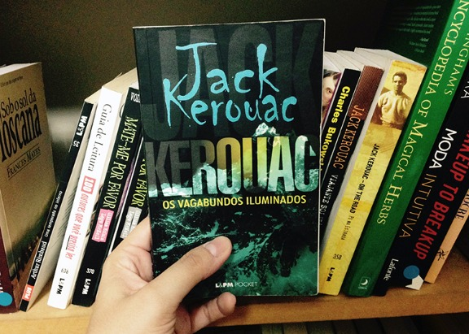
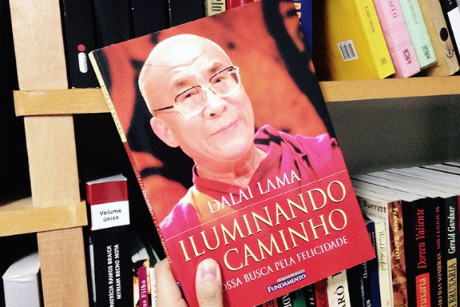
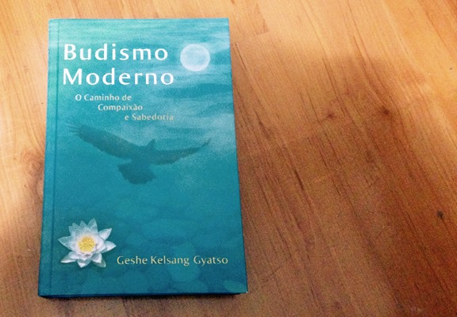
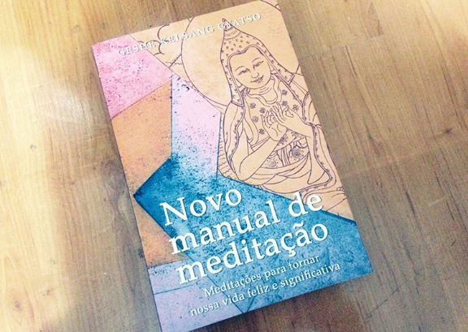
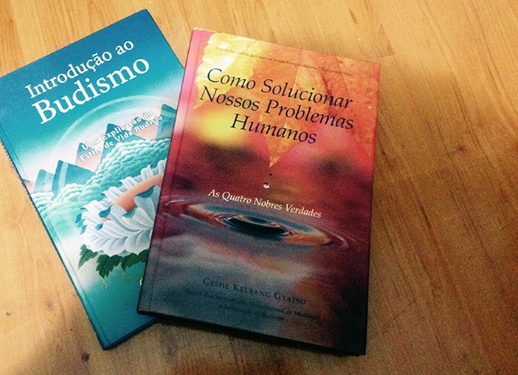
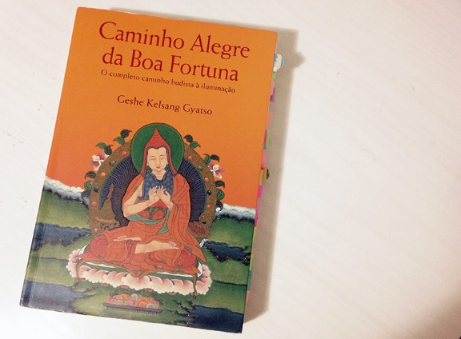
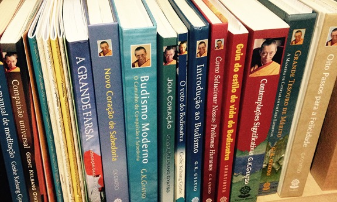
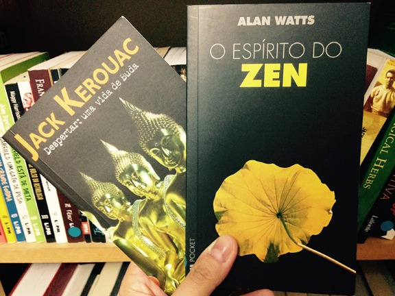

# Livros de Budismo que eu tenho e recomendo

São frequentes os pedidos para que eu fale mais sobre Budismo aqui no blog, e um desses pedidos sempre é referente aos livros que eu tenho e recomendo. Logo, este post é sobre isso. Falar sobre Budismo é legal porque a religião me ajuda a ser mais focada e tranquila, além de manter a constante lembrança de uma mente de compaixão e de servir aos outros, o que acho que contribui muito para eu ser organizada e manter as diversas atividades do meu dia a dia.  
Gostaria de começar falando como tudo começou – o livro que eu li e fez eu me interessar pelo Budismo de verdade. Por incrível que pareça, não foi um livro sobre Budismo, mas o livro de um escritor que acabou se tornando um dos meus preferidos:

O livro [“Os vagabundos iluminados”](http://www.skoob.com.br/livros/os-vagabundos-iluminados/4257ed5312) (Jack Kerouac) “é considerado por muitos especialistas e fãs da literatura *beat* como o melhor romance de Jack. O livro conta a história de uma busca pela verdade e pela iluminação. O protagonista, Ray Smith, é um aspirante a escritor de San Francisco que anseia por algo mais na vida. Esse algo mais será apresentado a ele por Japhy Rider – um jovem zen-budista adepto do montanhismo que vive com um mínimo de dinheiro, alheio à sociedade de consumo norte-americana.” (sinopse oficial) Quando eu li o livro, eu já estava em uma vibe um pouco de busca pela simplicidade e querendo me aproximar do Budismo, mas ele foi o que me deu o clique e me fez ter a motivação de ler mais a respeito.  
Com isso, comecei a procurar coisas pela Internet. Achei bons sites e boas referências de livros. No geral, eu não tinha muita ideia. Pensava que Budismo era uma coisa só, sem tantas escolas e tradições, como descobri depois. Minha busca inicial foi pelo conceito de zen, já que tinha essa referência não só do livro do Jack, como do blog do Leo Babauta, que eu já acompanhava ([Zen Habits](http://zenhabits.com/)), como de todo o imaginário popular acerca do Budismo (não sei vocês, mas eu frequentemente ouvia associações entre a religião e o sentimento de “zen”). Acabei conhecendo o trabalho da [Monja Coen](http://zendobrasil.org.br/), que é bem famosa aqui no Brasil (ela já foi no Jô Soares, por exemplo). Li alguns livros dela, mas acabei dando de presente para a minha mãe depois. Nunca me identifiquei plenamente com o zen, mas foi por onde comecei. Lia muitos textos, comecei a praticar meditação. Mas é engraçado porque ainda não tinha me encontrado e não sabia disso. Acho que a gente só sabe quando realmente encontra o tal lugar.  
Nesse meio tempo entre começar a praticar e o hoje em dia, se passaram uns seis ou sete anos. Só de começar a praticar meditação, eu já comecei a perceber como a minha vida estava mais tranquila. Por isso, fui atrás de livros diversos. Comprei um livro muito bonitinho chamado [“1001 pérolas da sabedoria budista”](http://www.skoob.com.br/livro/196917-1001-perolas-de-sabedoria-budista), que é cheio de frases de budistas e outras pessoas famosas relacionadas ao Budismo. Depois, fui atrás da fonte mais conhecida: os livros do Dalai Lama.

O livro acima, [“Iluminando o caminho”](http://www.skoob.com.br/livro/3960ED4979), foi o primeiro livro do Dalai Lama que eu li. Os livros do Dalai Lama funcionam assim: alguém faz uma entrevista longa com ele e a registra, publicando depois em forma de livro. Além desse, eu tenho mais uns cinco ou seis livros dele. Lembro que um livro que me marcou muito na época foi o [“A arte de lidar com a raiva”](http://www.skoob.com.br/livro/15215ED16617), porque eu era uma pessoa meio nervosinha e ele me ajudou a repensar alguns conceitos. No geral, apesar de gostar dos livros do Dalai Lama, eles me pareciam muito etéreos e um pouco longe da minha realidade. Não estou desmerecendo, de maneira nenhuma. Mas eu pensava assim: “É fácil ser monge em um mosteiro. Quero ver ser monge na cidade grande, com os problemas mundanos, tendo paciência e trabalhando com chefe chato”. Ignorância, eu sei. Mas, no fundo, eu apenas queria algo mais próximo da minha realidade.  
Vale citar que, até o momento, eu nunca tinha frequentado nenhum centro budista. Sou um pouco avessa a qualquer religião e não queria me envolver com isso. Também costumava achar os cursos e retiros um pouco inacessíveis para mim na época. Depois que o Paul nasceu, então, com ele pequeno, era praticamente impensável sair de casa e deixá-lo para participar de um retiro durante três ou quatro dias.  
Na metade de 2013, eu comecei a sentir uma vontade cada vez mais forte de frequentar um centro budista. Estava passando por muitas situações de sofrimento no dia a dia, todas decorrentes de relacionamentos com pessoas ao meu redor, e estava sentindo falta de uma “metodologia” para lidar com elas. Queria aprender a meditar de verdade também. Nesse contexto, um belo dia eu estava em uma das minhas tradicionais andanças pela Livraria Cultura e, vendo a seção de livros budistas, me deparei com este aqui:

É um livro bonito, com capa dura, e o título me chamou a atenção. [“Budismo moderno”](http://www.skoob.com.br/livro/160593ED179224), de Geshe Kelsang Gyatso. Comecei a ler e achei a leitura fácil, gostosa. Levei para casa. Tirei férias, [fiquei uma semana sem Internet](http://vidaorganizada.com/organizacao-pessoal/como-eu-fiquei-uma-semana-sem-internet/) e levei o livro. Voltei para a minha rotina decidida a procurar um centro budista para fazer um curso de meditação. Em minhas buscas pelo Google, encontrei um centro perto da minha casa, em Campinas, e vi que tinha um curso como eu queria – meditação voltada aos problemas do dia a dia. Fiz minha inscrição e fui, pela primeira vez, a um centro budista.  
Gosto de lembrar desse dia porque foi muito significativo para mim. Foi nesse dia dia que eu conheci uma das pessoas mais legais que eu encontrei até hoje, que depois descobri ser o professor de meditação do centro. Foi tudo muito maravilhoso. Saí flutuando da primeira aula, decidida a meditar todos os dias. De lá para cá, não parei mais. Faz parte da minha vida e me transformou completamente. Eu era uma pessoa ansiosa, que perdia a paciência rápido com as injustiças do dia a dia e sofria muito com relacionamentos, especialmente colegas de trabalho. Aprendi a refletir sobre os principais problemas que eu enfrentava, todos originados na minha mente, e a meditação me ajudou a lidar melhor com eles, reagindo de forma diferente. Falei mais sobre a minha rotina de meditação em outro post ([clique aqui para ler](http://vidaorganizada.com/organizacao-pessoal/dicas-praticas-organizar-vida/como-organizar/como-eu-organizo-minha-rotina-de-meditacao/)). O livro utilizado no curso foi este aqui:

[“Novo manual de meditação”](http://www.skoob.com.br/livro/149449ED166606), de Geshe Kelsang Gyatso. Notaram algo semelhante com o livro anterior? Sim, é o mesmo autor! Isso foi uma coincidência tremenda. Achei muito interessante que o centro budista que ficava perto da minha casa era justamente da mesma tradição daquele livro que eu tinha lido e me identificado muito, a Nova Tradição Kadampa.  
A Nova Tradição Kadampa, como eu descobri depois, é um pouco controversa no meio budista porque é um pouco desligada do Dalai Lama. Na verdade, há praticantes da tradição que protestam contra as atitudes do Dalai Lama. Em resumo, eis o motivo: existe uma deidade no Budismo chamada [Dorje Shugden](http://pt.wikipedia.org/wiki/Dorje_Shugden), que vem sendo incorporada às práticas budistas há séculos pelos lamas anteriores. O Dalai Lama atual, em determinado momento do século passado, decidiu proibir essa prática e expulsar dos templos budistas os monges que ainda a praticassem. Isso fez com que muitos monges passassem fome e sofressem retaliações (infelizmente, existem pessoas assim em todos os lugares). Por esse motivo, existem protestos contra essas retaliações. Eu fiquei bastante chocada quando soube desses fatos, porque já tinha lido livros do Dalai Lama. Fiquei chateada por saber que isso acontecia. O fundador da Nova Tradição Kadampa, Geshe Kelsang Gyatso, foi um dos monges expulsos da tradição do Dalai Lama, por não concordar em abolir uma prática que vinha sendo ensinado a praticar desde sempre em sua vida. Por isso, ele foi acolhido no Ocidente e incentivado a levar a prática do Budismo tibetano para os ocidentais. Começou a ensinar na Inglaterra e, de lá, começou a escrever seus livros e divulgar a tradição para os outros países. Claro que isso gerou bastante controvérsia, porque ele era uma pessoa “de fora” que transmitia os ensinamentos “de dentro”. Hoje a Nova Tradição Kadampa tem muitos templos e centros espalhados pelo mundo e ajuda muitas pessoas budistas e não budistas e terem uma vida mais tranquila. O que eu posso dizer a respeito disso, pelo que eu conheci e pelos meus sentimentos: sempre me senti extremamente acolhida no centro budista e venho aprendendo muito com os ensinamentos. Independente dessas controvérsias, temos o caminho budista a ser trilhado buscando seu uma pessoa melhor e ajudar os outros. Não entendo como isso pode ser ruim. Mas sim, há muita discussão em torno desse assunto, que não quero estender aqui. Para quem quiser saber mais, existe um livro chamado [“A grande farsa”](http://www.skoob.com.br/livro/401137ED454527), da Associação Shugden do Ocidente, que explica todo o cenário. Acho o título bem forte, mas vale como material informativo além do que se fala na Internet.  
Eu me encontrei dentro do Budismo Mahayana porque é a linha do Budismo tibetano com grande foco em ajudar os outros seres vivos. Todas as práticas são pautadas nessa intenção. Quando encontrei uma tradição que me identificasse, quis ler mais livros e estudá-la a fundo. Então comecei a fazer um curso de aprofundamento no próprio centro e a me envolver mais com a religião. Antes, como eu falei, eu não tinha vontade de fazer nenhuma dessas coisas, mas porque eu não me identificava. Quando encontrei algo que fazia sentido para mim, senti que fazia parte da minha vida fazer os pujas (orações cantadas com meditação), celebrar os dias da tradição, meditar diariamente e estudar. Portanto, os livros que posso indicar daqui para a frente são todos dentro dessa tradição, que é o que eu conheço melhor.  
Para iniciantes, tem dois livros muito bons que eu recomendo, que são:

O livro [“Introdução ao Budismo”](http://www.skoob.com.br/livro/48117ED343491) traz uma explicação do estilo de vida budista. É bem para iniciantes que querem saber mais sobre o Budismo e buscam um guia básico dentro de uma linha mahayana. [“Como solucionar nossos problemas humanos”](http://www.skoob.com.br/livro/57997ED63848) fala sobre como lidar com a raiva e a paciência no dia a dia, e é um verdade “tapa na cara” sobre como é nossas responsabilidade a forma como reagimos aos diversos acontecimentos do mundo. Um outro livro que eu li recentemente e que pode ser bom para iniciantes é o livro [“Budismo para leigos”](http://www.skoob.com.br/livro/162924ED181810), porque é mais informativo mesmo. Fala sobre a história de Buda Shakyamuni, as tradições do Budismo e os pontos principais entre todas elas. Se você quiser ficar alheio a qualquer tradição, pode gostar mais de ler algo assim.  
No entanto, se você quiser um livro bastante completo sobre a tradição Kadampa, a minha recomendação sem dúvida será este aqui:

Na Nova Tradição Kadampa, acreditamos que existe um caminho para a iluminação (Lamrim). Esse caminho é explicado em todas as suas fases neste livro, [“Caminho alegre da boa fortuna”](http://www.skoob.com.br/livro/118968ED132011). Se eu pudesse indicar um único livro da tradição, indicaria esse. Além desses acima citados, eu tenho um monte de outros da tradição. Gosto de me envolver bastante com algo quando gosto, então já li bastante coisa (e vivo relendo, porque os ensinamentos vão se acumulando – o que eu li hoje, na releitura estará diferente).

Todos os livros da Nova Tradição Kadampa podem ser encontrados no site da [Editora Tharpa Brasil](http://www.tharpa.com.br/) ou nos [centros budistas da tradição](https://www.google.com.br/search?q=centros+budistas+kadampa&oq=centros+budistas+kadampa&aqs=chrome..69i57.3349j0j7&sourceid=chrome&es_sm=122&ie=UTF-8).  
Para quem tiver curiosidade, gostaria de indicar mais dois livros sobre Budismo que não são dessa tradição, que são:

[“Despertar: uma vida de Buda”](http://www.skoob.com.br/livro/123878ED137477), também do Jack Kerouac, e [“O espírito do zen”](http://www.skoob.com.br/livro/3683ED4667), do Alan Watts. Na verdade, o que eu realmente recomendo, se quiser aprender sobre o Budismo, é que você frequente um centro, ou diversos, até encontrar algum que se identifique mais. Faça um curso de meditação, participe de um retiro, veja as pessoas que praticam como agem no dia a dia, e isso poderá ser a melhor referência que você pode ter se quiser saber mais.  
Espero que o post tenha sanado as dúvidas de quem sempre me pedia para escrever a respeito. Acho que fui até um pouco mais além contando como cheguei até aqui dentro do Budismo, mas acredito que seja importante para justificar os livros que escolhi.
