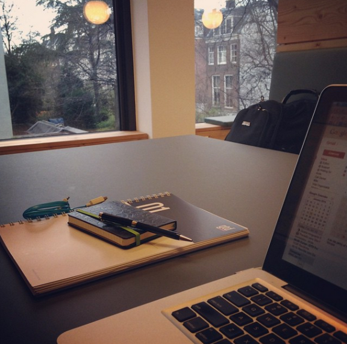
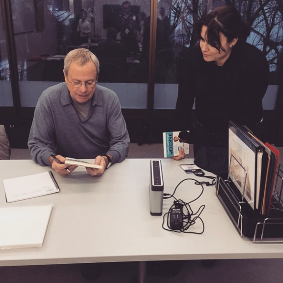
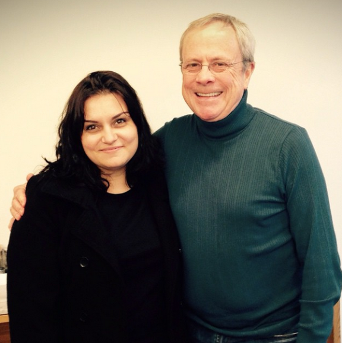

# O que eu aprendi com o David Allen em Amsterdam

Estar em Amsterdam e ter a oportunidade de conhecer o David Allen são coisas que estão mexendo bastante comigo nos últimos dias. Ouvir a orientação da implementação básica direto da fonte e saber que você já faz a maioria das coisas certinhas… além de chegar a uma conclusão e o próprio David fazer um comentário na sequência falando exatamente o que você pensou… Tudo isso foi se juntando para eu conseguir escrever o que eu vou escrever hoje.

Me sinto uma pessoa extremamente abençoada. Como pode – descobri um método de produtividade pelo qual eu fiquei completamente apaixonada e percebi que, além de mim, eu poderia ajudar outras pessoas a se organizarem. Montei um blog. Escrevi um livro. Comecei a trabalhar ministrando cursos e palestras. Conheci pessoas incríveis, que estão em sintonia com tudo o que eu acredito que as coisas devam ser na vida, no trabalho, na vida pessoal.

Para quem não sabe, essa viagem foi toda arranjada e financiada pelo Daniel, da Call Daniel, que quis me ajudar a realizar esse sonho. Eu sequer tenho como agradecer tantas coisas boas que têm acontecido. Quando disse que me sinto abençoada, é verdade. Não só pela viagem, mas pela oportunidade de trabalhar com o que eu amo e ao lado de pessoas tão boas, que visam um bem comum. Eu realmente acredito que todo mundo que tenha a oportunidade de trabalhar ao lado do Daniel seja uma pessoa abençoada. Ele é incrível, um modelo a seguir mesmo.

Ontem o David comentou sobre esse novo projeto dele, que é a divisão do GTD em três cursos de aprendizado (básico, projetos e horizontes de foco). Ele explicou que é o grande projeto da vida dele. Que vai completar 70 anos e quer deixar um legado… Minha gente, como isso me deixa comovida. Me fez ter ainda mais vontade de espalhar essa missão dele pelo mundo, porque também é a minha… eu queria que todo mundo usasse o GTD! Quero que todo mundo, assim como eu, aprenda a levar uma vida mais coerente e cada vez mais calma, fazendo as coisas acontecerem.

Estou escrevendo este texto em um espaço de coworking aqui em Amsterdam, uma cidade que eu moraria facilmente. Calma, silenciosa, tranquila. Todo mundo andando de bicicleta, sem trânsito, frio, cheia de antiquários. Fora toda a ideia de contracultura que existe aqui. Trabalhar neste espaço me fez ter vontade de procurar algo semelhante em São Paulo, porque os ganhos são enormes. Trabalhar em casa é bom, mas também vale a pena sair de vez em quando, ver pessoas diferentes, se inspirar mais. Dá vontade de mudar muita coisa na vida, a fim de simplificar mesmo.

Fico pensando em todo o caminho percorrido pelo David, tudo o que ele fez na vida até chegar até aqui, morando na Holanda, reformulando a coisa toda, investindo (muito) dinheiro nesses materiais novos de alto nível, nessa formação de multiplicadores. Se ele tem como missão ensinar o GTD, os multiplicadores são como embaixadores do método, e eu me sinto tão parte disso! Nem preciso de certificação.

Yo, David! What’s your next action?

Estar aqui me fez perceber de forma muito emocionada algumas coisas:

1. A gente pode chegar onde a gente quiser.
2. Ter uma missão de vida é muito importante. Essencial. Não saberia mais viver sem isso.
3. Ser produtivo não é coisa geek, mas a única forma de viver a vida de forma plena e coerente. Você aproveita seu tempo.
4. A vida pode ser mais simples. Sem comidas processadas, coisas de plástico e barulho ao redor.
5. O maior barulho é o interno.

Tantas coisas, David. Obrigada por tudo.

