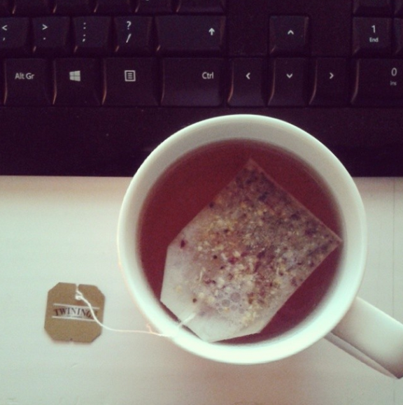
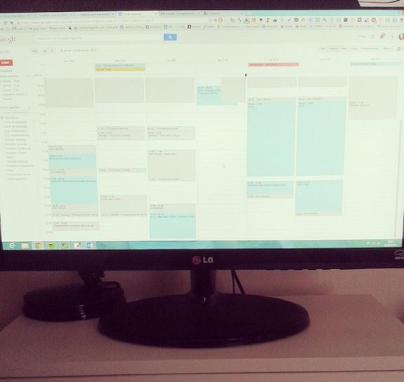
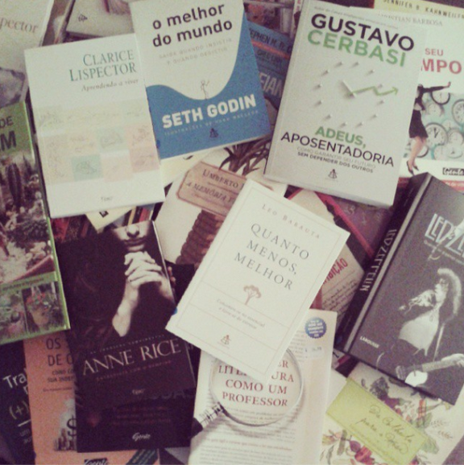

# Pensando em uma rotina mais simples para 2015

Quando surgiu a ideia de escrever um post para o blog falando sobre a simplificação da rotina para o ano novo, fiquei me perguntando o que eu ainda poderia escrever que não tivesse sido escrito aqui ou em qualquer outro lugar a respeito. Afinal, de uns anos para cá, o mundo pareceu abraçar a ideia de simplicidade voluntária, querendo tornar tudo no dia a dia mais simples de fazer, sem tanta complicação. Resolvi escrever uma espécie de relato pessoal, então, com as percepções que eu tenho tido atualmente sobre a questão da simplicidade e até do minimalismo aplicados à nossa rotina.

### Sono, acordar cedo, dormir tarde

Sou uma pessoa naturalmente noctívaga – e não sei se isso pode ser cientificamente dito (afinal, tudo não depende de hábitos?). Funciona assim: posso ter acordado muito cedo. Mas, se deixar, vou dormir tarde mesmo assim, porque é o meu natural. As pessoas matutinas acordam cedo mesmo que tenham ido dormir tarde, porque não conseguem ficar na cama depois de determinado horário. Acho que é mix de costume, metabolismo e hábito mesmo.

Para mim, essa rotina do sono ficou um pouco bagunçada desde que eu comecei a trabalhar em casa, porque às vezes tenho horários fixos e outras vezes não. Tem dias que preciso acordar antes das cinco horas da manhã para ministrar um treinamento em um lugar longe, enquanto há dias que eu levanto às dez horas (geralmente depois de um dia de treinamento). Para dormir, é bem difícil. Nunca consigo dormir antes das 22 horas – quiçá, das 23. Eu gostaria sim de manter uma rotina para acordar todos os dias às seis, por exemplo, mas não consigo. Meu descanso é importante e estou focando em ter de sete a nove horas de sono por noite. Não sei se é a melhor alternativa, mas é o que vem sendo possível.

Quem é mãe sabe que é muito difícil dormir cedo. Pelo menos aqui em casa, a hora que o Paul vai dormir é quando eu consigo fazer coisas que demandam mais a minha concentração, como estudar, ler um livro ou escrever. Com o horário de verão, ele está indo dormir por volta das 21:30, o que significa que seria impossível, para mim, ir dormir antes das 23. Mais alguém passa por isso aqui?

Então, o que faço é respeitar esse horário e, depois que ele dormir, executar poucas atividades, até mesmo para não perder o sono. Porém, não posso ignorar essas horas, que são parte importante do meu dia a dia.

### Trabalho

Minha rotina do trabalho tem ficado mais simplificada de uns dois meses para cá. Como eu comentei em outro post, há pouco tempo, quando eu comecei a trabalhar por conta própria eu quis pegar muitos trabalhos de uma só vez, por insegurança mesmo, o que me deixou um pouco sobrecarregada. Na organização, não tem segredo – é preciso aprender a dizer não. Por isso, comecei a ser um pouco mais rigorosa com essa minha regra e organizar melhor a minha rotina. Por exemplo: se eu vou trabalhar fora durante três dias na semana, não agendo nada para os outros dois, para conseguir fazer tudo o que eu preciso fazer. Tem funcionado! Mas não é fácil.

É de fundamental importância ter meus projetos e atividades organizados e planejar a cada semana ([no GTD, o planejamento é feito semanalmente](http://vidaorganizada.com/organizacao/como-fazer-a-revisao-semanal-do-gtd/ "Como fazer a revisão semanal do GTD")). Isso me dá uma dimensão real do tempo investido em determinados projetos e me faz ver que não dá para fazer tudo o que eu gostaria de fazer.

Algo que eu resolvi fazer também é investir um pouco mais em coisas que facilitem (e simplifiquem) o meu dia a dia, como usar mais táxi, por exemplo, e otimizar o meu tempo e o do meu marido. Tem funcionado muito bem! Estou viciada naqueles aplicativos de solicitar táxi (uso especialmente o Easy Táxi e o 99). basicamente, você seleciona o modo de pagamento e envia um sinal de que está esperando um táxi. Algum taxista nas redondezas aceita o seu pedido e vem te buscar. É extremamente prático e não depende de ter táxi no ponto mais próximo para você conseguir se deslocar.

### Comer, preparar comida

Já comentei aqui em casa que meu marido é responsável pela comida porque ele está estudando para isso, mas ultimamente eu tenho gostado de aliviar um pouco essa parte para ele e preparar comidinhas de vez em quando. No geral, preparamos alimentos a cada dois dias, sendo que, no dia a dia, no máximo grelhamos uma carne ou legumes que valem a pena ser comidos fresquinhos na hora mesmo.

Quando nós casamos, eu gostava de preparar comidas mais complicadas, com mais de um acompanhamento, sempre inventando coisas novas. Acho isso incrível mas, no dia a dia, não dá para fazer sempre. Por isso, acho de fundamental importância ter os “curingas da casa” (aqueles pratos que todo mundo gosta e não se importa de repetir) e ir planejando semanalmente também as compras do mercado ([veja como montar um menu semanal](http://vidaorganizada.com/rotinas/comida/como-planejar-o-menu-semanal-guia-pratico-para-maes-e-pais-muito-ocupados/ "Como planejar o menu semanal (guia prático para mães e pais muito ocupados)")).

Uma coisa que eu quero fazer menos em 2015 é comer fora, para economizar mesmo.

### Condução, deslocamento

Grande parte do nosso dia a dia é gasta com deslocamentos e trânsito, especialmente para quem mora em São Paulo ou no Rio de Janeiro. O que eu procuro fazer é otimizar esse tempo. Como comentei acima, estou usando bastante táxi. Essa foi uma decisão que tomei ao fazer as contas de quanto custaria ter um segundo carro. Eu não tenho carta de motorista mas, se tivesse, eu não poderia usar o nosso carro, que fica com o meu marido, pois ele leva e busca o filhote na escola, faz mercado e tudo o mais. Ou seja, mesmo se eu tivesse carta, não ficaria com o carro. Ter um segundo veículo seria inviável e desnecessário. Como uso muito raramente, compensa mais utilizar um táxi mesmo.

Aqui em São Paulo existe a grande vantagem de poder utilizar as linhas do metrô. Uso bastante metrô! Achei engraçado que, outro dia, uma leitora me reconheceu na estação Sé (lotada!) e disse: “não acredito que encontrei a Thais na estação Sé!”. Achei engraçado. Eu acho que é um meio de transporte que precisa de muitas melhorias, mas funciona bem. Se você quiser chegar rápido em qualquer lugar, vá de metrô! Além disso, aproveito o período de deslocamento no trem para ler bastante. Tem dias que consigo ler um livro inteiro nessa ida e volta, o que é ótimo, já que gosto muito de ler. São coisas que a gente pode desprezar no dia a dia achando que perdemos tempo utilizando transporte público, mas há tanto a ser feito quando não se está dirigindo!

### Meditação

Desde que mudei para São Paulo, não frequentei mais o centro budista. Eu gostava muito do centro que eu frequentava em Campinas e, além do mais, era perto da minha casa (eu ia a pé). Hoje, fica do outro lado da cidade e, para mim, é mais complicado. Mesmo assim, tenho estudado muito e praticado em casa, mesmo menos do que eu fazia antes. Em dezembro, quis investir mais tempo nisso porque percebi o quão estressada eu fiquei depois da mudança, e a meditação faz toda a diferença.

Gosto de meditar um pouco quando acordo e ao longo do dia, quando sinto necessidade. Essa rotina está bem estabelecida para mim.

### Limpeza e arrumação da casa

Sou muito a favor de fazermos nós mesmos a limpeza da casa, mas confesso que nem sempre acho que essa é a saída mais simples. Outro dia fiz um teste com uma dessas empresas que agendam online o serviço de uma faxineira (em breve farei o post na blog) e achei bastante prático, mas só usei uma vez. Eu sou um pouco como a Monica (Friends) – limpar é terapêutico. Eu GOSTO de limpar e arrumar a casa, mas o que acontece é que muitas vezes eu não consigo. É frequente chegar depois das 21 horas depois de um dia de treinamento e ainda ter coisas no geral para fazer – ficar com o Paul, colocá-lo para dormir, revisar algum material para o dia seguinte. E, no mais, eu costumo ficar com as pernas bem cansadas depois de trabalhar de pé e falando o dia todo. Por mais vontade que eu tenha de, sei lá, esfregar o chão da cozinha, fisicamente fica bem complicado.

O que eu tenho feito, portanto, é o que eu recomendo aqui: focar no essencial. Cheguei seriamente a pensar em ter alguém para me ajudar em casa, mas não levei essa ideia adiante. Talvez seja mais simples sim e, com o tempo, acho que acaba sendo natural você delegar muitas funções da sua vida. Porém, como conseguimos fazer aos poucos e na medida do necessário, continuamos levando.

Minha meta para 2015 é simplificar ainda mais essa rotina, buscando soluções.

### Leituras

2014 foi o ano em que eu li menos na minha vida. ler é como respirar, para mim – é aquela atividade que me deixa bem, “em casa”. Sou acostumada a ler muito e, por isso, em 2015 estou estabelecendo algumas metas de leitura mensais. Vou testar em janeiro para ver a quantidade ok de livros que consigo ler por mês atualmente. Eu trabalho bem com metas então acvho que isso é uma forma de simplificar o que gostaria de ler.

### Tempo com a família

É incrível como, se deixar, a família fica de lado no dia a dia. Por isso, o que eu tenho feito é reservado momentos na agenda ao longo de toda a semana para ter tempo de qualidade (e em quantidade!) com o nosso filho, além de fazer sempre atividades com o meu marido. Também estamos investindo em mais tempo com as outras pessoas da nossa família, como almoçando na casa da sogra, viajando para visitar a minha mãe, meu marido está levando o pai dele para pescar e estamos passeando com as nossas sobrinhas. Tem sido muito divertido! No geral, sou aquela pessoa quem, se deixar, nunca sai de casa. Acho que já deu, sabe? Gosto muito de ficar em casa e aproveitar os momentos de lazer. porém, é divertidíssimo fazer coisas com eles e sempre fico com aquele gostinho de quero mais quando saímos e nos divertimos.

Em 2015, quero fazer mais programas baratos e gratuitos. Tem tanta coisa! Quero ir mais a exposições, teatro, parques e museus.

Eu acredito que simplificar a rotina é algo que não tem segredo. Precisamos identificar aquilo que é essencial e dizer não para todo o resto. O fato de não ter segredo não significa que seja fácil – não é! Porém, só nós podemos tomar as rédeas da nossa própria vida e fazer isso acontecer. Eu espero ir em um ritmo bem mais lento este ano, porque para quem trabalha em casa, o risco de ficar correndo e se sobrecarregar é enorme!
