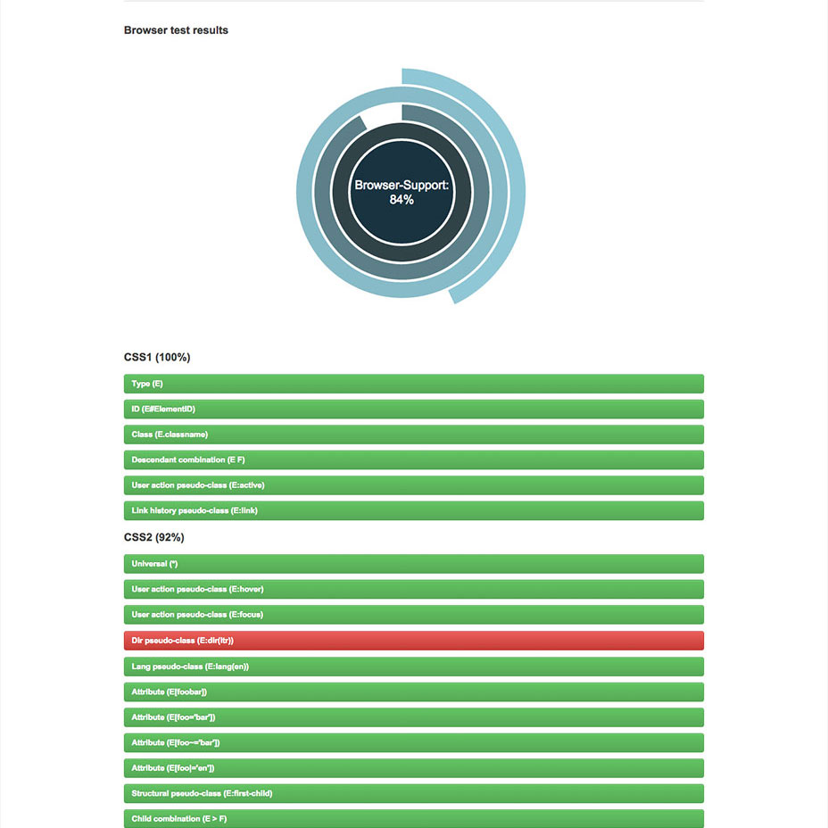
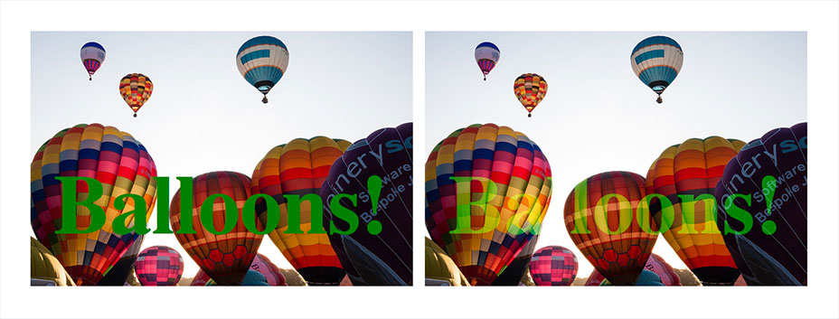
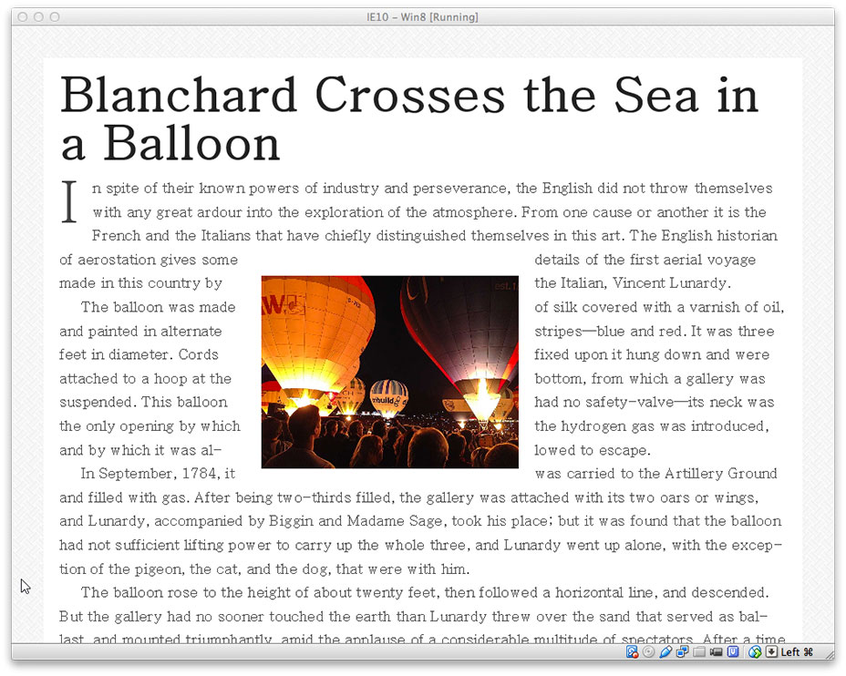
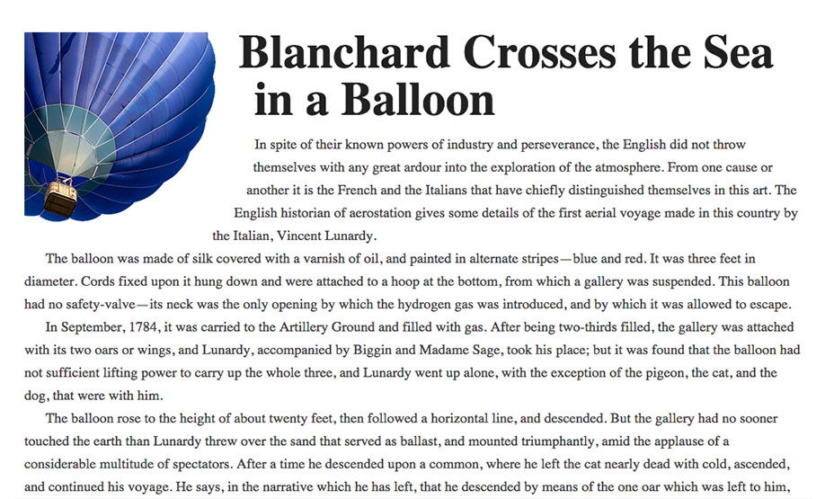
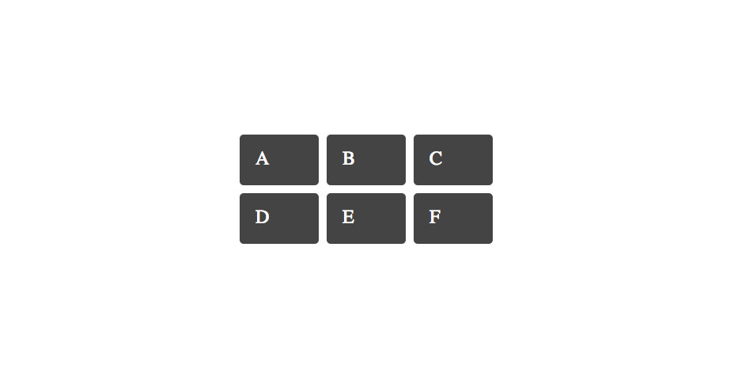

# CSS you can get excited about in 2015


CSS is a constantly evolving language, and as the new year begins it’s a great time to take a look at some of the emerging features that we can start to experiment with.

In this article I’ll take a look at some newer modules and individual CSS features that are gaining browser support. Not all of these are features you’ll be able to use in production immediately, and some are only available behind experimental flags. However you’ll find plenty of things here that you can begin to play with — even if only during a prototyping stage of development.

## CSS Selectors level 4

The level 3 selectors specification is well implemented in browsers and brought us useful selectors such as *nth-child.* brings us even more ways to target content with CSS.

### The negation pseudo-class :not

The negation pseudo-class selector *:not* appears in level 3 but gets an upgrade in level 4. In level 3 you can pass a selector to say that you do not want the CSS applied to this element. To make all text except text with a class of *intro* bold you could use the following rule.

```
p:not(.intro)  font-weight normal
```

In level 4 of the specification you can pass in a comma separated list of selectors.

```
p:not(.intro, blockquote)  font-weight normal
```

### The relational pseudo-class :has

This pseudo-class takes a selector list as an argument and will match if any of those selectors would match one element. It is easiest to see with an example, in this example any *a* elements that contain an image will have the black border applied:

```
a:has( > img )  border 1px solid #000
```

In this second example I am combining *:has* with *:not* and selecting only *li* elements that do not contain a paragraph element:

```
li:not(:has(p))  padding-bottom 1em
```

### The matches-any pseudo-class :matches

This pseudo-class means that we can apply rules to groups of selectors, for example:

```
p:matches(.alert, .error, .warn)  color red
```

To test your browser for support for these and other advanced selectors you can use the test on That site is also a great resource to find out more about upcoming selectors.

[](http://css4-selectors.com/browser-selector-test/)

## CSS Blend Modes

If you are familiar with Blend Modes in Photoshop then you might be interested in the This specification will allow us to apply blend modes to backgrounds and to any HTML elements right there in the browser.

In the following CSS I have a box containing a background image. By adding a background color and then setting *background-blend-mode* to hue and multiply I can apply interesting effects to the images.

```
  background-image url(balloons.jpg).box2   background-color red  background-blend-mode hue.box3   background-color blue  background-blend-mode multiply
```

[](http://dev.w3.org/fxtf/compositing-1/)

*Using background-blend-mode*

The mix-blend-mode property allows you to blend text on top of an image. In the below example I have an *h1* then in *.box2* I set to *mix-blend-mode: screen.*

```
  background-image url(balloons-large.jpg)  font-size 140px    color green.box2 h1   mix-blend-mode screen
```

[](http://dev.w3.org/fxtf/compositing-1/)

*Using mix-blend-mode*

CSS Blend Modes actually have surprisingly good support in modern browsers other than Internet Explorer, see the support matrix for , *mix-blend-mode* is available in Safari and Firefox, and behind the experimental features flag in Opera and Chrome. With careful use this is exactly the kind of specification you can start to play with to enhance your designs, as long as the fallback doesn’t leave things illegible in non-supporting browsers.

If you need to have fuller support for older browsers and so don’t feel blend modes can be used in production yet, don’t forget that you can use these during development to avoid trips through Photoshop. Once you have finalised images and treatments create the production images in a graphics programme, replacing the CSS effects.

Find out more about using blend modes with , in and on the

## The calc() function

The *calc()* function is part of the It means you can do mathematical functions right inside your CSS.

A simple use of *calc()* can be found if you want to position a background image from the bottom right of an element. Positioning an element 30px in from the top left is easy, you would use:

```
  background-image url(check.png)  background-position 30px 30px
```

However you can’t do that from bottom right, when you don’t know the dimensions of the container. The calc() functions means you can deduct our 30 pixels from 100% of width or height:

```
  background-image url(check.png)  background-position (100% - 30px) (100% - 30px)
```

Browser support for *calc()* is good across modern browsers, although reports that using it as a background position value in IE9 results in the browser crashing.

is a fun article about using calc() to solve a CSS problem. There are some simple use cases

## CSS Variables

A powerful feature of CSS pre-processors such as Sass, is the ability to use variables in our CSS. At a very simple level, we can save a lot of time by declaring the colors and fonts used in our design, then using a variable when using a particular color or font. If we then decide to tweak a font or the color palette we only need change those values in one place.

CSS Variables, described in the brings this functionality into CSS.

```
:root   --color-main #333333   --color-alert #ffecef.error  color (--color-alert)
```

Sadly browser support for is limited to Firefox at present.

You can see more examples and find out more in

## CSS Exclusions

We are all familiar with floats in CSS. The simplest example might be floating an image to allow text to flow around it. However, floats are fairly limited as the floated item always rises to the top, so while we can float an image left and wrap text to the right and below it, there’s no way to drop an image into the middle of the document and flow text all the way around, or position it at the bottom and let text flow round the top and side.

lets you wrap text around all sides of a positioned object. It doesn’t define a new method of positioning itself, so can be used in conjunction with other methods. In the example below I am absolutely positioning an element on top of a block of text, then declaring that element as an exclusion with the property *wrap-flow* with a value of *both,* so the text then respects the position of the element and flows round it.

```
.main   positionrelative.exclusion   position absolute     14em     14em    width 320px    wrap-flow both
```

[](http://dev.w3.org/csswg/css-exclusions/)

*Exclusions in Internet Explorer*

Browser support for exclusions and *wrap-flow: both* is currently limited to IE10+, requiring an -ms prefix. Note that Exclusions was until recently linked to the CSS Shapes specification that I look at next, so some of the information online conflates the two.

## CSS Shapes

The Exclusions specification deals with wrapping text around rectangular objects. Shapes brings us the much more powerful ability to wrap text around non-rectangular objects, such as flowing text around a curve.

defines a new property *shape-outside.* This property can be used on a floated element. In the below example I am using shape-outside to curve text around a floated image.

```
.shape   width 300px  float left  shape-outside circle(50%)
```

[](http://dev.w3.org/csswg/css-shapes/)

*CSS Shapes allows us to curve text around the ballon image*

includes Chrome and Safari, meaning that you could start to use it in stylesheets for iOS devices. Level 2 of the specification will allow you to shape text inside elements with the *shape-inside* property, so there is more to come from this feature.

Read more about Shapes in this A List Apart article by , and

## CSS Grid Layout

I have left my favourite until last. I’ve been a great fan of the emerging Grid Layout spec since the early implementation in Internet Explorer 10. CSS Grid Layout gives us a way to create proper grid structures with CSS and position our design onto that grid.

Grid layout gives us a method of creating structures that are not unlike using tables for layout. However, being described in CSS and not in HTML they allow us to create layouts that can be redefined using media queries and adapt to different contexts. It lets us properly separate the order of elements in the source from their visual presentation. As a designer this means you are free to change the location of page elements as is best for your layout at different breakpoints and not need to compromise a sensibly structured document for your responsive design. Unlike with an HTML table-based layout, you can layer items on the grid. So one item can overlap another if required.

In the example below we are declaring a grid on the element with a class of *.wrapper.* It has three 100 pixel wide columns with 10 px gutters and three rows. We position the boxes inside the grid by using line numbers before and after, above and below the area where we want the element to be displayed.

```
<!DOCTYPE html>      titleGrid Example</title     charsetutf-8    style
    
        margin 40px
    
    .wrapper 
        display grid
        grid-template-columns 100px 10px 100px 10px 100px
        grid-template-rows auto 10px auto
        background-color #fff
        color #444
    

    
        background-color #444
        color #fff
        border-radius 5px
        padding 20px
        font-size 150%
    

     
        grid-column 1 / 2 
        grid-row 1 / 2
    
     
        grid-column 3 / 4 
        grid-row 1 / 2
    
     
        grid-column 5 / 6 
        grid-row 1 / 2
    
     
        grid-column 1 / 2 
        grid-row 3 / 4
    
     
        grid-column 3 / 4 
        grid-row 3 / 4
    
     
        grid-column 5 / 6 
        grid-row 3 / 4
    

   </style</head       classwrapper         classA</div         classB</div         classC</div         classD</div         classE</div         classF</div    </div</body</html
```

[](http://caniuse.com/#feat=css-grid)

*The grid example in Chrome*

for the latest Grid Specification is limited to Chrome with the “experimental Web Platform features” flag enabled. There is a solid implementation of the initial version of the specification in Internet Explorer 10 and up.

Find out more about Grid Layout on my site, where you can see several Grid examples that work in Chrome, with experimental web platform features enabled. I also spoke last year at CSS Conf EU on Grid and you can see that video

## Do you have a favorite emerging specification not mentioned here?

I hope you’ve enjoyed this quick tour round some of the interesting, newer features of CSS. Use the linked resources to find out more about the features you have found most interesting. Let me know in the comments if you have a favorite upcoming CSS feature that you think people should know about, or additional great resources and examples for any of the features I have described.

*Featured image, uses  via Shutterstock.*
