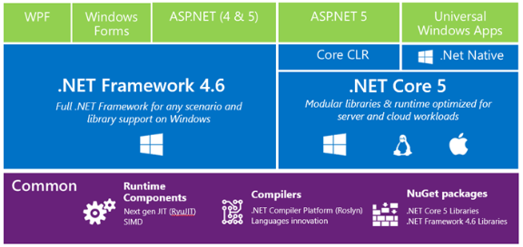
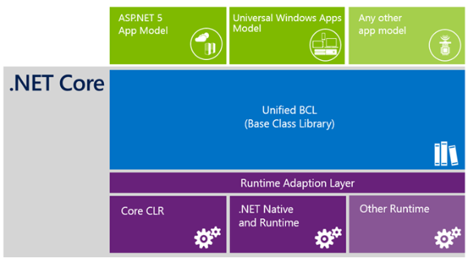
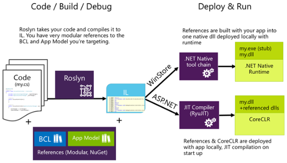
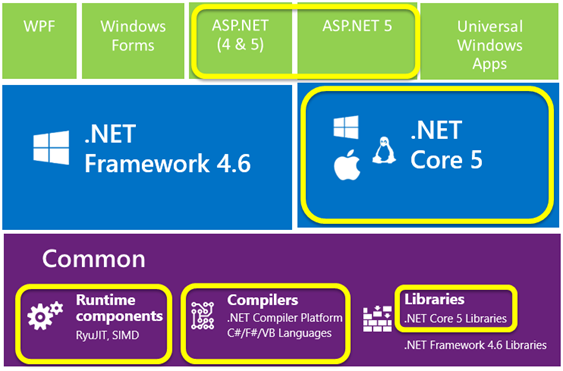

# Understanding .NET 2015

Last year after [BUILD](http://www.buildwindows.com/) I posted *[Exciting Times for .NET](http://blogs.msdn.com/b/bethmassi/archive/2014/04/10/exciting-times-for-net.aspx)* and since then I have had the pleasure of working much closer with the .NET team, which includes the runtime, framework, languages & compilers. Although my focus has been a lot more on internal community in the last year, such as helping run internal conferences for our field employees, I’ve also spent time helping get the [.NET Foundation](http://www.dotnetfoundation.org/) off the ground and learning **a lot** about open source communities and all our [.NET Foundation projects](http://dotnet.github.io/). Oh right, I also got married. :-) It’s been a transition period for me. Going from community “evangelist” to more of a “facilitator” or “connector”.  I really like [Alex Hillman’s term: Tummler](http://dangerouslyawesome.com/2014/04/community-management-tummling-a-tale-of-two-mindsets/).

Now that we’re approaching the next BUILD, I’m even more excited about the progress we’ve been making, particularly around the .NET platform itself, and the team’s approach to open source. There are multiple tracks of .NET innovations happening so I thought I’d write a high-level “sign-post” style blog post to help people understand the major pieces and how and where to get involved with the projects. In other words, a good place to start learning about .NET 2015. At least that’s my hope!

### .NET 2015 – 10,000 foot view

At a very high level, here’s the rundown of the major components that fall under the “.NET 2015” umbrella.

It’s important to note that there are three key investment areas for **.NET****Core** that influence the development of the major components.

1. **.NET Innovation** – bring the platform forward and innovate. We’re modernizing every layer including the languages, compilers, base class libraries, app models, runtimes and tools.
2. **Open Source** – bring our engineering processes out in the open and develop with the help and support of the community, fostering a vibrant .NET ecosystem.
3. **Cross platform** – expand .NET to the Linux and Mac platforms because our customers are operating in increasingly heterogeneous environments.

### Major components of .NET 2015

#### Frameworks and Runtimes

The .NET Framework is a managed execution environment that provides a variety of services to its running applications. It consists of two major components: the common language runtime (CLR), which is the execution engine that handles running applications; and the .NET Framework Class Library, which provides a library of tested, reusable code that developers can call from their own applications.

**.NET Framework 4.6** builds upon 4.5.2 and contains new APIs, improvements to event tracing, and many bug fixes. This is the next version of the full .NET Framework we know today. .NET Framework 4.6 will be included in Windows 10 and will also ship on Windows Update for previous OSes (Vista and above). **See:** [**.NET Framework 2015 Preview**](https://msdn.microsoft.com/en-us/library/w0x726c2(v=vs.110).aspx)

**.NET Core 5** is a general purpose, modular framework that can be used across a wide variety of app models and platforms, is available as open source, can be deployed modularly & locally (side-by-side), and will be supported by Microsoft on Windows, Linux and Mac OSX. It is a refactored set of base class libraries ([corefx](https://github.com/dotnet/corefx)) and runtime ([coreclr](https://github.com/dotnet/coreclr)) which includes a new JIT compiler (“RyuJIT”), the .NET Garbage Collector, native interop and many other .NET runtime components. Today, .NET Core builds and runs on Windows. We are adding Linux and Mac implementations of platform-specific components over the next few months. **See:** [**Introducing .NET Core**](http://blogs.msdn.com/b/dotnet/archive/2014/12/04/introducing-net-core.aspx) and [**CoreCLR is now Open Source**](http://blogs.msdn.com/b/dotnet/archive/2015/02/03/coreclr-is-now-open-source.aspx).

*If you click only one link from this post, make sure it is* [***Introducing .NET Core***](http://blogs.msdn.com/b/dotnet/archive/2014/12/04/introducing-net-core.aspx)*. Immo goes into great detail explaining the reasons why we need it and how it fits.*

#### Compilers

**The .NET Compiler Platform ("Roslyn")** provides open-source C# and Visual Basic compilers with rich code analysis APIs. It enables building code analysis tools with the same APIs that are used by Visual Studio. Roslyn produces platform independent Intermediate Language (IL) and is used when building against .NET 2015, including Framework and Core. At release, the entire .NET Framework will be compiled using Roslyn. There are also key language innovations in both VB and C#. **See:** [**Roslyn on GitHub**](https://github.com/dotnet/roslyn). There are also innovations happening with F# language and compiler. See [**F# on GitHub**](https://github.com/fsharp/)**.**

**“RyuJIT”** is the new default just-in-time (JIT) compiler for .NET on x64. The JIT compiler takes IL and compiles it for the particular machine architecture the first time it is executed at run-time. Used for desktop and server-based scenarios, RyuJIT is an overhaul of the previous 64-bit JIT compiler that significantly reduces startup times. It also includes support for SIMD (single instruction, multiple data) which allows mathematical operations to execute over a set of values in parallel. This can offer a profound speed-up to certain types of apps that rely on vector operations. **See:** [**The next-generation JIT compiler for .NET**](http://blogs.msdn.com/b/dotnet/archive/2013/09/30/ryujit-the-next-generation-jit-compiler.aspx)

**.NET Native** compiles C# to native machine code that performs like C++, so developers continue to benefit from the productivity and familiarity of the .NET Framework with the performance of native code. Typically, apps that target .NET are compiled to intermediate language (IL). At run time, the just-in-time (JIT) compiler translates the IL to native code. In contrast, .NET Native is an ahead-of-time compiler that compiles apps directly to native code and contains a minimal CLR runtime. Popular Windows Store apps start up to 60% faster and use 15-20% less memory when compiled with .NET Native. Universal Windows apps will run on .NET Native (ARM, x86, x64). **See:** [**Compiling Apps with .NET Native**](https://msdn.microsoft.com/en-us/library/dn584397(v=vs.110).aspx)

#### App Models

App models extend the common libraries of .NET Framework 4.6 and .NET Core 5. **Windows Forms, WPF, ASP.NET Web Forms, MVC 5,** etc., app models that you are familiar with today are part of the .NET Framework 4.6, come with many new features, as well as benefit from the new innovations in the languages, Roslyn compiler, and RyuJIT. There’s a lot happening on the .NET 4.6 stack. **See:** [**ASP.NET Overview – What about Web Forms?**](http://www.asp.net/vnext/overview/aspnet-vnext/aspnet-5-overview#webforms)**,** [**The Roadmap for WPF**](http://blogs.msdn.com/b/dotnet/archive/2014/11/12/the-roadmap-for-wpf.aspx) **and** [**.NET Framework 2015 Preview**](https://msdn.microsoft.com/en-us/library/w0x726c2(v=vs.110).aspx)

Additionally, there are new app models that are designed to run on the optimized .NET Core 5.

**ASP.NET 5** is a lean .NET app model for building modern web apps. It was built from the ground up to provide an optimized development framework for apps that are either deployed to the cloud or run on-premises. It consists of modular components with minimal overhead, so you retain flexibility while constructing your solutions. ASP.NET 5 can run on top of .NET Framework 4.6 or .NET Core 5. Today, ASP.NET 5 uses the [Mono runtime](http://www.mono-project.com/) to run on Linux and Mac. Once .NET Core supports Linux and Mac, then ASP.NET 5 will move to using .NET Core for those platforms. **See:** [**ASP.NET 5 Overview**](http://www.asp.net/vnext/overview/aspnet-vnext/aspnet-5-overview) and [**Introducing ASP.NET 5**](http://weblogs.asp.net/scottgu/introducing-asp-net-5)

**Universal Windows apps** is an app model that allows you to share source code between Windows Phone & Windows apps (8.1+) and are deployed to the Windows Store. Universal Windows apps will run on .NET Native which compiles IL to native machine code and contains a minimal CLR runtime. **See:** [**Building universal Windows apps for all Windows devices**](http://dev.windows.com/en-us/develop/Building-universal-Windows-apps)and[**Getting Started with .NET Native**](https://msdn.microsoft.com/en-us/library/dn600165(v=vs.110).aspx)

### So what’s .NET Core, again?

.NET Core 5 is a general purpose, modular framework that can be used across a wide variety of app models and platforms because it is a refactored set of base class libraries ([corefx](https://github.com/dotnet/corefx)) and runtime ([coreclr](https://github.com/dotnet/coreclr)). The APIs for the .NET Core base class libraries (BCL) is identical for the different app models. The APIs don’t just look the same – **they share the same implementation**. The majority of the APIs/assemblies are factored much more modularly and are platform independent.

App-local (or side-by-side) deployment is also a key characteristic of .NET Core. You choose the packages you need to deploy alongside your app. Modular packages are available via [NuGet](http://www.nuget.org/). This means your apps run in isolation and are not affected by machine-wide versions of the full .NET Framework. Your apps can be x-copy deployed without worry.

.NET Core is also supported by Microsoft on Windows, Linux and Mac OSX. .NET Core builds and runs on Windows today but we are adding Linux and Mac implementations of platform-specific components. And it’s all open source. It is hugely important to lay the foundation for .NET cross-platform and build a stronger ecosystem.

### From code to running application – .NET Core development

I think it always helps when learning technology to have a mental model of how things work together. Here’s my simplistic view of developing apps with .NET Core, from the code/build/debug cycle to app deployment and execution. Deployment and execution is different depending on what app model you are targeting.

You write code taking very modular references to the parts of the BCL and App Model you need. Roslyn is the compiler that takes your code and produces platform independent Intermediate Language (IL). Besides the compiler pipeline, there is a rich set of APIs you can use to do all sorts of analysis on your code. If you’re using Visual Studio, there are a ton of new IDE features that utilize these APIs to give you a much more productive coding experience.

If you’re building a universal Windows app, the .NET Native tool chain takes it from there. References are built with your app into a native image deployed locally with a minimal runtime. If you’re building an ASP.NET 5 app, references and the CoreCLR are deployed with your app locally to the server. JIT compilation then happens on startup using RyuJIT.

Additionally, ASP.NET 5 allows you to make changes in your code, save the changes, and refresh the browser without explicitly re-building the project. Visual Studio uses Roslyn to enable this dynamic compilation. You still have all of the structure and power of a compiled framework, but the development experience feels more like an interpreted language.

*Note: If you are targeting the full .NET Framework 4.6 then you will still enjoy the new innovations in the languages and Roslyn compiler. App deployment doesn’t change from how it’s done today, it still relies on having the full framework installed on the machine, but the JIT compilation happens with the new optimized JIT compiler, RyuJIT.*

### What is open *right now*?

Many of the pieces of .NET 2015 are open source and are under the stewardship of the [.NET Foundation](http://www.dotnetfoundation.org/). We’re actively working out in the open with the community on these projects.

You can see all the repos and activity of all the projects in the .NET Foundation here on GitHub: [http://dotnet.github.io/](http://dotnet.github.io/ "http://dotnet.github.io/")

Here’s a couple good places to get started. Check out the very detailed readme’s and contribution guides.

It’s also worth mentioning that the full .NET Framework is “source open”. Meaning, we’re not taking contributions and it’s not completely released under an OSI approved license, but you can *explore* all the source code here: <http://referencesource.microsoft.com/>

### Engineering in the Open

OSS isn’t new to Microsoft, but it is new to the .NET runtime & libraries. It’s a pretty big deal to take a 15+ year old project that so many people have worked on internally for that long and move not only the code, but all the engineering processes out in the open. It takes time. That’s why the team started with a small set of base class libraries at first, and have been releasing more and more and learning along the way. Those learnings and best practices have rippled throughout the team. We’ve been humbled by the [overwhelming support and contributions so far](https://github.com/dotnet/corefx/graphs/contributors).

You might be thinking to yourself “*I don’t have enough time in the day to build my own apps, let alone figure out how to write code for the CLR!*” Fair enough, I’m with you! You choose how involved you want to be. You don’t have to write code to be a contributor. [File an issue](https://github.com/dotnet/corefx/issues), [comment on a proposal](https://github.com/dotnet/corefx/labels/api%20addition), [answer a question](http://forums.dotnetfoundation.org/). Or just hang around and [watch the activity](https://github.com/dotnet/corefx/pulse).

You might be thinking “*I don’t want to lose the simplicity nor the quality or support that I’m used to!*” Don’t worry! We’re still dedicated to the same level of quality and service as before. To think of it simply, all we’re doing is taking our engineering out in the open. Everything that we had previously done internally to build quality software is still in place, it’s just now done publicly.

I’m truly excited about this new culture on the team and the future of .NET.

Enjoy!
