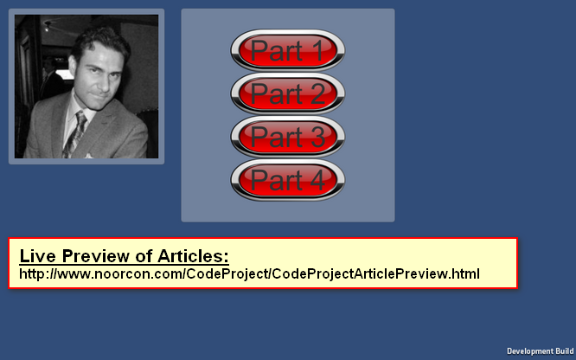
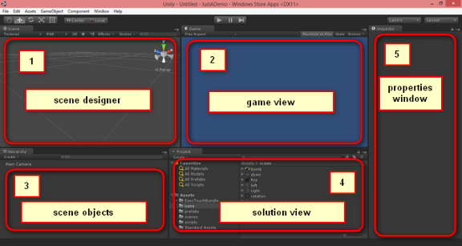
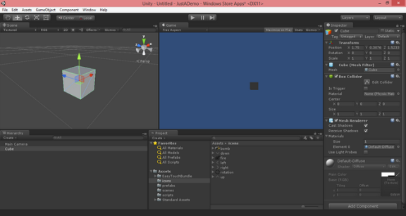
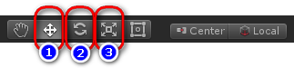
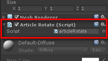

# UNITY 3D - GAME PROGRAMMING INTRODUCTION

The first article in a series to discuss Unity 3D and how to get started with your own 3D projects.

## Introduction

It has been a while since my last article, but coming back I have decided to write an article, or a series of articles, about a game engine called UNITY 3D which happens to be one of the most popular in the industry as of today.

There are several really outstanding benefits to the engine:

1. You can get a community version which works beautifully and is more then what most people will ever need.
2. The community itself is very large and active, hence you will always be able to find other developers and designers to help you in case you need any assistance.
3. You can develop for Unity 3D either on a Windows or a Macintosh also some flavors of Linux.
4. You can use C# to do the scripting / programming of your game.
5. You can target many platforms for your release.

The list can go on. I have listed some of the main points which I find attractive in Unity 3D. Also, since the community version is FREE, you can research and play around with the environment and your ideas before investing more time and money into it.

In any case this article is not about the financial aspect of the engine, but rather an introduction to the fundamental concepts to the game engine and how to get started for those who are eager to jump-start their own ideas.

So without further ado, we will be looking at the IDE and discuss some of the basics before we can start diving into more details.

The Series:

**Live Preview of Article Code and Visuals:**

[](http://www.noorcon.com/CodeProject/CodeProjectArticlePreview.html)

Link to live preview: <http://www.noorcon.com/CodeProject/CodeProjectArticlePreview.html>

## Background

It is assumed that the reader of this article is familiar with programming concepts in general. It is also assumed that the reader has an understanding and experience of the C# language. It is also recommended that the reader of the article is familiar with Object-Oriented Programming and Design Concepts as well. We will be covering them briefly throughout the article as needed, but we will not get into the details as they are separate topics altogether. We also assume that you have a passion to learn 3D programming and have the basic theoretical concepts for 3D Graphics and Vector Math.

Lastly, the article uses Unity 3D version 4.6.1 which is the latest public release as of the initial publication date. Most of the topics discussed in the series will be compatible with older versions of the game engine, and perhaps also the new version which is supposed to be release sometime this year. There is however, one topics which is significantly different in the current 4.6.1 version compared to the older version of the game engine, and that is the UI (User Interface) pipeline. This is due to the new UI architecture in the engine which is far superior to what we had prior to this release. I for one, am very happy with the new UI architecture.

## Using the code

Before we start, you will need to get the game engine. You can download it from the following link: [www.unity3d.com](http://www.unity3d.com/). It is a large download so make sure you have a fast and reliable connection before getting the installer.

You can get the installer for both Windows and Mac operating systems. Everything in this article will be applicable to both platforms. The main difference would be the keyboard access shortcuts, other than that everything else should be the same.

*Downloading the project/source code for article series:* [Download source](http://www.codeproject.com/KB/game/876015/CodeProjectArticleSample-noexe.zip)

Ok, assuming you have downloaded and installed the Unity 3D engine. We can now start with the basics.



*Figure 1-Five Distinct Sections of the IDE*

When you first launch Unity 3D, you will be presented with the default IDE layout. It may or may not look like the layout illustrated in Figure 1. You can very easily change the layout of your IDE by dragging and dropping them in the designated areas. I like my layout to be configures as shown in Figure 1 since it allows me to have a good idea of all the important elements of my project.

In Figure 1, you will notice five section:

- **Section 1 - Scene Designer:** This is where you will be creating your scene or level for your game, or 3D project. All of your Game Objects will be placed and manipulated in the Scene Designer.
- **Section 2 - Game View:** This is where you see how the scene or level looks like through the eyes of the camera. Basically it is the camera view, what the user will see.
- **Section 3 - Hierarchy Window:** or as I call it the Scene or Level Objects. This window will display all of the Game Objects you have in the current scene or level. Basically everything that your game level will need to work as designed are going to be listed here. This will include visual and non-visual game objects.
- **Section 4 - Project Window:** or as I call it the Solution Explorer. If you are familiar with Microsoft Visual Studio, then this is the same as your Solution Explorer. Everything from Game Objects, Scripts, Textures, Models, Audio, Video and etc… will be accessible and managed in this window. It also a representation of your project structure as defines in the main file system.
- **Section 5 - Inspector Window:** or as I call it the Properties window. Similar to Microsoft Visual Studio’s Properties window that will display the different attributes and properties of a selected Game Object. Depending on the selected object, the appropriate attributes and components will be listed. You will be able to modify your game objects through this window in the designer.

## Creating Our First Game Object (A Cube Primitive)

Assuming that you have played around the environment and are comfortable with the IDE, we will look at how to place some primitives in the scene.

By default, there are several primitives that can be created out of the box. These are:

1. Sphere
2. Capsule
3. Cylinder
4. Plane

**NOTE:** *Unity 3D is not a 3D Modeling Software! So don’t expect to create sophisticated models using Unity 3D. Unity 3D is a Game Engine. For your 3D modeling needs, you will need to work with software such as 3D Studio Max, Maya, Rhino and etc… Generally speaking, your models will be created by a 3D designer and you will import them into your game.*

We will start looking at placing a cube in our scene. In order for you to create a cube primitive, from the main menu select GameObject->3D Object->Cube. This action will result in placing a cube in your scene, your IDE should look something like the following:



*Figure 2-Placing a Cube Primitive*

Take a moment to study what you see on your screen. As you can see, your screen doesn’t look as boring anymore! Recall from Figure 1, the different areas/regions of the IDE, they have come to life now. Some immediate changes you should notice in your IDE:

1. A cube has been created and placed in the **Scene Window** (3D Primitive Model).
2. A Cube GameObject is now listed under your **Hierarchy Window**.
3. Since the newly Cube GameObject has been automatically selected, you will see that the **Inspector Window** now lists all of the standard properties and attributes of the primitive Cube GameObject.

|  |  |
| --- | --- |
| f01114cae057a0c38413429e663f72e3.png *Figure 3-Inspector Window* | Looking at the Inspector window, you can see that we have a bunch of standard attributes attached to the cube that we just placed into the scene. These attributes are part of all GameObjects.  There are different Components attached to the Cube GameObject.   - General Properties - Transform Component - Box Collider - Mesh Renderer   We will cover some of these attributes over the course of the article(s).  The top portion gives you the ability to identify your GameObject by name, if it is a Static object or not, apply a Tag to the GameObject and which Layer it belongs to.  One of the most important attribute of any GameObject is the Transform.  The Transform hold the Position, Rotation, and Scale of the GameObject in the scene, the 3D world. It is encouraged to play with different values of the Transform to see the effects on the GameObject in the 3D world.  The cube we just created is at position (1.75, 0.3076, 1.5233) representing the (X, Y, Z) coordinates respectively. |

The rotation vector of the cube is at (0,0,0) respectively on (X, Y, Z) axis. Using the design tools for manipulating the cube is very straight forward.

To change the perspective view of the scene while you are designing your level, you can hold down the Alt key and using the mouse left-click and move within the scene window. The view perspective will change according to your mouse movement. This is helpful when you want to get a better view of the game objects you are working with.

When you are satisfied with your design view, you can use the following tools for placement, rotation and scale of the object:

  
*Figure 4-Toolbar with Position, Rotate, and Scale buttons*

Figure 4 shows, the tools you can use for positioning (1), for rotation (2), and for scaling (3). When a game object is selected in the scene, you can apply any of the transformations to the object.

|  |  |  |
| --- | --- | --- |
| 26ea690c8f918943c0ec00da9c59db90.png  *Figure 5-Position Vectors* | 5141d8e327c11198f59e5ee38f7dc24e.png  *Figure 6-Rotation Axis* | deafac2115403ec885d16f0cd4ae7eea.png  *Figure 7-Scale Vectors* |

Now that we have the basic understanding of the environment, let’s start discussing some fun stuff, like programming! Unity 3D provides several languages that can be used for scripting or programming your game. We are going to use the C# language for our demonstration purposes. It is assumed here, that the reader has the basics of programming under their belt, and is comfortable with Object-Oriented Concepts. We are not going to go into the details in this article.

## Enter C# Programming in Unity 3D

When designing a game or a simulation, you will need to be able to manipulate your environment not just through the designer, but also at run-time, dynamically. This is where you will have to start applying your programming knowledge and skills to give **LIFE** to the environment. So that is it not sitting idle. Fortunately or unfortunately, there is no way to get around this!

So, to get you started, we will look at the basics of manipulation of the objects through code. Let’s say we want to rotate our cube on its Y-Axis when we build or run our application. There are several steps you will need to take:

1. You will need to create a C# script
2. In the C# script you will need to write the code which will apply the rotation to the object
3. Finally you will need to associate your script with the desired Game Object

At this point, I am not going to discuss the structure and organization of your project and file system for your project. We will discuss this in future articles as we start building our knowledge throughout the series.

In order for you to create a C# script in your project, within the Project Window, right click to get your Context Menu, then select Create->C# Script. This action will create a C# script file in the specified location, and will ask you to name it. At this point, the name you give your script is not a big deal, but as always you should consider utilizing best practices for naming convention as defined within your organization or yourself. In any case, I call my script *articleRotate.cs*. Double click the script to open it in the Mono Editor (Default Editor) you can change this to any other C# editor of your choosing.

Your code should look something like this:

[Copy Code](http://www.codeproject.com/Articles/876015/UNITY-D-GAME-PROGRAMMING-INTRODUCTION#)

```
using UnityEngine;
using System.Collections;

public class articleRotate : MonoBehaviour {

  Use this for initialization
  Start () {
 
 }
 
  Update is called once per frame
  Update () {
 
 }
}
```

A few things to explain before we move forward. Each script that you create will by default inherit from **MonoBehaviour**. We will discuss this class at a later point. Each script that you create will also have two functions defined by default: **Start()** and **Update()**.

The **Start()** function will be run only once at the start of the program. So any logic and data initializations that you need or want to do can be placed in the Start() function.

The **Update()** function is where most of the magic happens. This is the function that gets called continuously throughout the life of your game or simulation. This is the function where you will update your game objects. In short it is the function which will be called each frame before rendering the scene.

[Copy Code](http://www.codeproject.com/Articles/876015/UNITY-D-GAME-PROGRAMMING-INTRODUCTION#)

```
using UnityEngine;
using System.Collections;

public class articleRotate : MonoBehaviour {

  Use this for initialization
  Start () {
 
 }
 
  Update is called once per frame
  Update () {
  .transform.Rotate ( Vector3 (, , ), );
 }
}
```

The line which we just added in our code will perform the desired rotation we are looking for on the given object it is applied to. Without getting too much into the details and the behind the scene complication of this function. We can utilize the Rotate function defined on the transform component of our object to pass in a Vector3 object, representing our (X,Y,Z), and the rotation angle.

Since we are planning to rotate on the Y-Axis, we have to define our Vector3 as (0,1,0). The function will do all of the necessary transformation and complexity for you. The next parameter is the rotation angle, which we have defined as 1.

There are several ways to apply a script to a Game Object. The simplest way would be to drag and drop your script onto the desired game object on the scene. After you have applied the script, in the Inspector Windows, you will see that the script is a component of the cube.

  
*Figure 8-Script Attached to Game Object*

When you apply this code to your Cube and run your program, you will notice that your Cube is now rotating on its Y-Axis, one degree continuously. This is because our rotation logic is in the Update() function which is called continuously by the game engine while the program is running. And each time, the one degree rotation is applied to the Cube’s transform component! Hence you get the rotation effect.

## Points of Interest

I would encourage you to do more reading and practice with the Unity 3D game engine. Before we can discuss some of the more complex concepts and procedures, you should spend some time getting more familiar and comfortable with the IDE.

The next best thing would be to make sure that you are practicing your C# programming knowledge.

And lastly, slowly start to read about Computer Graphics theories and concepts to get a better feel and understanding of what is going on within the engine.

## History

This is the first article of a series which I would slowly contribute to the Code Project community.
