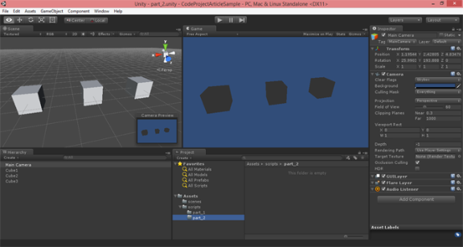
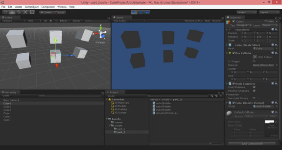
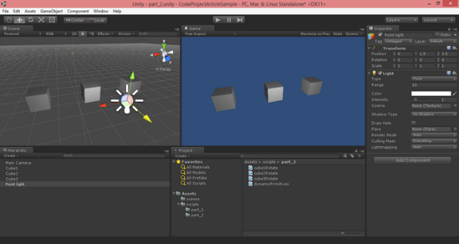
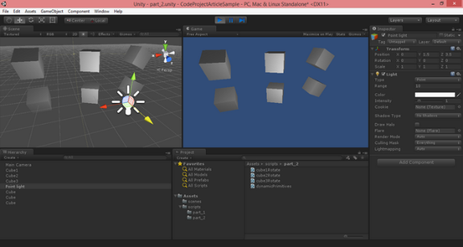

# UNITY 3D – GAME PROGRAMMING – PART 2

The second article in a series to discuss Unity 3D and how to get started with your own 3D projects.

## Introduction

In the second article in the series, we will continue on expanding our knowledge of the environment and also start demonstrating more coding and scripting. If you have not already done so, please take a moment and read:

In Part 1 we started by the very basics of the Unity 3D environment. Getting a feel of the IDE and the different sections which you will be working with throughout your project. We also covered how to use the tools in the designer to apply different transformation to a selected Game Object: positioning, rotation and scaling. We finally looked at how to create our first script and using the script apply a rotation transform on the Y-Axis of our cube.

In the second part of the series, we will look at more of the transformation of a given object through coding. We will also look at how to create light sources that are crucial for the rendering of your objects in the scene. Without lighting, your scene or level will not look as attractive.

Now, it is important to understand these concepts so that you have a better control of the environment you want to create.

**Live Preview of Article Code and Visuals:**

[](http://www.noorcon.com/CodeProject/CodeProjectArticlePreview.html)

Link to live preview: <http://www.noorcon.com/CodeProject/CodeProjectArticlePreview.html>

## Background

If you have not already done so, please take a moment and read [Unity 3D – Game Programming Introduction – Part 1](http://www.codeproject.com/Articles/876015/UNITY-D-GAME-PROGRAMMING-INTRODUCTION).

It is assumed that the reader of this article is familiar with programming concepts in general. It is also assumed that the reader has an understanding and experience of the C# language. It is also recommended that the reader of the article is familiar with Object-Oriented Programming and Design Concepts as well. We will be covering them briefly throughout the article as needed, but we will not get into the details as they are separate topics altogether. We also assume that you have a passion to learn 3D programming and have the basic theoretical concepts for 3D Graphics and Vector Math.

Lastly, the article uses Unity 3D version 4.6.1 which is the latest public release as of the initial publication date. Most of the topics discussed in the series will be compatible with older versions of the game engine, and perhaps also the new version which is supposed to be release sometime this year. There is however, one topics which is significantly different in the current 4.6.1 version compared to the older version of the game engine, and that is the UI (User Interface) pipeline. This is due to the new UI architecture in the engine which is far superior to what we had prior to this release. I for one, am very happy with the new UI architecture.

## Using Project Files

*Downloading the project/source code for article series:* [Download source](http://www.codeproject.com/KB/game/876478/CodeProjectArticleSample_part_2.zip)*.*

With each consecutive article that is submitted, the project/source code will be also expanding. The new project files and source files will be inclusive of older parts in the series.

## Position, Rotation and Scale of an Object

Every game object in a scene/level has a Transform. This component is used to store and manipulate the position, rotation and scale of a given object. As a game developer you will need to become familiar with the Transform and the many operations and properties that is has available through the API.

***NOTE:*** *To get familiar with all of the different variables, functions, and etc… of the Transform you will need to look into the Scripting API documentation provided by Unity 3D. I will not be listing them here, as it will be senseless.*

As stated, it is very important to understand the Transform so that you can manipulate your scene/level as desired.

Let’s say that we want to create three cube primitives in the following fashion: cube1 will be located at the origin (0,0,0), cube2 will be created at (3,0,0) and cube3 will be created at (-3,0,0). At this time, we will use the designer to create our primitives. Later on I will demonstrate on how to create the primitives dynamically, through code.

Using the menu toolbar, select GameObject->3D Object->Cube. You will need to perform this action three times, and each time a cube will be created and placed at (0,0,0). Using the Hierarchy window, select the first cube. The Inspector window will load all of the properties for the selected cube. Change the name to Cube1, and make sure the Position vector is at (0,0,0) the (X,Y,Z).

***NOTE:*** *If you are lost at this point, refer to Part 1 of the series. We cover the basics in Part 1.*

Repeat the same procedure to make Cube2 be positioned at (3,0,0) and Cube3 positioned at (-3,0,0). Your Scene should look something like the following:



*Figure 1-Three Cube Primitives*

***NOTE:*** *Depending on the position and orientation of your perspective view, you might have to adjust to make it look like what I have in Figure 1.*

Now, let’s say that we want our three cubes to rotate on different axis each in the following order: Cube1 will be rotating around it’s Y-Axis, Cube2 will be rotating around it’s X-Axis, and Cube3 will be rotating around it’s Z-Axis. To achieve this, we would need to create three scripts each representing the rotation for one of the Game Objects.

In your Project window, right-click to get the Context Menu up. Select Create->C# Script. This will create a C# file for you. Name it cube1Rotate.cs. Repeat the same procedure for Cube2 and Cube3. You should have three scripts called cube1Rotate.cs, cube2Rotate.cs, and cube3Rotate.cs.

Double-Click cube1Rotate.cs file to open it in the Mono Develop edit, or the editor of your choosing. In the **Update()** function we need to implement that will apply the Y-Axis rotation.

Cube1 Y-Axis Rotation:

[Copy Code](http://www.codeproject.com/Articles/876478/UNITY-D-GAME-PROGRAMMING-PART#)

```
using UnityEngine;
using System.Collections;

public class cube1Rotate : MonoBehaviour {

  Use this for initialization
  Start () {
 
 }
 
  Update is called once per frame
  Update () {
   Rotate our game object around it's y-axis
  .transform.Rotate ( Vector3 (, , ), );
 }
}
```

To apply the proper rotation for Cube2 and Cube3, we would need to open the appropriate script file and use the same **Transform** function called **Rotate()** but pass in a different **Vector3** object. So for X-Axis rotation it would be *Vector3(1,0,0)* and for the Z-Axis rotation it would be *Vector3(0,0,1)*.

Cube2 X-Axis Rotation:

[Copy Code](http://www.codeproject.com/Articles/876478/UNITY-D-GAME-PROGRAMMING-PART#)

```
using UnityEngine;
using System.Collections;

public class cube2Rotate : MonoBehaviour {

  Use this for initialization
  Start () {
 
 }
 
  Update is called once per frame
  Update () {
   Rotate our game object around it's x-axis
  .transform.Rotate ( Vector3 (, , ), ); 
 }
}
```

Cube3 Z-Axis Rotation:

[Copy Code](http://www.codeproject.com/Articles/876478/UNITY-D-GAME-PROGRAMMING-PART#)

```
using UnityEngine;
using System.Collections;

public class cube3Rotate : MonoBehaviour {

  Use this for initialization
  Start () {
 
 }
 
  Update is called once per frame
  Update () {
   Rotate our game object around it's z-axis
  .transform.Rotate ( Vector3 (, , ), ); 
 }
}
```

***NOTE:*** *Do not forget to associate each C# script with its respective GameObject.*

Now, at this point, if you are one of the more inclined developers, chances are you are thinking to yourself, do we really need to create a separate script file for each GameObject? What if I have hundreds of GameObjects in my scene/level. What am I going to do?

Well, the short answer to your questions is, **no**, you do not need to create a separate script file for each GameObject.

Let’s look at a more advanced scenario. Let’s create a script which will create three additional cube primitives, and place them two units above the existing cubes. That is, we will create a Cube1’ positioned at (0,2,0), a Cube2’ positioned at (3, 2, 0), and a Cube3’ positioned at (-3, 2, 0).

Collapse [anexo ausente] | [Copy Code](http://www.codeproject.com/Articles/876478/UNITY-D-GAME-PROGRAMMING-PART#)

```
using UnityEngine;
using System.Collections;

public class dynamicPrimitives : MonoBehaviour {

 private GameObject cube1;  represents our Cube1'
 private GameObject cube2;  represents our Cube2'
 private GameObject cube3;  represents our Cube3'

  Use this for initialization
  Start () {

   initialize our Cube1 primitive and place it at location (0,2,0)
  .cube1 = GameObject.CreatePrimitive (PrimitiveType.Cube);
  .cube1.transform.localPosition =  Vector3 (, , );

   initialize our Cube2 primitive and place it at location (3,2,0)
  .cube2 = GameObject.CreatePrimitive (PrimitiveType.Cube);
  .cube2.transform.localPosition =  Vector3 (, , );

   initialize our Cube3 primitive and place it at location (-3,2,0)
  .cube3 = GameObject.CreatePrimitive (PrimitiveType.Cube);
  .cube3.transform.localPosition =  Vector3 (-3, , );

 }
 
  Update is called once per frame
  Update () {
 
   apply the y-axis transform to Cube1'
  .cube1.transform.Rotate( Vector3(,,), );

   apply the x-axis transform to Cube2'
  .cube2.transform.Rotate( Vector3(,,), );

   apply the z-axis transform to Cube3'
  .cube3.transform.Rotate( Vector3(,,), );
 }
}
```

Several things are happening in the listing shown above. First, you will notice that we have declared three private **GameObject** variables that will represent our cubes. Next you will notice that we have used the **Start()** function to do our initialization of the cubes. So let’s discuss one of the cube’s and the same concept will apply to the rest.

Our Cube1’ is defined by the cube1 GameObject. By default this is null. If you recall from Part 1, the Start() function will be called only once upon the start or your game or simulation, therefore we would like to initialize / instantiate our primitives in the Start() function. We can do this by using the *GameObject.CreatePrimitive(PrimitiveType.Cube)* function. **CreatePrimitive()** is the function that will instantiate our Primitive, and **PrimitiveType.Cube** is an internal enum that will be passed to the function to instantiate the Cube primitive. Lastly, the newly created GameObject is assigned to our variable called cube1.

By default, each primitive will be instantiated at location (0,0,0), so the next step is for us to use the Transform to relocate our GameObject to the desired location in the 3D world. In this case, for Cube1’ we want to place it at (0,2,0). Therefore we will need to change the localPosition vector of the newly instantiated cube to a new Vector3(0,2,0). This represents the position of the GameObject.

You will need to attach this newly created script to an object in the scene to be executed during runtime. At this point, it doesn’t matter which GameObject it gets attached to. Go ahead and attach this script to your camera.

***NOTE:*** *Since the script is not modifying the GameObject it is attached to, it will not have any effect on it.*

When you run your scene, it will look something like the following:



*Figure 2-Screenshot of Running Script*

By now you should be comfortable enough to create GameObjects at design time and dynamically through code. You should also be comfortable with the positioning and rotation of the GameObject at design time as well as through code. Next, we will be discussing lighting the scene.

## Lights, Camera, Action!

There are four light sources available to you in Unity 3D. To get into the details and the theory of lighting is outside of the scope of this article. But it is important to know that lighting is a very important aspect of your scene. After all, how will the camera see its surrounding without lighting?

The four type:

1. Directional Light
2. Point Light
3. Spotlight
4. Area Light

I will discuss the different light sources in future articles. For now, let’s create an Area Light for our scene. To do so, from the main toolbar, select GameObject->Light->Point Light. A Point Light will be placed in your active scene. Go ahead and select the Point Light Object from the Hierarchy window, and change the Position vector properties for (X,Y,Z) to (0, 1.5, 3.5). Notice how you scene and your Game View have now lighten up. You should have something like the following figure at design time:



*Figure 3-Lighting at Design Time*

And the following figure at runtime, given you have applied the latest script to the scene:



*Figure 4-Lighting at Runtime*

I would like to stop Part 2 of the series at this point.

## Points of Interest

Practice more on your own, make sure that you understand what we have covered so far. Also, if you are new to C#, make sure you do reading on the basics and get as much practice as possible.

## History

This is the second article of a series which I would slowly contribute to the Code Project community.
