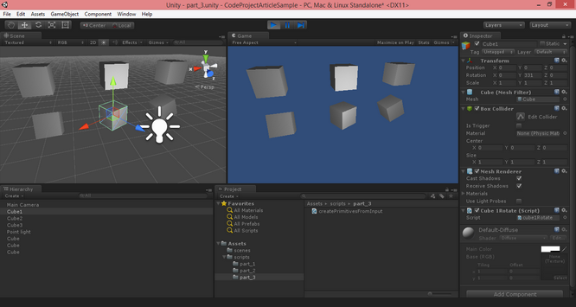
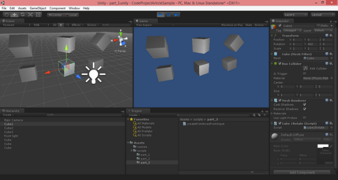
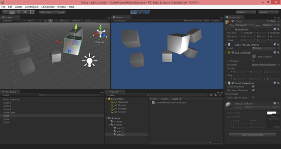

# UNITY 3D – GAME PROGRAMMING – PART 3

The third article in a series to discuss Unity 3D and how to get started with your own 3D projects.

## Introduction

In the third article in the series, we will continue on expanding our knowledge of the environment in general. We would also take a look at how to process user input from the keyboard. We need to be able to somehow handle user input and internally convert these inputs to desired actions or outputs. If you have not already done so, please take a moment and read:

In the first part of the series we started by the very basics of the Unity 3D environment. Getting a feel of the IDE and the different sections which you will be working with throughout your project. We also covered how to use the tools in the designer to apply different transformation to a selected Game Object: positioning, rotation and scaling. We finally looked at how to create our first script and using the script apply a rotation transform on the Y-Axis of our cube.

In the second part of the series, we looked at more of the transformation of a given object through coding. We also looked at how to create light sources that are crucial for the rendering of your objects in the scene.

In Part 3 of the series we will look at how to process user input and based on the input take particular actions. At this point we will only concentrate on the keyboard input from the user. Future articles will cover other types of input.

**Live Preview of Article Code and Visuals:**

[](http://www.noorcon.com/CodeProject/CodeProjectArticlePreview.html)

Link to live preview: <http://www.noorcon.com/CodeProject/CodeProjectArticlePreview.html>

## Background

It is assumed that the reader of this article is familiar with programming concepts in general. It is also assumed that the reader has an understanding and experience of the C# language. It is also recommended that the reader of the article is familiar with Object-Oriented Programming and Design Concepts as well. We will be covering them briefly throughout the article as needed, but we will not get into the details as they are separate topics altogether. We also assume that you have a passion to learn 3D programming and have the basic theoretical concepts for 3D Graphics and Vector Math.

Lastly, the article uses Unity 3D version 4.6.1 which is the latest public release as of the initial publication date. Most of the topics discussed in the series will be compatible with older versions of the game engine, and perhaps also the new version which is supposed to be release sometime this year. There is however, one topics which is significantly different in the current 4.6.1 version compared to the older version of the game engine, and that is the UI (User Interface) pipeline. This is due to the new UI architecture in the engine which is far superior to what we had prior to this release. I for one, am very happy with the new UI architecture.

## Using the code

*Downloading the project/source code for article series:* [Download source](http://www.codeproject.com/KB/game/877371/CodeProjectArticleSample_part_3-noexe.zip)*.*

With each consecutive article that is submitted, the project/source code will be also expanding. The new project files and source files will be inclusive of older parts in the series.

## Input Processing in Unity 3D - Input Manager

Each program you write, whether the program is a phone application, a web application, a game or an embedded system, needs some sort of an input. In general every program needs some sort of an input and some sort of an output. The output is what the users sees, and the input is what the user enters or gives to the program to generate the output based on some algorithm.

Unity 3D is no different. The game engine needs to be able to process inputs from different sources:

1. Keyboard
2. Mouse
3. Joystick(s)

Unity 3D manages its inputs through the Input Manager. The Input Manage is accessible by selecting Edit->Project Settings->Input from the main menu bar.

|  |  |  |
| --- | --- | --- |
| d1cfe2ffbc5073dd7987e54c819a627a.png    *Figure 1-Input Manager* | 49dbc3886ec4681ca357b0d2ea1eed54.png    *Figure 2-Horizonal Configuration* | 767298032cee0a3ffe1f0480e54adc2a.png    *Figure 3-Vertical Configuration* |

Figure 1 lists all of the out of the box Input configurations defined in the game engine. Let’s go ahead and expand the first Input Definition called **Horizontal**. Looking at Figure 2, you will notice the attributes that are defined under the Horizontal Axis input configuration. The following are the properties of the input configuration that are important to take a note of:

1. **Name:** the name of the axis as defines in the Input Manager. This is the name that you can refer to in your C# code for to detect and perform an operation as desired.
2. **Positive Button:** defines the primary button that will provide the positive direction / force.
3. **Negative Button:** defines the primary button that will provide the negative direction / force.
4. **Alt. Positive Button:** same as the positive button, but defines a secondary input intake.
5. **Alt. Negative Button:** same as the negative button, but defines a secondary input intake.
6. **Type:** defines where the input source is coming from; (Keyboard/Mouse/Joystick).
7. **Axis:** which axis in the world should the force be applied to.

At this point we are not going to modify any of the configurations. I just wanted to show you how the Input Manager looked like and give you a brief overview of the properties.

## Input Processing in Unity 3D - Keyboard Input

Recall from Part 2, we wanted to dynamically create our cube primitives and place them relative to the design time cubes. In order to achieve this, we had to create a new script and attach it to any active Game Object in the scene. We attached our script to the camera object.

***NOTE:*** *It was safe to do so because our script does not interact with the object it is attached to.*

The result was that when we run the program, the primitives would be immediately created and displayed in the scene.

Now let’s consider the following scenario, what if we wanted to create the primitives only after a specific key was pressed on the keyboard, let’s say the *Space Bar*.

Collapse [anexo ausente] | [Copy Code](http://www.codeproject.com/Articles/877371/UNITY-D-GAME-PROGRAMMING-PART#)

```
using UnityEngine;
using System.Collections;

public class createPrimitivesFromInput : MonoBehaviour {

 private GameObject cube1;  represents our Cube1'
 private GameObject cube2;  represents our Cube2'
 private GameObject cube3;  represents our Cube3'

 private  PRIMITIVES_CREATED;

  Use this for initialization
  Start () {  
  .PRIMITIVES_CREATED = false;
 }

  Update is called once per frame
  Update () {

   (Input.GetKey (KeyCode.Space)) {
   .CreateMyPrimitives();
  }

   (PRIMITIVES_CREATED) {
    apply the y-axis transform to Cube1'
   .cube1.transform.Rotate( Vector3(,,), );
   
    apply the x-axis transform to Cube2'
   .cube2.transform.Rotate( Vector3(,,), );
   
    apply the z-axis transform to Cube3'
   .cube3.transform.Rotate( Vector3(,,), );
  }
 }

  This function will be called when the Space Bar on the keyboard is pressed
  CreateMyPrimitives(){

   check to see if the object is null before instantiating
   (.cube1 == ) {
    initialize our Cube1 primitive and place it at location (0,2,0)
   .cube1 = GameObject.CreatePrimitive (PrimitiveType.Cube);
   .cube1.transform.localPosition =  Vector3 (, , );
  }

   check to see if the object is null before instantiating
   (.cube2 == ) {
    initialize our Cube2 primitive and place it at location (3,2,0)
   .cube2 = GameObject.CreatePrimitive (PrimitiveType.Cube);
   .cube2.transform.localPosition =  Vector3 (, , );
  }

   check to see if the object is null before instantiating
   (.cube3 == ) {
    initialize our Cube3 primitive and place it at location (-3,2,0)
   .cube3 = GameObject.CreatePrimitive (PrimitiveType.Cube);
   .cube3.transform.localPosition =  Vector3 (-3, , );
  }

  .PRIMITIVES_CREATED = ;
 }
}
```

The listing above is a modification of the script we created in [Part 2](http://www.codeproject.com/Articles/876478/UNITY-D-GAME-PROGRAMMING-PART) of the series. Let’s breakdown the script:

1. We need to detect if the Space Bar is pressed by the user. This is done in the **Update()** function using the **Input** object and the **GetKey()** function, i.e., Input.GetKey (KeyCode.Space). The parameter that we pass into the function is an enum representation of the Space Bar, **KeyCode.Space**.
2. Then we need to detect if the key is pressed by checking the value passed back by the **GetKey()** function. If true, then we will call a new function that we have defined called **CreateMyPrimitives()**.
3. In the **CreateMyPrimitive()** function, we will check to see if the primitives are null, and if so, then we will instantiate them.
4. In the **Update()** function, we check to see if the primitives have been initialized, and if so, we then apply the rotation to each primitive accordingly.

Don’t forget that the **Update()** function is continuously executed while the program is running. Therefore, if the Space Bar is pressed several time, we are going to run into a problem. We will be instantiating the primitives as many times as the Space Bar is being pressed, resulting in chaos.

In order to prevent this from happening, we will introduce a new boolean variable called **PRIMITIVES\_CREATED** which will be used to control if we need to instantiate the primitives or not. The initial value of the PRIMITIVES\_CREATED is set to false, and this is done in the **Start()** function.

***NOTE:*** *Remember that the **Start()** function gets executed only once at the start!*

So when the Space Bar is pressed, the **CreateMyPrimitives()** function is called, and the primitives are instantiated. Again, notice, that we are checking to see if the primitive variables are null before we instantiate them. Finally we set the **PRIMITIVES\_CREATED** variable to true.

Now, in the **Update()** function, we have to check and see if the primitives are initialized before we can apply our rotation to the Transform.



*Figure 4-Screenshot of Running New Script*

Can we improve this code? Sure we can. Here is another listing that will do exactly what we want.

Collapse [anexo ausente] | [Copy Code](http://www.codeproject.com/Articles/877371/UNITY-D-GAME-PROGRAMMING-PART#)

```
using UnityEngine;
using System.Collections;

public class createPrimitivesFromInput : MonoBehaviour {

 private GameObject cube1;  represents our Cube1'
 private GameObject cube2;  represents our Cube2'
 private GameObject cube3;  represents our Cube3'

 private  PRIMITIVES_CREATED;

  Use this for initialization
  Start () {  
  .PRIMITIVES_CREATED = false;
 }

  Update is called once per frame
  Update () {

   (!this.PRIMITIVES_CREATED) {
    (Input.GetKey (KeyCode.Space)) {
    .CreateMyPrimitives();
   }
  }{
    apply the y-axis transform to Cube1'
   .cube1.transform.Rotate( Vector3(,,), );
   
    apply the x-axis transform to Cube2'
   .cube2.transform.Rotate( Vector3(,,), );
   
    apply the z-axis transform to Cube3'
   .cube3.transform.Rotate( Vector3(,,), );
  }
 }

  This function will be called when the Space Bar on the keyboard is pressed
  CreateMyPrimitives(){

   (!this.PRIMITIVES_CREATED) {

    initialize our Cube1 primitive and place it at location (0,2,0)
   .cube1 = GameObject.CreatePrimitive (PrimitiveType.Cube);
   .cube1.transform.localPosition =  Vector3 (, , );

    initialize our Cube2 primitive and place it at location (3,2,0)
   .cube2 = GameObject.CreatePrimitive (PrimitiveType.Cube);
   .cube2.transform.localPosition =  Vector3 (, , );

    initialize our Cube3 primitive and place it at location (-3,2,0)
   .cube3 = GameObject.CreatePrimitive (PrimitiveType.Cube);
   .cube3.transform.localPosition =  Vector3 (-3, , );

   .PRIMITIVES_CREATED = ;

  }
 }
}
```

As you can see, the new listing is improved as we are using one variable to detect if the primitives are created or not and based on that perform our operations.

## Using Keyboard Input to Apply Rotation

Now, let’s go a step further. Let’s go ahead and define some input key values to handle the rotation for the dynamically created primitives in the following order:

1. Key A will be responsible to rotate Cube1’ on the Y-Axis.
2. Key B will be responsible to rotate Cube2’ on the X-Axis.
3. Key C will be responsible to rotate Cube3’ on the Z-Axis.

We would need to modify our code to handle the three new input types as follows:

Collapse [anexo ausente] | [Copy Code](http://www.codeproject.com/Articles/877371/UNITY-D-GAME-PROGRAMMING-PART#)

```
using UnityEngine;
using System.Collections;

public class createPrimitivesFromInput : MonoBehaviour {

 private GameObject cube1;  represents our Cube1'
 private GameObject cube2;  represents our Cube2'
 private GameObject cube3;  represents our Cube3'

 private  PRIMITIVES_CREATED;

  Use this for initialization
  Start () {  
  .PRIMITIVES_CREATED = false;
 }

  Update is called once per frame
  Update () {

   (!this.PRIMITIVES_CREATED) {
    (Input.GetKey (KeyCode.Space)) {
    .CreateMyPrimitives();
   }
  }{
    apply the y-axis transform to Cube1'
   (Input.GetKey(KeyCode.A)){
    .cube1.transform.Rotate( Vector3(,,), );
   }
   
    apply the x-axis transform to Cube2'
   (Input.GetKey(KeyCode.B)){
    .cube2.transform.Rotate( Vector3(,,), );
   }

    apply the z-axis transform to Cube3'
   (Input.GetKey(KeyCode.C)){
    .cube3.transform.Rotate( Vector3(,,), );
   }
  }
 }

  This function will be called when the Space Bar on the keyboard is pressed
  CreateMyPrimitives(){

   (!this.PRIMITIVES_CREATED) {

    initialize our Cube1 primitive and place it at location (0,2,0)
   .cube1 = GameObject.CreatePrimitive (PrimitiveType.Cube);
   .cube1.transform.localPosition =  Vector3 (, , );

    initialize our Cube2 primitive and place it at location (3,2,0)
   .cube2 = GameObject.CreatePrimitive (PrimitiveType.Cube);
   .cube2.transform.localPosition =  Vector3 (, , );

    initialize our Cube3 primitive and place it at location (-3,2,0)
   .cube3 = GameObject.CreatePrimitive (PrimitiveType.Cube);
   .cube3.transform.localPosition =  Vector3 (-3, , );

   .PRIMITIVES_CREATED = ;

  }
 }
}
```

Notice, that the **Update()** function is where you place the logic to perform your Input and Output. In the listing above, the code checks to see if the primitives have been initialized, and if true, then it will check for input from the user. Based on the key value it will apply the appropriate rotation to the Game Object.

Something to think about: in the new code, the primitives will not rotate continuously as they did in Part 2. They also will not rotate in-synch at the same time!

Each primitive will rotate independently only when the specific key associated to its rotation is pressed. For instance, if you press the A key, Cube1’ will continuously rotate until you stop pressing it. It will stop at the last rotation angle where you lifted your finger from the key!



*Figure 5-Screenshot Capturing New Input for Rotation*

## Using Keyboard Input to Apply Translation

Continuing on our script improvement, let’s now use the following keys to move Cube1’ forward, backward, and to either side:

1. **Up Arrow Key** will be responsible to move Cube1’ on the Z-Axis.
2. **Down Arrow Key** will be responsible to move Cube1’ backward on the Z-Axis.
3. **Left Arrow Key** will be responsible to move Cube1’ to the left on the X-Axis.
4. **Right Arrow Key** will be responsible to move Cube1’ to the right on the X-Axis.

In order to achieve this, we will need to modify our **Update()** function as follows:

Collapse [anexo ausente] | [Copy Code](http://www.codeproject.com/Articles/877371/UNITY-D-GAME-PROGRAMMING-PART#)

```
using UnityEngine;
using System.Collections;

public class createPrimitivesFromInput : MonoBehaviour {

 private GameObject cube1;  represents our Cube1'
 private GameObject cube2;  represents our Cube2'
 private GameObject cube3;  represents our Cube3'

 private  PRIMITIVES_CREATED;

  Use this for initialization
  Start () {  
  .PRIMITIVES_CREATED = false;
 }

  Update is called once per frame
  Update () {

   (!this.PRIMITIVES_CREATED) {
    (Input.GetKey (KeyCode.Space)) {
    .CreateMyPrimitives();
   }
  }{
    apply the y-axis transform to Cube1'
   (Input.GetKey(KeyCode.A)){
    .cube1.transform.Rotate( Vector3(,,), );
   }
   
    apply the x-axis transform to Cube2'
   (Input.GetKey(KeyCode.B)){
    .cube2.transform.Rotate( Vector3(,,), );
   }

    apply the z-axis transform to Cube3'
   (Input.GetKey(KeyCode.C)){
    .cube3.transform.Rotate( Vector3(,,), );
   }

    code for the movement of Cube1' forward
   (Input.GetKey(KeyCode.UpArrow)){
    .cube1.transform.Translate(Vector3.forward * Time.deltaTime);
   }
    code for the movement of Cube1' backward
   (Input.GetKey(KeyCode.DownArrow)){
    .cube1.transform.Translate(Vector3.back * Time.deltaTime);
   }
    code for the movement of Cube1' left
   (Input.GetKey(KeyCode.LeftArrow)){
    .cube1.transform.Translate(Vector3.left * Time.deltaTime);
   }
    code for the movement of Cube1' right
   (Input.GetKey(KeyCode.RightArrow)){
    .cube1.transform.Translate(Vector3.right * Time.deltaTime);
   }
  }
 }

  This function will be called when the Space Bar on the keyboard is pressed
  CreateMyPrimitives(){

   (!this.PRIMITIVES_CREATED) {

    initialize our Cube1 primitive and place it at location (0,2,0)
   .cube1 = GameObject.CreatePrimitive (PrimitiveType.Cube);
   .cube1.transform.localPosition =  Vector3 (, , );

    initialize our Cube2 primitive and place it at location (3,2,0)
   .cube2 = GameObject.CreatePrimitive (PrimitiveType.Cube);
   .cube2.transform.localPosition =  Vector3 (, , );

    initialize our Cube3 primitive and place it at location (-3,2,0)
   .cube3 = GameObject.CreatePrimitive (PrimitiveType.Cube);
   .cube3.transform.localPosition =  Vector3 (-3, , );

   .PRIMITIVES_CREATED = ;

  }
 }
}
```



*Figure 6-Screenshot of Translation of Object*

So now you have seen how to handle keyboard input in Unity 3D, and based on the input perform an action.

## Points of Interest

Using the new skills you have, try to think about the different aspects of user inputs your game or simulation is going to need. How will one manage more actions and handle multiple inputs? Do some reading on the subject and download the source code in this article to practice more. Next we will demonstrate how to create some simple User Interface elements.

## History

This is the third article of a series which I would slowly contribute to the Code Project community.
