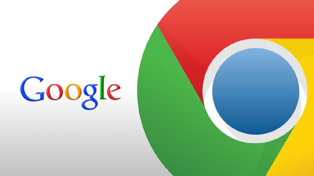

# Saying Goodbye to Google Services

[Home](https://danielmiessler.com/) » [Blog](https://danielmiessler.com/blog/) » [Technology](https://danielmiessler.com/technology/) » Saying Goodbye to Google Services

10/02/2014  | [Technology](https://danielmiessler.com/technology/)

It’s with mixed feelings that I’m starting my departure from Google services. My basic reasons are listed below:

1. As a consumer, it’s becoming increasingly obvious that they’re an advertising company first and foremost.
2. Their administrative interfaces are arbitrarily located, named, and designed. There’s no common design, no common location for management, and no consistency in experience.
3. I don’t like their incentivization model. Similar to point #1, they are best served by knowing more and more about me, and spreading that information to their real customers: advertisers. I dislike being a means to an ends.
4. They have no eye for design. Virtually everything they make is counterintuitive or haphazard in its UI and UX. For one or seven things it’s not that much of a problem, but over time, on dozens of their services, it’s grated on me for too long.
5. After years and years, there remains virtually ZERO way to get any support from Google. You send emails. You call numbers. They don’t really care, it seems.

In brief, they seem to just throw up new products, with new administrative interfaces, on new domains, with different ways of interacting with them, whenever they want to.

They bring users there, and then arbitrarily change those interfaces whenever they want (with no guarantee whatsoever that it’ll be an improvement). Or maybe they’ll just disable the service altogether, like with Google Reader.

I’m just tired of it, honestly, and I’m just now realizing that I shouldn’t be surprised by it at all. When you take three steps back, and look at the company’s origins, and goals, and business model, you actually feel ridiculous for expecting anything different.

They’re an engineer-based company designed to do one thing well—sell advertising. They’re sculpted for quick change the world of blackhat SEO and a constantly changing web ecosystem.

So they experiment. They try this. They try that. If it doesn’t work, or it doesn’t generate enough money, they let it go stale. They pull engineers off of it. Thousands of people are using it and sending emails about it? Complaining about it on Twitter? They don’t care.

Why would they?

This is kind of the point: They’re doing their services to try new ways of making advertising money. When they aren’t good at that they abandon or shut down the project.

And I get it. It makes absolute sense. I just refuse to be one of hapless people trying to keep up with it anymore. I don’t want to wonder what’s going to happen when I log into an admin interface. I don’t want to look at something with horrific design because it’s not a focus for the company.

Our priorities are simply in conflict.

My priority is having a great experience with my products and services, which means interface, design, simplicity, and support. Their priority is being nimble, trying new things, and not wasting time on things like UI and UX.

Totally understand. I’m just opting out.

Even Gmail suffers from this. I logged into it the other day and tried to send some messages. The thing is a wreck. If a UI/UX design student submitted that interface as a project they’d fail outright. What are it’s advantages? Uptime, speed, and finding emails.

Unsurprisingly, those are things that search companies do well.

## Email alternatives

So I’m taking my most important service of all out of Google—email.

This is not a small thing. I’ve had my email with Google for many years, and it’ll be strange to have it somewhere else. But honestly I’ve stayed this long because there were no options available, and now it seems there are.

I ultimately want to have my email with Apple, but they don’t yet offer the option to host a custom domain. Once they do I’ll likely take everything over there.

All I care about at this point is that as much as possible lives outside of Google.

### Notes

1. This is *not* about advertising; it’s about aligning your goals with those of the providers you use. Google is not focused on user experience and design; Apple is. See: [Decide What You Care About, and Map The Incentives](https://danielmiessler.com/blog/decide-care-map-incentives/).
2. Let me be clear about something: there are parts of Google that are HUGELY respectable. They have many efforts that are literally moving humanity forward, such as self-driving cars, internet for all, etc., and I continue to respect them immensely for those types of projects. But as a consumer that might as well be another company.
3. I’ll continue to use Google for everything website related, e.g., webmaster tools, analytics, SEO, etc.

- 14[**Share**](#)
- 255[**Share**](#)
- 27[**Share**](#)
- 105[**Share**](#)
- 0[**Share**](#)
- 0[**Share**](#)

#### Related…

- [Decide What You Care About, and Map The Incentives](https://danielmiessler.com/blog/decide-care-map-incentives/)
- [Why I Dislike Google Services](https://danielmiessler.com/blog/why-dislike-google-services/)
- [More Google Failure](https://danielmiessler.com/blog/google-failure/)
- [Apple is the Privacy Platform](https://danielmiessler.com/blog/apple-privacy-platform/)
- [The Simple Economic Reason I Prefer Apple to Google](https://danielmiessler.com/blog/the-simple-economic-reason-i-prefer-apple-to-google/)

#### Recommended…

[Semacodes](https://danielmiessler.com/blog/semacodes/)

[The iPhone Will Dominate, But Not Because Of Featu...](https://danielmiessler.com/blog/the-iphone-will-dominate-but-not-because-of-features-functionality/)

[Another Data Point in the iPhone vs. Android Debat...](https://danielmiessler.com/blog/another-data-point-in-the-iphone-vs-android-debate-re-sale-values/)

[The Reason Google is Terrified of Facebook](https://danielmiessler.com/blog/the-reason-google-is-terrified-of-facebook/)

[Linux DHCP](https://danielmiessler.com/blog/linux-dhcp/)

[OS X: The Keyboard Shortcut for “Don’t...](https://danielmiessler.com/blog/os-x-keyboard-shortcut-for-dont-save/)

  

Have an opinion on this? You can reply via [Twitter](#), via [email](https://danielmiessler.com/blog/saying-goodbye-to-google-services/mailto:daniel@danielmiessler.com), [discuss it here](#), or comment below.
