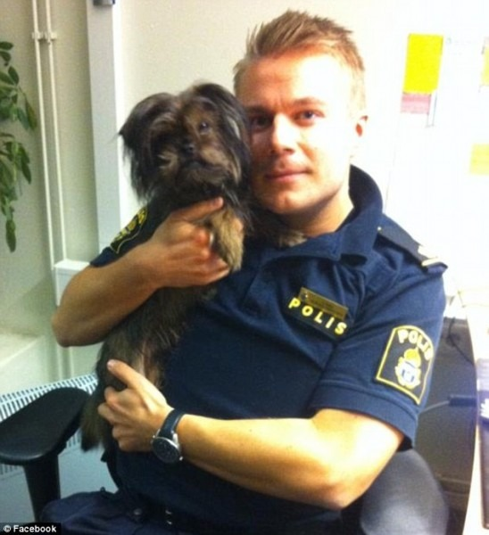

# [Nossos policiais um dia serão iguais aos suecos?](http://www.diariodocentrodomundo.com.br/nossos-policiais-um-dia-serao-iguais-aos-suecos/)

Policial sueco com seu cachorro

*De Estocolmo*

“A polícia detém o monopólio da violência em um Estado. Deve, portanto, ter o mesmo grau de responsabilidade”. É a enésima vez que ouço esta frase na Suécia, onde avistar um policial na rua é mais raro do que água em São Paulo.

Quem pronuncia a máxima agora é o Comandante da Polícia Montada de Estocolmo, Ola Österling – um sério candidato a cair elegantemente do cavalo, caso assistisse às imagens da cavalaria da PM pisoteando manifestantes em Brasília, ou aos variados espetáculos de violência encenados por um modelo policial que ainda confunde manifestações populares com congregações de baderneiros.

Ola Österling foi um dos idealizadores do novo modelo policial sueco de patrulhamento de manifestações populares, introduzido após o trauma nacional provocado pela violenta repressão policial aos protestos anticapitalistas de 2001 na cidade sueca de Gotemburgo.

Na nova forma de lidar com os manifestantes, o mais importante para a polícia sueca não é vencer a guerra – e sim evitá-la.

“A arma mais importante da polícia é a habilidade de dialogar com os manifestantes, e não a capacidade de reprimir”, diz Österling.

“E é fundamental que a polícia parta da premissa de que o ato de se manifestar é um direito básico de qualquer democracia séria. Dessa forma, os cidadãos que participam de uma manifestação sentem que têm o apoio da polícia, e que a polícia sempre será a salvaguarda do direito democrático dos cidadãos de protestar”.

Foi esse o raciocínio que deu origem à criação da Divisão de Diálogo da polícia sueca, chefiada por Österling de 2003 a 2012. Trata-se de uma equipe de policiais especializados em táticas de diálogo, treinados especificamente para reduzir a tensão entre policiais e manifestantes.

A literatura policial sueca explica: a percepção clássica, de que toda multidão é sempre perigosa, foi substituída por uma visão moderna da psicologia das multidões, que se baseia nas relações dentro dos grupos e entre os grupos de uma multidão. A partir daí, a polícia definiu uma estratégia baseada em três eixos – o diálogo, a redução da tensão e a ausência do confronto.

Assim que uma manifestação popular é convocada na Suécia, os especialistas em diálogo da polícia entram em ação. Sua função é servir como um elo na comunicação entre os organizadores do protesto e o comando da polícia – e seu primeiro ato é entrar em contato com os líderes da manifestação, a fim de criar um clima de confiança e cooperação entre as duas partes.

“A confiança é fundamental”, destaca Österling. “Os manifestantes em geral têm medo da polícia, e muitas vezes a polícia tem medo dos manifestantes. Porque o desconhecido sempre desperta medo. E para quebrar essa barreira, você precisa desenvolver uma relação constante com os diferentes segmentos da sociedade.”

“É como o relacionamento de um casal: as duas partes precisam se conhecer, e desenvolver um sentimento de confiança mútua. E você precisa desenvolver essa confiança várias semanas antes de uma manifestação ser realizada. De preferência, talvez até anos antes”, acrescenta o comandante.

O quesito confiança merece destaque especial nos manuais da polícia sueca:

“As estratégias tradicionais de negociação durante atos de protesto envolvem o uso de truques variados para ludibriar o manifestante, criando uma situação em que o manifestante cede e a polícia ganha. Mas chegamos à conclusão de que um diálogo genuíno deve ser baseado no respeito mútuo, a fim de preservar uma relação de confiança”, diz a literatura policial.

“O diálogo deve envolver portanto a comunicação entre as duas partes, e não uma das partes dizendo à outra o que ela deve fazer”.

E um diálogo genuíno, concluíram os suecos, também requer o conhecimento das razões que levam um manifestante a protestar.

“Quando comecei a treinar meus oficiais nas táticas de diálogo, também os encaminhei para cursos nas universidades, a fim de estudar temas como democracia, islamismo e neonazismo. Se preparamos uma operação policial para patrulhar uma manifestação dos neonazistas, por exemplo, precisamos ter policiais especializados nas questões relacionadas ao neonazismo”, explica Ola Österling.

Faz todo o sentido, ele diz: quando os manifestantes percebem que os policiais da equipe de diálogo têm um bom conhecimento sobre as razões do seu protesto, tornam-se em geral mais receptivos e abertos em relação à polícia.

“O policial nunca deve discutir as próprias opiniões. Mas é importante que ele tenha o conhecimento sobre os motivos do protesto, pois isso contribui para a criação de uma relação de aceitação e confiança entre o policial e o manifestante”, pontua o comandante, que ainda atua junto às equipes de diálogo.

No ato da manifestação, os especialistas em diálogo passam a atuar como um termômetro dentro do protesto.

“Não gosto de usar a palavra “infiltrado”. Prefiro dizer “presente”. Porque não trabalhamos como equipes de inteligência. Trabalhamos abertamente, no centro das manifestações. Os policiais da equipe de diálogo trabalham à paisana, mas usam um colete da polícia. Não se escondem, não tentam se infiltrar e atuam desarmados, o que é um importante gesto simbólico”, observa Österling.

“Dizemos claramente: ‘Sou da polícia, sou da equipe de diálogo, e não estou aqui para prender você. Estou aqui para ajudar a polícia a garantir que você tenha uma manifestação tranquila e pacífica’”.

No centro nervoso da manifestação, os especialistas em diálogo mantêm contato permanente com os organizadores do protesto e o comando tático da polícia, evitando assim situações de confronto. Um exemplo dessa atuação é descrito em um relatório da polícia sueca:

“Quando a polícia avançava em sua marcha na passeata, uma multidão de manifestantes parou e recusou-se a acatar as ordens de continuar o trajeto. Eles haviam na verdade formado um círculo em volta de uma colega, que havia se machucado. Um policial, que não sabia o que havia ocorrido, aproxima-se então da multidão armado com um cacetete. A equipe de diálogo intervém, após ser contactada por um dos organizadores, providencia uma ambulância para a manifestante ferida e acalma a situação”.

Em outro episódio, uma patrulha policial comunica alerta vermelho ao ver uma multidão se movimentar de maneira inesperada. A situação se deteriora, e vários carros da polícia são enviados para reforçar a presença policial contra um grupo de manifestantes de origem muçulmana.

Eles protestam contra a visita à Suécia de um ministro do país onde eram perseguidos e de onde foram obrigados a fugir. A Divisão de Diálogo entra em cena e estabelece um diálogo com os líderes do protesto. Os policiais argumentam que eles são livres para se manifestar na Suécia, mas que seria um erro protestar contra um regime violento usando métodos violentos, e os organizadores concordam em acalmar os colegas através do sistema de alto-falantes.

A polícia uniformizada também muda sua atitude, e os policiais tiram seus capacetes para acalmar a situação. As duas partes concordam que o objetivo maior da manifestação – atrair a atenção da midia – havia sido alcançado, e a ordem é restaurada.

O diálogo é a regra – mas a violência não é tolerada. E com seu porte físico de armário de três portas, um policial sueco diante de um vândalo desvairado não é uma criatura particularmente singela.

“É preciso dizer que a polícia não precisa escolher entre o diálogo ou a força. Como policial, você pode usar os dois, dependendo da gravidade da situação”, destaca o comandante da Polícia Montada.

A preocupação da polícia sueca, nos casos extremos de atos de protesto com alto risco de confrontação e distúrbios, é não promover uma escalada da violência.

“As intervenções devem ser cirúrgicas. E a não ser que a situação exija, é recomendável que não sejam intervenções excessivamente violentas. É preciso fazer uma distinção precisa entre a maioria pacífica e os indivíduos ou grupos violentos. Porque quando a polícia cria uma intervenção coletiva contra os manifestantes, cria-se uma situação de “nós” contra “eles”, em que toda a multidão passa a ver a polícia como o inimigo. Nesse caso, a polícia pode se ver forçada a usar métodos ainda mais violentos para conter um distúrbio”, observa Österling.

Disparos de balas de borracha para conter a multidão sempre foram proibidos na Suécia.

“Quando você usa a violência em uma manifestação popular, tem que estar seguro de que ela vai atingir a pessoa certa. E as balas de borracha não oferecem essa segurança. Portanto, decidimos não usar”, diz o comandante.

Outra regra de ouro da polícia sueca é uma lógica constatação: não fazer o jogo dos manifestantes violentos, que sempre tentarão tirar a polícia para dançar um perigoso minueto.

“Ativistas violentos sabem que precisam contar com a ‘ajuda’ dos policiais para responder às suas provocações, espalhar o pânico e provocar a polícia a atacar a multidão”, lembra a literatura policial.

Certa vez, o comandante de polícia da cidade de Malmö chegou a ser acusado de passividade, ao não reagir imediatamente quando um grupo de manifestantes começou a depredar um banco. O comandante redigiu então um extenso relatório de defesa: a repressão imediata naquele momento, argumentou, teria provocado um confronto desproporcionalmente violento em relação à severidade do ato de vandalismo praticado. Com o flagrante devidamente registrado nas câmeras, o grupo foi detido em hora mais apropriada.

A doutrina sueca é, enfim, uma estratégia que desafia a polícia a aprender e compreender melhor as normas culturais das multidões e suas intenções legítimas, facilitar os protestos pacíficos, comunicar constantemente as intenções da polícia e, quando crimes forem cometidos, realizar intervenções de forma discriminada e cuidadosa.

Não se trata, evidentemente, da utopia de uma polícia imaculada: erros acontecem, como comprovam os distúrbios em massa que explodiram em 2013 nos bairros da periferia de Estocolmo quando um policial matou a tiros um imigrante que ameaçava a mulher com uma faca no apartamento do casal.

Mas é uma polícia que parece buscar correções de curso, quando a estratégia dá sinais de demência.

A atual doutrina policial sueca nasceu após um franco mea culpa das autoridades suecas pela brutalidade dos eventos de Gotemburgo em 2001, quando a polícia abriu fogo em uma manifestação pela primeira vez desde 1931 e feriu três manifestantes.

O governo criou então uma comissão especial de investigação, e teve início o exercício favorito dos suecos: o debate, apoiado na realização de estudos minuciosos para desenvolver soluções mais sensatas.

“Olhamos primeiro para o que a polícia da Dinamarca estava fazendo”, conta Österling.

O modelo usado pelo sistema sueco era muito estático, com policiais atuando atrás de escudos e barreiras, e portanto incapazes de se comunicar com os manifestantes.

“Os dinamarqueses nos mostraram um sistema bastante dinâmico. Em vez de escudos e barreiras, eles usavam veículos, que acompanhavam a manifestação, para proteger os policiais”, explica o comandante.

A polícia sueca introduziu então uma frota de unidades móveis, que acompanham as manifestações a uma distância tática – os policiais só deixam os veículos em caso de necessidade. A isso, os suecos acrescentaram o conceito do diálogo e criaram uma força nacional de táticas especiais, que é deslocada para qualquer região do país quando necessário.

Mas a idéia central da doutrina sueca é permitir que a própria multidão mantenha a ordem, sempre que possível, através de mecanismos de auto-contenção:

“Se os manifestantes não precisarem da presença policial, não deve haver presença policial. Porque os manifestantes podem, em princípio, tomar conta de si próprios”, acredita Ola Österling.

É uma estratégia que reduz, a julgar pelos relatórios policiais, a incidência de paradoxais confrontos entre a polícia e os cidadãos que esperam dela a sua proteção.

Seria uma boa tática para um país como o Brasil? – pergunto ao comandante.

“Tenho a convicção de que o diálogo como tática policial pode funcionar tanto no Brasil como em qualquer outra parte do mundo. Mas a polícia deve ao mesmo tempo ser uma polícia bem preparada, bem treinada e bem equipada.”

Claudia Wallin, jornalista brasileira radicada na Suécia, é autora de [Um país sem excelências e mordomias](http://geracaoeditorial.com.br/pais-sem-excelencias-e-mordomias-um/). Ela pode ser encontrada também no blog http://www.claudiawallin.com.br/

***(Acompanhe as publicações do DCM no Facebook. Curta [aqui](https://www.facebook.com/diariodocentrodomundo)).***
