# GitHub Cheat Sheet

A collection of cool hidden and not so hidden features of Git and GitHub. This cheat sheet was inspired by [Zach Holman](https://github.com/holman)'s [Git and GitHub Secrets](http://www.confreaks.com/videos/1229-aloharuby2012-git-and-github-secrets) talk at Aloha Ruby Conference 2012 ([slides](https://speakerdeck.com/holman/git-and-github-secrets)) and his [More Git and GitHub Secrets](https://vimeo.com/72955426) talk at WDCNZ 2013 ([slides](https://speakerdeck.com/holman/more-git-and-github-secrets)).

*Shortlink: [`http://git.io/sheet`](http://git.io/sheet)*

*Read this in other languages: [English](https://github.com/tiimgreen/github-cheat-sheet/blob/master/README.md), [한국어](https://github.com/tiimgreen/github-cheat-sheet/blob/master/README.ko.md), [日本語](https://github.com/tiimgreen/github-cheat-sheet/blob/master/README.ja.md), [简体中文](https://github.com/tiimgreen/github-cheat-sheet/blob/master/README.zh-cn.md).*

## Table of Contents

## GitHub

### Ignore Whitespace

Adding `?w=1` to any diff URL will remove any changes only in whitespace, enabling you to see only that code that has changed.

[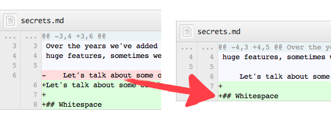](https://camo.githubusercontent.com/797184940defadec00393e6559b835358a863eeb/68747470733a2f2f6769746875622d696d616765732e73332e616d617a6f6e6177732e636f6d2f626c6f672f323031312f736563726574732f776869746573706163652e706e67)

[*Read more about GitHub secrets.*](https://github.com/blog/967-github-secrets)

### Adjust Tab Space

Adding `?ts=4` to a diff or file URL will display tab characters as 4 spaces wide instead of the default 8. The number after `ts` can be adjusted to suit your preference. This does not work on Gists, or raw file views, but a [Chrome](https://chrome.google.com/webstore/detail/github-tab-size/ofjbgncegkdemndciafljngjbdpfmbkn) or [Opera extension](https://addons.opera.com/en/extensions/details/github-tab-size/) can automate this.

Here is a Go source file before adding `?ts=4`:

[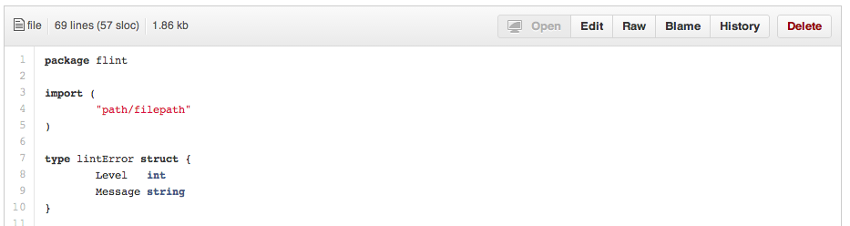](https://camo.githubusercontent.com/b52541f4421a753d80462f3ca35ab8cd0b2d2814/687474703a2f2f692e696d6775722e636f6d2f474954314672302e706e67)

...and this is after adding `?ts=4`:

[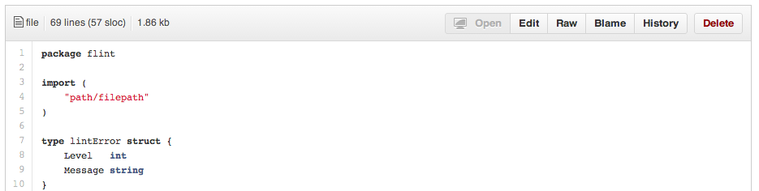](https://camo.githubusercontent.com/fe1043f0996f491d6eea37ef068535f087e00c83/687474703a2f2f692e696d6775722e636f6d2f3730464c3448392e706e67)

### Commit History by Author

To view all commits on a repo by author add `?author={user}` to the URL.

```
https://github.com/rails/rails/commits/master?author=dhh
```

[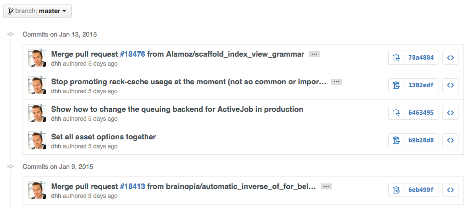](https://camo.githubusercontent.com/d4af886fa80d5b63d1884338a8566ad009a1021d/687474703a2f2f692e696d6775722e636f6d2f533741453239622e706e67)

[*Read more about the differences between commits views.*](https://help.github.com/articles/differences-between-commit-views)

### Cloning a Repository

When cloning a repository the `.git` can be left off the end.

```
$ git clone https://github.com/tiimgreen/github-cheat-sheet
```

[*Read more about the Git `clone` command.*](http://git-scm.com/docs/git-clone)

### Branch

#### Compare all Branches to Another Branch

If you go to the repo's [Branches](https://github.com/tiimgreen/github-cheat-sheet/branches) page, next to the Commits button:

```
https://github.com/{user}/{repo}/branches
```

... you would see a list of all branches which are not merged into the main branch.

From here you can access the compare page or delete a branch with a click of a button.

[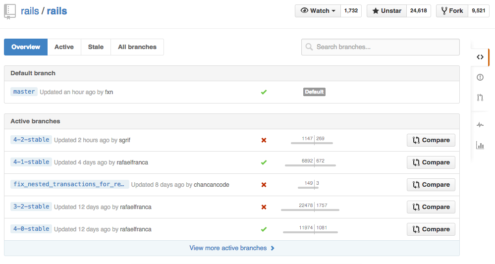](https://camo.githubusercontent.com/ae7a4633f0d28244736c6d85c1a86709b6df2166/687474703a2f2f692e696d6775722e636f6d2f3046456533307a2e706e67)

#### Comparing Branches

To use GitHub to compare branches, change the URL to look like this:

```
https://github.com/{user}/{repo}/compare/{range}
```

Where `{range} = master...4-1-stable`

For example:

```
https://github.com/rails/rails/compare/master...4-1-stable
```

[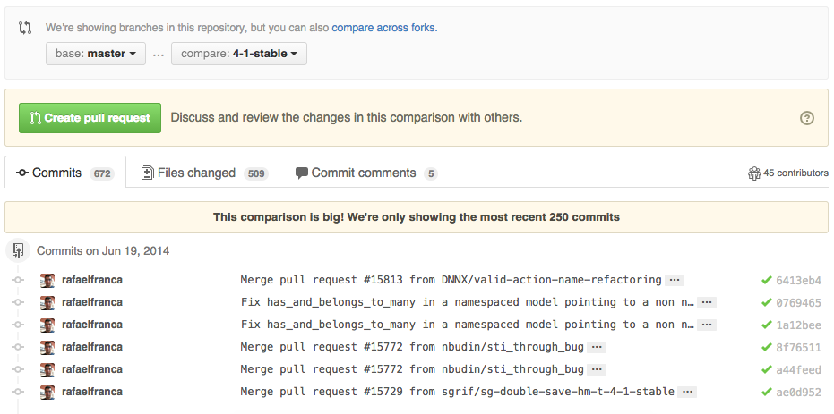](https://camo.githubusercontent.com/66b48236ec6fdc4f1112da35764d3d89939fa0a2/687474703a2f2f692e696d6775722e636f6d2f744952434f734b2e706e67)

`{range}` can be changed to things like:

```
https://github.com/rails/rails/compare/master@{1.day.ago}...master
https://github.com/rails/rails/compare/master@{2014-10-04}...master
```

*Dates are in the format `YYYY-DD-MM`*

[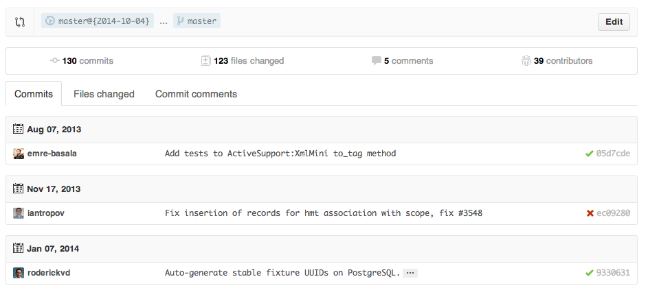](https://camo.githubusercontent.com/e9d634ff7da136f67279a183f3e73baafec61ef8/687474703a2f2f692e696d6775722e636f6d2f3564747a45537a2e706e67)

Branches can also be compared in `diff` and `patch` views:

```
https://github.com/rails/rails/compare/master...4-1-stable.diff
https://github.com/rails/rails/compare/master...4-1-stable.patch
```

[*Read more about comparing commits across time.*](https://help.github.com/articles/comparing-commits-across-time)

#### Compare Branches across Forked Repositories

To use GitHub to compare branches across forked repositories, change the URL to look like this:

```
https://github.com/{user}/{repo}/compare/{foreign-user}:{branch}...{own-branch}
```

For example:

```
https://github.com/rails/rails/compare/byroot:master...master
```

[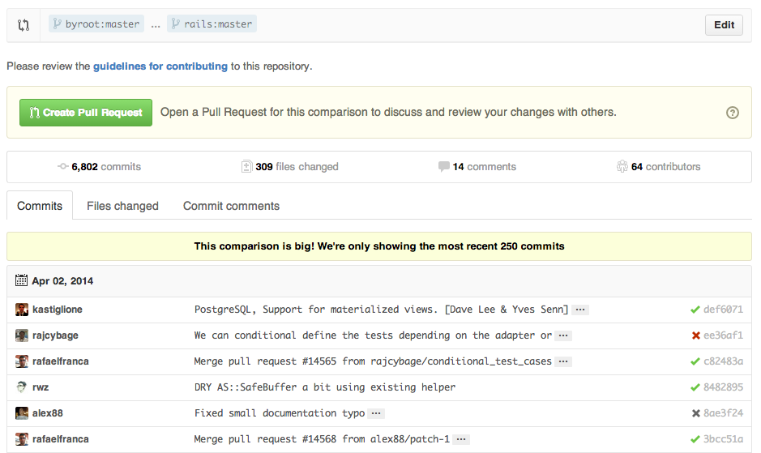](https://camo.githubusercontent.com/19e6a90dd1814243b90871fafb98a8b60a923ec9/687474703a2f2f692e696d6775722e636f6d2f513157367163422e706e67)

### Gists

[Gists](https://gist.github.com/) are an easy way to work with small bits of code without creating a fully fledged repository.

[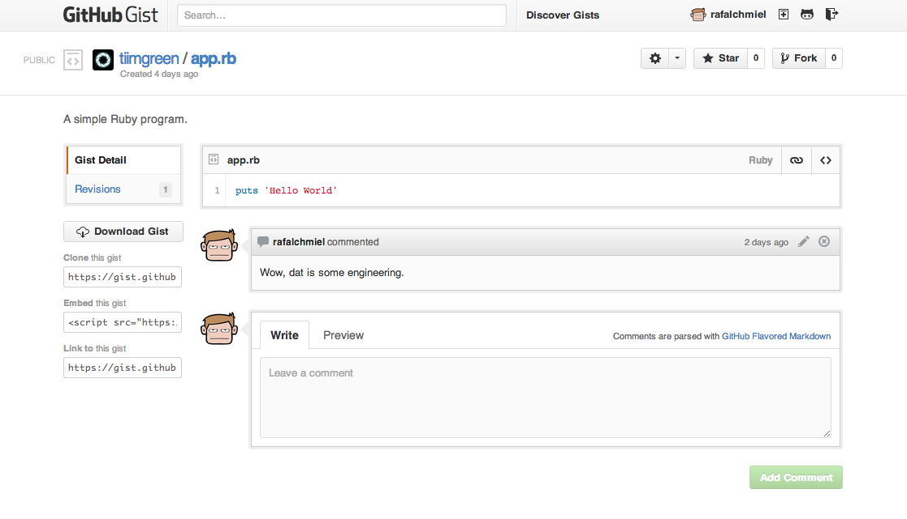](https://camo.githubusercontent.com/2577712c9a05afec55930e914c38aed69f85c221/687474703a2f2f692e696d6775722e636f6d2f566b4b49314c432e706e673f31)

Add `.pibb` to the end of any Gist URL ([like this](https://gist.github.com/tiimgreen/10545817.pibb)) in order to get the *HTML only* version suitable for embedding in any other site.

Gists can be treated as a repository so they can be cloned like any other:

```
$ git clone https://gist.github.com/tiimgreen/10545817
```

[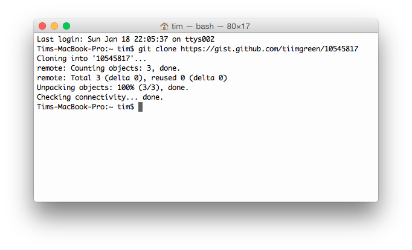](https://camo.githubusercontent.com/6f44827b994777e311cb4d4e0b1163adaaa5f190/687474703a2f2f692e696d6775722e636f6d2f4263467a6162702e706e67)

This means you also can modify and push updates to Gists:

```
$ git commit
$ git push
Username  'https://gist.github.com
Password for https://tiimgreen@gist.github.com
```

However, Gists do not support directories. All files need to be added to the repository root.  
[*Read more about creating Gists.*](https://help.github.com/articles/creating-gists)

### Git.io

[Git.io](http://git.io/) is a simple URL shortener for GitHub.

[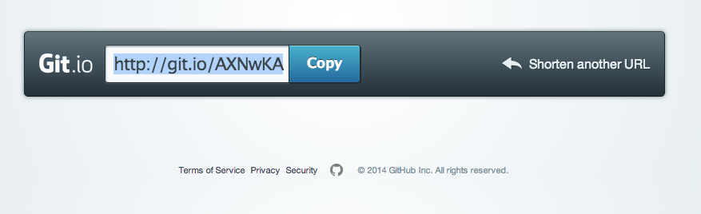](https://camo.githubusercontent.com/44e4c7861337bea3d61eac724c9bfac446fb5d37/687474703a2f2f692e696d6775722e636f6d2f364a55666263472e706e673f31)

You can also use it via pure HTTP using Curl:

```
$ curl -i http://git.io -F url=https://github.com/...
HTTP/1.1 201 Created
Location: http://git.io/abc123

$ curl -i http://git.io/abc123
HTTP/1.1 302 Found
Location: https://github.com/...
```

[*Read more about Git.io.*](https://github.com/blog/985-git-io-github-url-shortener)

### Keyboard Shortcuts

When on a repository page, keyboard shortcuts allow you to navigate easily.

- Pressing `t` will bring up a file explorer.
- Pressing `w` will bring up the branch selector.
- Pressing `s` will focus the search field for the current repository. Pressing Backspace to delete the “This repository” pill changes the field to search all of GitHub.
- Pressing `l` will edit labels on existing Issues.
- Pressing `y` **when looking at a file** (e.g. `https://github.com/tiimgreen/github-cheat-sheet/blob/master/README.md`) will change your URL to one which, in effect, freezes the page you are looking at. If this code changes, you will still be able to see what you saw at that current time.

To see all of the shortcuts for the current page press `?`:

[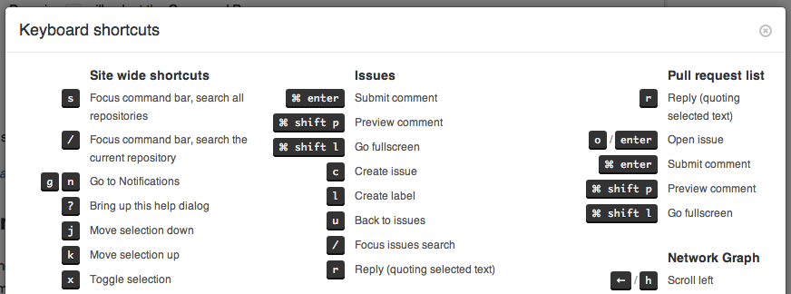](https://camo.githubusercontent.com/e8444fa30f6994ed634c623d7ac7b30dc82fb46c/687474703a2f2f692e696d6775722e636f6d2f79355a664e456d2e706e67)

[Read more about search syntax you can use.](https://help.github.com/articles/search-syntax/)

### Line Highlighting in Repositories

Either adding `#L52` to the end of a code file URL or simply clicking the line number will highlight that line number.

It also works with ranges, e.g. `#L53-L60`, to select ranges, hold `shift` and click two lines:

```
https://github.com/rails/rails/blob/master/activemodel/lib/active_model.rb#L53-L60
```

[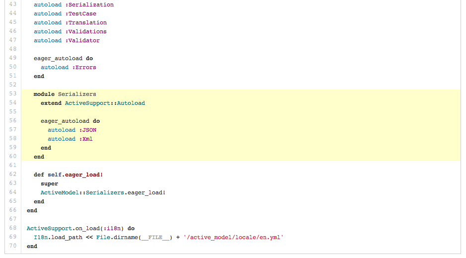](https://camo.githubusercontent.com/da8b01ee726d25c787bcc5791ef1ba0d92ce4d7d/687474703a2f2f692e696d6775722e636f6d2f3841686a72437a2e706e67)

### Closing Issues via Commit Messages

If a particular commit fixes an issue, any of the keywords `fix/fixes/fixed`, `close/closes/closed` or `resolve/resolves/resolved`, followed by the issue number, will close the issue once it is committed to the master branch.

```
$ git commit -m Fix screwup, fixes #12
```

This closes the issue and references the closing commit.

[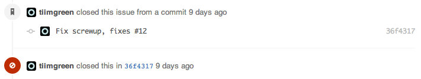](https://camo.githubusercontent.com/ade6142e7353dabecc199411dec63973eb6fa5df/687474703a2f2f692e696d6775722e636f6d2f556831675a64782e706e67)

[*Read more about closing Issues via commit messages.*](https://help.github.com/articles/closing-issues-via-commit-messages)

### Cross-Link Issues

If you want to link to another issue in the same repository, simply type hash `#` then the issue number, and it will be auto-linked.

To link to an issue in another repository, `{user}/{repo}#ISSUE_NUMBER` e.g. `tiimgreen/toc#12`.

[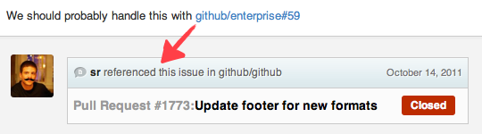](https://camo.githubusercontent.com/447e39ab8d96b553cadc8d31799100190df230a8/68747470733a2f2f6769746875622d696d616765732e73332e616d617a6f6e6177732e636f6d2f626c6f672f323031312f736563726574732f7265666572656e6365732e706e67)

### Locking Conversations

Pull Requests and Issues can now be locked by owners or collaborators of the repo.

[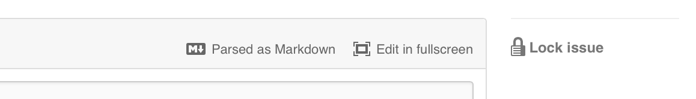](https://cloud.githubusercontent.com/assets/2723/3221693/bf54dd44-f00d-11e3-8eb6-bb51e825bc2c.png)

This means that users who are not collaborators on the project will no longer be able to comment.

[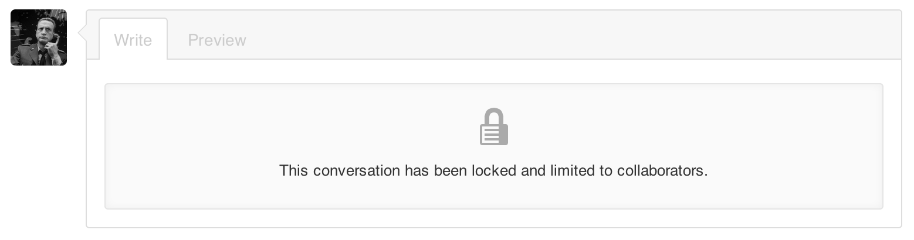](https://cloud.githubusercontent.com/assets/2723/3221775/d6e513b0-f00e-11e3-9721-2131cb37c906.png)

[*Read more about locking conversations.*](https://github.com/blog/1847-locking-conversations)

### CI Status on Pull Requests

If set up correctly, every time you receive a Pull Request, [Travis CI](https://travis-ci.org/) will build that Pull Request just like it would every time you make a new commit. Read more about how to [get started with Travis CI](http://docs.travis-ci.com/user/getting-started/).

[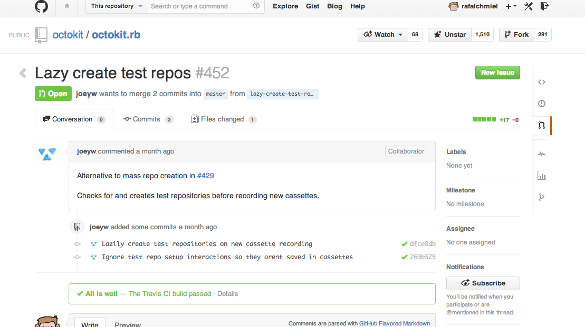](https://github.com/octokit/octokit.rb/pull/452)

[*Read more about the commit status API.*](https://github.com/blog/1227-commit-status-api)

### Syntax Highlighting in Markdown Files

For example, to syntax highlight Ruby code in your Markdown files write:

```
```ruby
require 'tabbit'
table = Tabbit.new('Name', 'Email')
table.add_row('Tim Green', 'tiimgreen@gmail.com')
puts table.to_s
```
```

This will produce:

```
require tabbit
table  Tabbit.(, Email)
table.add_row(Tim Green, tiimgreen@gmail.com)
puts table.to_s
```

GitHub uses [Linguist](https://github.com/github/linguist) to perform language detection and syntax highlighting. You can find out which keywords are valid by perusing the [languages YAML file](https://github.com/github/linguist/blob/master/lib/linguist/languages.yml).

[*Read more about GitHub Flavored Markdown.*](https://help.github.com/articles/github-flavored-markdown)

### Emojis

Emojis can be added to Pull Requests, Issues, commit messages, etc. using `:name_of_emoji:`

The full list of supported Emojis on GitHub can be found at [emoji-cheat-sheet.com](http://www.emoji-cheat-sheet.com/) or [scotch-io/All-Github-Emoji-Icons](https://github.com/scotch-io/All-Github-Emoji-Icons).

The top 5 used Emojis on GitHub are:

1. `:shipit:`
2. `:sparkles:`
3. `:-1:`
4. `:+1:`
5. `:clap:`

### Images/GIFs

Images and GIFs can be added to comments, READMEs etc.:

```

```

Raw images from the repo can be used by calling them directly.:

```

```

[](https://camo.githubusercontent.com/fca1eaa46baa3573f6e2d993f6fe1f95a6329ae9/687474703a2f2f7777772e73686561776f6e672e636f6d2f77702d636f6e74656e742f75706c6f6164732f323031332f30382f6b656570686174696e2e676966)

All images are cached on GitHub, so if your host goes down, the image will remain available.

#### Embedding Images in GitHub Wiki

There are multiple ways of embedding images in Wiki pages. There's the standard Markdown syntax (shown above). But there's also a syntax that allows things like specifying the height or width of the image:

```
[[ http://www.sheawong.com/wp-content/uploads/2013/08/keephatin.gif | height = 100px ]]
```

Which produces:

[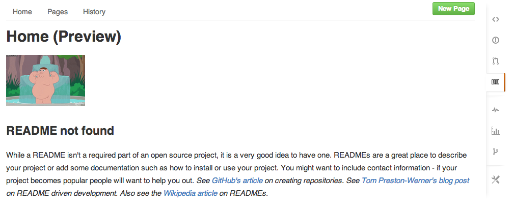](https://camo.githubusercontent.com/cf2e557009192c63d6accbdf14bcf4b78e9ed97b/687474703a2f2f692e696d6775722e636f6d2f4a35624d6637532e706e67)

### Quick Quoting

When on a comment thread and you want to quote something someone previously said, highlight the text and press `r`, this will copy it into your text box in the block-quote format.

[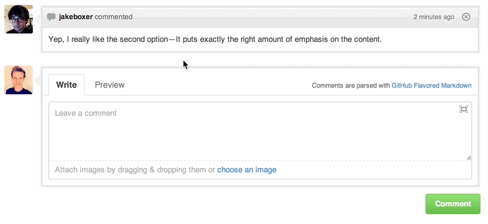](https://camo.githubusercontent.com/df4de1519cc0c3cc4d394f309f1d5c7c92297e03/68747470733a2f2f662e636c6f75642e6769746875622e636f6d2f6173736574732f3239363433322f3132343438332f62306661363230342d366566302d313165322d383363332d3235366333376661376162632e676966)

[*Read more about quick quoting.*](https://github.com/blog/1399-quick-quotes)

### Pasting Clipboard Image to Comments

*(Works on Chrome browsers only)*

After taking a screenshot and adding it to the clipboard (mac: `cmd-ctrl-shift-4`), you can simply paste (`cmd-v / ctrl-v`) the image into the comment section and it will be auto-uploaded to github.

[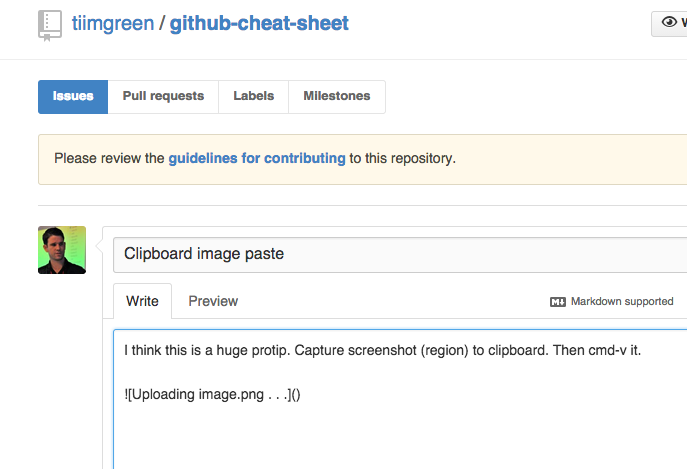](https://cloud.githubusercontent.com/assets/39191/5794265/39c9b65a-9f1b-11e4-9bc7-04e41f59ea5f.png)

[*Read more about issue attachments.*](https://help.github.com/articles/issue-attachments)

### Quick Licensing

When creating a repository, GitHub gives you the option of adding in a pre-made license:

[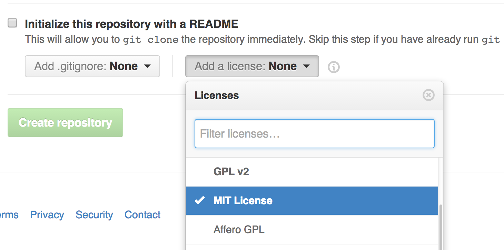](https://camo.githubusercontent.com/a3b95ac4cfc8bec5d4fdc007fe5b12655a3f25a5/687474703a2f2f692e696d6775722e636f6d2f4368716a3446672e706e67)

You can also add them to existing repositories by creating a new file through the web interface. When the name `LICENSE` is typed in you will get an option to use a template:

[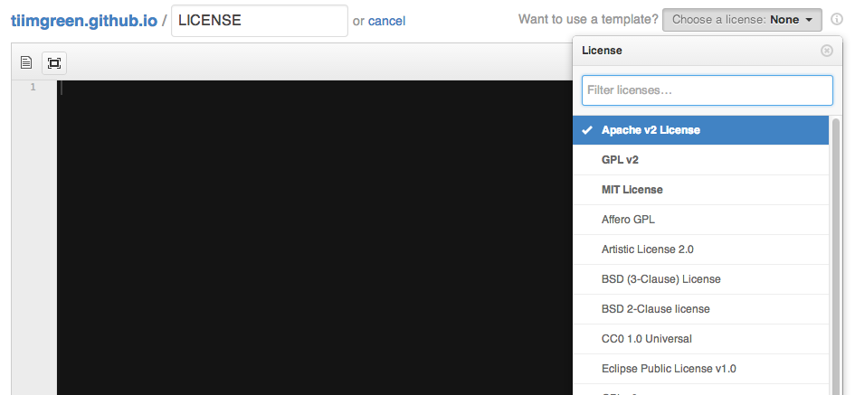](https://camo.githubusercontent.com/74e0a5fea1880745908b53ff06536fd721908a86/687474703a2f2f692e696d6775722e636f6d2f66546a516963742e706e67)

Also works for `.gitignore`.

[*Read more about open source licensing.*](https://help.github.com/articles/open-source-licensing)

### Task Lists

In Issues and Pull requests check boxes can be added with the following syntax (notice the space):

```
- [ ] Be awesome
- [ ] Prepare dinner
  - [ ] Research recipe
  - [ ] Buy ingredients
  - [ ] Cook recipe
- [ ] Sleep
```

[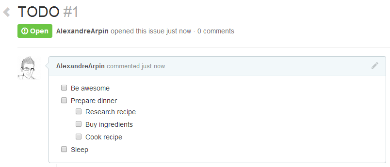](https://camo.githubusercontent.com/e0ca04595f493cd02e6da43402b028cbaf631fae/687474703a2f2f692e696d6775722e636f6d2f6a4a42586873592e706e67)

When they are clicked, they will be updated in the pure Markdown:

```
- [x] Be awesome
- [ ] Prepare dinner
  - [x] Research recipe
  - [x] Buy ingredients
  - [ ] Cook recipe
- [ ] Sleep
```

[*Read more about task lists.*](https://help.github.com/articles/writing-on-github#task-lists)

#### Task Lists in Markdown Documents

In full Markdown documents **read-only** checklists can now be added using the following syntax:

```
- [ ] Mercury
- [x] Venus
- [x] Earth
  - [x] Moon
- [x] Mars
  - [ ] Deimos
  - [ ] Phobos
```

- Mercury
- Venus
- Earth
- Mars
  - Deimos
  - Phobos

[*Read more about task lists in markdown documents.*](https://github.com/blog/1825-task-lists-in-all-markdown-documents)

### Relative Links

Relative links are recommended in your Markdown files when linking to internal content.

```
[Link to a header](#awesome-section)
[Link to a file](docs/readme)
```

Absolute links have to be updated whenever the URL changes (e.g. repository renamed, username changed, project forked). Using relative links makes your documentation easily stand on its own.

[*Read more about relative links.*](https://help.github.com/articles/relative-links-in-readmes)

### Metadata and Plugin Support for GitHub Pages

Within Jekyll pages and posts, repository information is available within the `site.github` namespace, and can be displayed, for example, using `{{ site.github.project_title }}`.

The Jemoji and jekyll-mentions plugins enable [emoji](https://github.com/tiimgreen/github-cheat-sheet#emojis) and [@mentions](https://github.com/blog/821) in your Jekyll posts and pages to work just like you'd expect when interacting with a repository on GitHub.com.

[*Read more about repository metadata and plugin support for GitHub Pages.*](https://github.com/blog/1797-repository-metadata-and-plugin-support-for-github-pages)

### Viewing YAML Metadata in your Documents

Many blogging websites, like [Jekyll](http://jekyllrb.com/) with [GitHub Pages](http://pages.github.com/), depend on some YAML-formatted metadata at the beginning of your post. GitHub will render this metadata as a horizontal table, for easier reading

[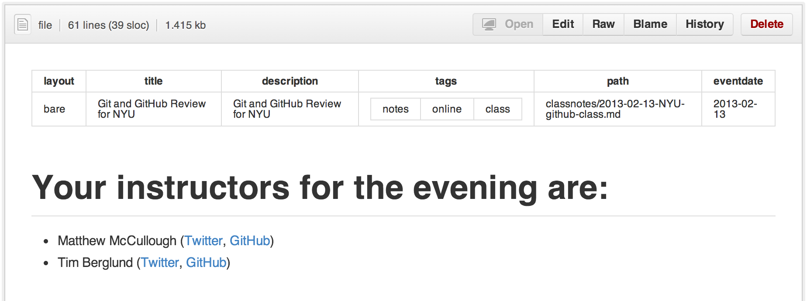](https://camo.githubusercontent.com/47245aa16728e242f74a9a324ce0d24c0b916075/68747470733a2f2f662e636c6f75642e6769746875622e636f6d2f6173736574732f36343035302f313232383236372f65303439643063362d323761302d313165332d396464382d6131636432323539393334342e706e67)

[*Read more about viewing YAML metadata in your documents.*](https://github.com/blog/1647-viewing-yaml-metadata-in-your-documents)

### Rendering Tabular Data

GitHub supports rendering tabular data in the form of `.csv` (comma-separated) and `.tsv` (tab-separated) files.

[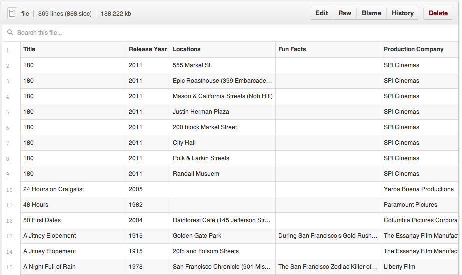](https://camo.githubusercontent.com/1b6dd0157ffb45d9939abf14233a0cb13b3b4dfe/68747470733a2f2f662e636c6f75642e6769746875622e636f6d2f6173736574732f3238323735392f3937363436322f33323038336463652d303638642d313165332d393262322d3566323863313061353035392e706e67)

[*Read more about rendering tabular data.*](https://github.com/blog/1601-see-your-csvs)

### Revert a Pull Request

After a pull request is merged, you may find it does not help anything or it was a bad decision to merge the pull request.

You can revert it by clicking the **Revert** button on the right side of a commit in the pull request page to create a pull request with reverted changes to this specific pull request.

[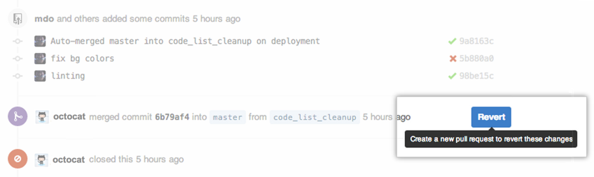](https://camo.githubusercontent.com/0d3350caf2bb1cba53123ffeafc00ca702b1b164/68747470733a2f2f6769746875622d696d616765732e73332e616d617a6f6e6177732e636f6d2f68656c702f70756c6c5f72657175657374732f7265766572742d70756c6c2d726571756573742d6c696e6b2e706e67)

[*Read more about reverting pull requests*](https://github.com/blog/1857-introducing-the-revert-button)

### Diffs

#### Rendered Prose Diffs

Commits and pull requests, including rendered documents supported by GitHub (e.g. Markdown), feature *source* and *rendered* views.

[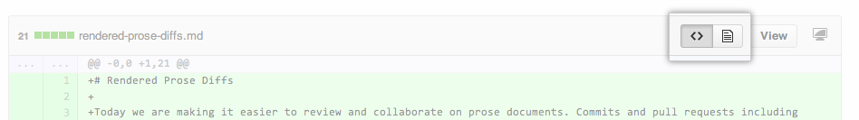](https://camo.githubusercontent.com/d13da922ee5d1185db29b193d454f5b397a8da89/68747470733a2f2f6769746875622d696d616765732e73332e616d617a6f6e6177732e636f6d2f68656c702f7265706f7369746f72792f72656e64657265645f70726f73655f646966662e706e67)

Click the "rendered" button to see the changes as they'll appear in the rendered document. Rendered prose view is handy when you're adding, removing, and editing text:

[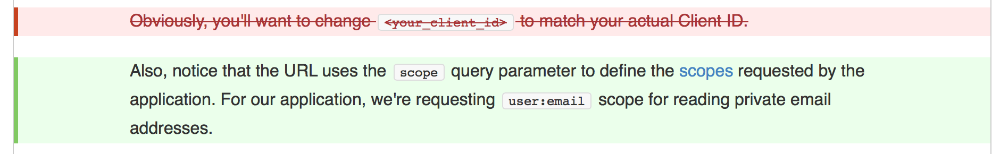](https://camo.githubusercontent.com/1c4a52738b52038653e37bb1e51d0dcf7dd3cc18/68747470733a2f2f662e636c6f75642e6769746875622e636f6d2f6173736574732f31373731352f323030333035362f33393937656462342d383632622d313165332d393062652d3565393538366564656364372e706e67)

[*Read more about rendered prose diffs.*](https://github.com/blog/1784-rendered-prose-diffs)

#### Diffable Maps

Any time you view a commit or pull request on GitHub that includes geodata, GitHub will render a visual representation of what was changed.

[](https://github.com/benbalter/congressional-districts/commit/2233c76ca5bb059582d796f053775d8859198ec5)

[*Read more about diffable maps.*](https://github.com/blog/1772-diffable-more-customizable-maps)

#### Expanding Context in Diffs

Using the *unfold* button in the gutter of a diff, you can reveal additional lines of context with a click. You can keep clicking *unfold* until you've revealed the whole file, and the feature is available anywhere GitHub renders diffs.

[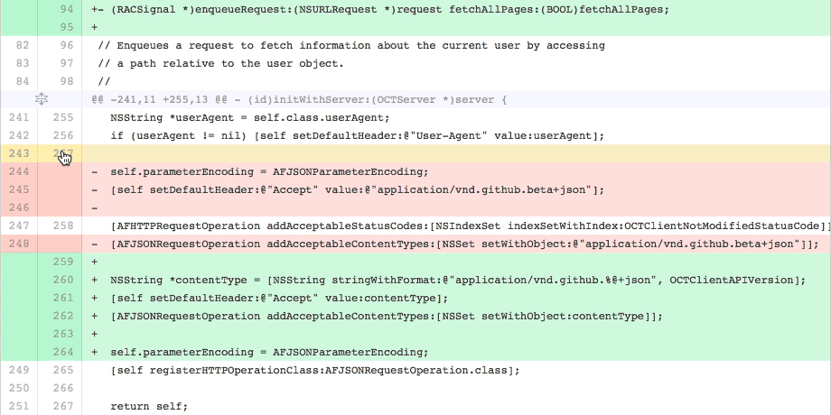](https://camo.githubusercontent.com/0e02bc17ce408657ba14c164b9f9edac432685a4/68747470733a2f2f662e636c6f75642e6769746875622e636f6d2f6173736574732f32323633352f313631303533392f38363363316636342d353538342d313165332d383262662d3135316234303661323732662e676966)

[*Read more about expanding context in diffs.*](https://github.com/blog/1705-expanding-context-in-diffs)

#### Diff or Patch of Pull Request

You can get the diff of a Pull Request by adding a `.diff` or `.patch`
extension to the end of the URL. For example:

```
https://github.com/tiimgreen/github-cheat-sheet/pull/15
https://github.com/tiimgreen/github-cheat-sheet/pull/15.diff
https://github.com/tiimgreen/github-cheat-sheet/pull/15.patch
```

The `.diff` extension would give you this in plain text:

```
diff --git a/README.md b/README.md
index 88fcf69..8614873 100644
--- a/README.md
+++ b/README.md
@@ -28,6 +28,7 @@ All the hidden and not hidden features of Git and GitHub. This cheat sheet was i
 - [Merged Branches](#merged-branches)
 - [Quick Licensing](#quick-licensing)
 - [TODO Lists](#todo-lists)
+- [Relative Links](#relative-links)
 - [.gitconfig Recommendations](#gitconfig-recommendations)
     - [Aliases](#aliases)
     - [Auto-correct](#auto-correct)
@@ -381,6 +382,19 @@ When they are clicked, they will be updated in the pure Markdown:
 - [ ] Sleep

(...)
```

#### Rendering and diffing images

GitHub can display several common image formats, including PNG, JPG, GIF, and PSD. In addition, there are several ways to compare differences between versions of those image formats.

[](https://github.com/blog/1845-psd-viewing-diffing)

[*Read more about rendering and diffing images.*](https://help.github.com/articles/rendering-and-diffing-images)

[Hub](https://github.com/github/hub) is a command line Git wrapper that gives you extra features and commands that make working with GitHub easier.

This allows you to do things like:

```
$ hub clone tiimgreen/toc
```

[*Check out some more cool commands Hub has to offer.*](https://github.com/github/hub#commands)

### Contributing Guidelines

Adding a `CONTRIBUTING` file to the root of your repository will add a link to your file when a contributor creates an Issue or opens a Pull Request.

[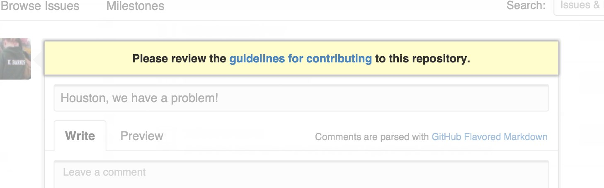](https://camo.githubusercontent.com/71995d6b0e620a9ef1ded00a04498241c69dd1bf/68747470733a2f2f6769746875622d696d616765732e73332e616d617a6f6e6177732e636f6d2f736b697463682f6973737565732d32303132303931332d3136323533392e6a7067)

[*Read more about contributing guidelines.*](https://github.com/blog/1184-contributing-guidelines)

### Octicons

GitHubs icons (Octicons) have now been open sourced.

[](https://camo.githubusercontent.com/2f4f450830accbd44062add083885eadc0f791c7/68747470733a2f2f6f672e6769746875622e636f6d2f6f637469636f6e732f6f637469636f6e734031323030783633302e706e67)

[*Read more about GitHub's Octicons*](https://octicons.github.com/)

### GitHub Resources

#### GitHub Talks

### Previous Branch

To move to the previous branch in Git:

```
$ git checkout -
# Switched to branch 'master'

$ git checkout -
# Switched to branch 'next'

$ git checkout -
# Switched to branch 'master'
```

[*Read more about Git branching.*](http://git-scm.com/book/en/Git-Branching-Basic-Branching-and-Merging)

### Stripspace

Git Stripspace:

- Strips trailing whitespace
- Collapses newlines
- Adds newline to end of file

A file must be passed when calling the command, e.g.:

```
$ git stripspace  README.md
```

[*Read more about the Git `stripspace` command.*](http://git-scm.com/docs/git-stripspace)

### Checking out Pull Requests

Pull Requests are special branches on the GitHub repository which can be retrieved locally in several ways:

Retrieve a specific Pull Request and store it temporarily in `FETCH_HEAD` for quickly `diff`ing or `merge`ing:

```
$ git fetch origin refs/pull/[PR-Number]/head
```

Acquire all Pull Request branches as local remote branches by refspec:

```
$ git fetch origin +refs/pull/*/head:refs/remotes/origin/pr/*
```

Or setup the remote to fetch Pull Requests automatically by adding these corresponding lines in your repository's `.git/config`:

```
[remote "origin"]
    fetch = +refs/heads/*:refs/remotes/origin/*
    url = git@github.com:tiimgreen/github-cheat-sheet.git
```

```
[remote "origin"]
    fetch = +refs/heads/*:refs/remotes/origin/*
    url = git@github.com:tiimgreen/github-cheat-sheet.git
    fetch = +refs/pull/*/head:refs/remotes/origin/pr/*
```

For Fork-based Pull Request contributions, it's useful to `checkout` a remote branch representing the Pull Request and create a local branch from it:

```
$ git checkout pr/42 pr-42
```

Or should you work on more repositories, you can globally configure fetching pull requests in the global git config instead.

```
git config --global --add remote.origin.fetch +refs/pull/*/head:refs/remotes/origin/pr/*
```

This way, you can use the following short commands in all your repositories:

```
git fetch origin
```

```
git checkout pr/42
```

[*Read more about checking out pull requests locally.*](https://help.github.com/articles/checking-out-pull-requests-locally)

### Empty Commits :trollface:

Commits can be pushed with no code changes by adding `--allow-empty`:

```
$ git commit -m Big-ass commit --allow-empty
```

Some use-cases for this (that make sense), include:

- Annotating the start of a new bulk of work or a new feature.
- Documenting when you make changes to the project that aren't code related.
- Communicating with people using your repository.
- The first commit of a repo, as the first commit cannot be rebased later: `git commit -m "init repo" --allow-empty`.

[](https://camo.githubusercontent.com/297489aac74b746ac60488788ae4957a453935df/687474703a2f2f692e6d696e75732e636f6d2f696c316a61772e676966)

### Styled Git Status

Running:

```
$ git status
```

Produces:

[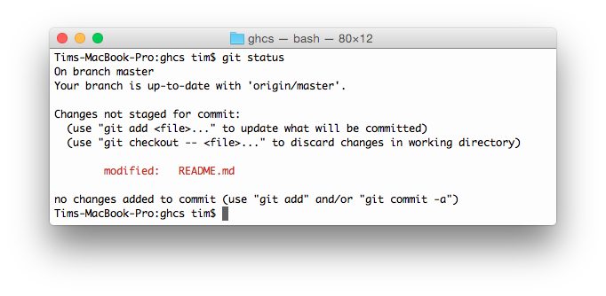](https://camo.githubusercontent.com/8318c88e25e3d6c1eb2a9ba73b8c508447fea00e/687474703a2f2f692e696d6775722e636f6d2f716a50797658622e706e67)

By adding `-sb`:

```
$ git status -sb
```

This is produced:

[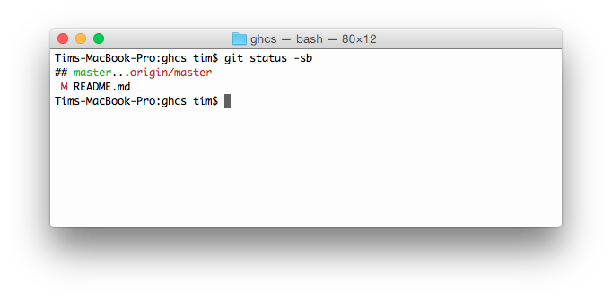](https://camo.githubusercontent.com/a2d692c06a0d296cbf8258d546f996e47fd13229/687474703a2f2f692e696d6775722e636f6d2f4b304f59336e6d2e706e67)

[*Read more about the Git `status` command.*](http://git-scm.com/docs/git-status)

### Styled Git Log

Running:

```
$ git log --all --graph --pretty=format:%Cred%h%Creset -%C(auto)%d%Creset %s %Cgreen(%cr) %C(bold blue)<%an>%Creset --abbrev-commit --date=relative
```

Produces:

[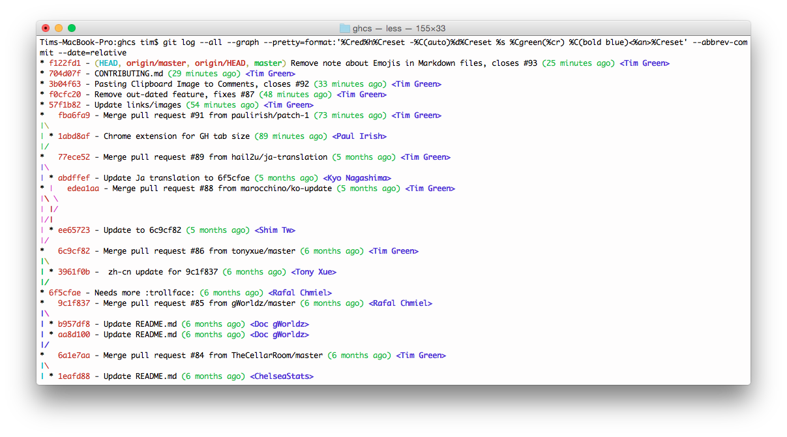](https://camo.githubusercontent.com/a698d31838cd57e7910c8b2922b7c9aae261b152/687474703a2f2f692e696d6775722e636f6d2f3538654f746b572e706e67)

Credit to [Palesz](http://stackoverflow.com/users/88355/palesz)

*This can be aliased using the instructions found [here](https://github.com/tiimgreen/github-cheat-sheet#aliases).*

[*Read more about the Git `log` command.*](http://git-scm.com/docs/git-log)

### Git Query

A Git query allows you to search all your previous commit messages and find the most recent one matching the query.

```
$ git show :/query
```

Where `query` (case-sensitive) is the term you want to search, this then finds the last one and gives details on the lines that were changed.

```
$ git show :/typo
```

[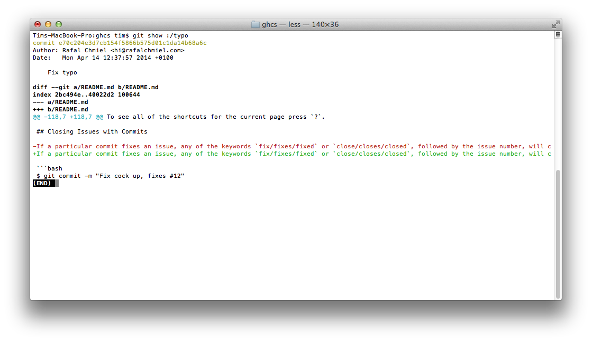](https://camo.githubusercontent.com/dd367971caed2480a98cab383b542cd9f36aca0c/687474703a2f2f692e696d6775722e636f6d2f69636147694e742e706e67)

*Press `q` to quit.*

### Merged Branches

Running:

```
$ git branch --merged
```

Will give you a list of all branches that have been merged into your current branch.

Conversely:

```
$ git branch --no-merged
```

Will give you a list of branches that have not been merged into your current branch.

[*Read more about the Git `branch` command.*](http://git-scm.com/docs/git-branch)

### Fixup and Autosquash

If there is something wrong with a previous commit (can be one or more from HEAD), for example `abcde`, run the following command after you've amended the problem:

```
$ git commit --fixup=abcde
$ git rebase abcde^ --autosquash -i
```

[*Read more about the Git `commit` command.*](http://git-scm.com/docs/git-commit)
[*Read more about the Git `rebase` command.*](http://git-scm.com/docs/git-rebase)

### Web Server for Browsing Local Repositories

Use the Git `instaweb` command to instantly browse your working repository in `gitweb`. This command is a simple script to set up `gitweb` and a web server for browsing the local repository.

```
$ git instaweb
```

Opens:

[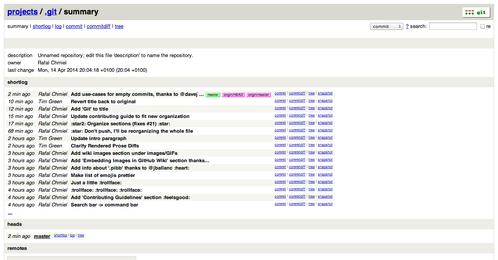](https://camo.githubusercontent.com/96e740c09fa676f180273cb52fd9bfc2df1f77e6/687474703a2f2f692e696d6775722e636f6d2f4478656b6d71632e706e67)

[*Read more about the Git `instaweb` command.*](http://git-scm.com/docs/git-instaweb)

### Git Configurations

Your `.gitconfig` file contains all your Git configurations.

#### Aliases

Aliases are helpers that let you define your own git calls. For example you could set `git a` to run `git add --all`.

To add an alias, either navigate to `~/.gitconfig` and fill it out in the following format:

```
[alias]
  co = checkout
  cm = commit
  p = push
  # Show verbose output about tags, branches or remotes
  tags = tag -l
  branches = branch -a
  remotes = remote -v
```

...or type in the command-line:

```
$ git config --global alias.new_alias git_function
```

For example:

```
$ git config --global alias.cm commit
```

For an alias with multiple functions use quotes:

```
$ git config --global alias.ac add -A . && commit
```

Some useful aliases include:

| Alias | Command | What to Type |
| --- | --- | --- |
| `git cm` | `git commit` | `git config --global alias.cm commit` |
| `git co` | `git checkout` | `git config --global alias.co checkout` |
| `git ac` | `git add . -A` `git commit` | `git config --global alias.ac '!git add -A && git commit'` |
| `git st` | `git status -sb` | `git config --global alias.st 'status -sb'` |
| `git tags` | `git tag -l` | `git config --global alias.tags 'tag -l'` |
| `git branches` | `git branch -a` | `git config --global alias.branches 'branch -a'` |
| `git cleanup` | `git branch --merged | grep -v '*' | xargs git branch -d` | `git config --global alias.cleanup "!git branch --merged | grep -v '*' | xargs git branch -d"` |
| `git remotes` | `git remote -v` | `git config --global alias.remotes 'remote -v'` |
| `git lg` | `git log --color --graph --pretty=format:'%Cred%h%Creset -%C(yellow)%d%Creset %s %Cgreen(%cr) %C(bold blue)<%an>%Creset' --abbrev-commit --` | `git config --global alias.lg "log --color --graph --pretty=format:'%Cred%h%Creset -%C(yellow)%d%Creset %s %Cgreen(%cr) %C(bold blue)<%an>%Creset' --abbrev-commit --"` |

*Some Aliases are taken from [@mathiasbynens](https://github.com/mathiasbynens) dotfiles: <https://github.com/mathiasbynens/dotfiles/blob/master/.gitconfig>*

#### Auto-Correct

If you type `git comit` you will get this:

```
$ git comit -m Message
# git: 'comit' is not a git command. See 'git --help'.

# Did you mean this?
#   commit
```

To call `commit` when `comit` is typed, just enable auto-correct:

```
$ git config --global .autocorrect 1
```

So now you will get this:

```
$ git comit -m Message
# WARNING: You called a Git command named 'comit', which does not exist.
# Continuing under the assumption that you meant 'commit'
# in 0.1 seconds automatically...
```

#### Color

To add more color to your Git output:

```
$ git config --global color.ui 1
```

[*Read more about the Git `config` command.*](http://git-scm.com/docs/git-config)

### Git Resources

#### Git Books
