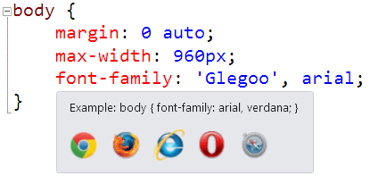

# [Scott Hanselman's 2014 Ultimate Developer and Power Users Tool List for Windows](http://www.hanselman.com/blog/ScottHanselmans2014UltimateDeveloperAndPowerUsersToolListForWindows.aspx)

[Comments [196]](http://www.hanselman.com/blog/CommentView.aspx?guid=52a5e5bb-48df-46c6-9989-48f1eefe57c4#commentstart)
Posted in [Tools](http://www.hanselman.com/blog/CategoryView.aspx?category=Tools)

Sponsored By

Everyone collects utilities, and most folks have a list of a few that they feel are indispensable.  Here's mine.  Each has a distinct purpose, and I probably touch each at least a few times a week.  For me, "util" means utilitarian and it means don't clutter my tray.  If it saves me time, and seamlessly integrates with my life, it's the bomb. Many/most are free some aren't. Those that aren't free are very likely worth your 30-day trial, and very likely worth your money.

This is the **Updated for 2014 Version** of my [2003](http://www.hanselman.com/blog/content/radiostories/2003/09/09/scottHanselmansUltimateDeveloperAndPowerUsersToolsList.html), [2005](http://www.hanselman.com/blog/ScottHanselmans2005UltimateDeveloperAndPowerUsersToolList.aspx), [2006](http://www.hanselman.com/blog/ScottHanselmans2006UltimateDeveloperAndPowerUsersToolListForWindows.aspx), [2007](http://www.hanselman.com/blog/ScottHanselmans2007UltimateDeveloperAndPowerUsersToolListForWindows.aspx), [2009](http://www.hanselman.com/blog/ScottHanselmans2009UltimateDeveloperAndPowerUsersToolListForWindows.aspx) and [2011](http://www.hanselman.com/blog/ScottHanselmans2011UltimateDeveloperAndPowerUsersToolListForWindows.aspx) List, and currently subsumes all my other lists. I’ve been doing this for a decade!

These are all well loved and oft-used utilities.  I wouldn't recommend them if I didn't use them constantly. Things on this list are here because I dig them. No one paid money to be on this list and no money is accepted to be on this list.

> **Personal Plug:** If this list is the first time you and I have met, you should [subscribe to my blog](http://feeds.hanselman.com/ScottHanselman), and check [out my podcasts](http://hanselman.com/podcasts), and [sign up for my newsletter of Wonderful Things](http://hanselman.com/newsletter).

Please Link to <http://hanselman.com/tools> when referencing the latest [Hanselman Ultimate Tools List](http://www.hanselman.com/tools). Feel free to get involved here in the comments, post corrections, or suggestions for future submissions. I very likely made mistakes, and probably forgot a few utilities that I use often. **New Entries to the 2014 Ultimate Tools are in **red**. There are dozens of additions and many updated and corrected entri****es and fixed links.**

> *NOTE: Please **don't** reproduce this in its entirety, I'd rather you link to [**http://hanselman.com/tools**](http://www.hanselman.com/tools). I appreciate your enthusiasm, but posts like this take a lot of work on my part and I'd appreciate that work staying where it is and linked to, rather than being copy/pasted around the 'net. If you're reading this content and you're not at [**http://hanselman.com**](http://hanselman.com/), perhaps you'd like to join us at [the original URL](http://www.hanselman.com/tools)?*

### THE BIG TEN LIFE AND WORK-CHANGING UTILITIES

> *"Productivity is being able to do things that you were never able to do before." - Franz Kafka*

- [**Chocolatey**](http://www.chocolatey.org/) – It’s a weird name, but it’s [apt-get for Windows and once you start using it, you’ll be hooked](http://www.hanselman.com/blog/IsTheWindowsUserReadyForAptget.aspx). I tend to use it by default, even before Googling, to install stuff. For example, just today I went 'cinst filezilla' and 'cinst winscp' and was correct on both assumptions. Consider a "favoriteutils" batch file for building new machines and you'll be off and running in no time. Even better, use...
  - [**Boxstarter**](http://boxstarter.org/) - Build on top of Chocolatey and NuGet and create complete Windows environments and push them to your machines with Gists from your friends or your own GitHub. Even deploy to remote machines or Hyper-V with 100% unattended installs.
- [**TeraCopy**](http://codesector.com/teracopy) - While I use the excellent built in copy features of Windows 8.1 the most, when I want to move a LOT of files as FAST as possible, nothing beats TeraCopy, an app that does just that - move stuff fast.
- [**NimbleText**](http://nimbletext.com/) - Regular Expressions are hard and I'm not very smart. NimbleText lets me do crazy stuff with large amounts of text without it hurting so much.
- [**GOW Gnu on Windows**](https://github.com/bmatzelle/gow) - Sometimes Cygwin is just overkill. Gow is 130 useful \*nix [command line utilities recompiled as native Win32 binaries](https://github.com/bmatzelle/gow/downloads).
- [**F.lux**](http://justgetflux.com/) - I admit, I thought this was stupid when I started using it. It took a few days, but now, given that I have 3 large monitors, I can't live without it. It slowly, imperceptibly, changes the color temperature of your monitor's color as the sky itself changes. It prevents (for me) headaches and eyestrain from running bright blue and white monitors late at night. Love it. Try it.
- [**AutoHotKey**](http://www.autohotkey.com/) - This little gem is bananas. It's a tiny, amazingly fast free open-source utility for Windows. It lets you automate everything from keystrokes to mice. Programming for non-programmers. It's a complete automation system for Windows without the frustration of VBScript. This is the Windows equivalent of AppleScript for Windows. (That's a very good thing.)
  - Make sure you get the "[AuftoCorrect for English](http://www.autohotkey.com/download/OtherDownloads.htm)" script on the Other Download page. It's got 4700 common English Misspellings. It gives you autocorrect everywhere in Windows. Every program, always. It's just the [tip of the](http://www.autohotkey.com/docs/scripts/index.htm) [iceberg](http://lifehacker.com/tag/autohotkey/).
  - Note that [Window Pad](http://www.autohotkey.com/forum/topic21703.html) - a great util on its own - is actually written in AutoHotKey. Amazing!
- [**Paint.NET**](http://www.getpaint.net/index.html)- The Paint Program that Microsoft [forgot](http://www.hanselman.com/blog/MicrosoftsPaintProgramLegacyYAMPP.aspx), written in .NET. It's 80% of Photoshop and it's free. Paint.NET is also still [actively being developed and version 4 is well on its way](http://blog.getpaint.net/)!
- [**7-Zip**](http://www.7-zip.org/) - It's over and 7zip won. Time to get on board. The 7z format is fast becoming the compression format that choosey hardcore users choose. You'll typically get between 2% and 10% better compression than ZIP. This app integrates into Windows Explorer nicely and opens basically EVERYTHING you could ever want to open from TARs to ISOs, from RARs to CABs.
- [**DropBox**](http://db.tt/mlY7wKi) - There's so many great cloud storage systems today. [SkyDrive](https://skydrive.live.com/), [DropBox](http://db.tt/mlY7wKi), [Google Drive](http://drive.google.com/), and others. I keep coming back to DropBox though. It's on every platform I want it on. It works great with large stores (mine is over 60gigs) and also allows selective sync for small amounts of data in just certain folders. Ultimately, though, get yourself some cloud storage because when your stuff is just "there", life is better.
- [**Windows Live Writer**](http://download.live.com/writer) - If you've got a blog (and if not, why not?) then this is THE app. They've also got a [great plugin community](http://plugins.live.com/writer/browse?orderby=featured&page=1). It's the second app I install. It may be done, but it's not dead.

### EXCELLENT WINDOWS 8 and 8.1 STUFF YOU HAVE BUT DIDN'T KNOW.

> *"If you don't pay appropriate attention to what has your attention, it will take more of your attention than it deserves. " - David Allen*

Now that I've upgraded to Windows 8.1 on all my machines, I really like it. Take a few minutes and learn the hot keys and you'll be flying. I went and created a [series of YouTube videos to train folks on how to use Windows 8 and 8.1 effectively](http://www.hanselman.com/blog/ThreeAllNewWindows81VideoTutorialsWhatsNewIn81KeyboardShortcutsAndManagingWindows.aspx). [Check them out](http://www.hanselman.com/blog/ThreeAllNewWindows81VideoTutorialsWhatsNewIn81KeyboardShortcutsAndManagingWindows.aspx)! Even if [Windows 8 moved your cheese, you can find it again](http://www.hanselman.com/blog/Windows8ProductivityWhoMovedMyCheeseOhThereItIs.aspx).

It's also worth pointing out that on Windows 8 and 8.1 that you don't actually NEED a lot of utilities anymore. There's an antivirus, a firewall, partition manager, ISO file mounter, a cleanup app, an [app startup manager](http://www.howtogeek.com/162446/how-to-manage-startup-applications-in-windows-8/), multiple monitor taskbars, and even virtual machine creation, all built in.

Here's a list of the best stuff that you already have but maybe didn't realize.

- [**Disk Cleanup**](http://www.hanselman.com/blog/GuideToFreeingUpDiskSpaceUnderWindows7.aspx) - It's improved, built-in and  much easier to find free space in Windows
- **Reliability History** - In the Windows 8 Start screen, type reliability, click Settings, and then select View Reliability History. You'll get a fantastic view into how your machine is running, what works and what doesn't. Often I'll find that it's a specific or driver that's causing my troubles, rather than Windows itself. This is a great unused tool for getting to the bottom of reliability issues.
- **Display Calibration** - Another app I once had to install, now built-in. Type calibrate from Start, and get all your monitors' colors correct and clear. Crucial for those who work on the web or in PhotoShop.
- [**Problem Steps Recorder**](http://www.hanselman.com/blog/HelpYourUsersRecordAndReportBugsWithTheProblemStepsRecorder.aspx) - This gem was also in Windows 7. I often have my Mom use it to show me bugs or issues she runs into.
- **Hyper-V Virtual Machines** - Windows 8 Pro includes Virtual Machines out of the box. Search for Features and Add "Hyper-V" to get a complete hypervisor that can run Ubuntu or older versions of Windows at near full-speed.
  - **NOTE:** Your processor needs SLAT to use Hyper-V
- **Task Scheduler** - An oldie, to be sure, but one even I forget I have. If you have to do something often, scheduled it. From the Start screen type "Task."
- **Memory Diagnostic** -  Concerned about bad RAM? Type "memory" as Windows now has a built-in diagnostic tool!
- **Resource Monitor** - Type "Resource" from Start and get deep info into what Windows is doing, even beyond what Task Manager tells you. I use this to find rogue services.
- [**File History**](http://www.hanselman.com/blog/Windows8Step0TurnOnContinuousBackupsViaFileHistory.aspx) - It's like Time Machine. I've got File History backing up my files hourly. More than once this has saved me when I needed a file off my desktop...that was deleted last month.
- [**Storage Spaces**](http://windows.microsoft.com/en-us/windows-8/storage-spaces-pools) makes a giant drive out of a bunch drives. I actually copy my File History to a number of drives added into a Storage Pool with Storage Spaces. All built in.
- [**OblyTile**](http://forum.xda-developers.com/showthread.php?t=1899865) - This quirky little app exists for one reason: to make prettier Tiles for your Windows 8 Start Screen to replace the ugly ones your regular desktop apps make. You can also pin Folders, commands like Shutdown, and generally make your Start Screen lovelier than it is now.

### WINDOWS 8 STORE APPS

> *"If you spend too much time thinking about a thing, you’ll never get it done." - Bruce Lee*

The store is growing and there's a number of store apps I use all the time.

- [**OneNote**](http://apps.microsoft.com/windows/app/onenote/f022389f-f3a6-417e-ad23-704fbdf57117)- While not as good as the desktop app, I run them both as I have a touchscreen. It's even better if you have a stylus.
- [**Google for Windows 8**](http://apps.microsoft.com/windows/app/google-search/308dc145-6851-487d-b83b-1223a3b52dc2) - The Google apps is effectively a wrapper around Google's web properties, but its voice recognition technology is absolutely brilliant. It's worth installing just to ask questions like "How old is Oprah?"
- [**

  Bing Translator**](http://apps.microsoft.com/windows/app/bing-translator/1489bb69-3e78-4085-96f5-2a9a6f303559)- The Bing Translator is deceptively deep. It supports dozens of languages and even supports offline translation! It'll also read the translation to you, allowing you and a guest to have a chat in two languages, switching back and forth. The most amazing part is the camera translation. Just point your webcam at some words and Bing will overlay the translation on the image itself.
- [**Comixology**](http://apps.microsoft.com/windows/app/comics/39c58b6e-8b89-4127-a7a3-914cc7918b98) - I am a [HUGE fan of Digital Comics](https://www.google.com/url?sa=t&rct=j&q=&esrc=s&source=web&cd=1&cad=rja&ved=0CC0QFjAA&url=http%3A%2F%2Fwww.hanselman.com%2Fblog%2FGoodUXInTheWildAComicBookGeekReturnsAfterTwentyYearsAwayToABraveNewDigitalWorld.aspx&ei=cLS0UvW-O4X4yAHTMg&usg=AFQjCNGcjhijpnrBRJu2gI2B3OAvdNwcxw&sig2=rlP8E-b5lZSV6CcFD_dZ3w&bvm=bv.58187178,d.aWc). Guided View is a great way to enjoy comics on your laptop or tablet, and I hope Comixology continues to develop this fantastic app.
- [**Fresh Paint**](http://www.microsoft.com/freshpaint) - Definitely a showcase/showoff app, but also incredibly deep and broad it its support for the tools artists need. The color mixing is amazing. You can paint with your mouse, finger, or stylus. Awesome for a pro, or just for the kids.
- [**Movie Moments**](http://apps.microsoft.com/windows/app/movie-moments/76ee3826-fa5d-487b-9969-5e526466adaf) - A great little app for making 60 second movies with captions, effects, add music, etc.
- [**TuneIn Radio**](http://apps.microsoft.com/windows/app/tunein-radio/a2b86ed9-4db2-4ded-ae34-aa44530370ff) - Lets you listen to the radio in the background while you work.
- [**TimeManage.me**](http://apps.microsoft.com/windows/app/timemanage-me/7ac6919e-a49b-49ab-91b0-afb94afcb6c3) - The best Pomodoro timer in the Windows 8 store. Simple and does it well.
- [**Modern Delicious**](http://apps.microsoft.com/windows/app/modern-delicious/729b104f-b40e-44a2-972e-7a5142b4a9a6) - I've long managed all my bookmarks in the cloud with the [Delicious](http://www.delicious.com/) bookmarking services. This great Windows 8 app adds Delicious support to modern apps AND supports the Share Charm, so I can Share links directly to Delicious from modern IE...or any app!
- [**Music Maker Jam**](http://apps.microsoft.com/windows/app/music-maker-jam/5980cefa-aafa-47e4-8ef1-8d72fc208dc0) - Really deep music creation app that lets you jam and export to MP3.
- [**Mint Finance Manager**](http://apps.microsoft.com/webpdp/app/08b15cbf-c576-4e0e-adfd-10e279939e83) - Takes everything that's great about the Mint finance service and adds a brilliant UX and a Live Tile. Love it.

### A (.NET) DEVELOPER'S LIFE

> *"Hofstadter's Law: It always takes longer than you expect, even when you take into account Hofstadter's Law." - Douglas Hofstadter*

- [**PowerShell**](http://www.microsoft.com/windowsserver2003/technologies/management/powershell/default.mspx) **-** The full power of .NET, WMI and COM all from a command line. PowerShell has a steep learning curve, much like the tango, but oh, my, when you really start dancing...woof. I also use [PowerShell Prompt Here](http://www.hanselman.com/blog/IntroducingPowerShellPromptHere.aspx). It's built into Windows 7, by the way.

  - I also recommend after installing PowerShell that you immediately go get [**PowerTab**](http://powertab.codeplex.com/) to enable amazing "ANSI-art" style command-line tab completion.
  - Next, go get the[**PowerShell Community Extensions**](http://www.codeplex.com/PowerShellCX) to add dozens of useful commands to PowerShell.
  - Want a more advanced GUI for PowerShell? Get the free [**PowerGUI**](http://www.powergui.org/).
- [**LINQPad**](http://www.linqpad.net/)- Interactively query your databases with LINQ with this tool from Joseph Albahari. A fantastic learning tool for those who are just getting into LINQ or for those who want a code snippet IDE to execute any C# or VB expression. Free and wonderful. There's a [whole list of LINQ related tools on Jim Wooley's site as well](http://www.thinqlinq.com/Post.aspx/Title/LINQ-Tools).
- [**MarkdownPad 2**](http://markdownpad.com/) - For the longest time there were only attempts at a good Markdown editor on Windows. Now there's an awesome one and it puts others to shame. Get MarkdownPad 2, it's lovely.
- [**scriptcs**](http://scriptcs.net/) - You can easily install scriptcs with Chocolatey, and you'll quickly be able to execute C# scripts with no need to compile. Just make a .csx file, no need for even a class if you like, and you're off. It's C# and PowerShell and something more. Definitely a project to watch in 2014.
- [**Microsoft Web Platform Installer**](http://www.microsoft.com/web/) - When I need to take a machine from fresh install to developer machine quickly, I start at <http://www.microsoft.com/web/> and use the Platform Installer to get SQL Express, Visual Studio Express and several dozen other applications installed fast. It's also nice in that it'll setup PHP and ASP.NET open source applications easily. ;
- [**Web Essentials for Visual Studio**](http://vswebessentials.com/) - So essential, in fact, that Web Essentials is our official/unofficial "ASP.NET Web Tools Labs" where Mads Kristensen and friends put all their crazy ideas for future version of Visual Studio. The best features graduate into the released product! And it's open source!
- [**GitHub for Windows**](http://windows.github.com/) - Truly one of the best WPF apps out there, and it's not just for GitHub, it's a great Git client in its own right. **Pro Tip:** Press ~ while you're browsing within a repo to get a PowerShell console with PoshGit preconfigured! Awesome.
  - Also of note is [**SourceTree**](http://www.sourcetreeapp.com/), it supports not only Git but also Mercurial and is very clean. Talks to any remote Git or HG service.
- [**JetBrains dotPeek .NET decompiler**](http://www.jetbrains.com/decompiler/) - The original .NET [Reflector](http://www.reflector.net/) is no longer free, but JetBrains dotPeek is. Dig into the internals of any .NET assembly from .NET 1.0 to .NET 4 and beyond.
  - Want a Reflector tool but want it to be Open Source? Check out [**ILSpy**](http://wiki.sharpdevelop.net/ilspy.ashx)from the folks that brought you [SharpDevelop](http://www.icsharpcode.net/).
- **TWO WAY TIE:** [**Notepad2**](http://www.flos-freeware.ch/notepad2.html) and [**Sublime Text**](http://www.sublimetext.com/). The world of text editing has conflated to these two contenders. I use notepad2 for my better notepad, but Sublime fills that space between a full IDE (although it's very close!) and a text editor. Get them both! And make sure you add [Sublime's Package Control](https://sublime.wbond.net/).
- [**CodeRush**](https://www.devexpress.com/Products/CodeRush/)(and [DxCore](https://www.devexpress.com/Products/Visual_Studio_Add-in/DXCore/)) - Apparently my enthusiasm for CodeRush has been noticed by a few. It just keeps getting better. However, the best kept secret about CodeRush isn't all the shiny stuff, it's the free Extensibility Engine called DxCore that brings VS.NET plugins to the masses.
  - CodeRush just added a cool new feature in 13.2 called [Unit Test Builder](https://community.devexpress.com/blogs/markmiller/archive/2013/12/04/new-in-coderush-13-2-unit-test-builder.aspx) that is truly amazing.
- [**ReSharper**](http://www.jetbrains.com/resharper/) - Whether you're working in large existing codebases or practicing TDD, ReSharper is one of the top Developer Productivity Tools on the market. Give it a try.
- [**ZoomIt**](http://technet.microsoft.com/en-us/sysinternals/bb897434.aspx)- You need to present? Make your stuff seen. ZoomIt is so elegant and so fast, it has taken over as my #1 screen magnifier. Do try it, and spend more time with happy audiences and less time dragging a magnified window around. Believe me, I've tried at least ten different magnifiers, and ZoomIt continues to be the best. Even though there's magnification built into Windows 7 via the "Window + Plus" key, I keep ZoomIt around so I can draw on the screen like [John Madden](http://en.wikipedia.org/wiki/John_Madden_(football)).
- [**Fiddler**](http://www.fiddlertool.com/) - The easy, clean, and powerful debugging proxy for checking out HTTP between here and there. It even supports sniffing SSL traffic.
- [**Mite2**](http://mite.keynote.com/) - A free desktop-based tool for testing and verification of mobile Web content. A must have for sites that need broad mobile coverage.
- [**BrowserStack**](http://www.hanselman.com/blog/crossbrowserdebuggingintegratedintovisualstudiowithbrowserstack.aspx) - Browser Stack is an amazing cloud of virtual machines running dozens of browsers on as many operating system. A fantastic cross-browser testing tool that has optional Visual Studio integration.
- [**WinMerge**](http://winmerge.org/) **or** [**BeyondCompare**](http://www.scootersoftware.com/) - I'm a BeyondCompare person and have purchased it, but WinMerge is getting better and better. It's free, it's open source and it'll compare files and folders and help you merge your conflicted source code files like a champ.
  - [**Perforce Visual Merge**](http://www.perforce.com/product/components/perforce_visual_merge_and_diff_tools) is free and also can diff images, which is pretty amazing.
- [**Postman**](http://www.getpostman.com/) - Amazing HTTP and REST client that runs inside Google Chrome. It's TiVo for your Web Service.
  - For a server-side collaborate solution for Web Services, check out [https://www.runscope.com](https://www.runscope.com/)
- [**NirSoft Utilities Collection**](http://www.nirsoft.net/) - Nearly everything NirSoft does is worth looking at. My favorites are[MyUninstaller](http://www.nirsoft.net/utils/myuninst.html), a replacement for Remove Programs, and [WhoIsThisDomain](http://www.nirsoft.net/utils/whois_this_domain.html).
  - Also check out [ZipInstaller](http://www.nirsoft.net/utils/zipinst.html); it *installs utilities that don't provide their own installer*! It creates icons, puts them in the folder you want and adds an uninstaller.
  - You love to Ctrl-Scroll with your mouse to zoom the size of text, right? Why not use [**Volumouse**](http://www.nirsoft.net/utils/volumouse.html) to control your system's sound volume with the mouse wheel. Magical.
- [**BugShooting**](http://www.bugshooting.com/) - Funny how you don't know if you need an application until you need one. BugShooting is very specific - it takes screenshots, sure, but more importantly it sends them directly into your Bug Tracking system.
- [**WinCheat**](http://alinconstantin.dtdns.net/Download/WinCheat/) - Not a tool to cheat Windows or in games, WinCheat is like Spy++ in that it lets you dig deep into the internals of the PE format and the Win32 Windowing subsystems. I'm consistently surprised how often I need an app like this.
- [**Telerik Code Converter**](http://converter.telerik.com/) - Website that converts C# to VB and VB to C#.
- [**Kaxaml**](http://www.kaxaml.com/) - The original and still the most awesome notepad for XAML, a must for WPF or Silverlight developers.
- [**NuGet**](http://www.nuget.org/)- If you're using .NET you've gotta be using NuGet. It's Package Management for .NET and it's about time.
  - [**NuGet Package Explorer**](http://npe.codeplex.com/) - This essential NuGet Explorer installs quickly as a Click Once application and lets you open NuGet Packages, search the NuGet website directly as well as author specs and publish NuGet packages directly from the GUI.
- [**MSBuildShellExtension**](http://www.codeplex.com/msbuildshellex) - Really ought to be built in. Right-click on any .NET project and build it directly from Explorer.
- [**FireBug**](http://www.getfirebug.com/) - It's a complete x-ray into your browser including HTML, CSS and JavaScript, all live on the page. A must have. It's on the list twice. Go get it.
  - [**YSlow for FireBug**](http://developer.yahoo.com/yslow/) - This fine little add-on from Yahoo not only includes [JSLint](http://www.jslint.com/) (included on this list below) but more importantly analyzes your website for 13 different [rules for high performance web sites](http://developer.yahoo.com/performance/index.html#rules). Not every rule applies to us, but it's a great tool regardless.
  - [**YSlow for Chrome**](https://chrome.google.com/webstore/detail/ninejjcohidippngpapiilnmkgllmakh) - The same YSlow you love, now for Chrome.
  - Extend Firebug with [**Firepicker**](http://thedarkone.github.com/firepicker/) for easier color management for your CSS and Styles.
- [**WebDeveloper**](http://chrispederick.com/work/firefox/webdeveloper/) **for** [**FireFox**](http://www.mozilla.org/products/firefox/) - If you're the last developer to download FireFox, or you're holding off, WebDeveloper is a solid reason to switch to FireFox NOW. It's amazing and has to be used to be believed. It consolidates at least 2 dozens useful functions for those who sling ASP.NET or HTML. And if you're a CSS person, the realtime CSS editing is pretty hot.
- [**CodePaste.NET**](http://codepaste.net/) - When you write code, you need to share it.
  - Also try [**Pastie**](http://www.pastie.org/) and [**Gist**](http://gist.github.com/) for sharing snippets.
- [**Jabbr**](http://jabbr.net/)- A fresh alternative to IRC.
- [**NCrunch**](http://www.ncrunch.net/) - Automated unit testing for .NET. Runs them in parallel and automatically, inserting the results inline inside Visual Studio. Familiar with Continuous Integration? Meet Continuous Testing.
- **[Pixie](http://www.nattyware.com/pixie.php)** - Simple, cute and portable. It's a color picker.
- [**Siren of Shame**](http://www.sirenofshame.com/) - If you've got a continuous integration server setup, you really need a way to guilt people that break the build. You need a Siren of Shame.
- [**NDepend**](http://www.ndepend.com/) - This amazing app does dependency analysis on your .NET application and presents the findings as a TreeMap.
- [**NCover**](http://www.ncover.com/) - The leader in .NET code coverage tools. Deep and broad. Free for students and educational users.
- [**Query Express**](http://www.albahari.com/queryexpress.html) - Wow, a Query Analyzer look-alike that doesn't suck, doesn't need an install, is wicked fast, is free and is only 100k. Pinch me, I'm dreaming. It's 6 years old and I still like it.
- [**PostSharp**](http://www.postsharp.net/download) - Take your code beyond code generation and stay DRY with aspect oriented programming. Inject repetitive code directly into your application with frameworks that cross cut concerns.
- [**Help+Manual**](http://www.helpandmanual.com/) - There's few good options for creating Help Files on Windows but while Help+Manual does cost money, it's a pretty amazing and complete system.
  - [**HelpNDoc**](http://www.helpndoc.com/) - Not sure how I missed this one. *Free* for personal use and greats PDFs, CHMs, and more.
- [**TreeTrim**](http://code.google.com/p/treetrim/) or [**Jeff Atwood's CleanSourcesPlus**](http://www.codinghorror.com/blog/archives/000368.html) - Jeff extends on [Omar](http://www.shahine.com/omar)'s idea of a quick Explorer utility that lets you right click on any folder with code in it and get your bin,obj,debug,release directories blown away. Jeff's includes configuration options for deleting things like Resharper folders and Source Control bindings. TreeTrim is a similar command-line tool for cleaning up, but on steroids, including a plugin model.
- [**Visual Studio Gallery**](http://visualstudiogallery.msdn.microsoft.com/en-us/) - All the world's extensions to Visual Studio in one place, and ranked by the public. Easy to search and sort.
- [**SQL Complete**](http://www.devart.com/dbforge/sql/sqlcomplete/) - Adds Intellisense to SQL Server Management Studio and it's free. How can you not like that?
- [**FileHelpers**](http://www.filehelpers.com/) - This open source library is the easiest way I've found to get data out of fixed-length or delimited text files and into Sql or Excel.
- [**MemProfiler**](http://memprofiler.com/) - The amount of information this tool offers is obscene. We used this at my last job to track down a number of funky memory leaks
- [**HeidiSQL**](http://www.heidisql.com/) - Complete tiny MySQL and SqlServer management app. Supported by apps.
- [**LogParser**](http://www.microsoft.com/downloads/details.aspx?FamilyID=890cd06b-abf8-4c25-91b2-f8d975cf8c07&displaylang=en) - Get to know it, as it's a free command-line tool from Microsoft that lets you run SQL queries against a variety of log files and other system data sources, and get the results out to an array of destinations, from SQL tables to CSV files. I [dig it and use it to parse my own logs](http://www.hanselman.com/blog/ParsingMyIISLogFilesWithLogParser22ToLearnMoreAboutBlogsStatsFromNewsGatorAndNewsGatorOnline.aspx)
  - LogParser is good, we know, but [**LogParserLizard**](http://www.hanselman.com/blog/AnalyzeYourWebServerDataAndBeEmpoweredWithLogParserAndLogParserLizardGUI.aspx) is great. LogParserLizard is a [GUI for LogParser and a free download](http://www.lizard-labs.net/log_parser_lizard.aspx).

### VISUAL STUDIO ADD-INS

> *"This one goes to eleven..." - Nigel Tufnel*

- [**Productivity Power Tools**](http://visualstudiogallery.msdn.microsoft.com/dbcb8670-889e-4a54-a226-a48a15e4cace)- Two dozen cool new enhancements to Visual Studio. The best features get into the next version of VS. Check out PeekHelp, TimeStampMargin, RecentlyClosedTabs, and LOTS more.
- [**Electric Plum iPhone Mobile Simulator**](http://www.electricplum.com/simulator.aspx) - A nice little iOS browsing experience emulator. Saves me time when writing jQuery Mobile sites.
  - I also use the [**Opera Mobile Emulator**](http://www.opera.com/developer/tools/mobile/) to see how my sites will turn out on small or tablet devices.
- [**Web Essentials**](http://www.vswebessentials.com/) - Add [Browser Link features](http://www.asp.net/visual-studio/overview/2013/visual-studio-2013-web-editor-features-browser-link), improved CSS editing, color preview, font preview and lots more to Visual Studio with this lightweight and actively developed "playground" extension. Yes, I mentioned it twice.
- [**CodeMaid**](http://visualstudiogallery.msdn.microsoft.com/76293c4d-8c16-4f4a-aee6-21f83a571496) - Deep and powerful open source code cleanup tool that supports not just C# and VB, but also F#, XAML, CSS and much more!
- [**OzCode**](http://www.oz-code.com/) - Formerly BugAid, OzCode takes the concept of a Debug Visualizer to the next level. Visualize forloops and their future, compare expressions, dig deep and compare arrays and much more. Free while in Beta.
- [**NuGet Package Manager**](http://www.nuget.org/) - NuGet integrates into the References node of the Solution Explorer, enables Package Management and brings PowerShell directy into to Visual Studio.
- [**VsVim**](http://visualstudiogallery.msdn.microsoft.com/59ca71b3-a4a3-46ca-8fe1-0e90e3f79329) - Obsessed with the Vim editor but also like Visual Studio? Why not like them both? It's also open source.
- [**StyleCop**](http://stylecop.codeplex.com/) - StyleCop analyzes C# source code to enforce a set of style and consistency rules. It can be run from inside of Visual Studio or integrated into an MSBuild project. Totally useful by yourself or with a team.
  - Use [**StyleCop.MSBuild**](https://www.nuget.org/packages/StyleCop.MSBuild/) to integrate StyleCop into your system's build with NuGet!
- [**Code Digger**](http://visualstudiogallery.msdn.microsoft.com/fb5badda-4ea3-4314-a723-a1975cbdabb4) (based on [**Pex**](http://research.microsoft.com/en-us/projects/pex/)) - Amazing Visual Studio addin that finds edge cases in your code that ordinary unit testing never can.
- [**WiX Toolset**](http://visualstudiogallery.msdn.microsoft.com/b6868002-9770-4479-80a7-259de34df527) - Creating setup projects got harder with VS2013 as deployment projects were removed. Consider the Free and Open Source WiX Toolset, recently updated to support 2013! Extremely mature and trusted.
- [**Atomineer**](http://www.atomineerutils.com/) - The last word in code documentation generation, this tool lets you take unruly code comments across 7 languages and lets you turn it into Qt, JavaDoc, Doxygen, and Documentation XML.

### LAUNCHERS

***Scott's Note:** Personally, I'm all about Windows 8.1 now, so I'm not using a 3rd party launcher any more as I don't see the need. However, here are some stand-outs I've used in the past that you might want to check out.*

> *"Oh, yes, little Bobby Tables, we call him." - <http://xkcd.com/327>*

- [**Slickrun**](http://www.bayden.com/SlickRun/) - still the sexy favorite, this little floating magic bar keeps me moving fast, launching programs, macros and explorer with its shiny simplicity.   
  Tell them I sent you.
  - Also available is an Open Source project called [**MagicWords**](http://code.google.com/p/magicwords/) (not updated since Feb 07) that looks similar to SlickRun.
- [Martin Plante](http://slimcode.com/cs/blogs/martin/default.aspx) has created [**SlimKeys**](http://www.slimcode.com/) and continues to innovate his a "universal hotkey manager" with a .NET plugin architecture. If you've got ideas or thoughts, [visit the slimCODE Forums](http://slimcode.com/cs/forums/).   
  Have you ever wanted to bind something to Shift-Ctrl-Alt-Window-Q but didn't know how to grab a global hotkey? This will launch programs, watch folders, and find files.
- [**Promptu**](http://www.promptulauncher.com/)- A new entry into the lauching space, Promptu ups the ante with new features like syncing between computers.
- [**Humanized Enso**](http://humanized.com/enso/) - Unquestionably the smoothest and most interesting user interface of the launchers, Enso pops up as the Caps-Lock key is held down, and performs the command when the key is released. It takes a minute to understand, but it's a very clean UI metaphor. They are now bringing Enso's metaphor to Firefox as "[Ubiquity](http://ubiquity.mozilla.com/)."
- [**Colibri**](http://colibri.leetspeak.org/) - The closest thing so far, IMHO, to [Quicksilver](http://quicksilver.blacktree.com/) on Windows, although this little gem has a slow startup time, it runs *fast*! It's being actively developed and promises integration with a dozen third party programs. It also formally supports "Portable Mode" for those of you who like to carry your apps around on a USB key.
- [**Launchy**](http://www.launchy.net/) - Another do it all application, Launchy binds to Alt-Space by default. This app also has the potential to be Quicksilver like if it start including support for stringing together verb-noun combos. It's pretty as hell and totally skinnable (there's TWO Quicksilver skins included!)

### STUFF I JUST DIG

> *"Great googlely moogley!" - Johnny Carson*

- [**Carnac**](http://code52.org/carnac/)- This wonderful little open source utility shows the hotkey's you're pressing as you press them, showing up as little overlays in the corner. I use it during coding presentations.
- [**µTorrent**](http://www.utorrent.com/) - I say "u-torrent" but I suppose "micro-torrent" is more correct. When you need a BitTorrent Client to download your [Legal Torrents](http://www.legaltorrents.com/) or [my podcast torrent](http://www.hanselminutes.com/), there's no better, faster, cleaner or more powerful client out there. Love it.
- [**xplorer2**](http://www.zabkat.com/) - Norton Commander-like functionality for Windows. It's one better than Explorer. There's 32-bit and 64-bit versions and it supports Windows 7.
- [**RescueTime**](http://www.rescuetime.com/) - Are you productive? Are you spending time on what you need to be spending time on? RescueTime keeps track of what you are doing and tells you just that with fantastic reports. Very good stuff if you're trying to GTD and TCB. ;)
- [**Total Commander**](http://www.ghisler.com/) - The original, classic, and still the king, Total Commander is a high-speed, low glitz complete two-pane file manager for Windows. Remember Norton Commander? It's like that.
- [**SyncBack**](http://store.esellerate.net/a.asp?c=1_SKU22989555596_AFL2982561895&at=) - How can you not like a company named 2BrightSparks? There's a [Freeware SE version](http://store.esellerate.net/a.asp?c=1_SKU22989555596_AFL2982561895&at=) as well. Golden, with a clean crisp configuration UI, I use this tool internally for scheduled backups and syncs between machines within my family network.
- [**Listary**](http://www.listary.com/) - A truly amazing and polished search utility that is somewhere between a launcher and a file manager, both but neither. Listary lives next to your major file management apps and makes managing their lists and finding files a breeze. Really something special and worth your download.
- Tortoise source control for all!
  - [**TortoiseHG**](http://tortoisehg.bitbucket.org/) - a Windows shell extension for Mercurial source control.
  - [**TortoiseSVN**](http://tortoisesvn.net/) - a Windows shell extension for Subversion source control
  - [**TortoiseGit**](http://code.google.com/p/tortoisegit/) - What's that? Oh, yes, a Windows shell extension for Git source control. When you just gotta have a GUI and you love tolerate Explorer.
- Don't like to mix your source control and your Explorer? Then integrate your favorite SCC into Visual Studio!
  - [**VisualHG**](http://visualhg.codeplex.com/) - Source Control Plugin for Visual Studio and Mercurial
  - [**AnkhSVN**](http://ankhsvn.open.collab.net/) - Subversion + Visual Studio = Crazy Delicious
  - [**GitSCC**](http://gitscc.codeplex.com/) - Git source control tools inside Visual Studio? Linus would be mad, but we're happy!
- [**EtherPad**](http://etherpad.com/) is gone but they've put it up a fork at [**PiratePad**](http://piratepad.net/) - This web-based multi-person interactive notepad has quickly become my #1 tool for brainstorming online with my remote team.
- [**TimeSnapper**](http://www.timesnapper.com/) - Tivo for your desktop? Kind of. TimeSnapper can't give you files back, but it'll take a screenshot in the background at user-configurable intervals and let you answer the burning question - What was I doing all day at work? Free and only 80k. Another brilliant idea blatantly stolen off my list of things to do and executed by folks more clever than I. Kudos.
- [**IcoFx**](http://icofx.ro/) - There is just no better icon editor for Windows out there. Any input, any output, it's super modern and just works. It does cost money, though.
  - [**Greenfish Icon Editor**](http://greenfishsoftware.blogspot.nl/2012/07/greenfish-icon-editor-pro.html') - This is a great open source Icon editor with a small portable version!
- [**Jing**](http://www.jingproject.com/) - Jing is a weird little app that is a screenshot app, a screencast app and a sharing app. It's incredibly easy to use and includes a free account at screencast.com for sharing your videos. It keeps pulling me back into it's strange gravity.
- [**Chameleon Window Manager**](http://www.chameleon-managers.com/window-manager/) - Frankly all the Neosoft tools on this site are amazing, but Window Manager is particularly powerful. It lets you have total control over your windows, what goes where, how they move and resize.
- [**WinSnap**](http://www.ntwind.com/software/winsnap.html) and [**Window Clippings**](http://www.windowclippings.com/) - I'm **torn** between two of the finest screenshot utilities I've ever found. WinSnap has as many (or as few) options as you'd like. Also does wonders with rounded corners and transparency, as does Window Clippings. Both include a 32-bit and 64-bit version, as well as a portable no-install version and WinSnap offers Windows 7 taskbar features. However, Window Clippings also has no install, includes 32 and 64-bit, has a plugin model and is only $18. It's a tough one. I use Window Clippings at least daily, and I use WinSnap a few times a week. **Both** these apps are worth your download.
  - [**Shotty**](http://shotty.devs-on.net/) - Shotty is another great little screenshot utility with a nicely streamlined workflow. Most importantly, it also does transparent PNGs and respects Aero glass.
- [**BabySmash!**](http://www.babysmash.com/) - OK, I snuck it in. So sue me. It's not a tool, or is it? If you've got an infant and you need to entertain them while you sneak in some coding, it's invaluable. ;)
- [**GBridge**](http://www.gbridge.com/) - I used to use [Hamachi](http://www.hamachi.cc/) as a private VPN system to log into multiple machines across my personal networks but I've recently started preferring GBridge. It gives you VPN, VNC, and file sharing security over Google's GTalk network. Ya, crazy, I know.
- [**DarkRoom**](http://they.misled.us/dark-room) - When I just want everything to go away so I can think, I don't just want a clean desktop, I want a Dark Room to work in. I love this text editor for getting my thoughts straight. I also use it for more dramatic presentations.
- [**Foxit Reader for Windows**](http://www.foxitsoftware.com/pdf/rd_intro.php) - Fast as hell. Version 3.1 is even better. This little PDF reader requires no installer and is tiny and fast. Did I mention fast? Good bye, Acrobat. Sorry.
- [**StudioStyl.es**](http://studiostyl.es/) - This online application will actually dynamically generate a new Visual Studio color theme file for you. Or you can download a hand-built one and make Visual Studio yours.
- [**Virtual TI-89 [Emulator]**](http://lpg.ticalc.org/prj_tiemu/)- Sometimes CALC.EXE doesn't cut it, and I want a REAL scientific calculator for Windows, so I emulate the one I used in college. Nerdy? Yes.
- [**Visual Studio Wallpapers**](http://vs2010wallpapers.com/)- A site dedicated to making your desktop pretty with community-submitted Visual Studio wallpapers? What else could you want?
- [**VLC Media Player**](http://www.videolan.org/vlc/) - Screw all other media players. When you just want to watch video. Bam.
- [**foobar2000**](http://www.foobar2000.org/) - Extremely efficient freeware audio player for Windows.
- [**FAR File Manager**](http://farmanager.com/?l=en)- Norton Commander is back and still in *text mode*, it's still lightning speed and it's from the makers of [RAR](http://www.rarlab.com/) File Archiver. I'll race you. I get FAR, you get Explorer. Works great with ConEmu above.
- [**Skype**](http://www.skype.com/) - Internet VOIP Calls with better sound than the POTS phone? Free? Conference calls as well? Sign me up.
- [**DOSBox**](http://www.dosbox.com/) - When you're off floating in 64-bit super-Windows-7-Ultimate land, sometimes you forget that there ARE some old programs you can't run anymore now that DOS isn't really there. Enter DOSBox, an x86 DOS Emulator! Whew, now I can play Bard's Tale from 1988 on Windows 7 from 2009.
- [**Cygwin**](http://www.cygwin.com/) - Remind yourself of your roots and give yourself a proper Unix prompt within Windows. However, it's less about the prompt as it is about the wealth of command-line tools you'll gain access to. It's a large system, perhaps too large, but it's very popular and very powerful.
- [**SketchFlow**](http://www.microsoft.com/expression/products/SketchFlow_OverView.aspx) **or** [**Balsamiq**](http://www.balsamiq.com/)- All good designs started out as sketches, but rather than using paper and pencil, use a UX (User Experience) sketching tool to decide what your application should look like and how it should behave.
  - Others to check out are [Pencil](http://pencil.evolus.vn/) for UI prototyping and [IxEdit](http://www.ixedit.com/) for interaction design without JavaScript.
- [**FinePrint**](http://www.fineprint.com/) - This virtual printer lets you save paper, print booklets, delete pages and graphics, and provides print preview for every application. I love these guys so much it's inappropriate.
- [**Fraps**](http://www.fraps.com/) - DirectX video capture! Exactly what you need when you want full screen video of a DirectX or OpenGL application.
- [**Tor Anonymous Browsing**](http://www.torproject.org/) - This tool lets your anonymize your web browsing and publishing. Use it when you're on the road, or staying in a hotel.

### LOW-LEVEL UTILITIES

> *"If you know how to use Process Monitor competently, people of both sexes will immediately find you more attractive." - Scott Hanselman*

- The [**Ultimate Boot CD**](http://www.ultimatebootcd.com/) and the [**Ultimate Boot CD for Windows**](http://www.ubcd4win.com/) - I've downloaded and saved everything from BootDisk.com, including Win95 and Win98 boot disks and a DOS 6.22 disk. The boot CDs are life-savers and should be taken to all family gatherings where the relatives KNOW you're a computer person. They'll expect you to save their machines before the turkey is served.
  - [**Hiren's BootCD**](http://www.hiren.info/pages/bootcd) - More up to date and more hardcore, Hiren's BootCD is essential for saving machines from rootkits and other evil.
  - [**Darik's Boot and Nuke**](http://www.dban.org/) - When you just need to completely torch a machine and you don't want to use a hammer.
- [**WinToBootic**](http://www.wintobootic.com/) - It won't win any beauty contests, but it will make it WAY easier for you to create bootable Windows media!
- [**BlueScreenView**](http://www.nirsoft.net/utils/blue_screen_view.html)- Got a Windows crash dump from a blue screen and you really want to know what*really* happened? BlueScreenView almost always can tell you the culprit. [**SysInternals**](http://technet.microsoft.com/en-us/sysinternals) - I want to call out specifically [ProcExp](http://technet.microsoft.com/en-us/sysinternals/bb896653) and [AutoRuns](http://technet.microsoft.com/en-us/sysinternals/bb963902), but anything Mark and Bryce do is pure gold. ProcExp is a great Taskman replacement and includes the invaluable "Find DLL" feature. It can also highlight any .NET processes. AutoRuns is an amazing aggregated view of any and all things that run at startup on your box.
  - A great new addition to the SysInternals Family is [Process Monitor](http://technet.microsoft.com/en-us/sysinternals/bb896645), a utility that eclipses both Filemon and Regmon. It runs on any version of Windows and lets you see exactly what a process is doing. Indispensable for developing.
  - It's also worth calling out the legendary [Process Explorer](http://technet.microsoft.com/en-us/sysinternals/bb896653) as a standout and must-have utility.
- [**SoX Sound eXchange**](http://sourceforge.net/projects/sox/) - I do a lot with audio files and SoX is the swiss army knife of audio utilities.
- [**GSpot**](http://www.headbands.com/gspot/) - If you are Deeply Interested in know what codec that video is using, GSpot will likely be able to tell you more than you could possible care to.
- [**Bart's Preinstalled Enviroment (BartPE)**](http://www.nu2.nu/pebuilder/) - Ever want to just boot quickly off a CD and get some data off an NTFS drive? What about network access? This is a bootdisk you'll keep in your bag all the time. Unfortunately, it's not been updated in a while, but I keep it around anyway.
- [**DllFiles**](http://www.dll-files.com/)- You never know when you might need an old-ass dll.
- [**PInvoke.NET**](http://pinvoke.net/) - When you've got to call into a system DLL from managed code, at least do it with the help of this wiki that's FULL of the correct DllImport statements.
- [**HandBrake**](http://handbrake.fr/) - There's dozens of video converters out there but I keep coming back to HandBrake. Great way to make those 8 processor machines work hard.
- [**cURL**](http://curl.haxx.se/) - Throw this in your PATH right away. You never know when you want to issue an HTTP request from the command line. Once you know you can, you'll do it all the time.
- [**Snoop**](http://blois.us/Snoop/)- This amazing WPF developer util helps you visually debug your applications at runtime. What's on top of what? Where's that panel? Snoop will help you find out.
- [**InspectExe**](http://www.silurian.com/win32/inspect.htm) - Explore and diagnose problems with Win32 applications. Display all import and export functions of an executable file, shows function definition for decorated (mangled) function names. Sometimes you just gotta crack it open.
- [**DVDDecrypter**](http://www.dvddecrypter.org.uk/) and other utils -  When you just need to make an archival backup copy of a DVD.
  - [PSPVideo9](http://www.pspvideo9.com/) - Meant for the Playstation Portable, this utility is more useful that you think. It creates MP4 squished video you can use anywhere.
- [**WireShark**](http://www.wireshark.org/) - Used to be called Ethereal, but it's Wireshark. Very free, and very good. Although, I've needed it less and less as I find myself using...
  - ...the [**Microsoft Network Monitor 3.3**](http://www.microsoft.com/downloads/details.aspx?FamilyID=983b941d-06cb-4658-b7f6-3088333d062f&displaylang=en)- Version 3.x was a fine upgrade to NetMon, overhauling the guts. This is a very full featured sniffer and I've never had a problem with it.
- [**Bitvise Tunnelier SSH Client**](http://www.bitvise.com/tunnelier-download) - Lots of folks use Putty to SSH into things, but frankly, it's hard. Bitvise Tunnelier will handle anything you can throw at it.
- [**Top 125 Network Security Tools**](http://sectools.org/) - Every useful network security tool there is in a fantastic list.
- [**Process Explorer**](http://technet.microsoft.com/en-us/sysinternals/bb896653) - The ultimate replacement for TaskManager. Includes the amazing Find DLL feature to find out what processes have your DLL in memory.

### WEBSITES AND BOOKMARKLETS

> *"So why is “Shut down” on the Start menu? When we asked people to shut down their computers, they clicked the Start button. Because, after all, when you want to shut down, you have to start somewhere." - Raymond Chen*

- [**ExplainShell.com**](http://explainshell.com/)- Genius. Explains how a unix chained-together command works and what does what.
- [**JSFiddle**](http://jsfiddle.net/) - Sometimes you just want to fiddle with JavaScript. Fire up a text editor, IDE or Firebug? Naw, man. Use JSFiddle, load your framework of choice and get to work. HTML, CSS and JavaScript plus your results. Then share with a friend!
- [**CSSDeck**](http://cssdeck.com/) - Three boxes and online! HTML, CSS, and JavaScript all combined into one of the most creative places on the internet. You'll learn more about CSS here than in any book.
- [**Responsinator**](http://www.responsinator.com/?url=hanselman.com) - Get a quick idea of what your website would look like on a mobile device or tablet.
- [**Bit.ly**](http://bit.ly/) - All the goodness of TinyUrl with statistics, real-time tracking, accounts and much, much more. If you get a Bit.ly url, add a + to the end of it to see lots of statistics!
- [**Markup.io**](http://markup.io/) - So smart. Got a webpage to markup? Don't download an app. Use this bookmarklet, mark it up directly in the browser, then share a marked up URL. Magic. [Like this](http://markup.io/v/tjy07ajt25pe).
- [**BrowserShots**](http://browsershots.org/) - What's your site look like in MSIE4.0? Opera 9.64? This site will show you.
- [**Visibone HTML/JavaScript Reference**](http://www.visibone.com/)- These guys make a great physical paper reference, but they also have a great .HTML file you can download for free that has ASCII charts and Color references.  It's a link I keep close by.
- [**StackOverflow**](http://stackoverflow.com/) - Get your questions answered here! If you haven't heard, you better ask someone.
- [**SQL Designer**](http://ondras.zarovi.cz/sql/demo/) - A web-based DHTML/AJAX SQL Entity Relationship Designer that exports .SQL files. Seriously. Drink that in, then visit it.
- **BrowserStack.com** - VNC remote into any OS with any browser, even super obscure ones, and test your web app.
- [**ViewPure**](http://viewpure.com/) - Watch a YouTube video. Just the video and not the rest of the crap or ads or other videos around it. It's readability for YouTube.
- [**Design**](http://www.sprymedia.co.uk/article/Design) - Overlay grids, rules, and crosshairs on your Web Site design, using only a bookmarklet.
- [**Del.icio.us**](http://del.icio.us/shanselman) - A social distributed bookmarks manager. It took me a bit to get into it, but their[Bookmarklets](http://del.icio.us/doc/about) that you drag into your Links toolbar won me over. All my bookmarks are here now and I can always find what I need, wherever I am. Very RESTful. I have used this for YEARS.
- [**Kuler**](http://kuler.adobe.com/) - A wonderful color scheme chooser for when you aren't a designer but you wish you were.
- [**Color Scheme Designer**](http://colorschemedesigner.com/) - I'm not a designer and I have no style, but I do know what I like. This site makes it easy to brainstorm, design and tweak a color scheme for your next big project.
- [**smtp4dev**](http://smtp4dev.codeplex.com/) - I often write apps that fire out emails and notifications. It's great to fire up a little SMTP mail server and have the emails delivered to a local folder. Great for testing and debugging anything that sends mail.
- [**HTML5 Boilerplate**](http://html5boilerplate.com/)- A good place to start when you're learning about HTML5 and are ready to create sites that look great and work great everywhere.
- [**TypeTester**](http://www.typetester.org/) - The very best way to compare up to three different web-typefaces.
  - [**What the Font?**](http://www.myfonts.com/WhatTheFont/) - This website will let you upload an image with a font and it'll guess (usually right) what font it is.
- [**32 Bookmarklets for Web Designers**](http://speckyboy.com/2009/02/16/32-indispensable-bookmarklets-for-web-developers-and-designers/) - I use these when I'm DEEP into some thing CSSy and it's tearing me apart.
- [**http://www.downforeveryoneorjustme.com/**](http://www.downforeveryoneorjustme.com/) - Is that Website Down For Everyone Or Just Me? Enough said.
- [**QuirksMode**](http://www.quirksmode.org/) - Over 150 pages of details on CSS and JavaScript. When my brain is overflowing with the HTML of it all, I head here.
- [**BuiltWith**](http://builtwith.com/) - What was that site BUILT WITH?
- [**Google Maps**](http://maps.google.com/) **+** [**HousingMaps.com**](http://www.housingmaps.com/) - Google Maps is cool, but [Paul Rademacher's](http://www.cs.unc.edu/~rademach/) [HousingMaps.com](http://www.housingmaps.com/) is synergy. It was the **first** great Mashup of Web 2.0 and I keep it around to remind me of what's possible if you keep an idea fresh and simple.
- [**ProxySwitcher**](http://mwiedemeyer.de/ProxySwitcher) - Always on the road and switching between client networks? Now switch your proxy servers as fast as you change pants.
- [**YouGetSignal**](http://www.yougetsignal.com/) - Amazingly helpful collection of online networking tools.
- [**XRay**](http://westciv.com/xray/index.html) - This sleek little bookmarklet lets you quickly see all the CSS attributes attached to any HTML element.
- [**The Morning Brew**](http://blog.cwa.me.uk/tags/morning-brew/) - *The* website I read every work day that helps me keep up on what's new in .NET.
- [**PortableApps.com**](http://portableapps.com/) - Take all your favorite apps with you on a USB key without installing them! All your settings remain. Be sure to get [PStart](http://portableapps.com/apps/utilities/pstart), the handy Portable Apps Launcher for the Tray.
  - More Portable apps at <http://portablefreeware.com/>
- [**JSLint**](http://www.jslint.com/) - Just what is sounds like, it's a JavaScript "Lint" tool that will tidy up your JavaScript and also tell you why your code sucks.
  - There's also [**JSHint**](http://www.jshint.com/) which is a prettier than JSLint.

### TOOLS FOR BLOGGERS AND THOSE WHO READ BLOGS

> *"You can do anything, but not everything." - David Allen*

- Google Reader is dead. Some folks think RSS aggregators are slowly dying, but I think there's lots of alternatives.
  - [**Feedly**](http://www.feedly.com/)- Feedly is the prettiest and most polished of the new feed readers. Great mobile apps and a fast web client.
  - [**NewsBlur**](http://www.newsblur.com/) - Fast and written by a one-man shop, but with support on lots of platforms and an actively developed web client.
  - [**The Old Reader**](http://www.theoldreader.com/) - This one is the most "Google Reader faithful" reader. If you just want Reader back, try The Old Reader.
- Many folks still read with a Windows app like...
  - [**FeedDemon**](http://www.feeddemon.com/) - My favorite aggregator. Always on the cutting edge and free. Synchronizes with Google Reader!
  - [**RSSBandit**](http://www.rssbandit.org/) **-** Free, Open Source, and written in .NET. The first aggregator for many and now also syncs with Google Reader. Solid...[AND it may be starting active development again](http://rssbandit.org/blog/next-step-iceman/)!
- [**PNGGauntlet**](http://pnggauntlet.com/) and [**PNGOut**](http://advsys.net/ken/) - If you've got PNGs, don't put them online without compressing them first! This is SO important to bloggers that care about their user's experiences.
- [**InstaPaper**](http://www.instapaper.com/) - InstaPaper and it's "ReadLater" functionality is absolutely essential for dealing with the large amounts of information that bloggers come across. Read anything on the web on *your* time on *any*device. [I use InstaPaper daily](http://www.hanselman.com/blog/TwoMustHaveToolsForAMoreReadableWeb.aspx).
- [**FeedValidator**](http://feedvalidator.org/) - If your RSS/Atom feed doesn't pass FeedValidator's tests, it's crap. Seriously. Crap.
- [**IFTTT (IfThisThenThat)**](http://www.hanselman.com/blog/EssentialIFTTTIfThisThenThatProgrammingWorkflowsForHumansUsingTheWebsSocialGlue.aspx) - A social workflow manager that lets you combine everything on the web with everything else. [IFTTT](http://www.ifttt.com/) is now an essential tool in everything I do on the social web.
- [**OneNote**](http://docs.live.com/)with cloud syncing and [**OneNote for iPhone**](http://itunes.apple.com/us/app/microsoft-onenote/id410395246?mt=8) - I recently switched off of EverNote and over to OneNote when the OneNote iPhone app came out. That means I can use all my Office apps with OneNote, sync them to the cloud and they are already on my iPhone. I can also edit my cloud notes at[http://docs.live.com](http://docs.live.com/) on machines that don't have OneNote.
  - [**Evernote**](http://www.evernote.com/) **and** [**RememberTheMilk**](http://www.rmilk.com/) - These two apps manage notes and todos and they do it in an elegant and cross platform way. Evernote works on the Mac, Windows, iPhone, Palm Pre, Windows Mobile and BlackBerry and your notes live in the cloud. Remember The Milk is your todos any way you like them, from Google Calendar, Twitter, BlackBerry and Bookmarklets.
- [**Windows Live Writer**](http://download.live.com/writer) - The ultimate offline Blog Post tool. It has [an easy SDK](http://msdn.microsoft.com/en-us/library/aa738906.aspx). If you don't like it, change it.
  - [**Amazon Quick Link**](http://plugins.live.com/writer/detail/amazon-quick-link) - If you blog, you likely read. If you read, you may read books. If you blog, read and read books, you may want to blog about the books you read. Here's where to start. This will insert your Amazon Associates ID into Amazon links in your blog posts.
  - [**PreCode Plugin**](http://www.codeplex.com/precode) **with** [**SyntaxHighligher**](http://alexgorbatchev.com/wiki/SyntaxHighlighter) - If you're a coder and you blog code, [consider this Live Writer plugin along with some nice JavaScript to make your code snippets shine](http://www.hanselman.com/blog/BestCodeSyntaxHighlighterForSnippetsInYourBlog.aspx).
- [**CallBurner**](http://www.callburner.com/) - If you blog, you may also podcast. CallBurner is a great way to record your Skype calls. Lots of options and creates both stereo MP3s as well as a WAV file for each side of the call. Their Video version[VodBurner](http://www.vodburner.com/) will record video as well.

### CHROME ADD-INS/EXTENSIONS

> *"Tomorrow is 11/11/11, not 11/11/11. Bloody Americans." - [Laurentme0w](https://twitter.com/#!/laurenme0w/status/134682800426205184)*

- [**AdBlock for Chrome**](https://chrome.google.com/webstore/detail/adblock/gighmmpiobklfepjocnamgkkbiglidom) - Works as advertised.
- [**Postman for Chrome**](https://chrome.google.com/webstore/detail/postman-rest-client/fdmmgilgnpjigdojojpjoooidkmcomcm)- REST Client, the best.
- [**KnockoutJS context debugger for Chrome**](https://chrome.google.com/webstore/detail/knockoutjs-context-debugg/oddcpmchholgcjgjdnfjmildmlielhof) - Gives meaning to Knockout objects in memory in Chrome.
- [**AngularJS Batarang**](https://chrome.google.com/webstore/detail/angularjs-batarang/ighdmehidhipcmcojjgiloacoafjmpfk?hl=en) - Makes Chrome understand AngularJS.
- [**XmlTree**](https://chrome.google.com/webstore/detail/xml-tree/gbammbheopgpmaagmckhpjbfgdfkpadb) - Prettifies XML in Chrome
- [**Web Developer for Chrome**](https://chrome.google.com/webstore/detail/web-developer/bfbameneiokkgbdmiekhjnmfkcnldhhm) - Inception! Your favorite Firefox Toolbar now in Chrome!
- [**SpeedTracer**](https://chrome.google.com/webstore/detail/speed-tracer-by-google/ognampngfcbddbfemdapefohjiobgbdl) - Speed speed speed. It's all timelines and timing.
- [**Web Developer Checklist**](https://chrome.google.com/webstore/detail/web-developer-checklist/iahamcpedabephpcgkeikbclmaljebjp)- From [http://webdevchecklist.com](http://webdevchecklist.com/), did you do all these before you published your website?
- [**JSONView for Chrome**](https://chrome.google.com/webstore/detail/chklaanhfefbnpoihckbnefhakgolnmc) - Makes exploring JSON payloads in Chrome much easier.

### THINGS WINDOWS FORGOT

> *"I didn't know anything about this. So I called up some folks at Microsoft, and apparently we make a lot of different image editors." - Steve Balmer*

- [**Ditto**](http://ditto-cp.sourceforge.net/) - It's TiVo for your Windows Clipboard. Open source work well with any clipboard format.
  - [**ClipX**](http://bluemars.org/clipx/) - "ClipX is a tiny clipboard history manager. It is sweet, it is free, use it."
- [**Cmder**](http://bliker.github.io/cmder/)[**and ConEmu**](https://code.google.com/p/conemu-maximus5/)- I've long been on [a quest for a prettier Windows Console](http://www.hanselman.com/blog/MakingABetterSomewhatPrettierButDefinitelyMoreFunctionalWindowsCommandLine.aspx). I think that [the Cmder-modified distro that includes ConEmu](http://bliker.github.io/cmder/) is as close as Windows has got. Recommended.
  - Do note that **Cmder** includes **ConEmu** and the amazing [**Clink**](https://code.google.com/p/clink/) utility that brings Bash Readline style command-line editing to Windows' CMD.EXE.
- [**PSReadline**](https://github.com/lzybkr/PSReadLine) - Amazingly powerful improvement to the PowerShell command line experience, it emulates the GNU readline library, adds syntax highlighting, brace matching and much more.
- [**ImgBurn**](http://www.imgburn.com/) - Well, yes and no. Windows 7 includes an ISO burning app, but ImgBurn has the right balance of clean interface and piles of technical information. I like to know exact what's happening when I burn a disk and Free ImgBurn is a joy to use. Don't let their website freak you out. It's THE burning app to get.
- [**WiFi Manager command line**](http://www.hanselman.com/blog/HowToDeleteOpenOrInsecureWiFiHotSpotsFromWindows8WifiexeCommandLineUtilityWithSource.aspx) - It's easy to connect to WiFi but often hard to delete those auto-connect open hotspot profiles in Windows. Now you can do it all from the command line.
- [**VoidTools Everything Search Engine**](http://voidtools.com/) -  Sometimes you just want a text box, a 300k application and you want to Search Everything. This tiny utility makes it super easy to search your entire hard drive (all of them actually) instantly. You can Google the whole internet with Bing in a second, why shouldn't you be able to do the same with your hard drive. Best part is that it works on any version of Windows, even Windows 2000.
- [**SoundSwitcher**](http://soundswitch.codeplex.com/releases/view/68935) - If you've got a lot of sound profiles, headphones, bluetooth and more, you'll appreciate this little util that streamlines switching and toggling sound devices.
- [**Recuva**](http://www.piriform.com/recuva) - This will save your butt the next time you delete a photo from a memory card. Nice undelete util.
- [**PureText**](http://stevemiller.net/puretext/) - Ever wish Ctrl-V didn't suck? And when I say "suck" I mean, wouldn't you rather spend less of your live in Edit|Paste Special? PureText pastes plain text, purely, plainly. Free and glorious. Thanks Steve Miller
- [**Paint.NET**](http://www.getpaint.net/index.html)- The Paint Program that Microsoft [forgot](http://www.hanselman.com/blog/MicrosoftsPaintProgramLegacyYAMPP.aspx), written in .NET. If you like to live on the edge, go get the [Paint.NET 3.5 Alpha build](http://paintdotnet.forumer.com/viewforum.php?f=46&sid=d0b8fe9f49bdf73fe80c0fe7fdc7873a) with [enhanced Windows 7 features](http://blog.getpaint.net/2009/08/11/paintnet-v35-now-enhanced-for-windows-7-with-directwrite/).
- [**DoPDF**](http://www.dopdf.com/) - Want to print to a virtual printer and have a PDF pop out? Bam.
- [**Wim2VHD**](http://www.hanselman.com/blog/StepByStepTurningAWindows7DVDOrISOIntoABootableVHDVirtualMachine.aspx) - This is REALLY advanced stuff and Windows didn't really "forget" it as it didn't include it out of the box. If you want to make a bootable and "sys-prepped" Windows 7 Virtual Machine from your Windows 7 DVD media, this is the script for you.
- [**TrueCrypt**](http://www.truecrypt.org/)- I love that this is free. Create a file or partition and encrypt the heck out of it. You can even encrypt a secret drive that'll have "decoy" documents that you can give the bad guys when they torture the password out of you. [Prepare your getaway drive now](http://www.hanselman.com/blog/2006ResolutionPrepare.aspx).
- [**BareGrep and BareTail**](http://www.baremetalsoft.com/) - Really everything these guys do is worth your time. There's lots of ways to get this functionality, including the [GNU Utils for Windows](http://gnuwin32.sourceforge.net/packages/textutils.htm) and [BareTail](http://www.baremetalsoft.com/baretail/index.php). The point is, it should have been included! A "tail -f" for Windows.  Great if you work with programs that write to log files and you want to watch the log as it's being written.  Also has keyword highlighting so you can see things get visually flagged as they go by. Also, who doesn't want to Grep? These haven't changed since 2006 but they still work great.
- [**LockHunter**](http://lockhunter.com/) - Can't delete a file? Who has it open? Thanks Windows for NOT telling me. Unlock will, though.
- [**PassPack**](http://www.passpack.com/) **or** [**KeePass**](http://keepass.info/)- If you have a crapload of secrets and passwords and you'd like to keep them as such, take a look at these two utils. PassPack is largely online while KeePass is totally offline. KeePass is free and open source with a very clean and very powerful interface.
  - I've recently switched to [**1Password**](https://agilebits.com/) for my primary password manager. It syncs great and runs anywhere.
- [**TreeSize Free**](http://www.jam-software.com/treesize_free/) - This one may be the new app I use the most. It may be the best and clearest space finder today. The Pro version does even deeper analysis.
  - [**DiskView**](http://www.diskview.com/)- The most powerful disk usage program I've found, DiskView integrates nicely with Explorer and includes SMART disk health statistics.
  - [**SequoiaView**](http://www.win.tue.nl/sequoiaview/) - A fast Treemap of your disk usage. The original.
  - [**WinDirStat**](http://windirstat.sourceforge.net/) - There's a lot of Disk Visualization Tools out there, but this one just seems to tell me exactly what I need to know and it can be run without installation.
  - [**OverDisk**](http://overdisk.en.softonic.com/) - This one's stuck at version 0.11b but it's still worth a download. It's a pie chart view of your disk space usage. It runs really slow - takes forever, really - however, it's worth the wait.
- [**Prish Image Resizer**](http://download.cnet.com/Prish-Image-Resizer/3000-2192_4-75180364.html) - Yes, you heard me right, son. That means [Right-Click an image in Explorer and freaking RESIZE IT BABY](http://download.cnet.com/Prish-Image-Resizer/3000-2192_4-75180364.html). Lovely. Reliable. Wife loves it. Works in 32-bit and 64-bit. Why is this not part of Windows 7?
  - **NOTE:** Try to get the Direct Download to Prish, and not the evil CNET Adware stuff.
- [**Synergy**](http://synergy-foss.org/) - A virtual KVM. Share your mouse and keyboard between multiple computers on your desk, even if those computers run all different operating systems. Free and open source.
- [**BgInfo from SysInternals**](http://technet.microsoft.com/en-us/sysinternals/bb897557) - If you log into a lot of boxes remotely and always wonder, where the hell is this? This wallpaper tool creates custom wallpapers with all the information you'd need, like IP Address, Box Name, Disk Space, and it's totally configurable.
- [**SmartFtp**](http://www.smartftp.com/) - Say what you like, but I've tried them all, and SmartFtp is flat-out the best FTP app out there for Windows. And they get a +1 charisma for having a 64-bit version. Also works nicely in Windows 8.1.
- [**SharpKeys**](http://www.randyrants.com/sharpkeys/) - Do you want your Right-CTRL key to map to the Windows Key? I do. Why can't I do it with Windows' Control Panel? Because Windows forgot. Thankfully Randy didn't. Remap any key in Windows.
- [**PC De-Crapifier**](http://www.pcdecrapifier.com/download) - So you just bought a Dell for $300 and it has a $4000 value worth of Crapware. Get ride of that poo with the De-Crapifier.
- [**Magical Jelly Bean KeyFinder**](http://www.magicaljellybean.com/keyfinder/)- Misplace your Windows and Office Product Keys?  Find them with this.
- [**KatMouse**](http://www.ehiti.de/katmouse/) - Wish you could scroll windows without changing focus to that Window? Katmouse lets you scroll just by moving the mouse over the window...no need to click before wheel-scrolling.
- [**Bulk Rename Utility**](http://www.bulkrenameutility.co.uk/Main_Intro.php) - A graphical and incredible versatile way to rename large numbers of files using a myriad of patterns. Invaluable.
- [**PSTools from SysInternals**](http://technet.microsoft.com/en-us/sysinternals/bb896649.aspx)- All the command-line tools that Windows forgot...kill, loggedon, remote exec, shutdown, getsid, etc.
- [**Terminals**](http://www.codeplex.com/Terminals) - An Open Source multi-tabbed Remote Desktop client. Simple and useful. Freshly updated!
  - [**RoyalTS**](http://www.royalts.com/main/home/win.aspx) - If all you do all day long is remote into machines, then RoyalTS is the app you've always wanted. It's Outlook for Terminal Services. I'm not sure if that's a thing but it sounds impressive. RoyalTS is amazing.
- [**TouchCursor**](http://touchcursor.sourceforge.net/) - If you move the cursor a lot, but you don't like moving your hands, why not make I,J,K,L (where you right hand is already) move the cursor? I'm not sure it's worth $20, but it works exactly as advertised.
- [**Synchronex**](http://www.xellsoft.com/SynchronEX.html) - A file synchronizer, sure, but not just any file synchronizer, this one supports local, UNC, FTP, SFTP, WebDAV, ZIP and versioning. And only $20. Oy. I use it for backing up my blog on a schedule. An obtuse scripting format, more complex than [SyncBack SE](http://store.esellerate.net/a.asp?c=1_SKU22989555596_AFL2982561895&at=), but more detail oriented and powerful. Once you set it and forget it, IJW (It Just Works.) Brilliant and bananas.

C*ontents Copyright © 2003-2014* [*Scott Hanselman*](http://www.hanselman.com/) *- Please link, don't copy and reblog this list...hyperlinks to* [*are most welcome*](http://www.hanselman.com/tools)*. Also* [*follow me on Twitter*](http://twitter.com/shanselman)*.*

> **TAX DEDUCTIBLE DONATIONS:** If you **enjoyed this post, or this blog,** please [make a **secure tax-deductible donation directly to the American Diabetes Association**](http://www.hanselman.com/fightdiabetes/donate). Please read [my personal story about life as a diabetic](http://www.hanselman.com/fightdiabetes) and [donate today](http://www.hanselman.com/fightdiabetes/donate). ALL PROCEEDS will go to Diabetes Research.

#### About Scott

Scott Hanselman is a former professor, former Chief Architect in finance, now speaker, consultant, father, diabetic, and Microsoft employee. He is a failed stand-up comic, a cornrower, and a book author.

[About](http://hanselman.com/about)   [Newsletter](http://www.hanselman.com/newsletter)
