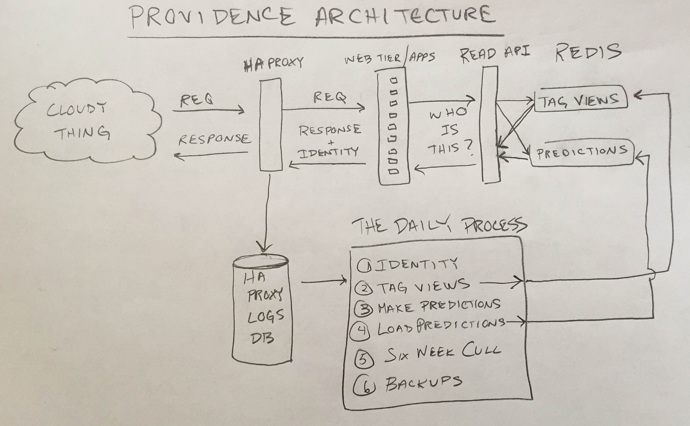
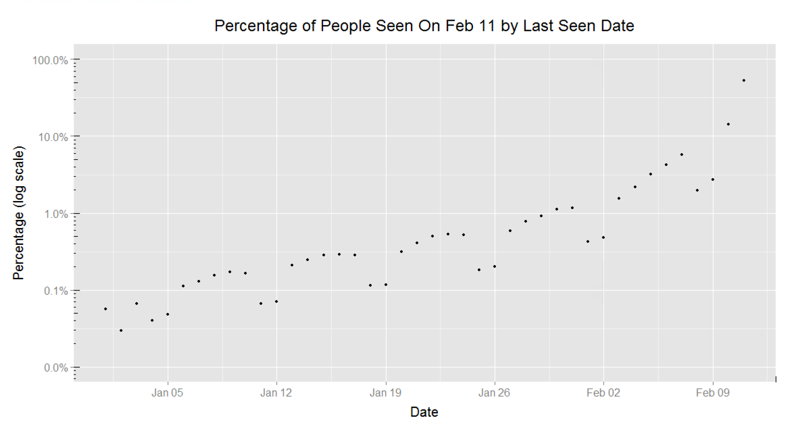
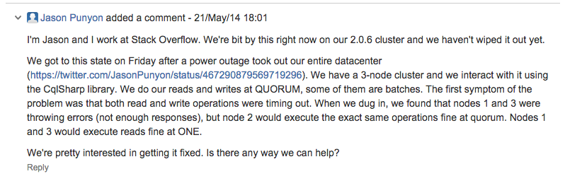
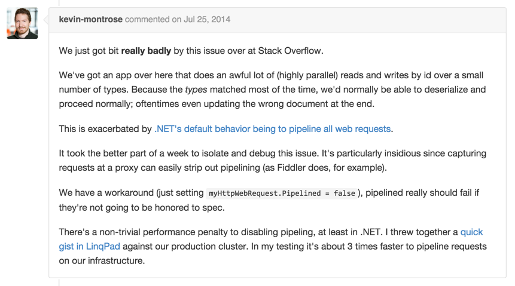

# Providence: Failure Is Always an Option

*This post is part of a series on the Providence project at Stack Exchange. The first post can be found [here](http://kevinmontrose.com/2015/01/27/providence-machine-learning-at-stack-exchange/).*

[The](http://kevinmontrose.com/2015/01/27/providence-machine-learning-at-stack-exchange/) [last](http://kevinmontrose.com/2015/01/29/providence-what-technologies-do-you-know/) [five](http://kevinmontrose.com/2015/02/04/providence-matching-people-to-jobs/) [blog](http://jasonpunyon.com/blog/2015/02/05/providence-testing-and-results/) [posts](http://jasonpunyon.com/blog/2015/02/10/providence-architecture-and-performance/) have been a highlight reel of Providence’s successes. Don’t be fooled, though, the road to Providence was long and winding. Let’s balance out the highlight reel with a look at some of the bumps in the road.

I said the road was long. Let’s quantify that. The first commit to the Providence repo happened on February 13, 2014 and Providence officially shipped with [Targeted Job Ads for Stack Overflow](http://blog.stackoverflow.com/2015/01/targeted-jobs-for-stack-overflow) on January 27, 2015. We worked on Providence for about a year.

You read that right; we worked on Providence for about a year. I’m telling you that this system…

…took a year to build. It’s kind of impressive, actually. The only *new* things on that diagram are the Daily Process, the Read API and a couple of redis instances. This certainly isn’t a big system by any means. We only sling around a few GB a day.

## So…What Happened?

We **failed slowly** while **solving the wrong problems** trying to build a system that was **too big** on **speculatively chosen technologies**.

### Too Big

When we started building Providence, we started with the idea that we were gonna keep data about persons for the most recent 365 days. Here’s a graph I made today:

That’s showing the distribution of people we saw on February 11, 2015 by the last time we saw them. As you go further back in time the percentage of people who were last seen on that day drops off precipitously (that’s a log scale). Keeping a year of data around makes absolutely no sense if you have that graph. The potential benefit (a hit on an old person) is far outweighed by the operational cost of a system that could keep that much data around. We didn’t have that graph when we sized the system, we just picked a number out of the sky. Our choice of a year was an order of magitude too high.

### Speculative Technology Decisions

The problem with keeping around a year of data is that…that’s a lot of data. We decided that SQL Server, the data store we had, was inadequate based on the fact that we were going to have to do key-value lookups on hundreds of millions of keys. We never really questioned that assertion or anything, it just seemed to go without saying.

This led us to a speculative technology decision. We “needed” a new datastore, so the task was to evaluate the ones that seemed promising. I spent about 2 weeks learning Cassandra, did some tiny proofs of concept, and without evaluating other options (aside from reading feature lists) decided that it was the way to go.

The terribleness of this decision would be borne out over the ensuing months, but far more terrible was this way of making decisions. Based on my most cursory of investigations of one technology I, with what can only be described as froth, was able to convince Stack Exchange Engineering and Site Reliability we needed to build a cluster of machines to run a distributed data store that I had all of two weeks of experience with. And we did it.

While I certainly appreciate the confidence, this was madness.

Another decision we made, apropos of nothing, was that we needed to update predictions for people every 15 minutes. This led us to decide on a Windows Service architecture, which wasn’t really our forte. In addition to that, we also were pretty frothy about using C#’s async/await as TheWay™ to do things, and we had *some* experience there but not a bunch.

### Solving the wrong problems

Early on we spent a good deal of time on the offline machine learning aspect of Providence. This was one of the few things we got right. Even if we had all our other problems nailed down, Providence still wouldn’t be anything if the underlying models didn’t work. We knew the models had to work and that they were the hardest part of the problem at the beginning, so that’s what we worked on.

The Developer Kinds model was finished with offline testing in June. The next step was to get it tested in the real world. That next step didn’t happen for *four* months. The linchpin of the system sat on the shelf untested for four months. Why?

Some of the fail of speculative technology decisions is that you don’t realize exactly how much you’re giving up by striking out in a new direction. We put years of work into our regular web application architecture and it shows. Migrations, builds, deployment, client libraries, all that incidental complexity is handled just the way we like. Multiple SRE’s and devs know how most systems work and can troubleshoot independently. I wouldn’t go so far as to say as it’s *finely* honed, but it’s definitely honed.

It was folly to think that things would go so smoothly with new-and-shiny-everything. The Windows Service + async/await + new data store equation always added up to more incidental work. We needed to make deploying Windows Services work. Cassandra needed migrations. Our regular perf tools like MiniProfiler don’t work right with async/await, so we needed to learn about [flowing execution context](http://blogs.msdn.com/b/pfxteam/archive/2012/06/15/executioncontext-vs-synchronizationcontext.aspx). If Cassandra performance wasn’t what we needed it to be we were in a whole new world of pain, stuck debugging a distributed data store we had little experience with.

And then it happened.

The datacenter screwed up and power to our systems was cut unceremoniously. When we came back up Cassandra was in an odd state. We tried repairing, and anything else we thought would fix it but ultimately got nowhere. After a few days we found a [bug report](https://issues.apache.org/jira/browse/CASSANDRA-7144) that exhibited similar behavior. It’d been filed a few weeks earlier, but there was no repro case. The ultimate cause wasn’t found until a month after the original bug report was filed.

This was the nail in the coffin for Cassandra. The fact that we got bitten by a bug in someone else’s software wasn’t hard to swallow. Bugs happen. It was the fact that were we in production, we’d have eaten a mystery outage for a month before someone was able to come up with an answer. It just proved how not ready we were with it and it made us uncomfortable. So we moved on.

### Speculative Technology Decisions Redux

So what do you do when a bad technology choice bites you in the ass after months of work? You decide to use an existing technology in a completely unproven way and see if that works any better, of course.

We still “knew” our main tools for storing data weren’t going to work. But we’d also just been bitten and we wanted to use something closer to us, not *as* crazy, something we had more experience with. So we chose elasticsearch.

### Solving The Wrong Problems Redux

And lo, we repeated all the same wrong problem solving with elasticsearch. There was a smidge less work because elasticsearch was already part of our infrastructure. Our operational issues ended up being just as bad though. We were auditing the system to figure out why our data wasn’t as we expected it and rediscovered a [more-than-a-year-old bug](https://github.com/elasticsearch/elasticsearch/issues/2665), that HTTP Pipelining didn’t work. We turned pipelining off and while elasticsearch acted correctly we saw a marked performance drop. We tried to optimize for another few weeks but ultimately threw in the towel.

### Failing slowly

Bad planning, bad tech decisions, and a propensity for sinking weeks on things only incidental to the problem all adds up to excruciatingly…slow…failure.
Failing is only kind of bad. Failing slowly, particularly as slowly as we were failing, and having absolutely nothing to show for it is *so* much worse. We spent months on datastores without thinking to ourselves “Wow, this hurts a lot. Maybe we shouldn’t do this.” We spent time rewriting client libraries and validating our implementations. We held off throwing in the towel until way too late way too often.

At this point, now mid September 2014, we *finally* realized we needed to get failing fast on these models in the real world or we weren’t going to have anything to ship in January. We gave up on everything but the models, and focused on how we could get them tested as quickly as possible. We dropped back to the simplest system we could think of that would get us going: Windows task scheduler invoked console applications that write data to files on disk that are loaded into redis. We gave up on the ill-chosen “a year of data” and “updates every 15 minutes” constraints, and backed off to 6 weeks of data updated daily.

Within *two weeks* we had real-world tests going and we got incredibly lucky. Results of the model tests were nearly universally positive.

## So what’s different now?

Engineering made some changes in the way we do things to try to keep Providence’s lost year from happening again. Overall we’re much more prickly about technology choices now. Near the end of last year we started doing Requests For Comment (RFCs) to help our decision making process.

RFCs start with a problem statement, a list of people (or placeholders for people) representative of teams that are interested in the problem, and a proposed solution. RFCs publicize the problem within the company, help you to gauge interest, and solicit feedback. They are public artifacts (we just use Google Docs) that help surface the “how” of decisions, not just the “what”. It’s still early going, but I like them a lot.

Kevin and I have essentially become allergic to big projects. We attempt to practice “What can get done by Friday?” driven development. Keeping things small precludes a whole class of errors like “We need a new datastore”, ‘cause that ain’t gettin’ done by Friday. It’s hard to sink a week on something you weren’t supposed to be working on when all you have is a week.
