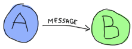
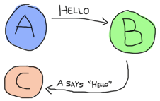
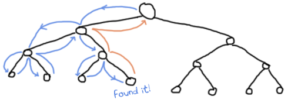
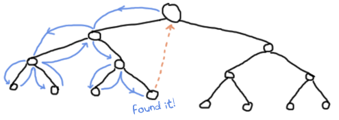

# Errors and Exceptions

### Not so fast!

There's no right place for a chapter like this one. By now, you've learned enough that you're probably running into errors, but not yet enough to know how to handle them. In fact we won't be able to see all the error-handling mechanisms within this chapter. That's a bit because Erlang has two main paradigms: functional and concurrent. The functional subset is the one I've been explaining since the beginning of the book: referential transparency, recursion, higher order functions, etc. The concurrent subset is the one that makes Erlang famous: actors, thousands and thousands of concurrent processes, supervision trees, etc.

Because I judge the functional part essential to know before moving on to the concurrent part, I'll only cover the functional subset of the language in this chapter. If we are to manage errors, we must first understand them.

**Note:** Although Erlang includes a few ways to handle errors in functional code, most of the time you'll be told to just let it crash. I hinted at this in the [Introduction](http://learnyousomeerlang.com/introduction#what-is-erlang). The mechanisms that let you program this way are in the concurrent part of the language.

### A Compilation of Errors

There are many kinds of errors: compile-time errors, logical errors, run-time errors and generated errors. I'll focus on compile-time errors in this section and go through the others in the next sections.

Compile-time errors are often syntactic mistakes: check your function names, the tokens in the language (brackets, parentheses, periods, comas), the arity of your functions, etc. Here's a list of some of the common compile-time error messages and potential resolutions in case you encounter them:

module.beam: Module name 'madule' does not match file name 'module'
:   The module name you've entered in the `-module` attribute doesn't match the filename.

./module.erl:2: Warning: function some\_function/0 is unused
:   You have not exported a function, or the place where it's used has the wrong name or arity. It's also possible that you've written a function that is no longer needed. Check your code!

./module.erl:2: function some\_function/1 undefined
:   The function does not exist. You've written the wrong name or arity either in the `-export` attribute or when declaring the function. This error is also output when the given function could not be compiled, usually because of a syntax error like forgetting to end a function with a period.

./module.erl:5: syntax error before: 'SomeCharacterOrWord'
:   This happens for a variety of reason, namely unclosed parentheses, tuples or wrong expression termination (like closing the last branch of a `case` with a comma). Other reasons might include the use of a reserved atom in your code or unicode characters getting weirdly converted between different encodings (I've seen it happen!)

./module.erl:5: syntax error before:
:   All right, that one is certainly not as descriptive! This usually comes up when your line termination is not correct. This is a specific case of the previous error, so just keep an eye out.

./module.erl:5: Warning: this expression will fail with a 'badarith' exception
:   Erlang is all about dynamic typing, but remember that the types are strong. In this case, the compiler is smart enough to find that one of your arithmetic expressions will fail (say, `llama + 5`). It won't find type errors much more complex than that, though.

./module.erl:5: Warning: variable 'Var' is unused
:   You declared a variable and never use it afterwards. This might be a bug with your code, so double-check what you have written. Otherwise, you might want to switch the variable name to `_` or just prefix it with an underscore (something like \_Var) if you feel the name helps make the code readable.

./module.erl:5: Warning: a term is constructed, but never used
:   In one of your functions, you're doing something such as building a list, declaring a tuple or an anonymous function without ever binding it to a variable or returning it. This warning tells you you're doing something useless or that you have made some mistake.

./module.erl:5: head mismatch
:   It's possible your function has more than one head, and each of them has a different arity. Don't forget that different arity means different functions, and you can't interleave function declarations that way. This error is also raised when you insert a function definition between the head clauses of another function.

./module.erl:5: Warning: this clause cannot match because a previous clause at line 4 always matches
:   A function defined in the module has a specific clause defined after a catch-all one. As such, the compiler can warn you that you'll never even need to go to the other branch.

./module.erl:9: variable 'A' unsafe in 'case' (line 5)
:   You're using a variable declared within one of the branches of a `case ... of` outside of it. This is considered unsafe. If you want to use such variables, you'd be better of doing `MyVar = case ... of`...

This should cover most errors you get at compile-time at this point. There aren't too many and most of the time the hardest part is finding which error caused a huge cascade of errors listed against other functions.
It is better to resolve compiler errors in the order they were reported to avoid being misled by errors which may not actually be errors at all. Other kinds of errors sometimes appear and if you've got one I haven't included, send me an email and I'll add it along with an explanation as soon as possible.

### No, YOUR logic is wrong!

Logical errors are the hardest kind of errors to find and debug. They're most likely errors coming from the programmer: branches of conditional statements such as 'if's and 'case's that don't consider all the cases, mixing up a multiplication for a division, etc. They do not make your programs crash but just end up giving you unseen bad data or having your program work in an unintended manner.

You're most likely on your own when it comes to this, but Erlang has many facilities to help you there, including test frameworks, TypEr and Dialyzer (as described in the [types chapter](http://learnyousomeerlang.com/types-or-lack-thereof#for-type-junkies)), a [debugger](http://www.erlang.org/doc/apps/debugger/debugger_chapter.html "official documentation") and [tracing module](http://erldocs.com/17.3/runtime_tools/dbg.html "link to non-official documentation"), etc. Testing your code is likely your best defense. Sadly, there are enough of these kinds of errors in every programmer's career to write a few dozen books about so I'll avoid spending too much time here. It's easier to focus on those that make your programs crash, because it happens right there and won't bubble up 50 levels from now. Note that this is pretty much the origin of the 'let it crash' ideal I mentioned a few times already.

### Run-time Errors

Run-time errors are pretty destructive in the sense that they crash your code. While Erlang has ways to deal with them, recognizing these errors is always helpful. As such, I've made a little list of common run-time errors with an explanation and example code that could generate them.

function\_clause
:   `1.``1>` `lists:sort``([``3``,``2``,``1``])``.`

    `2.``[1,2,3]`

    `3.``2>` `lists:sort``(``fffffff``)``.`

    `4.``** exception error: no function clause matching lists:sort(fffffff)`
:   All the guard clauses of a function failed, or none of the function clauses' patterns matched.

case\_clause
:   `1.``3>` `case` `"Unexpected Value"` `of`

    `2.``3>`    `expected_value` `->` `ok``;`

    `3.``3>`    `other_expected_value` `->` `'also ok'`

    `4.``3>` `end``.`

    `5.``** exception error: no case clause matching "Unexpected Value"`
:   Looks like someone has forgotten a specific pattern in their `case`, sent in the wrong kind of data, or needed a catch-all clause!

if\_clause
:   `1.``4>` `if` `2` `>` `4` `->` `ok``;`

    `2.``4>`    `0` `>` `1` `->` `ok`

    `3.``4>` `end``.`

    `4.``** exception error: no true branch found when evaluating an if expression`
:   This is pretty similar to `case_clause` errors: it can not find a branch that evaluates to `true`. Ensuring you consider all cases or add the catch-all `true` clause might be what you need.

badmatch
:   `1.``5>` `[X,Y]` `=` `{``4``,``5``}``.`

    `2.``** exception error: no match of right hand side value {4,5}`
:   Badmatch errors happen whenever pattern matching fails. This most likely means you're trying to do impossible pattern matches (such as above), trying to bind a variable for the second time, or just anything that isn't equal on both sides of the `=` operator (which is pretty much what makes rebinding a variable fail!). Note that this error sometimes happens because the programmer believes that a variable of the form \_MyVar is the same as `_`. Variables with an underscore are normal variables, except the compiler won't complain if they're not used. It is not possible to bind them more than once.

badarg
:   `1.``6>` `erlang:binary_to_list``(``"heh, already a list"``)``.`

    `2.``** exception error: bad argument`

    `3.``in function  binary_to_list/1`

    `4.``called as binary_to_list("heh, already a list")`
:   This one is really similar to `function_clause` as it's about calling functions with incorrect arguments. The main difference here is that this error is usually triggered by the programmer after validating the arguments from within the function, outside of the guard clauses. I'll show how to throw such errors later in this chapter.

undef
:   `1.``7>` `lists:random``([``1``,``2``,``3``])``.`

    `2.``** exception error: undefined function lists:random/1`
:   This happens when you call a function that doesn't exist. Make sure the function is exported from the module with the right arity (if you're calling it from outside the module) and double check that you did type the name of the function and the name of the module correctly. Another reason to get the message is when the module is not in Erlang's search path. By default, Erlang's search path is set to be in the current directory. You can add paths by using `code:add_patha/1` or `code:add_pathz/1`. If this still doesn't work, make sure you compiled the module to begin with!

badarith
:   `1.``8>` `5` `+` `llama``.`

    `2.``** exception error: bad argument in an arithmetic expression`

    `3.``in operator  +/2`

    `4.``called as 5 + llama`
:   This happens when you try to do arithmetic that doesn't exist, like divisions by zero or between atoms and numbers.

badfun
:   `1.``9>` `hhfuns:add``(``one``,``two``)``.`

    `2.``** exception error: bad function one`

    `3.``in function  hhfuns:add/2`
:   The most frequent reason why this error occurs is when you use variables as functions, but the variable's value is not a function. In the example above, I'm using the `hhfuns` function from the [previous chapter](http://learnyousomeerlang.com/higher-order-functions) and using two atoms as functions. This doesn't work and `badfun` is thrown.

badarity
:   `1.``10>` `F` `=` `fun``(``_``)` `->` `ok` `end``.`

    `2.``#Fun<erl_eval.6.13229925>`

    `3.``11>` `F(``a``,``b``)``.`

    `4.``** exception error: interpreted function with arity 1 called with two arguments`
:   The `badarity` error is a specific case of `badfun`: it happens when you use higher order functions, but you pass them more (or fewer) arguments than they can handle.

system\_limit
:   There are many reasons why a `system_limit` error can be thrown: too many processes (we'll get there), atoms that are too long, too many arguments in a function, number of atoms too large, too many nodes connected, etc. To get a full list in details, read the [Erlang Efficiency Guide](http://www.erlang.org/doc/efficiency_guide/advanced.html#id2265856) on system limits. Note that some of these errors are serious enough to crash the whole VM.

### Raising Exceptions

In trying to monitor the execution of code and protect against logical errors, it's often a good idea to provoke run-time crashes so problems will be spotted early.

There are three kinds of exceptions in Erlang: *errors*, *throws* and *exits*. They all have different uses (kind of):

#### Errors

Calling `erlang:error(Reason)` will end the execution in the current process and include a stack trace of the last functions called with their arguments when you catch it. These are the kind of exceptions that provoke the run-time errors above.

Errors are the means for a function to stop its execution when you can't expect the calling code to handle what just happened. If you get an `if_clause` error, what can you do? Change the code and recompile, that's what you can do (other than just displaying a pretty error message). An example of when not to use errors could be our tree module from the [recursion chapter](http://learnyousomeerlang.com/recursion#more-than-lists "More than lists"). That module might not always be able to find a specific key in a tree when doing a lookup. In this case, it makes sense to expect the user to deal with unknown results: they could use a default value, check to insert a new one, delete the tree, etc. This is when it's appropriate to return a tuple of the form `{ok, Value}` or an atom like `undefined` rather than raising errors.

Now, errors aren't limited to the examples above. You can define your own kind of errors too:

`1.``1>` `erlang:error``(``badarith``)``.`

`2.``** exception error: bad argument in an arithmetic expression`

`3.``2>` `erlang:error``(``custom_error``)``.`

`4.``** exception error: custom_error`

Here, `custom_error` is not recognized by the Erlang shell and it has no custom translation such as "bad argument in ...", but it's usable in the same way and can be handled by the programmer in an identical manner (we'll see how to do that soon).

#### Exits

There are two kinds of exits: 'internal' exits and 'external' exits. Internal exits are triggered by calling the function `exit/1` and make the current process stop its execution. External exits are called with `exit/2` and have to do with multiple processes in the concurrent aspect of Erlang; as such, we'll mainly focus on internal exits and will visit the external kind later on.

Internal exits are pretty similar to errors. In fact, historically speaking, they were the same and only `exit/1` existed. They've got roughly the same use cases. So how to choose one? Well the choice is not obvious. To understand when to use one or the other, there's no choice but to start looking at the concepts of actors and processes from far away.

In the introduction, I've compared processes as people communicating by mail. There's not a lot to add to the analogy, so I'll go to diagrams and bubbles.

Processes here can send each other messages. A process can also listen for messages, wait for them. You can also choose what messages to listen to, discard some, ignore others, give up listening after a certain time etc.

These basic concepts let the implementors of Erlang use a special kind of message to communicate exceptions between processes. They act a bit like a process' last breath; they're sent right before a process dies and the code it contains stops executing. Other processes that were listening for that specific kind of message can then know about the event and do whatever they please with it. This includes logging, restarting the process that died, etc.

With this concept explained, the difference in using `erlang:error/1` and `exit/1` is easier to understand. While both can be used in an extremely similar manner, the real difference is in the intent. You can then decide whether what you've got is 'simply' an error or a condition worthy of killing the current process. This point is made stronger by the fact that `erlang:error/1` returns a stack trace and `exit/1` doesn't. If you were to have a pretty large stack trace or lots of arguments to the current function, copying the exit message to every listening process would mean copying the data. In some cases, this could become unpractical.

#### Throws

A throw is a class of exceptions used for cases that the programmer can be expected to handle. In comparison with exits and errors, they don't really carry any 'crash that process!' intent behind them, but rather control flow. As you use throws while expecting the programmer to handle them, it's usually a good idea to document their use within a module using them.

The syntax to throw an exception is:

`1.``1>` `throw``(``permission_denied``)``.`

`2.``** exception throw: permission_denied`

Where you can replace `permission_denied` by anything you want (including `'everything is fine'`, but that is not helpful and you will lose friends).

Throws can also be used for non-local returns when in deep recursion. An example of that is the `ssl` module which uses `throw/1` as a way to push `{error, Reason}` tuples back to a top-level function. This function then simply returns that tuple to the user. This lets the implementer only write for the successful cases and have one function deal with the exceptions on top of it all.

Another example could be the array module, where there is a lookup function that can return a user-supplied default value if it can't find the element needed. When the element can't be found, the value `default` is thrown as an exception, and the top-level function handles that and substitutes it with the user-supplied default value. This keeps the programmer of the module from needing to pass the default value as a parameter of every function of the lookup algorithm, again focusing only on the successful cases.

As a rule of thumb, try to limit the use of your throws for non-local returns to a single module in order to make it easier to debug your code. It will also let you change the innards of your module without requiring changes in its interface.

### Dealing with Exceptions

I've already mentioned quite a few times that throws, errors and exits can be handled. The way to do this is by using a `try ... catch` expression.

A `try ... catch` is a way to evaluate an expression while letting you handle the successful case as well as the errors encountered. The general syntax for such an expression is:

`01.``try` `Expression` `of`

`02.``SuccessfulPattern1 [Guards]` `->`

`03.``Expression1``;`

`04.``SuccessfulPattern2 [Guards]` `->`

`05.``Expression2`

`06.``catch`

`07.``TypeOfError:ExceptionPattern1` `->`

`08.``Expression3``;`

`09.``TypeOfError:ExceptionPattern2` `->`

`10.``Expression4`

`11.``end``.`

The Expression in between `try` and `of` is said to be *protected*. This means that any kind of exception happening within that call will be caught. The patterns and expressions in between the `try ... of` and `catch` behave in exactly the same manner as a `case ... of`. Finally, the `catch` part: here, you can replace TypeOfError by either `error`, `throw` or `exit`, for each respective type we've seen in this chapter. If no type is provided, a `throw` is assumed. So let's put this in practice.

First of all, let's start a module named `exceptions`. We're going for simple here:

`01.``-module``(``exceptions``)``.`

`02.``-compile``(``export_all``)``.`

`03.`

`04.``throws(F)` `->`

`05.``try` `F()` `of`

`06.``_` `->` `ok`

`07.``catch`

`08.``Throw` `->` `{``throw``,` `caught``, Throw}`

`09.``end``.`

We can compile it and try it with different kinds of exceptions:

`1.``1>` `c(``exceptions``)``.`

`2.``{ok,exceptions}`

`3.``2>` `exceptions:throws``(fun``()` `->` `throw``(``thrown``)` `end``)``.`

`4.``{throw,caught,thrown}`

`5.``3>` `exceptions:throws``(fun``()` `->` `erlang:error``(``pang``)` `end``)``.`

`6.``** exception error: pang`

As you can see, this `try ... catch` is only receiving throws. As stated earlier, this is because when no type is mentioned, a throw is assumed. Then we have functions with catch clauses of each type:

`01.``errors(F)` `->`

`02.``try` `F()` `of`

`03.``_` `->` `ok`

`04.``catch`

`05.``error``:Error` `->` `{``error``,` `caught``, Error}`

`06.``end``.`

`07.`

`08.``exits(F)` `->`

`09.``try` `F()` `of`

`10.``_` `->` `ok`

`11.``catch`

`12.``exit``:Exit` `->` `{``exit``,` `caught``, Exit}`

`13.``end``.`

And to try them:

`1.``4>` `c(``exceptions``)``.`

`2.``{ok,exceptions}`

`3.``5>` `exceptions:errors``(fun``()` `->` `erlang:error``(``"Die!"``)` `end``)``.`

`4.``{error,caught,"Die!"}`

`5.``6>` `exceptions:exits``(fun``()` `->` `exit``(``goodbye``)` `end``)``.`

`6.``{exit,caught,goodbye}`

The next example on the menu shows how to combine all the types of exceptions in a single `try ... catch`. We'll first declare a function to generate all the exceptions we need:

`01.``sword(``1``)` `->` `throw``(``slice``)``;`

`02.``sword(``2``)` `->` `erlang:error``(``cut_arm``)``;`

`03.``sword(``3``)` `->` `exit``(``cut_leg``)``;`

`04.``sword(``4``)` `->` `throw``(``punch``)``;`

`05.``sword(``5``)` `->` `exit``(``cross_bridge``)``.`

`06.`

`07.``black``_``knight(Attack)` `when` `is_function``(Attack,` `0``)` `->`

`08.``try` `Attack()` `of`

`09.``_` `->` `"None shall pass."`

`10.``catch`

`11.``throw``:``slice` `->` `"It is but a scratch."``;`

`12.``error``:``cut_arm` `->` `"I've had worse."``;`

`13.``exit``:``cut_leg` `->` `"Come on you pansy!"``;`

`14.``_``:``_` `->` `"Just a flesh wound."`

`15.``end``.`

Here `is_function/2` is a BIF which makes sure the variable Attack is a function of arity 0. Then we add this one for good measure:

`1.``talk()` `->` `"blah blah"``.`

And now for something completely different:

`01.``7>` `c(``exceptions``)``.`

`02.``{ok,exceptions}`

`03.``8>` `exceptions:talk``()``.`

`04.``"blah blah"`

`05.``9>` `exceptions:black_knight``(``fun` `exceptions``:``talk``/``0``)``.`

`06.``"None shall pass."`

`07.``10>` `exceptions:black_knight``(fun``()` `->` `exceptions:sword``(``1``)` `end``)``.`

`08.``"It is but a scratch."`

`09.``11>` `exceptions:black_knight``(fun``()` `->` `exceptions:sword``(``2``)` `end``)``.`

`10.``"I've had worse."`

`11.``12>` `exceptions:black_knight``(fun``()` `->` `exceptions:sword``(``3``)` `end``)``.`

`12.``"Come on you pansy!"`

`13.``13>` `exceptions:black_knight``(fun``()` `->` `exceptions:sword``(``4``)` `end``)``.`

`14.``"Just a flesh wound."`

`15.``14>` `exceptions:black_knight``(fun``()` `->` `exceptions:sword``(``5``)` `end``)``.`

`16.``"Just a flesh wound."`

The expression on line 9 demonstrates normal behavior for the black knight, when function execution happens normally. Each line that follows that one demonstrates pattern matching on exceptions according to their class (throw, error, exit) and the reason associated with them (`slice`, `cut_arm`, `cut_leg`).

One thing shown here on expressions 13 and 14 is a catch-all clause for exceptions. The `_:_` pattern is what you need to use to make sure to catch any exception of any type. In practice, you should be careful when using the catch-all patterns: try to protect your code from what you can handle, but not any more than that. Erlang has other facilities in place to take care of the rest.

There's also an additional clause that can be added after a `try ... catch` that will always be executed. This is equivalent to the 'finally' block in many other languages:

`1.``try` `Expr` `of`

`2.``Pattern` `->` `Expr1`

`3.``catch`

`4.``Type:Exception` `->` `Expr2`

`5.``after` `% this always gets executed`

`6.``Expr3`

`7.``end`

No matter if there are errors or not, the expressions inside the `after` part are guaranteed to run. However, you can not get any return value out of the `after` construct. Therefore, `after` is mostly used to run code with side effects. The canonical use of this is when you want to make sure a file you were reading gets closed whether exceptions are raised or not.

We now know how to handle the 3 classes of exceptions in Erlang with catch blocks. However, I've hidden information from you: it's actually possible to have more than one expression between the `try` and the `of`!

`01.``whoa()` `->`

`02.``try`

`03.``talk``(),`

`04.``_``Knight` `=` `"None shall Pass!"``,`

`05.``_``Doubles` `=` `[N``*``2` `|``|` `N` `<-` `lists:seq``(``1``,``100``)],`

`06.``throw``(``up``),`

`07.``_``WillReturnThis` `=` `tequila`

`08.``of`

`09.``tequila` `->` `"hey this worked!"`

`10.``catch`

`11.``Exception:Reason` `->` `{``caught``, Exception, Reason}`

`12.``end``.`

By calling `exceptions:whoa()`, we'll get the obvious `{caught, throw, up}`, because of `throw(up)`. So yeah, it's possible to have more than one expression between `try` and `of`...

What I just highlighted in `exceptions:whoa/0` and that you might have not noticed is that when we use many expressions in that manner, we might not always care about what the return value is. The `of` part thus becomes a bit useless. Well good news, you can just give it up:

`01.``im``_``impressed()` `->`

`02.``try`

`03.``talk``(),`

`04.``_``Knight` `=` `"None shall Pass!"``,`

`05.``_``Doubles` `=` `[N``*``2` `|``|` `N` `<-` `lists:seq``(``1``,``100``)],`

`06.``throw``(``up``),`

`07.``_``WillReturnThis` `=` `tequila`

`08.``catch`

`09.``Exception:Reason` `->` `{``caught``, Exception, Reason}`

`10.``end``.`

And now it's a bit leaner!

**Note:** It is important to know that the protected part of an exception can't be tail recursive. The VM must always keep a reference there in case there's an exception popping up.

Because the `try ... catch` construct without the `of` part has nothing but a protected part, calling a recursive function from there might be dangerous for programs supposed to run for a long time (which is Erlang's niche). After enough iterations, you'll go out of memory or your program will get slower without really knowing why. By putting your recursive calls between the `of` and `catch`, you are not in a protected part and you will benefit from Last Call Optimisation.

Some people use `try ... of ... catch` rather than `try ... catch` by default to avoid unexpected errors of that kind, except for obviously non-recursive code with results that won't be used by anything. You're most likely able to make your own decision on what to do!

### Wait, there's more!

As if it wasn't enough to be on par with most languages already, Erlang's got yet another error handling structure. That structure is defined as the keyword `catch` and basically captures all types of exceptions on top of the good results. It's a bit of a weird one because it displays a different representation of exceptions:

`01.``1>` `catch` `throw``(``whoa``)``.`

`02.``whoa`

`03.``2>` `catch` `exit``(``die``)``.`

`04.``{'EXIT',die}`

`05.``3>` `catch` `1``/``0``.`

`06.``{'EXIT',{badarith,[{erlang,'/',[1,0]},`

`07.``{erl_eval,do_apply,5},`

`08.``{erl_eval,expr,5},`

`09.``{shell,exprs,6},`

`10.``{shell,eval_exprs,6},`

`11.``{shell,eval_loop,3}]}}`

`12.``4>` `catch` `2``+2``.`

`13.``4`

What we can see from this is that throws remain the same, but that exits and errors are both represented as `{'EXIT', Reason}`. That's due to errors being bolted to the language after exits (they kept a similar representation for backwards compatibility).

The way to read this stack trace is as follows:

`1.``5>` `catch` `doesnt:exist``(``a``,``4``)``.`

`2.``{'EXIT',{undef,[{doesnt,exist,[a,4]},`

`3.``{erl_eval,do_apply,5},`

`4.``{erl_eval,expr,5},`

`5.``{shell,exprs,6},`

`6.``{shell,eval_exprs,6},`

`7.``{shell,eval_loop,3}]}}`

- The type of error is `undef`, which means the function you called is not defined (see the list at the beginning of this chapter)
- The list right after the type of error is a stack trace
- The tuple on top of the stack trace represents the last function to be called (`{Module, Function, Arguments}`). That's your undefined function.
- The tuples after that are the functions called before the error. This time they're of the form `{Module, Function, Arity}`.
- That's all there is to it, really.

You can also manually get a stack trace by calling `erlang:get_stacktrace/0` in the process that crashed.

You'll often see `catch` written in the following manner (we're still in [exceptions.erl](http://learnyousomeerlang.com/static/erlang/exceptions.erl)):

`1.``catcher(X,Y)` `->`

`2.``case` `catch` `X``/``Y` `of`

`3.``{``'EXIT'``, {``badarith``,``_``}}` `->` `"uh oh"``;`

`4.``N` `->` `N`

`5.``end``.`

And as expected:

`1.``6>` `c(``exceptions``)``.`

`2.``{ok,exceptions}`

`3.``7>` `exceptions:catcher``(``3``,``3``)``.`

`4.``1.0`

`5.``8>` `exceptions:catcher``(``6``,``3``)``.`

`6.``2.0`

`7.``9>` `exceptions:catcher``(``6``,``0``)``.`

`8.``"uh oh"`

This sounds compact and easy to catch exceptions, but there are a few problems with `catch`. The first of it is operator precedence:

`1.``10>` `X` `=` `catch` `4``+2``.`

`2.``* 1: syntax error before: 'catch'`

`3.``10>` `X` `=` `(``catch` `4``+2``)``.`

`4.``6`

That's not exactly intuitive given that most expressions do not need to be wrapped in parentheses this way. Another problem with `catch` is that you can't see the difference between what looks like the underlying representation of an exception and a real exception:

`01.``11>` `catch` `erlang:boat``()``.`

`02.``{'EXIT',{undef,[{erlang,boat,[]},`

`03.``{erl_eval,do_apply,5},`

`04.``{erl_eval,expr,5},`

`05.``{shell,exprs,6},`

`06.``{shell,eval_exprs,6},`

`07.``{shell,eval_loop,3}]}}`

`08.``12>` `catch` `exit``({``undef``, [{``erlang``,``boat``,[]}, {``erl_eval``,``do_apply``,``5``}, {``erl_eval``,``expr``,``5``}, {``shell``,``exprs``,``6``}, {``shell``,``eval_exprs``,``6``}, {``shell``,``eval_loop``,``3``}]})``.`

`09.``{'EXIT',{undef,[{erlang,boat,[]},`

`10.``{erl_eval,do_apply,5},`

`11.``{erl_eval,expr,5},`

`12.``{shell,exprs,6},`

`13.``{shell,eval_exprs,6},`

`14.``{shell,eval_loop,3}]}}`

And you can't know the difference between an error and an actual exit. You could also have used `throw/1` to generate the above exception. In fact, a `throw/1` in a `catch` might also be problematic in another scenario:

`1.``one``_``or``_``two(``1``)` `->` `return``;`

`2.``one``_``or``_``two(``2``)` `->` `throw``(``return``)``.`

And now the killer problem:

`1.``13>` `c(``exceptions``)``.`

`2.``{ok,exceptions}`

`3.``14>` `catch` `exceptions:one_or_two``(``1``)``.`

`4.``return`

`5.``15>` `catch` `exceptions:one_or_two``(``2``)``.`

`6.``return`

Because we're behind a `catch`, we can never know if the function threw an exception or if it returned an actual value! This might not really happen a whole lot in practice, but it's still a wart big enough to have warranted the addition of the `try ... catch` construct in the R10B release.

### Try a try in a tree

To put exceptions in practice, we'll do a little exercise requiring us to dig for our `tree` module. We're going to add a function that lets us do a lookup in the tree to find out whether a value is already present in there or not. Because the tree is ordered by its keys and in this case we do not care about the keys, we'll need to traverse the whole thing until we find the value.

The traversal of the tree will be roughly similar to what we did in `tree:lookup/2`, except this time we will always search down both the left branch and the right branch. To write the function, you'll just need to remember that a tree node is either `{node, {Key, Value, NodeLeft, NodeRight}}` or `{node, 'nil'}` when empty. With this in hand, we can write a basic implementation without exceptions:

`01.``%% looks for a given value 'Val' in the tree.`

`02.``has``_``value(``_``, {``node``,` `'nil'``})` `->`

`03.``false``;`

`04.``has``_``value(Val, {``node``, {``_``, Val,` `_``,` `_``}})` `->`

`05.``true``;`

`06.``has``_``value(Val, {``node``, {``_``,` `_``, Left, Right}})` `->`

`07.``case` `has_value``(Val, Left)` `of`

`08.``true` `->` `true``;`

`09.``false` `->` `has_value``(Val, Right)`

`10.``end``.`

The problem with this implementation is that every node of the tree we branch at has to test for the result of the previous branch:

This is a bit annoying. With the help of throws, we can make something that will require less comparisons:

`01.``has``_``value(Val, Tree)` `->`

`02.``try` `has_value1``(Val, Tree)` `of`

`03.``false` `->` `false`

`04.``catch`

`05.``true` `->` `true`

`06.``end``.`

`07.`

`08.``has``_``value1(``_``, {``node``,` `'nil'``})` `->`

`09.``false``;`

`10.``has``_``value1(Val, {``node``, {``_``, Val,` `_``,` `_``}})` `->`

`11.``throw``(``true``)``;`

`12.``has``_``value1(Val, {``node``, {``_``,` `_``, Left, Right}})` `->`

`13.``has_value1``(Val, Left),`

`14.``has_value1``(Val, Right)``.`

The execution of the code above is similar to the previous version, except that we never need to check for the return value: we don't care about it at all. In this version, only a throw means the value was found. When this happens, the tree evaluation stops and it falls back to the `catch` on top. Otherwise, the execution keeps going until the last `false` is returned and that's what the user sees:

Of course, the implementation above is longer than the previous one. However, it is possible to realize gains in speed and in clarity by using non-local returns with a throw, depending on the operations you're doing. The current example is a simple comparison and there's not much to see, but the practice still makes sense with more complex data structures and operations.

That being said, we're probably ready to solve real problems in sequential Erlang.
