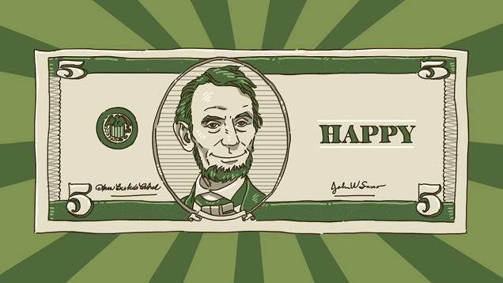

# [How to Buy Happiness: The Purchases Most Likely to Bring You Joy](http://lifehacker.com/how-to-buy-happiness-the-purchases-most-likely-to-brin-1681780686)

132,5448

[13l](http://lifehacker.com/how-to-buy-happiness-the-purchases-most-likely-to-brin-1681780686?rev=1422286862714# "Recommend")

#### Patrick Allan

[Profile](http://patrickallan.kinja.com/)[Follow](http://lifehacker.com/how-to-buy-happiness-the-purchases-most-likely-to-brin-1681780686?rev=1422286862714#)

[Patrick Allan](http://patrickallan.kinja.com/)

Filed to: [happiness](http://lifehacker.com/tag/happiness)

- [psychology](http://lifehacker.com/tag/psychology)
- [money](http://lifehacker.com/tag/money)
- [shopping](http://lifehacker.com/tag/shopping)
- [life lessons](http://lifehacker.com/tag/life-lessons)
- [feature](http://lifehacker.com/tag/feature)
- [editor's picks](http://lifehacker.com/tag/editors-picks)

 [1/26/15 8:00am](http://lifehacker.com/how-to-buy-happiness-the-purchases-most-likely-to-brin-1681780686)

- [*C*Share to Kinja](http://lifehacker.com/how-to-buy-happiness-the-purchases-most-likely-to-brin-1681780686?rev=1422286862714#)
- [*"*Share to Facebook](http://facebook.com/sharer.php?u=http%3A%2F%2Flifehacker.com%2Fhow-to-buy-happiness-the-purchases-most-likely-to-brin-1681780686)
- [**Share to Pinterest](http://www.pinterest.com/pin/create/api_other/?url=http%3A%2F%2Flifehacker.com%2Fhow-to-buy-happiness-the-purchases-most-likely-to-brin-1681780686&media=http%3A%2F%2Fi.kinja-img.com%2Fgawker-media%2Fimage%2Fupload%2Fs--0ut_DtPP--%2Fo3rk560gpdu4i4ohklyf.jpg&description=While%20true%20happiness%20may%20be%20something%20that%20can%20only%20be%20found%20in%20the%20heart%2C%20there%20are%20plenty%20of%20arguments%20that%20say%20money%20can%20actually%20buy%20you%20some%20happiness%20here%20and%20there.%20Here%20are%20some%20of%20the%20ways%20experts%20say%20it%27s%20possible%20to%20write%20a%20check%20and%20make%20it%20out%20to%20your%20happiness.)
- [*!*Share to Twitter](http://twitter.com/share?url=http%3A%2F%2Flifehacker.com%2Fhow-to-buy-happiness-the-purchases-most-likely-to-brin-1681780686&text=How%20to%20Buy%20Happiness%3A%20The%20Purchases%20Most%20Likely%20to%20Bring%20You%20Joy)
- [*~*Go to permalink](http://lifehacker.com/how-to-buy-happiness-the-purchases-most-likely-to-brin-1681780686)
[))](http://lifehacker.com/how-to-buy-happiness-the-purchases-most-likely-to-brin-1681780686?rev=1422286862714#)

While true happiness may be something that can only be found in the heart, there are plenty of arguments that say money *can* actually buy you some happiness here and there. Here are some of the ways experts say it's possible to write a check and make it out to your happiness.  N

It's certainly hard to measure happiness, of course. There's no point system or way to accurately measure the happiness flowing through your bloodstream, and happiness is an emotion that can mean different things for different people, so keep that in mind as you read on. That said, buying happiness all comes down to how you spend your money. It could be a new album from your favorite artist, a trip to somewhere you've longed to travel to, or just a cold beer at the end of a long day. This guide won't unlock the secret to true happiness in your life—whatever that may entail for you—but it will provide some ideas on how to get the most from your your hard-earned money.  N

### **Buy Your Financial Security** N

[anexo ausente]

Stress is the enemy of happiness, and feeling insecure in your finances can be a major stressor. Over time it even begins to [affect your health in a negative way](http://lifehacker.com/5528312/how-debt-affects-your-health), which obviously is bad for your happiness. Instead of living in worry about your debts and loans, you can start to buy your happiness back by paying them off.  N

###### [How Debt Affects Your Health](http://lifehacker.com/5528312/how-debt-affects-your-health)

We know that money won't buy happiness, but a lack of money can certainly cause stress, and…
[Read more](http://lifehacker.com/5528312/how-debt-affects-your-health)

The next time you feel like you have some extra cash to splurge with, see how much of your savings you can [put toward your debt instead](http://lifehacker.com/put-savings-toward-paying-off-debt-based-on-your-debts-1677728297). It takes time to whittle away things like credit card debt, but when you finally overcome it, you'll feel way happier overall. Besides, when push comes to shove, paying off your credit cards is literally [the best financial return for your money](http://lifehacker.com/paying-off-credit-cards-is-the-best-financial-return-fo-1496724814).  N

### **Cash In on Experiences** N

[anexo ausente]

Some purchased items can make you happy, yes, but you've probably heard that the best use of money is [buying experiences instead](http://lifehacker.com/5608980/spend-on-experiences-instead-of-possessions-for-longer-happiness). Our life is built around our experiences and the memory of a great vacation will stick with us a lot longer than a new smartphone. Experiences also have the perk of shaping who you are. You could learn a lot about yourself—and what you *really* want in life—when you opt for an awesome experience instead of a new TV that would just keep you glued to your couch.  N

###### [Spending on Experiences Instead of Possessions Results in More Satisfaction](http://lifehacker.com/5608980/spend-on-experiences-instead-of-possessions-for-longer-happiness)

Got some extra cash (finally)? Consider spending it on a weekend get-away, or hiking gear, rather…
[Read more](http://lifehacker.com/5608980/spend-on-experiences-instead-of-possessions-for-longer-happiness)

In a [survey](http://www.wjh.harvard.edu/~dtg/DUNN%20GILBERT%20&%20WILSON%20(2011).pdf) conducted by Harvard University psychology professor and [Stumbling on Happiness](http://www.amazon.com/Stumbling-Happiness-Daniel-Gilbert/dp/1400077427?tag=lifehackeramzn-20&ascsubtag=84b7fe7223082b4b55a52bfb1c6caecc201e9bd5&rawdata=%5Bt%7Clink%5Bp%7C1681780686%5Ba%7C1400077427%5Bau%7C602884910) author Dan Gilbert, a majority of respondents—57%— reported greater happiness from experiential purchases. Only 34% of respondents said that material goods brought them happiness. Gilbert and his colleagues also found that the [type of experience wasn't that important](http://www.wjh.harvard.edu/~dtg/DUNN%20GILBERT%20&%20WILSON%20(2011).pdf):  N

> But when it comes to happiness, the nature of the activity in which people are engaged seems to matter less than the fact that they are engaged in it… people were maximally happy when they were thinking about what they were doing, and time-lag analyses revealed that mindwandering was a cause, and not merely an effect, of diminished happiness. A wandering mind is an unhappy mind, and one of the benefits of experiences is that they keep us focused on the here and now.
>   N

Maintaining presence, the practice of focusing on the here and now, has long been touted as a great method of maintaining happiness. Experiences make that easy, especially if it's something you've never done before. How could you not be in the moment if you're experiencing something brand new? As explained by Elizabeth Dunn, associate professor of psychology at the University of British Columbia—and co-author of [Happy Money: The Science of Smarter Spending](http://www.amazon.com/gp/product/1451665067/ref=as_li_tf_tl?ie=UTF8&camp=1789&creative=9325&creativeASIN=1451665067&linkCode=as2&tag=lifehackeramzn-20&ascsubtag=56134a618537c755d367eeff40442eeb78514c27&rawdata=%5Bt%7Clink%5Bp%7C1681780686%5Ba%7C1451665067%5Bau%7C602884910)—change is a huge part of buying happiness. In her research, she found that buying big things like a house [didn't make people any happier](http://www.forbes.com/sites/nextavenue/2013/06/07/money-can-buy-happiness-if-you-spend-it-right/):  N

> This was one of the most surprising findings I came across. It's quite striking that what so many of us are pouring our incomes into turns out not to have that big an impact on happiness. The human happiness system is fundamentally attuned to change and houses are very stable.
>   N

So if you want an easy boost to your happiness, you need to get out in the world and do some new things. But you don't have to do it alone! In fact, it might even be better for you to buy experiences with others. Being social makes us happy, and investing in experiences that you can talk about later with others is a great way to do that. You get the benefits of a new experience, as well as the perks of feeling like you were involved in something special later on. Think of something of you've always wanted to do and get some friends or family involved. If you can, plan multiple things far ahead, so you can [build the anticipation](http://lifehacker.com/you-might-enjoy-an-experience-more-the-longer-you-have-1628185690) (which can help you enjoy it even more).  N

### **Make It Rain for Others** N

When you think of buying happiness, you probably think of spending money on yourself. That's perfectly normal, but there's a strong case for spending money on others to create happiness. Sometimes seeing someone else's smile can do more for you than making yourself smile.  N

In the [TED talk](https://www.youtube.com/channel/UCAuUUnT6oDeKwE6v1NGQxug) above, social science researcher [Michael Norton](http://www.hbs.edu/faculty/Pages/profile.aspx?facId=326229) describes an [experiment](http://dash.harvard.edu/bitstream/handle/1/11189976/dunn,%20aknin,%20norton_prosocial_cdips.pdf?sequence=1) he conducted in Canada in which people were given money and asked to spend a certain amount of money each day. Some were told to buy things for themselves and others were told to buy things for others. When it was all said and done, the group that was told buy things for others reported feeling much happier. Of course, this was in a first world country and performed with a sample of fairly wealthy undergrads. They ran the same experiment in Uganda, where things are a little different, and got similar results, with the group who bought things for others reporting more happiness. Of course, if you can't buy something for others, or donate money, [volunteering is a great way to buy your happiness](http://lifehacker.com/ten-things-you-can-do-to-be-happier-backed-by-science-1065356587) with a different kind of currency—your time.  N

###### [Ten Simple Things You Can Do to Be Happier, Backed by Science](http://lifehacker.com/ten-things-you-can-do-to-be-happier-backed-by-science-1065356587)

Happiness is so interesting, because we all have different ideas about what it is and how to get…
[Read more](http://lifehacker.com/ten-things-you-can-do-to-be-happier-backed-by-science-1065356587)

Spending money on others doesn't have to mean buying them trinkets and trivets, either. Think of a way to invest in others as if they were a stock or bond. Instead of money, you know that you're going to get a great return rate on happiness. Know a painter that's short on cash? Buy them some canvases and feel the joy when you see them become beautiful paintings. Have a niece or nephew that's learning to read? Buy them a collection of books and try not to smile when they read them out loud to you. Sure, you could just toss some money at someone, but finding a way to invest in what they love will make a huge difference for both of you.  N

### **Buy the Right Kind of Material Goods** N

[anexo ausente] [1](http://lifehacker.com/thank-god-for-j-k-rowling-writing-7-books-so-we-can-1681990878)

There's nothing wrong with buying a material item, but there are some ways to increase the chance that it will actually make you happy. You might get sudden rush of excitement when you buy something expensive, but nothing kills your happiness faster than a big wave of buyer's remorse.  N

First of all, spend your money where you spend your time. It might seem obvious, but spending money on things that you actually *use* will make you much happier. Yet people often fail to consider "[the comfort principle](http://lifehacker.com/5857142/the-comfort-principle-spend-money-where-you-spend-your-time)." For example, if you spend a ton of time sitting in a desk chair, you'll be pretty happy buying a new chair that's insanely comfortable—even if it doesn't seem like a "fun" purchase. On the other hand, if you rarely go for a bike ride, an overly-expensive bicycle will just feel like a pricey item in your garage, which certainly won't make you happy.  N

###### [The Comfort Principle: Spend Money Where You Spend Your Time](http://lifehacker.com/5857142/the-comfort-principle-spend-money-where-you-spend-your-time)

One of Lifehacker's main tasks is to help you save money. But once you've saved money,…
[Read more](http://lifehacker.com/5857142/the-comfort-principle-spend-money-where-you-spend-your-time)

When we first talked about the comfort principle, we came up with a generic list that holds up pretty well:  N

- ·8 hours: (Work) Office chair, computer, office desk, monitor  N
- ·2 hours: (Commute) Car, car stuff  N
- ·1 hour: (Cooking) Kitchen utensils  N
- ·3 hours: (Living room recreation) TV, video games, music  N
- ·1 hour: (Reading) Kindle/iPad  N
- ·1 hour: (Exercise) Running, treadmill, elliptical  N

Make a list of your own and really think about what you spend your time doing. Be careful about trying to trick yourself into doing things, too. You might think that buying an expensive treadmill will get you to run more, but there's a good chance it will just become something that sits in the guest room. [Stick to "experiential items"](http://lifehacker.com/materialism-may-not-all-bad-if-you-purchase-experient-1613438722) whenever you can. Just like with buying experiences, experiential items offer you excitement and joy over extended periods of time. A good book that you'll enjoy reading over and over, or even a video game that gives hours of entertainment are good examples of these.  N

###### [Materialism May Not Be All Bad, if You Purchase "Experiential" Items](http://lifehacker.com/materialism-may-not-all-bad-if-you-purchase-experient-1613438722)

Conventional wisdom says that materialism–that is, using your money to simply buy more stuff–is a…
[Read more](http://lifehacker.com/materialism-may-not-all-bad-if-you-purchase-experient-1613438722)

If you're going to splurge on things, it's best to only splurge on inexpensive things. When you buy a bunch of expensive things, they seem exciting and special for a little while, only to lose their luster. Same goes for inexpensive things, but you spend a heck of a lot less them. So go ahead, splurge a little and feel that happiness surge. Just do it with things that don't cost you an arm and a leg so you have some limbs left when the magic's gone.  N

Lastly, make sure you don't overdo it. Trying to buy too many things will take away the excitement of buying something. Abundance is the enemy of appreciation, and getting yourself a treat loses a lot of its power when you take it too far.  N

### **Buy Yourself More Time** N

[anexo ausente]

It may not seem like it some days, but time is even more limited than money. If that's the case for you, you can take the money you already have and buy more time in a couple different ways. For example, our own Adam Pash found that he was much happier after [hiring a house cleaner](http://lifehacker.com/5859755/when-money-can-buy-happiness-use-it). It freed up his time and he didn't have to argue about cleanliness with his wife. Imagine what you could do with the amount time you spend cleaning now.  N

###### [When Money *Can* Buy Happiness, Use It](http://lifehacker.com/5859755/when-money-can-buy-happiness-use-it)

There are a handful of problems you can't solve by throwing money at them. Happily, money can…
[Read more](http://lifehacker.com/5859755/when-money-can-buy-happiness-use-it)

Of course, it doesn't have to be a house cleaner. It can be anything that frees up time. Services like [Amazon Prime Pantry](http://www.amazon.com/gp/pantry/info?tag=lifehackeramzn-20&ascsubtag=acc838d5385167a8dbf6162cbf66bd69fe869494&rawdata=%5Bt%7Clink%5Bp%7C1681780686%5Bau%7C602884910) or [Yummy.com](http://www.yummy.com/) can do your grocery shopping for you, or a nanny or babysitter can watch the kids a couple times a week. When you have more time to do the things you want to do, you'll be much happier. It's not always cheap for these kinds of things, but if you use that extra time well, it may be well worth the price.  N

### **Beware of the Pitfalls** N

[anexo ausente]

As you open your wallet for all of these potential happiness boosters, it's important to stay aware of the downsides. **First, manage your expectations.** Nobody—including the experts—believes that you can become happy just through buying things. Experiences, time, and material goods can only go so far. Inner peace, love, and overall contentedness can't be bought with any amount of money.  N

**Second, be sure to buy what** ***you*** **like.** Not what others like. Following the herd can sometimes make you feel like a part of the group, but in the long run you'll be spending money on things you never actually wanted to buy in the first place. In those instances, you might be better off looking for a herd that fits your likes a little more.  N

**Third, as you make more money, avoid spending more money.** This is called ["lifestyle inflation"](http://lifehacker.com/5901672/avoid-lifestyle-inflation-when-you-get-a-new-job-to-keep-your-finances-in-check), and it can make it seem like you never got a raise to begin with. Spending *more* money on the things you used to spend less on won't make you any happier. Remember the things that made you happy before your bump in earnings and tell yourself that it doesn't have to change. [2](http://lifehacker.com/aye-i-got-a-raise-out-of-the-blue-at-the-beginning-of-1682394139) N

###### [Avoid "Lifestyle Inflation" When You Get a New Job to Keep Your Finances in Check](http://lifehacker.com/5901672/avoid-lifestyle-inflation-when-you-get-a-new-job-to-keep-your-finances-in-check)

One of the most common traps many people fall into when they get a new job—and in many cases, a…
[Read more](http://lifehacker.com/5901672/avoid-lifestyle-inflation-when-you-get-a-new-job-to-keep-your-finances-in-check)

With those things in mind, go forth and find some fun things to do, some people to invest in, and some items that will give you some real bang for your buck. Is money the key to happiness? No, so don't ever believe it is. But money is a part of our lives and you might as well use it for things that make the work day worth it.  N

---

One more thing: happiness is not a place you reach and rest at. Instead, imagine it like a garden, as it takes constant upkeep and care. As soon as you stop watering and pulling weeds, it can go away. So while it may be true that money can't make you perpetually happy, it can certainly be a quick watering that your plants so desperately need every now and again.  N

*Photos and illustrations by Tina Mailhot-Roberge, [Sean MacEntee](https://www.flickr.com/photos/smemon/12696032183), [honey-bee](https://www.flickr.com/photos/honey-bee/530997131), [martinak15](https://www.flickr.com/photos/martinaphotography/9551503778), [Tax Credits](https://www.flickr.com/photos/76657755@N04/7214596024), [B Rosen](https://www.flickr.com/photos/rosengrant/4391297000).*  N

[13l](http://lifehacker.com/how-to-buy-happiness-the-purchases-most-likely-to-brin-1681780686?rev=1422286862714# "Recommend") 731[Reply](http://lifehacker.com/how-to-buy-happiness-the-purchases-most-likely-to-brin-1681780686?rev=1422286862714#)
