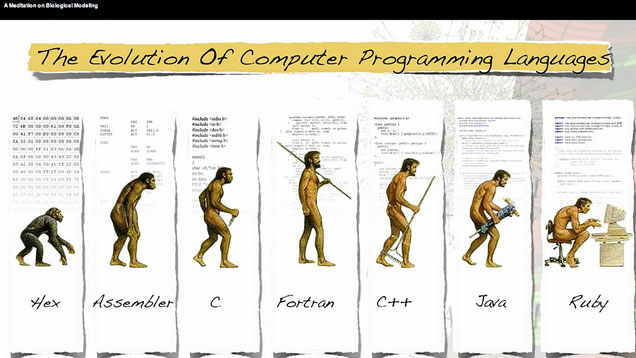
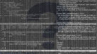

# [The Case for Learning C as Your First Programming Language](http://lifehacker.com/the-case-for-learning-c-as-your-first-programming-langu-1682070792)

56,8378

[8l](http://lifehacker.com/the-case-for-learning-c-as-your-first-programming-langu-1682070792# "Recommend")

#### Melanie Pinola

[Profile](http://melaniepinola.kinja.com/)[Follow](http://lifehacker.com/the-case-for-learning-c-as-your-first-programming-langu-1682070792#)

[[anexo ausente]](http://melaniepinola.kinja.com/)

[Melanie Pinola](http://melaniepinola.kinja.com/)

Filed to: [learn to code](http://lifehacker.com/tag/learn-to-code)

- [programming](http://lifehacker.com/tag/programming)
- [code](http://lifehacker.com/tag/code)
- [developers](http://lifehacker.com/tag/developers)

 [Tuesday 11:00am](http://lifehacker.com/the-case-for-learning-c-as-your-first-programming-langu-1682070792)

- [*C*Share to Kinja](http://lifehacker.com/the-case-for-learning-c-as-your-first-programming-langu-1682070792#)
- [*"*Share to Facebook](http://facebook.com/sharer.php?u=http%3A%2F%2Flifehacker.com%2Fthe-case-for-learning-c-as-your-first-programming-langu-1682070792)
- [**Share to Pinterest](http://www.pinterest.com/pin/create/api_other/?url=http%3A%2F%2Flifehacker.com%2Fthe-case-for-learning-c-as-your-first-programming-langu-1682070792&media=http%3A%2F%2Fi.kinja-img.com%2Fgawker-media%2Fimage%2Fupload%2Fs--vArLJbud--%2Fofrmwr4zn4vjabzbakgn.jpg&description=We%20could%20probably%20debate%20forever%20which%20programming%20language%20is%20best%20to%20learn%20first--it%20could%20depend%20on%20your%20goals%20and%20other%20considerations.%20Mac%20developer%20Evan%20Miller%2C%20however%2C%20makes%20a%20strong%20case%20for%20learning%20C%20first%2C%20likening%20it%20to%20learning%20to%20drive%20stick%20shift.)
- [*!*Share to Twitter](http://twitter.com/share?url=http%3A%2F%2Flifehacker.com%2Fthe-case-for-learning-c-as-your-first-programming-langu-1682070792&text=The%20Case%20for%20Learning%20C%20as%20Your%20First%20Programming%20Language)
- [*~*Go to permalink](http://lifehacker.com/the-case-for-learning-c-as-your-first-programming-langu-1682070792)
[))](http://lifehacker.com/the-case-for-learning-c-as-your-first-programming-langu-1682070792#)

 [1](http://lifehacker.com/hex-is-a-programming-language-now-or-are-we-referring-1682344007)

We could probably debate forever
[which programming language is best to learn first](http://lifehacker.com/which-programming-language-should-i-learn-first-1477153665)—it could [depend on your goals](http://lifehacker.com/learn-which-programming-language-to-choose-with-this-in-1669612111) and [other considerations](http://lifehacker.com/five-best-programming-languages-for-first-time-learners-1494256243). Mac developer Evan Miller, however, makes a strong case for learning C first, likening it to learning to drive stick shift.  N

[o](http://lifehacker.com/the-case-for-learning-c-as-your-first-programming-langu-1682070792#)

###### [Which Programming Language Should I Learn First?](http://lifehacker.com/which-programming-language-should-i-learn-first-1477153665)

Dear Lifehacker, With all the buzz about learning to code, I've decided to give it a try. The…
[Read more](http://lifehacker.com/which-programming-language-should-i-learn-first-1477153665)

> Python is convenient, and in many ways, a great advance over the C programming language. However, just as teaching teenagers to drive automatic transmission is a practical guarantee that they'll never learn stick, advising neophytes to learn Python is creating programmers who will never bother to learn how to code in C. And that, I believe, is a bad thing.  N

He writes that knowing C is definitely not a requirement for a productive career in software, but that learning a language like Python isn't challenging enough for the kinds of people who might become the best programmers—those who would dig deeper and figure out how computers work:  N

> C forces you to build a mental model of what the computer is actually *doing* when you run your programs, much like a teenager figuring out how the gear mechanism works by playing around with the clutch. As you ask *why* and keep digging for answers, your mental model will grow to encompass the process model, the CPU architecture, the memory hierarchy, the operating system, and so forth. It's that mental model — rather than the C language itself — that will enable you to poke through the abstractions created by others, and write programs you never thought possible.  N

Just some food for thought. ([Harvard's CS50](https://www.edx.org/course/introduction-computer-science-harvardx-cs50x), by the way, starts with C, and it is a head-banging yet great experience.)   N

[You Can't Dig Upwards](http://www.evanmiller.org/you-cant-dig-upwards.html) | Evan Miller  N

*Photo by [dullhunk](https://www.flickr.com/photos/dullhunk/4833512699/sizes/z/).*  N

[8l](http://lifehacker.com/the-case-for-learning-c-as-your-first-programming-langu-1682070792# "Recommend") 1291[Reply](http://lifehacker.com/the-case-for-learning-c-as-your-first-programming-langu-1682070792#)
