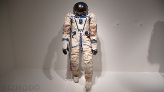
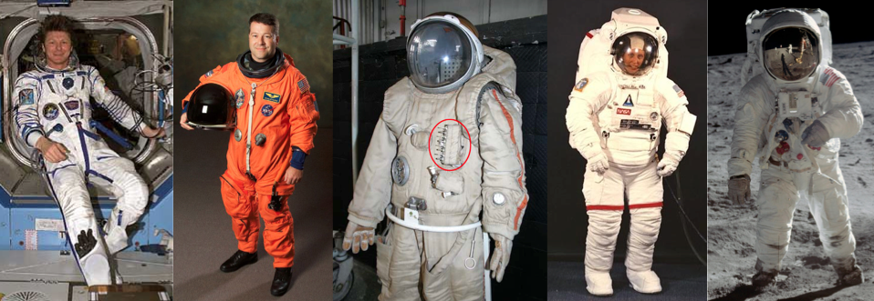
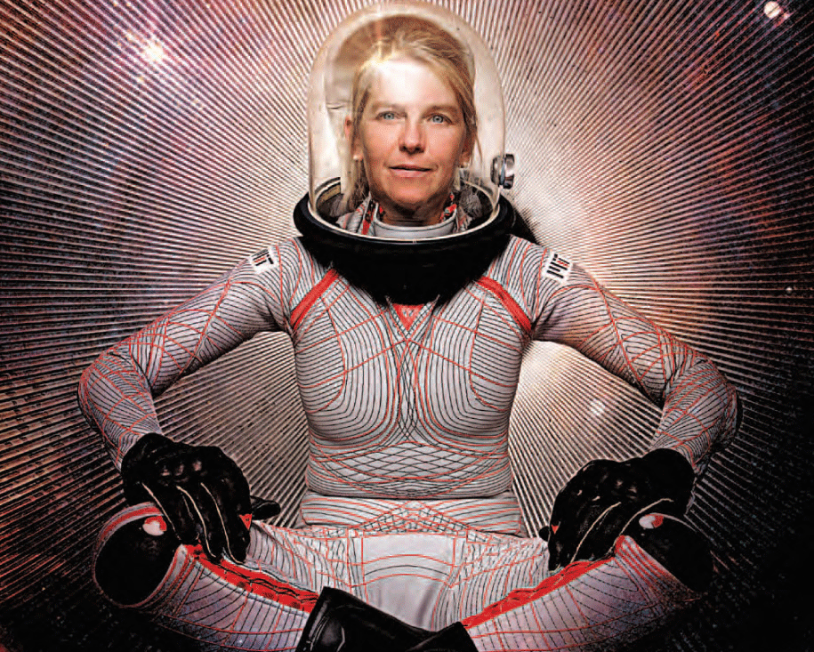

# [Gizmodo](http://m.gizmodo.uol.com.br/)

### [espaço](http://m.gizmodo.uol.com.br/espaco/)

# [Por que é impossível construir o traje espacial perfeito](http://m.gizmodo.uol.com.br/por-que-e-impossivel-construir-o-traje-espacial-perfeito/)

Por: [Robert Frost](http://m.gizmodo.uol.com.br/author/robert_frost/ "Posts de Robert Frost")

11 de fevereiro de 2015 às 16:15

COMPARTILHE 

 47 

 0

A primeira coisa que deve ser considerada quando se constrói um traje espacial é: para que ele será usado?

Não existe um traje universal. Cada um deles é desenhado para a missão a qual ele se designa, ou seja, cada caso é um caso. Por exemplo: o traje espacial Sokol, da Rússia, é, tecnicamente, um traje espacial. Mas ele é um traje de uso interno, logo, deve ser usado apenas dentro da espaçonave, e não em seu exterior. A função do traje Sokol é de proteger os cosmonautas do vácuo caso a espaçonave *Souyz* – nave espacial soviética com capacidade para até três pessoas — despressurize. Os figurinos dessas missões devem ser pequenos e flexíveis para não causar muitos problemas de locomoção e movimento dentro da apertada *Souyz*. E por não ter sido projetado para ser usado fora da nave, o traje não consegue carregar equipamentos robustos de suporte à vida ou controle térmico. Além disso, o material do traje não é muito resistente a rasgos e perfurações, de modo que não é adequado para vestir no espaço, repleto de poeira e detritos.

O mesmo pode ser dito para o traje americano — aquele laranja que eles usam em *Armageddon*. Ele não foi criado para o ambiente espacial. Ele foi criado para proteger o astronauta caso a nave despressurize e, assim como o traje Sokol, também foi desenhado para proteger o astronauta caso haja necessidade de pouso na água. Ele é laranja por ser uma cor chamativa, o que ajuda no trabalho dos profissionais de resgate. Além disso, ele é resistente à água e ajuda o astronauta a flutuar para não se afogar.

Agora, o traje russo Orlan e o americano EMU (*Extravehicular Mobility Unit* — Unidade de Mobilidade Extraveicular em português), estes sim são projetados para uso externo. No entanto, o design desses trajes não contempla o uso deles sobre terrenos, como a Lua ou Marte. Observe bem e você verá que o EMU não tem botas de verdade — não há uma proteção rígida como os trajes Apollo, usados para andar sobre a Lua.

Não mencionei o traje espacial chinês Faetian, já que ele é basicamente uma cópia do russo Orlan.

Construir um traje espacial é uma batalha entre proteção e mobilidade. Quanto mais se tenta proteger o astronauta, menos mobilidade ele tem. Quanto mais flexível for o traje, menos proteção ele dá.

## **Vácuo**

Obviamente, o vácuo é uma preocupação importante. Fluidos se movem de áreas de pressão alta para as de baixa pressão. No vácuo, todo os gases e líquidos de dentro do nosso corpo tentam sair. Cada milímetro da nossa pele se comprime enquanto todo o conteúdo sob ela tenta escapar para chegar ao vácuo. Um traje espacial serve para prevenir isso. Até então, eles conseguem atingir este resultado criando uma camada à prova de vazamentos que envolve o corpo e mantém ar entre o corpo e esta camada. O ar não está sob pressão normal (1.03 kgf/cm2), no entanto. Caso ficasse, os astronautas teriam que fazer uma força extraordinária para mexer braços e pernas. O EMU é pressurizado a 0.30 kgf/cm2, enquanto o Orlan é pressurizado a 0.40 kgf/cm2.

Trajes com materiais mais confortáveis, como bandagens que se apertam ao corpo, já foram sugeridos. Existem diversos designs muito interessantes com esse tipo de material, mas também existem bons motivos pelos quais NASA e Roscosmos não os adotaram ainda: é muito mais difícil vestir um traje espacial em microgravidade. Para vestir o traje Orlan, a mochila de equipamentos localizada nas costas do traje é desprendida e o astronauta entra por este vão. Com o EMU, depois que o torso é vestido pelo tripulante, os braços e pernas são inseridos e ajustados separadamente.

Mas um traje de bandagens seria como vestir uma roupa de mergulho dois números menor. E sem talco e chão para pisar. Imagina colocar uma roupa de mergulho minúscula enquanto se está flutuando por uma sala? Não parece nada fácil. O traje de bandagem oferece mais mobilidade, mas ao custo de duas horas adicionais de preparação e astronautas exaustos antes mesmo de sair da espaçonave. Além disso, este traje causa muito atrito, podendo causar dor. Há também o problema do controle térmico do corpo, que é muito mais complicado quando se veste um destes. Mas mesmo com todos os poréns, o traje de bandagens ainda é uma área que merece ser pesquisada. Dava Newman, do Instituto de Tecnologia de Massachusetts, está fazendo exatamente isso. Um dos desafios que ela tem encontrado é como conectar com sucesso um capacete pressurizado a gás a um traje pressurizado por compressão, que é o caso da vestimenta de bandagens. Outro desafio que ela encontra é relacionado ao tamanho das vestes espaciais. Para servir propriamente, cada traje deve ser individualmente desenhado para o astronauta em questão. No entanto, seis meses no espaço podem alterar o formato do corpo do tripulante. Abaixo você vê um dos designs da Dava:

**>>> [Leia mais sobre esse traje desenvolvido pelo MIT](http://gizmodo.uol.com.br/traje-espacial-mit/)**

## **Extremos Térmicos**

Na luz do Sol, um traje espacial pode aquecer a 200 graus Celsius, enquanto na escuridão, ele pode chegar a 200 graus Celsius negativos. As camadas externas dos trajes espaciais lidam com esses extremos sem problemas, seja refletindo a radiação ou fazendo com que o calor interno não se dissipe. Mas o maior desafio dos problemas térmicos é relacionado ao calor gerado pelo corpo do próprio astronauta. O tripulante que participar atividades extraveiculares — isto é, que sairá da espaçonave — se exercitará e produzirá calor, e o sistema térmico precisa eliminar este calor o mais rápido possível. A NASA e a Roscosmos usam um sistema de LCG (*Liquid Cooling Garment* — vestimenta de resfriamento líquido em português), que lembra uma roupa de mergulho com tubos. A água que corre por dentro dos tubos conduz o calor do corpo para fora da veste. Colocar um traje de resfriamento por baixo do traje de bandagens é um desafio, já que o espaço é ridiculamente limitado.

## **Radiação**

O espaço está repleto de radiação danosa aos seres humanos. O traje espacial precisa proteger o astronauta destas ameaças, seja da radiação ultravioleta vinda do Sol, dos raios cósmicos ou mesmo a radiação da antena transmissora.

## **Perfurações de impacto**

Um grão de areia em velocidade orbital pode ser tão perigoso quanto uma bala. Embora o traje não proteja o astronauta dos detritos grandes, ele o resguarda contra os menores, tanto para proteger o astronauta de feridas graves como para manter a pressão do traje. Isso é feito graças às múltiplas camadas de material resistente presentes nas vestes. A camada externo do traje EMU, da NASA, usa kevlar (a fibra usada em coletes à prova de balas) incorporada a ela. Tanto o EMU como o Orlan têm uma camada externa feita de um material chamado orthofabric — uma mistura de [Gore-Tex](http://en.wikipedia.org/wiki/Gore-Tex), [Kevlar](http://en.wikipedia.org/wiki/Kevlar) e [Nomex](http://en.wikipedia.org/wiki/Nomex) — que tem uma camada de [Mylar](http://chemistry.about.com/od/polymers/f/What-Is-Mylar.htm), para proteção extra.

## **Rasgos e saliências no ambiente de trabalho**

A NASA tem restrições rigorosas para que seus equipamentos não tenham bordas afiadas, mas a longa exposição ao espaço pode vir a causar fendas e descosturas. Uma luva pode desenvolver, com o tempo, cantos afiados que poderão rasgar ou esgarçar o traje, por exemplo. Por conta de problemas como este, a NASA chegou a fazer alterações na luva do traje EMU.

## **Mobilidade & ergonomia**

### **Capacete**

Capacetes devem proteger a cabeça, por isso todos os designs devem ser construídos com material rígido e forte. O capacete do traje EMU é feito de policarbonato, por exemplo. No entanto, o volume dele e os mecanismos que o conectam ao torso do traje limitam os movimentos do astronauta, quando ele vai virar a cabeça, por exemplo. É mais ou menos como o [uniforme do Batman interpretado por Michael Keaton:](http://i.kinja-img.com/gawker-media/image/upload/s--8E88be3b--/vwkaiyamhricnebfucdz.jpg) o capacete era conectado ao uniforme por uma espécie de pescoceira que o impedia de virar a cabeça, então, ele precisava virar todo o corpo para ver algo. Isso é parcialmente solucionado nos trajes espaciais, pois com um capacete grande, o campo de visão é maior, sendo possível virar a cabeça — de leve — para ver algo.

Luz é muito importante para o astronauta trabalhar em áreas externas. Como o Sol nasce e se põe a cada 90 minutos (quando em órbita terrestre baixa) o astronauta precisa estar apto ligar e desligar luz rapidamente. Isso foi solucionado com luzes dentro do capacete e com uma segunda camada externa do capacete, banhada em ouro, que funciona mais ou menos como um óculos de sol.

### **Torso**

Os torsos são geralmente bem rígidos já que são eles que carregam grande parte da interface e do equipamento. Em um traje volumoso, alcance e flexibilidade são limitados, então todo controle que o astronauta precisa acessar deve estar localizado nos braços ou no peito.

### **Braços e pernas**

Precisam de flexibilidade, mas devem estar protegidos contra danos. Ferimentos no joelho são bastante comuns para os astronautas que performam atividades extraveiculares.

### **Luvas**

É um desafio fazer luvas que protegem, mas ao mesmo tempo são flexíveis e pequenas o suficiente para não atrapalharem os dedos em atividades normais, como segurar um parafuso ou apertar um botão. Só para você ter uma ideia, coloque luvas de forno ou de couro e tente usar uma chave de fenda para desmontar seu controle remoto da TV. Difícil, né? Além disso, por estarem longe da cabeça e do torso, as luvas precisam de aquecimento.

Um detalhe interessante é que astronautas que executam estas missões extraveiculares costumam perder as unhas devido à maneira como a luva se encaixa nas mãos.

### **Alcance antropométrico**

Aqui o traje EMU tem vantagem sobre o Orlan. Alcance antropométrico significa quanto da população pode usar o traje. O Orlan é um traje de peça única que não pode ser facilmente adaptado a pessoas de tamanhos diferentes, enquanto todos os trajes EMU compartilham um torso comum, e os braços e pernas são facilmente trocados por membros maiores ou menores, dependendo do tamanho do astronauta. O Orlan é um traje de tamanho único, com cintas ajustáveis para os braços e pernas. O EMU pode acomodar 5% das mulheres e 95% dos homens.

Trajes espaciais são muito caros de produzir e não existe a necessidade de produzir um traje para cada pessoa, de modo que o mais fácil seria criar trajes que se adaptem aos diferentes tipos de corpos dos astronautas.

## Outras preocupações

### Longevidade

O traje russo Orlan é certificado para 15 usos (ou 4 anos), depois disto devem ser descartados. Os americanos EMU são remodeláveis e podem durar até mais de 25 anos. Mas, conforme mencionado anteriormente, nenhum dos dois foi projetado para uso em solo na Lua ou em Marte. Os trajes não resistem a ambientes como esses porque lá, poeira e detrito espacial danificam a veste. Um traje para esse ambiente deve ser fácil de manter e limpar. Preferivelmente, deve até repelir poeira e sujeira, especialmente porque trazer isto para dentro da espaçonave é um perigo para a tripulação, e pode trazer coisas como problemas respiratórios causados por poeira cósmica.

### Duração

O EMU foi projetado para ser usado por até sete horas contínuas e o Orlan, por seis horas e meia. Caminhadas no espaço precisam de muita preparação. Não queremos trajes que não podem operar de forma tão longa quanto estes dois.

### Sistema de suporte à vida

O Orlan tem o sistema de suporte à vida dentro do próprio traje, enquanto o EMU o carrega em uma mochila externa. Ambos funcionam em circuito fechado com 100% de oxigênio, além de usar gás carbônico removível e recarregável.

### Controle térmico

Os trajes Orlan e EMU usam o sistema de resfriamento líquido mencionado anteriormente que esfriam por uso de um sublimador. Ambos suportam até 600 watts de metabolismo basal.

### Evacuação

É possível urinar, defecar e até vomitar dentro do traje espacial.

### Comida e água

O traje providencia água potável ao astronauta. Eles suam muito durante missões externas, sendo preciso repor a água do corpo. Em missões externas longas, alimento é providenciado para evitar casos de hipoglicemia.

### Resistência à água

Pode soar estranho, mas é importante. Grande parte do treinamento de missões externas é feito em piscinas. É importante que o traje usado nesses testes e o traje usado no espaço não tenham diferenças detectáveis pelo astronauta.

### Peso

O peso da traje não é importante para missões externas, quando em órbita terrestre baixa. Mas podem ser um fator importante em missões em Marte ou na Lua. O EMU pesa cerca de 127 quilos e o Orlan, cerca de 104 quilos.

### **Suporte**

Um traje deve ter correntes de segurança, cinto de utilidades, além de usar alças e ferramentas padronizadas.

### Possíveis melhorias

Pensa-se em inserir HUDs  (em inglês Heads Up Display), que dão aos capacetes a função de mostrar informações e auxiliadores de trabalho diretamente no visor. Algo comum em videogames — pense nas barras de energia do personagem — e parecido com o que o Google Glass tentou fazer.

***[Sobre o autor](http://www.quora.com/Robert-Frost-1):** Robert Frost trabalha para o diretório de operações de voo da [NASA](http://nasa/). Ele passou dez anos treinando astronautas e controladores de voo em orientação, navegação, controle e propulsão para a Estação Espacial Internacional e cinco anos trabalhando para o escritório de treinamento de viagens espaciais, gerenciando projetos e conduzindo treinamentos. Ele agora trabalha para o grupo de controle de voo de veículos de visita e tecnologia de integração avançada para a *Estação Espacial Internacional. [[Quora](http://www.quora.com/What-are-all-the-factors-considered-in-the-design-of-a-space-suit)]**

  
VOLTAR AO TOPO

[VISITE A VERSÃO COMPLETA](http://www.gizmodo.com.br/por-que-e-impossivel-construir-o-traje-espacial-perfeito/?modeview=full "Versão completa")
