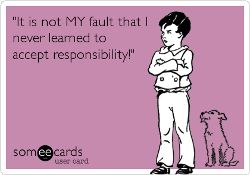

# "Made in Brazil"

### ["Made in Brazil"](http://maovisivel.blogspot.com.br/2015/02/made-in-brazil.html)

quarta-feira, fevereiro 18, 2015    
[Sem comentário](http://www.blogger.com/comment.g?blogID=166497424090410357&postID=5300722388342518365&isPopup=true)

No final de 2013 muito se falava sobre a possibilidade da chamada “tempestade perfeita”, entendida à época como a combinação profana do rebaixamento da nota da dívida brasileira com o aumento das taxas de juros nos EUA. Segundo o ex-ministro Delfim Netto, em tal cenário teríamos “
[uma rápida elevação da taxa de juros no mundo, uma mudança dos fluxos de capitais, um ajuste instantâneo e profundo da nossa taxa de câmbio, uma redução do crédito bancário, uma queda dramática da renda real dos trabalhadores e a volta (...) de taxas de juros reais aos absurdos níveis com que vivemos durante tantos anos, acompanhados por um aumento do desemprego](http://avaranda.blogspot.com.br/2013/10/a-tempestade-perfeita-antonio-delfim.html)

Embora a nota da dívida tenha sido rebaixada, não chegamos a perder (ainda!) o “grau de investimento”, nosso atestado de bons pagadores. Por outro lado, em que pesem os sinais de recuperação cada vez mais evidentes da economia americana, como mostrado no último relatório do mercado de trabalho, as taxas de juros (no caso para aplicação nos títulos de 10 anos do Tesouro) se encontram cerca de um ponto percentual mais baixas do que eram à época, na casa de 1,80% ao ano. A verdade é que esta temida “tempestade perfeita” (ainda) não ocorreu.

No entanto, à falta da ajuda meteorológica estrangeira, o governo, com sua competência habitual, tratou de criar a versão brasileira deste desastre climatológico-econômico.

O consenso entre os economistas que contribuem para a pesquisa
**Focus**, do BC, aponta para crescimento nulo em 2015 com a inflação superando 7%, e isto num cenário que não contempla racionamento de energia e água (ainda; perdão pela repetição do advérbio).

Assim, o mercado de trabalho, que não foi bem do ponto de vista de geração de empregos em 2014, deve provavelmente ter desempenho ainda pior em 2015. Neste contexto é difícil imaginar que a taxa de desemprego vá permanecer tão baixa quanto nos últimos anos.

É tentador atribuir este quadro desolador às políticas adotadas no período mais recente e não tenho a menor dúvida que economistas já conhecidos por seu baixo apego à honestidade intelectual não hesitarão em fazer exatamente isto. Aliás, não parece ser outra a motivação do
[manifesto “heterodoxo”](http://www.valor.com.br/brasil/3892154/signatarios-de-manifesto-de-apoio-protagonizam-agora-revolta-heterodoxa) publicado na semana passada.

A verdade, contudo, é que a “tempestade perfeita” vem sendo gestada domesticamente há anos, mas ganhou velocidade do final de 2014 para cá.

Do lado da política macroeconômica, a irresponsabilidade foi a norma. A incapacidade de reconhecer que a desaceleração da economia brasileira resultava essencialmente de limitações do lado da oferta levou a políticas de aumento sem precedentes do gasto governamental, assim como o desmonte da estrutura institucional que impunha alguma disciplina ao setor público. A Lei de Responsabilidade Fiscal foi devidamente imolada no altar da “nova matriz macroeconômica”.

Da mesma forma, o descaso com a inflação ficou evidente na condução desastrada da política monetária de 2011 para cá, também implicando considerável retrocesso institucional.

Tão, ou mais, importante, porém, foi a deterioração da política microeconômica. Retomando velhos vícios no que se refere à intervenção no domínio econômico, o governo desarticulou setores importantes, reduzindo ainda mais o ritmo de expansão da produtividade, agravando o problema do baixo crescimento.

O resultado destas políticas não poderia ser diferente do observado: estagnação, inflação acima da meta, déficits externos elevados e dívida pública crescente, agravados agora pela gestão desastrosa tanto da Petrobras quanto do setor energético, supostamente áreas de especialidade da presidente.

A “tempestade perfeita” é apenas o ponto culminante dos erros do governo, cuja responsabilidade cabe igualmente aos economistas que não só aplaudiram a política econômica da presidente, mas também pediram bis, e agora tentam desajeitadamente fingir que nada tem a ver com o problema.

(Publicado 11/Fev/2015)

Posted in:

|  |  |
| --- | --- |
| Reações: |  |
