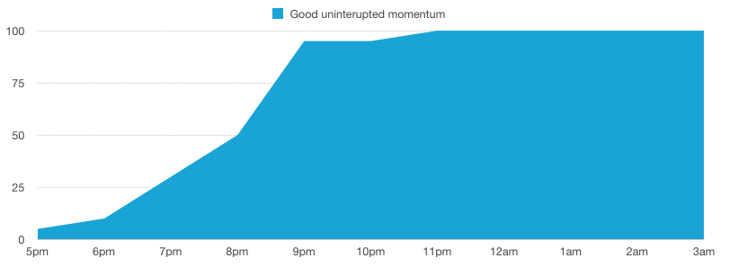
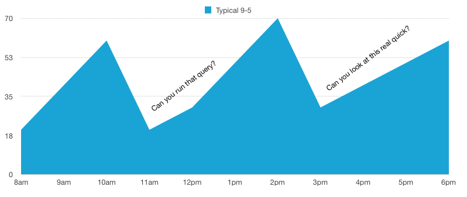

# Programmer Momentum

#### Why a 15 minute side track actually costs an hour

I have been struggling for the past month with my productivity. I feel like I’m not getting enough done in general. I started to explore this and figure out what’s going on at work or otherwise that is preventing me from actually making decent progress on my projects. The research ended up being really productive.

> mo·men·tum (mōˈmen(t)əm,məˈmen(t)əm/)  
> the quantity of motion of a moving body, measured as a product of its mass and velocity.

When I sit down to code a project, I don't just jump right in. If it’s the start of a project, or the start of the work day, I have to load a lot of data into my head. Think about it like mental ram.

- What language is this part in?
- All of the syntax of that language
- What is the purpose of the project currently at hand?
- Is this an efficient way to solve this problem?
- Will this cause me technical debt later on?
- Will this affect another part of the application?

If you're a lead you also need to think about

- Will this make money / good business decision?
- Is this something that can be reusable?
- Is this really the best customer experience?

And these are just the meta details, not even the actual problem at hand. For that you’ve got math, standard programming practices, the business logic, database queries, plugin nuances, your own code specifics and more.

The best momentum comes in the form of foreshadowing. You've got the short term road map in your head and you have the next two steps loaded up ready to be coded. My favorite way to build momentum is to write the steps ahead of time in comment form.

```
// connect to the database  
// pull client information  
// create a cache of that data  
// connect to the UPS api  
// use package data to create an estimate  
// approve estimate  
// generate shipping label  
// use graphicsmagik to convert the raw data into PDF  
// combine PDFs into a single page  
// serve PDF to the user
```

I love a list like this. It’s challenging and gives you something to look forward to. When you know how to do each item your momentum increases exponentially. You start to get these things done faster, more efficiently and more effectively than you would otherwise.



Total progress = 733

*Note: To even get to the point where you can knock out the above comment list, you'd have to have already completed the first mental list of basics.*

### Breaking the momentum

There are three major things that can totally destroy your momentum. Things that can decrease your ability to complete the task by two or three times.

1. Something isn't working as expected.
2. Someone has interrupted you. (email, skype, text, coworker, twitter)
3. Time’s up (go home, go to sleep)

#### Something isn't working as expected

This really sucks, but it’s very common. You think you know how to use the UPS api, but for some reason it’s not working. You've done this before, you know how it’s supposed to work, but when you test — it’s blank. If you're lucky enough to get a good error message then you usually don't lose much momentum. But if you're not so lucky, you're about to fall hard. At this point you have a few options

1. Find some working code and compare
2. Google it
3. Ask on stackoverflow
4. Chat a friend and interrupt them
5. Post an issue to github and hope they are quick
6. Think of a new way

All of these just completely ruin any momentum you had. Forget the checklist, forget getting it done anytime soon, now you have to focus on this random thing you never intended to spend more than two minutes on.

**My solution** to this is to gain experience. The more experience you have, the more problems you get to solve and the less chance there is that you can't figure it out quickly. ***Learn to debug!*** Experience also teaches you how to google for things more effectively and can allow you to find the answer faster.

#### Interruptions

These are the biggest time suck. Your boss, a co worker, a meeting; these things really get in the way. They cause you to lose focus and every minute you are away from your project is three hours that you’ve lost in momentum.

Let’s say you're about to write a loop that checks all the packages for size, contents and maybe calculate dimensional weight. Then you are asked “Hey can you grab me xyz from the database real quick?”. I'm inclined to say “yes” and get the data. But this might take 4 minutes, maybe I needed to lookup a SQL command or remember how some structure was laid out. Don't forget for every project (even this side track) I need to load up that whole first list. At this point some of the first project’s mental ram is fading.



Total progress = 430

By the time you get back to it, you need to reload some of your mental data and figure out where you left off. Chances are pretty good that you've lost your spot. Where was I in this loop? What is that dimensional weight algorithm?

**My solution** is to respond to the interruption with a priority. “Do you need this right now? No? Send me an email” If you spend ten minutes on a small task you've lost a half hour. If you spend an hour in a meeting you’ve lost three hours of programming time.

> If you spend an hour in a meeting you’ve lost three hours of programming time.


Total progress = 309

#### Time’s up

Life gets in the way of your code. You have to leave work, you need to go to bed, your boyfriend/girlfriend/SO wants to spend some quality time with you.

You're torn because you *want* to do these things, but you also know how much you'll lose if you stop. If you've never worked 10 hours straight then you don’t know how it feels. But trust me, once you're on a roll working 10 hours in a row is easy and amazingly efficient.

If you want to be seen as super productive at your job, carve out one or two of these long uninterrupted coda-thons each week.

Be careful though, you need to know when to stop. If you start making really stupid mistakes, or you run into a seemingly unexplainable problem you need to stop. Walk away and go home. There is a high probability you will fix it right away tomorrow.
