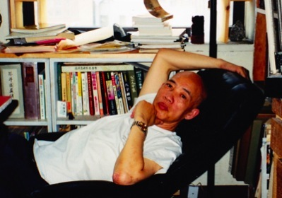
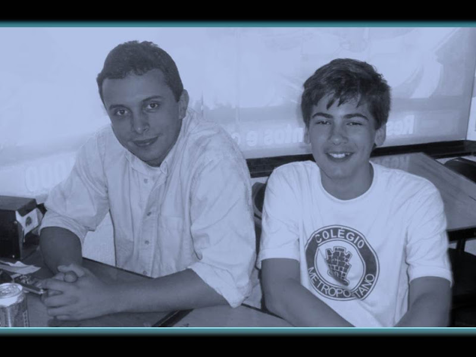
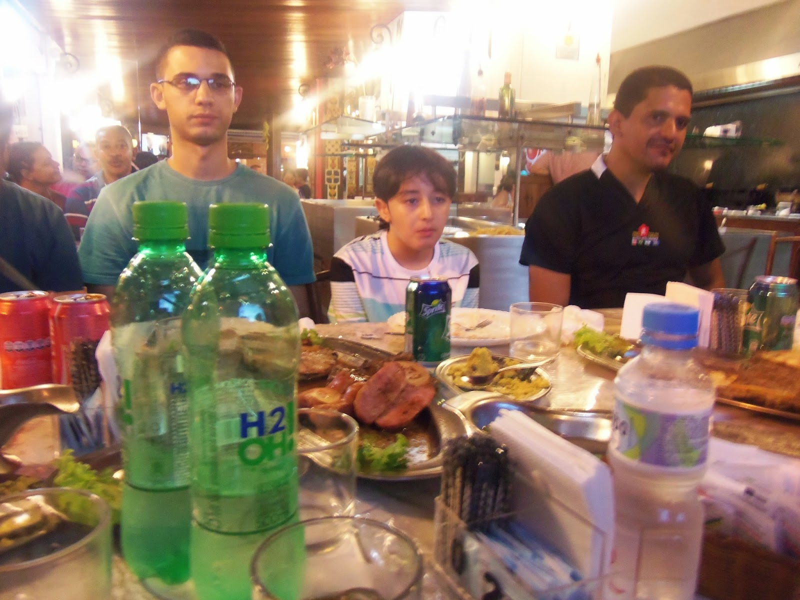
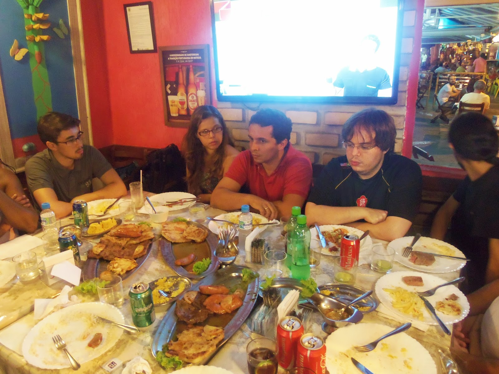
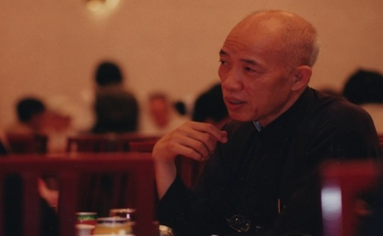

# INVITATION FOR THE NEW MEMBERS OF KUNG FU FAMILY

Uma vez me foi contado que quando questionado sobre a data do início de sua Família Kung Fu, Grão-Mestre Moy Yat deu a data de sua entrada na Família Ip Man. Segundo ele, se não fosse aquele momento. Tudo o que veio depois, incluindo a abertura da Família Moy Yat, não teria acontecido.  
  
Once I was told that when someone asked about the date of the beginning of Late Grand-Master Moy Yat´s  Kung Fu Family, Grand Master Moy Yat himself gave the date of his entry in the  Ip Man Family. According to him, if was not for that moment. All that came after, including the opening of the Moy Yat Family, would not have happened.

**CONVITE DOS NOVOS MEMBROS DA FAMÍLIA KUNG FU**

**INVITATION FOR THE NEW MEMBERS OF KUNG FU FAMILY**

Em 2012 (foto) tive uma oportunidade inédita na minha jornada dentro do Ving Tsun: Convidar alguém a entrar na Família Kung Fu no lugar de Si fu(foto).

O convidado na ocasião foi Alexandre Ribeiro durante almoço(foto) no próprio bairro do Méier.

In 2012 (photo) I had an unprecedented opportunity in my journey within the Ving Tsun: Invite someone to join the Kung Fu Family in place of Si fu (photo).  
The new member at the occasion was Alexandre Ribeiro during lunch (photo) in the very neighborhood of Meier.

(da esq p/ dir: Fabiano Granado, Dani Eustáquio e Vagner Marinho)

(from left to right: Fabiano Granado, Dani Eustáquio and Vagner Marinho)

Três anos depois, tive a mesma honra desta vez num jantar onde três aspirantes a membro da Família Moy Jo Lei Ou seriam convidados por mim em nome do Si Fu: Fabiano Granado, Dani Eustáquio e Vagner Marinho.

Estes três praticantes participaram do módulo "Ving Tsun Experience" presente como instrumentalização do Programa Moy Yat Ving Tsun de Inteligência Marcial em nossos Núcleos Licenciados. Este módulo tem por finalidade o reconhecimento dos descendentes de Grão-Mestre Moy Yat, bem como, dar a oportunidade que os próprios participantes se reconheçam como tal.

Three years later, I had the same honor this time at a dinner where three aspiring members of the Moy Jo Lei Ou Family were invited by me on behalf of Si Fu: Fabiano Granado, Dani Eustaquio and Vagner Marinho.

These three practitioners participated in the module "Ving Tsun Experience" this is an instrument of the Moy Yat Ving Tsun Martial Intelligence Program in our Licensed Schools. This module aims at the recognition of Grand Master Moy Yat descendants and give the opportunity to the participants themselves recognize themselves as such.

Fiquei feliz por compartilhar este momento com vários irmãos Kung Fu e minha noiva. Em nossa Família , além do ato de simplesmente se fazer saber do desejo de ingressar na Familia Kung Fu, um ato relacional(Podendo representar aqui a "Humanidade" do processo) . O momento do convite é a formalização(Rito) presente neste processo de forma a criar um marco que deixe este desejo de ambas as partes com a adequação necessária.

I was happy to share this moment with several Kung Fu brothers and my fiancee. In our family, beyond the act of simply conveying the desire to join the Kung Fu Family, a relational act (Being able to represent here the "humanity" of the process). The time of the invitation is the formalization (Rite) present in this process in order to create a framework that let this desire of both parties with the necessary protocol.

Agora não é mais dificil de entender a resposta de Grão-Mestre Moy Yat(foto). Todas as aventuras, todos os grandes momentos, todos os momentos mais simples. As superações e os sorrisos. Tudo isso eu só vivi no Ving Tsun, porque entrei na Família Kung Fu.

Porém, entrar na Família Kung Fu não lhe dá poderes . Você precisa se permitir desfrutar de momentos , inclusive aqueles que você julga triviais. Saber apreciar qualquer coisa que se apresente a você. Entender que você faz a sua história todos os dias dentro dessa jornada.

Que Vagner, Fabiano e Dani possam viver isso tudo...

Now it is not hard to understand the Grand Master Moy Yat answer (photo). All adventures, all the great moments, all simpler times. The overruns and smiles. All this I only lived in Ving Tsun, because I entered the Kung Fu Family.  
But enter the Kung Fu Family does not give you powers. You need to allow yourself to enjoy moments, including those you deem trivial. To appreciate anything that is presented to you. Understand that you do your history every day in this journey.  
Vagner, Fabiano and Dani can live it all now ...

**THE DISCIPLE OF MASTER JULIO CAMACHO**

**Thiago Pereira "Moy Fat Lei"**

**moyfatlei.myvt@gmail.com**
