# [BLOG DO PEREIRA (the peartree´s blog)](http://moyfatlei.blogspot.com.br/)

## Wednesday, 11 February 2015

### "Jaau Wai" in "Crouching Tiger, Hidden Dragon"

[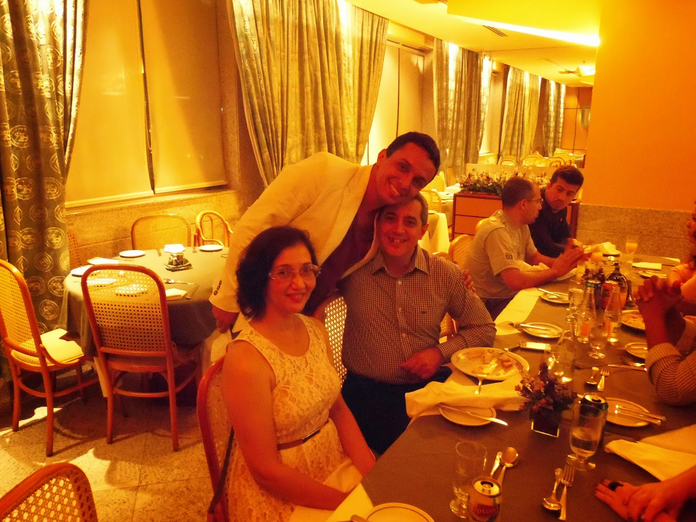](http://1.bp.blogspot.com/-DUYlMZEuiVI/VNpUqv93_EI/AAAAAAAARqs/NulCopEJOJk/s1600/100_0144.JPG)

Mestre Ricardo e sua esposa Sra Flavia (foto) são os líderes da Família Moy Ke Lo Si e pessoas que sempre me tratam com muito carinho.  
Até 2003, a única Familia da Linhagem Moy Yat que existia no Rio de Janeiro era a Família Moy Yat Sang liderada por Si Gung. A partir daquele ano, começando pela Família Moy Jo Lei Ou, outras foram surgindo e o “Mo Lam” de nossa própria linhagem foi se tornando mais complexo.  
No filme “O Tigre e o Dragão”, esse círculo marcial baseado na literatura “Wuxia” recebe o nome de “Jiang Hu” que poderia ser traduzido como “Rios e Lagos”.  
  
Master Ricardo and his wife Mrs. Flavia (photo) are the leaders of Family Moy Ke Lo Si where people always treat me with great affection.  
Until 2003, the only Family from Moy Yat Lineage that existed in Rio de Janeiro was the Moy Yat Sang Family led by Si Gung. From that year, starting with Moy Jo Lei Ou Family, others came along and the "Mo Lam" of our own lineage became more complex.  
In the movie "Crouching Tiger, Hidden Dragon", this martial circle based on the literature "Wuxia" is called "Jiang Hu" which could be translated as "Rivers and Lakes".

Em “O Tigre e o Dragão” um dos melhores exemplos que o cinema recentemente produziu sobre estas relações intricadas do Circulo Marcial, conhecemos a interação entre alguns personagens importantes: Sir Te , Governador Yu , Jen , Shu Lien e Li Mu Bai.  
  
In this movie one of the best examples recently produced about these intricate relationships of Marcial Circle, know the interaction between some important characters: Sir Te, Governor Yu, Jen, Shu Lien and Li Mu Bai.

[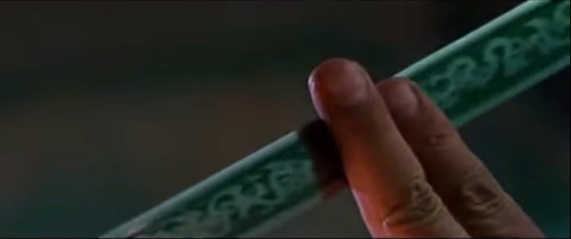](http://2.bp.blogspot.com/-uXstrWV7LfY/VNtQ62VTpYI/AAAAAAAARrg/bgr0vjoS_dU/s1600/sr%2Bt.jpg)

Na primeira cena que gostaria de comentar sobre a necessidade de atenção constante e do monitoramento do que acontece a sua volta, vemos Sr T tomando chá com o recém chegado Governador que está admirando a espada “Destino Verde”(foto) . Presente dado a Sr T por Li Mu Bai pouco tempo antes.  
O Governador admira a espada , e percebendo o brilho nos olhos do Governador, Sr T começa a descrever cada detalhe dela: Desde a espessura da lamina, até a pintura que poderia indicar a qual período ela pertenceria. Aquilo apenas inflamou ainda mais o feitiche do Governador pela espada. Sr T muda de assunto e começa a falar do “Jiang Hu” de BeiJing. Esse mundo de “Tigres e Dragões”.  
  
In the first scene I would like to comment on the need for constant attention and monitoring of what happens around you, we see Sir Te having tea with the newcomer Governor who is admiring the sword "Green Destiny"(photo above). Gift given to Sir Te by Li Mu Bai shortly before.  
The Governor wonder the sword, and realizing the brightness in the eyes of the Governor, Sir Te begins to describe every detail of it: Since the thickness of the blade, to the painting that could indicate which period it belongs. That only further inflamed the fetish of the Governor by the sword. Sir Te changes the subject and starts talking of "Jiang Hu" of BeiJing. This world of "Tigers and Dragons."

[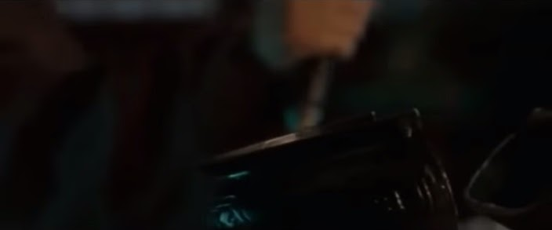](http://3.bp.blogspot.com/-driH1Tex1qU/VNtRFRX0SoI/AAAAAAAARro/T9XcSivkMR0/s1600/sr%2Bt2.jpg)

Sr T pega a espada e com um único golpe viril porém suave, parte em dois um dos recipientes de chá bem na frente do governador e diz: “Voce precisa ser flexível, porem firme. É assim que se governa”.  
Desta forma, Sr T passou o seu recado sobre o “Jiang Hu” com uma experiência significativa, além de mostrar ao Governador que espada não é um artigo de decoração ou para ser apreciado sem que se esqueça sua natureza.  
Pois como diz Karyn L Lai(2008):  “ ...No Pensamento Chinês , enquanto é reconhecido que os indivíduos são sujeitos de suas experiências, também é importante entender que as experiências são compreendidas por completo apenas dentro de um pano de fundo...”  
  
Sir Te takes the sword and with a single blow manly but gentle part in two a tea cup  right in front of the governor and says, "*You need to be flexible, however firm. This is how to govern*. "  
Thus, Sir Te spent his message on the "Jiang Hu" with significant experience, and show the Governor that sword is not a decorative item or to be enjoyed without forget its nature.  
For as Karyn L Lai  (2008): "... *In Chinese thought, while it is recognized that individuals are subjects of their experiences, it is also important to understand that the experiences are completely understood only within a background* .. . "  
  
**Jaau Wai.**  
  
Dentro da lógica do Ving Tsun, numa perspectiva Kung Fu, podemos entender que quando posicionamos nossos pés apontados para frente, inúmeras linhas surgem dentro do que chamamos de “Dimensão Kung Fu”, uma “Dimensão Intangivel ”. Essas linhas são os locais que vamos pisar quando nos movimentarmos. E a troca de linhas se chama “Jaau Wai”.  
Por isso, muita gente não percebe a importância do trabalho com as pernas dentro da lógica do Jaau Wai.  
  
Within the Ving Tsun logic, a Kung Fu perspective, we can understand that when we place our feet pointed forward, numerous lines arise within what we call "Dimension Kung Fu," an "Intangible Dimension". These lines are the places that we tread when we MOVE. And the exchange of lines is called "Jaau Wai".  
So many people do not realize the importance of working with the legs inside the Jaau Wai logic.

[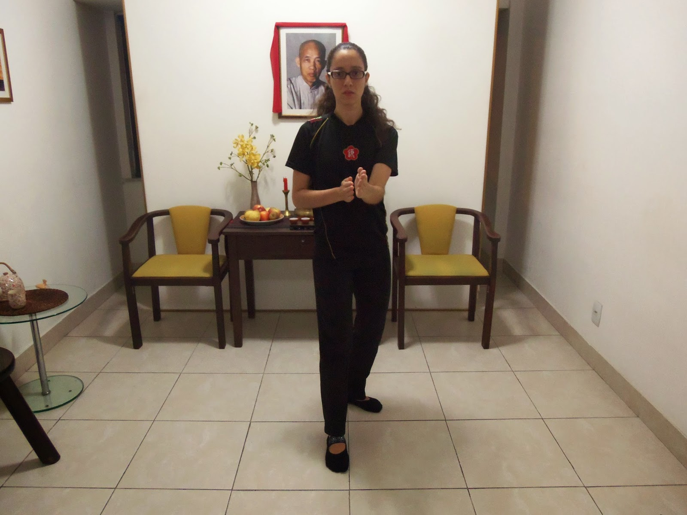](http://2.bp.blogspot.com/-B0Xs8tAUWVs/VNpX_yfTFyI/AAAAAAAARrA/L7jyDErlqsA/s1600/103_2480.JPG)

(Sam , aluna de Mestre Ursula, mostra seu Jaau Wai ao se posicionar em guarda com um dos pés a frente)

(Sam, student of Master Ursula, shows her Jaau Wai while she stands in guard puting one of her feet foward)

Você só sabe em quais linhas a pessoa está a partir do seu primeiro passo.  E por isso, que ao se posicionar numa guarda com um dos pés a frente, você já está entregando o seu “Jaau Wai”.  
You just know in which lines the person is from your first step. And so, that when positioning a guard with one foot forward, you're delivering your "Jaau Wai".

[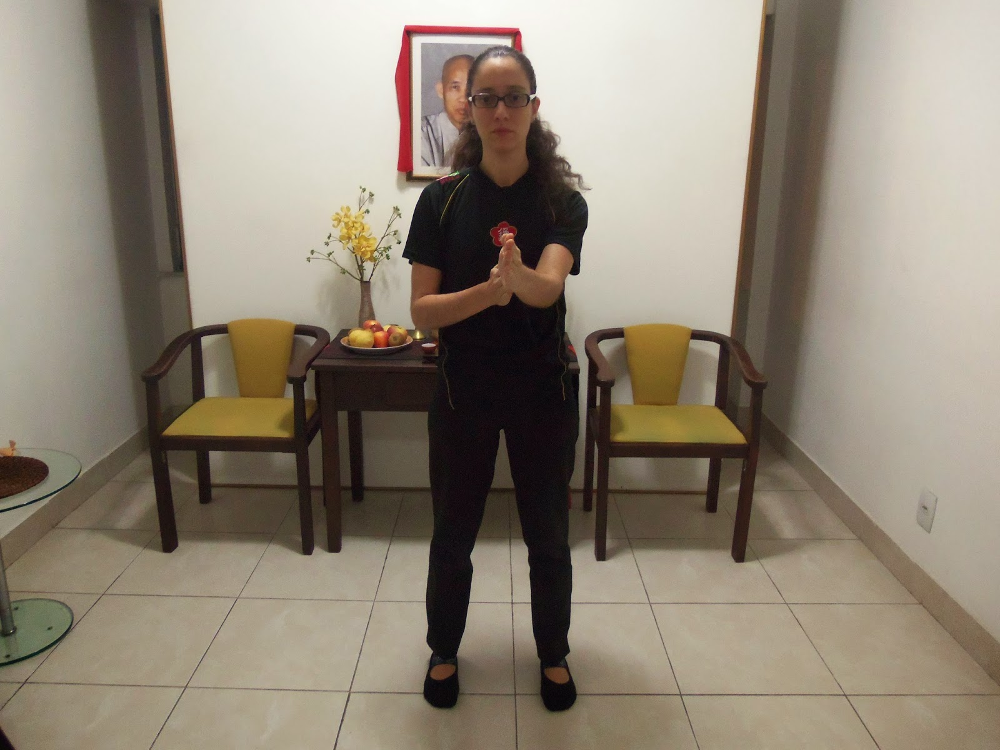](http://3.bp.blogspot.com/-FLWis3va9Pw/VNtWXW0wBuI/AAAAAAAARsM/qTad8rDlQMo/s1600/103_2479.JPG)

(Sam se mantém neutra sem mostrar seu Jaau Wai)

(Sam stand neutral without showing her Jaau Wai)

 Desta forma, podemos observar que um bom Jong Sau, dentro deste pensamento, é um Jong Sau (posição de guarda) em que os pés não entregam o seu Jaau Wai a seu adversário, de forma a ele já saber para onde deverá angular.  
Thus, we can see that a good Jong Sau, within this thinking, is a Jong Sau (guard position) where the feet do not deliver your Jaau Wai to your opponent, so he already knew where should angular.  
**“Jaau Wai” em “O Tigre e o Dragão”**  
**"Jaau Wai" in "Crouching Tiger, Hidden Dragon"**

[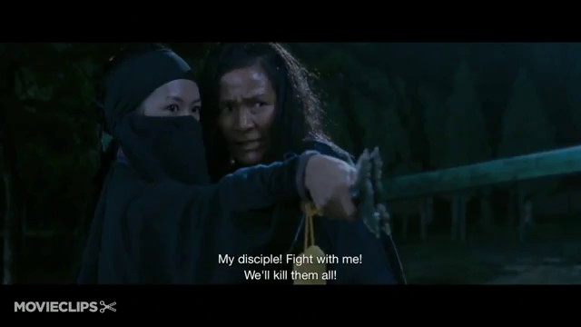](http://dlm11.meta.ua/pic/0/97/32/DtDkIQhRvq.jpg)

Jen (Zhang Zhi Yi) filha do governador, secretamente aprende o Kung Fu de sua cuidadora que na verdade é uma Mestra chamada Raposa Jade.  
  
Jen (Zhang Zhi Yi) governor's daughter, secretly learns Kung Fu from her caregiver which is actually a Master called Jade Fox.

[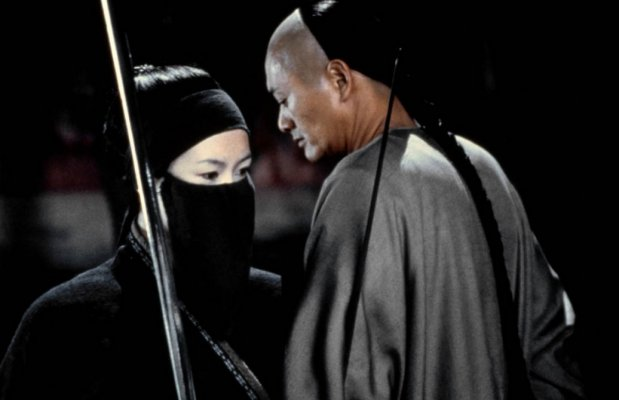](http://1.bp.blogspot.com/-Zg3E0vDxpqA/T5SPUME9zdI/AAAAAAAAAWU/c_94vW2porw/s1600/Wo+hu+cang+long1.jpg)

Jehn possui uma habilidade natural que supera a de sua Mestra e isso é compreendido por Li Mu Bai logo em seu primeiro encontro.  
  
Jen has a natural ability that surpasses that of her Master, and it is realized by Li Mu Bai in their first duel.

Acontece que Jen rouba a espada “Destino Verde” da casa de Sr T.  E cabe a Shu Lien (Michele Yeoh) , perseguir  a ursupadora mascarada , e vê ao final da luta que ela foge para o complexo de residências do Governador.  
  
It turns out that Jen steals the sword "Green Destiny" from Sir Te´s house and it's up to Shu Lien (Michele Yeoh), chase the masked thief, and sees in the end of the fight she flees to the Governor's residential complex.

[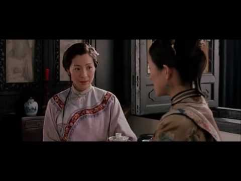](http://i.ytimg.com/vi/djbg1-d24ek/0.jpg)

Em outra cena, quando Jhen faz amizade com Shu Lien , a convida para visita-la em sua casa pois começa a se apaixonar pelas histórias de Shu Lien que vive no Mundo das Artes Marciais (Jiang Hu).  
Shu Lien, sem tanta destreza para trazer uma experiência significativa para Jehn como fez Sr T ao falar da espada para o governador. Tenta convence-la de que esse mundo não é um lugar tão fácil de se viver. E nem tão glamuroso ou romântico.   
  
In another scene, when Jen befriends Shu Lien, invites her to visit her at her house because begins to fall by the stories of Shu Lien living in the World of Martial Arts (Jiang Hu).  
Shu Lien, without much skill to bring significant experience to Jen as did Sir Te in speaking of the sword to the governor. Tries to convince her that this world is not a place so easy to live. And not as glamorous or romantic.

[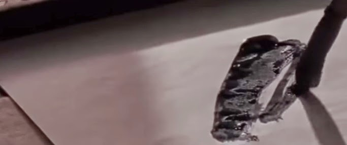](http://2.bp.blogspot.com/-OtFlAL6oblI/VNtRW8JrFII/AAAAAAAARrw/yQGA-xs1Wsk/s1600/calligraphy.jpg)

Enquanto conversam Shu Lien percebe a habilidade com que Jhen escreve ideogramas. E comenta que pode-se descobrir a habilidade de alguém ao observar sua caligrafia.  
Despreparada para esse mundo de “Tigres e Dragões”, Jhen resolve escrever o nome de Shu Lien e dar-lhe de presente. Naquele momento, Shu Lien passa a desconfiar dela, como a ladra da espada com quem lutara anteriormente. Jhen havia mostrado seu “Jaau Wai”.   Mas ainda faltava “abrir sua linha central” para ter certeza.  
  
  
While talk Shu Lien realize the skill with which Jen writes ideograms. And comments that one can discover one's ability to observe his handwriting.  
Unprepared for this world of "Tigers and Dragons", Jen decides to write the name of Shu Lien and give her as a gift. At that moment, Shu Lien goes to suspect her as the thief of the sword who had fought previously. Jen had shown her "Jaau Wai". But Shu Lien should open her Center Line to be sure.

[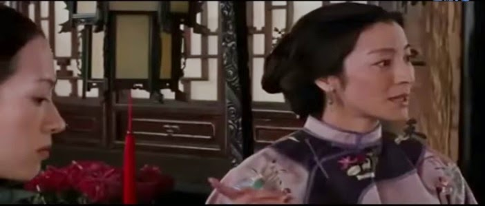](http://3.bp.blogspot.com/-jK_FvFgRwk0/VNtRqxH7qQI/AAAAAAAARr4/BKACFrIoEbE/s1600/tea.jpg)

 Por isso numa outra cena, Sr T , Shu Lien e Li Mu Bai visitam o Governador. Os homens passeiam pela propriedade enquanto a esposa do governador e sua filha Jhen sentam-se com Shu Lien para tomar chá.  
Shu Lien utiliza-se de *[um conceito já comentado aqui chamado “Bai He”](http://moyfatlei.blogspot.com.br/2013/05/especial-baihe-o-que-e-special-baihe.html)* para conversar com a esposa do governador  enquanto passa mensagens para Jen, que acabava se envolvendo no que é dito. Aproveitando-se do momento em que Jen flutua em seus pensamentos, Shu Lien propositalmente derruba uma xicara(foto) que é segura em pleno ar por Jen. Finalmente, Shu Lien fizera ela abrir a Linha Central. Ela era a ladra.  
  
So in another scene, Sir Te, Shu Lien and Li Mu Bai visit the Governor. While the Men wandering around the property the Governor´s wife and daughter Jen sit with Shu Lien for tea.  
Shu Lien makes use of *[a concept already reviewed here called "Bai He"](http://moyfatlei.blogspot.com.br/2013/05/especial-baihe-o-que-e-special-baihe.html)* to talk to the wife of the governor while passing messages to Jen, who had been involved in what is said. Taking advantage of the moment Jen floats in her thoughts, Shu Lien purposely drops a tea cup(photo) that is safe in the air by Jen. Finally, Shu Lien did she open the Center Line. She was the thief.

[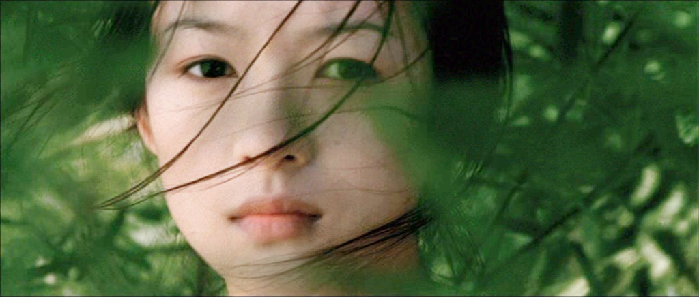](http://1.bp.blogspot.com/-6MKfl2ySx6A/ULFh8C413TI/AAAAAAAAALU/bhqdnwiZqIs/s1600/Crouching-Tiger-Hidden-Dragon-2147.jpg)

Portanto, todas estas cenas em “O Tigre e o Dragão”(foto), nos mostram que muito mais do que status social como do Governador ou uma habilidade nata como a de Jhen. Não superam aquele que tem “Kung Fu”.  Pois status e habilidade não são o suficiente para se viver no Circulo Marcial Chinês quando levado a sério.  
  
Therefore, all these scenes in "Crouching Tiger,Hidden Dragon",  show that much more than social status as the Governor or an innate ability as the Jen. Not exceed one that has "Kung Fu". For status and ability are not enough to live in the Chinese Martial Cricles when taken seriously.

[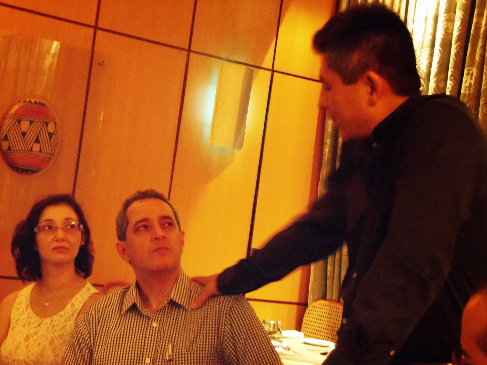](http://2.bp.blogspot.com/-lRXAYYI6Lcg/VNpU7PhZAkI/AAAAAAAARq0/DAPMFESnMQg/s1600/100_0175.JPG)

Por isso que para um Si Fu como Ricardo Queiroz, num “Mo Lam” que só cresce no Rio dentro de nosso próprio Clã . O desafio é duplo: Como líder de Família , ele precisará entender  fardo de estar sempre atento as nuances deste mundo, como também para preparar seus To Dai para esses desafios. Assim como faz meu Si Fu comigo.  
Obviamente tanto ele quanto meu Si Fu estão mais cientes do que eu sobre isso, mas ainda assim, quando penso nestas pessoas, percebo a responsabilidade que eles tem todos os dias. Principalmente quando se começa a se aceitar discípulos e esse compromisso em prepara-los passa a ser vitalício.  
Por isso ,quando lhe chamarem de “Si Fu”, é importante pensar no peso deste termo. Ele não é para ser usado sem pensar.  
  
So that for a Si Fu as Ricardo Queiroz, inside a "Mo Lam" that only grows in Rio within our own clan. The challenge is twofold: As a Family leader, he will need to understand the burden of always being aware of the nuances of this world, but also to prepare his To Dai to these challenges. So how does my Si Fu to me.  
Obviously he and my Si Fu are more aware than I do about this, but still, when I think of these people, I realize the responsibility that they have every day. Especially when it begins to accept disciples and this commitment prepares them happens to be lifelong.  
So when someone call you "Si Fu", it is important to consider the weight of the term. It is not to be used without thinking.

[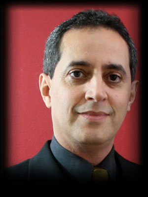](http://www.myvt.org/img/conselhomestres/ricardoqueiroz.jpg)

O querido Mestre Ricardo Queiroz, é Diretor do Nucleo Centro no Rio de Janeiro e discípulo de Mestre Leo Imamura. Nos dias 13,14 e 15 de Março, ele estará presente no evento internacional que contará com a presença do próprio Mestre Leo Imamura no Rio de Janeiro . Você poderá conhece-lo melhor por exemplo no “Painel com os Mestres” na tarde de Sabado, quando serão abertas perguntas a estes dignatários, sobre não só estes desafios do Mo Lam como também qualquer outra curiosidade que surgir.

The dear Master Ricardo Queiroz, is Director of the MYVT Downtown School in Rio de Janeiro and disciple of Master Leo Imamura. In the days 13,14 and 15 March, he will attend the international event that will be attended's own Master Leo Imamura in Rio de Janeiro. You may know him best for example during the "Panel with the Masters" on Saturday afternoon when questions will be open to these dignitaries on not only these challenges inside Mo Lam as well as any other curiosity that arise.

(PARA INFORMAÇÕES SOBRE O EVENTO E INSCRIÇÃO:  [aniversario.myvt-rio.org](http://aniversario.myvt-rio.org/))

(for more info about this event visit:  [aniversario.myvt-rio.org](http://aniversario.myvt-rio.org/))

**THE DISCIPLE OF MASTER JULIO CAMACHO**

**Thiag Pereira "Moy Fat Lei"**

**moyfatlei.myvt@gmail.com**
