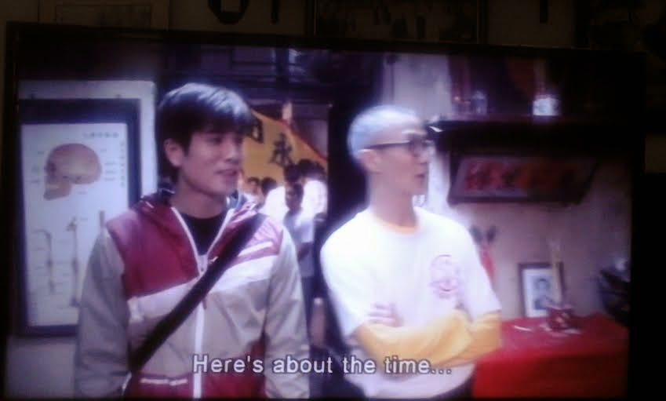
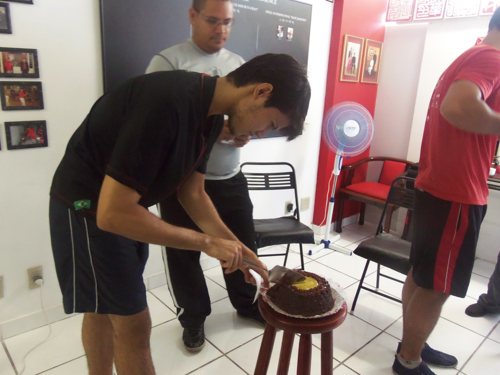
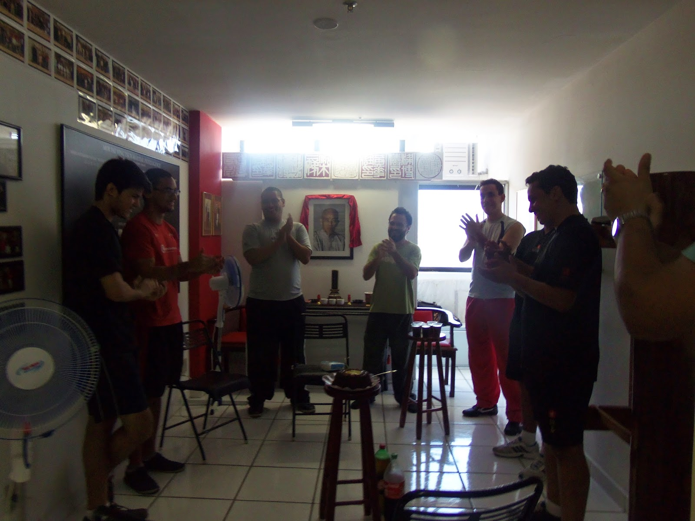
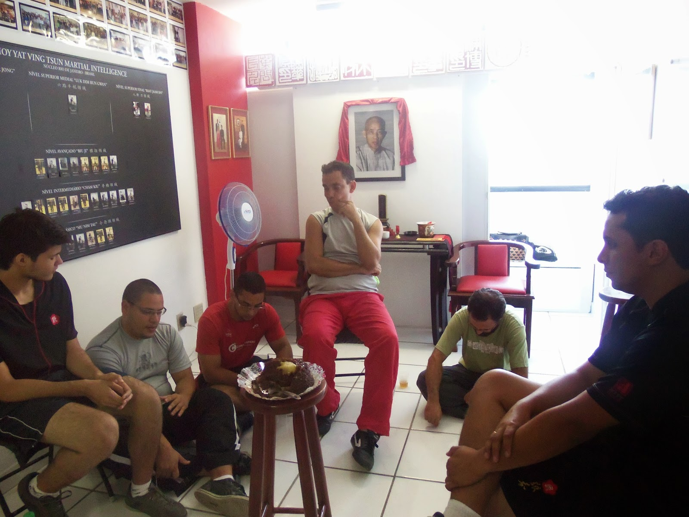
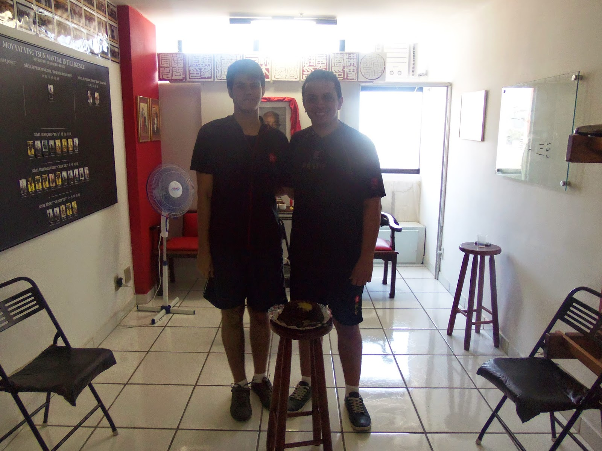

# PEDRO FREIRE´S BIRTHDAY AT MYVT MEIER SCHOOL

*Num programa que foi exibido numa canal de Hong Kong chamado “Kung Fu Quest”. A cada episódio um praticante de artes marciais chinês , famoso ou não, embarcava junto de outro em algum lugar de Hong Kong ou da China continental, a fim de conhecer Mestres e Artes Tradicionais e principalmente entrar fundo no tipo de transmissão preservada até hoje por estas pessoas.*  
*Apesar de termos um episódio sobre Ving Tsun (Wing Chun), o meu preferido é o que falar sobre “Hung Kuen”(foto). Nele , o ator Phillip Ng presente em novelas como “Wing Chun” de 2007 na qual interpreta o jovem Chan Wah Shun. Vai em busca de Mestres desta arte.*  
*Num dos Mo Gun que ele chega, ele e sua equipe de reportagem do programa chegam bem quando os membros daquela Família Kung Fu estão precisando encerrar as atividades ali por falta de dinheiro para pagar o aluguel.*  
*Não estamos falando de jovens, e sim de senhores na casa de seus 70 anos desmontando o Mo Gun e chorando copiosamente ao se lembrarem de tudo que viveram ali com seu Si Fu e irmãos Kung Fu. Phillip Ng também se emociona e o episódio ganha um outro tom.*  
  
*In a program that was displayed in a Hong Kong channel called "Kung Fu Quest". In each episode a Chinese martial artist, famous or not, boarded another along somewhere in Hong Kong or mainland China in order to meet Masters and Traditional Arts and mainly get background on the type of transmission preserved to this day by these persons.
Although we have an episode about Ving Tsun (Wing Chun), my favorite about "Hung Kuen" (photo). In it, the actor Phillip Ng ,present in novels like "Wing Chun" (2007), in which he plays the*  
*young Chan Wah Shun. Goes in search of Masters of this art.
In one of Mo Gun he arrives, he and his crew arrive when members of that Kung Fu family are*  
*in need to close down there for lack of money to pay the rent.
We are not talking about young people,but people in their 70s dismantling the Mo Gun and*  
*crying copiously to remember all who lived there with his Kung Fu brothers and Si Fu.*  
*Phillip Ng also cried and the episode wins another tone.*

**ANIVERSÁRIO DE PEDRO FREIRE NO NUCLEO MÉIER**

**PEDRO FREIRE´S BIRTHDAY AT MYVT MEIER SCHOOL**

Todos nós do Clã Moy Yat Sang, quando ingressamos em qualquer uma de suas Familias Kung Fu, assumimos o compromisso do provimento progressivo de Vida Kung Fu. Isso significa que o fato de dois praticantes de Ving Tsun saírem juntos, não é “Vida Kung Fu”. Dois praticantes falarem sobre técnicas não é também “Vida Kung Fu”.  Esse provimento progressivo diz respeito a respeitar a natureza do Domínio que a pessoa está explorando.  
Ou seja, não requisitar algo de natureza do Baat Jaam Do a alguém que está estudando a natureza do Cham Kiu.  
Por isso no Sábado com o Mo Gun cheio, recebemos visitantes, pessoas que estavam começando a prática naquele dia. Recebemos um irmão KF que está para retomar a prática, recebemos membros de outra Família e dentre todos estes acontecimentos naquele Sábado de muito calor, celebramos o aniversário de 18 anos de Pedro Freire.  
  
We all of Moy Yat Sang Clan, when we enter in any of its Kung Fu Families, we are committed to provide progressive Kung Fu Life. This means that the fact that two practitioners of Ving Tsun being together, is not "Kung Fu Life". Two practitioners talk about techniques is not  "Kung Fu Life". This progressive provision relates to respect the nature of the domain that the person is exploring.  
Ie not request something of the nature of the Baat Jaam Do to someone who is studying the nature of the Cham Kiu.  
So on Saturday with the Mo Gun filled ,we receive visitors, people beginning to practice that day. We received a Kung Fu brother who is up to restart the practice, we received members of another family and among all these events that Saturday , we celebrate the 18th birthday of Pedro Freire.

Alguns irmãos Kung Fu compararam uma torta de chocolate com quindim e Coca-Cola. Cantamos “parabéns pra você” para Pedro e sentamos em circulo. Cada um dos presentes pôde dizer algumas palavras para Pedro sobre sua pessoa. Fosse relembrando algum momento, fosse pontuando algo nele que lhe chamassem a atenção.  
  
Some brothers Kung Fu compared a chocolate pie with quindim and Coca-Cola. We sang "Happy Birthday to You" to Peter and sat in a circle. Everyone present could say a few words to Peter about his person. Was recalling some point, was pointing something in it being called his attention.

O último a falar foi o próprio Pedro, que de forma sucinta expressou o que aquele momento significava para ele.   
Interessante comentar que em termos de Vida Kung Fu, sentar em circulo e comer bolo não diz nada. Mas todo o processo que antecede, que transcorre e que se desdobra desse simples momento, quando bemnitorado , pode gerar muita coisa a quem está envolvido.  
  
The last to  speak was Pedro himself, who succinctly expressed what that moment meant to him.  
Interesting to comment that in terms of Kung Fu life, sit in a circle and eat cake says nothing. But the whole process above, elapsed and unfolding of this single moment, when properly monitored, can generate a great deal to those involved.

No final das contas, com tudo que tinha pra fazer naquele final de semana, lembrei-me quando dirigia para a Cerimônia no Domingo pela manhã, da cena dos irmãos Kung Fu chorando no momento em que o Mo Gun estava fechando no tal episódio do programa “Kung Fu Quest”. E me veio a cabeça o aniversário de Pedro no dia anterior. E percebi a quantidade de momentos “familiares” que vão se acumulando num Mo Gun. E a dor que deve ser ter que encerrar o trabalho dessa forma.  
Se todos tiverem sempre esses momentos no coração, acredito que um dia como esse nunca chegue para nós...  
  
In the end, with all I had to do that weekend, I remembered when I was driving to the ceremony on Sunday morning, the scene of the Kung Fu brothers crying at the time the Mo Gun was closing in this episode of the show "Kung Fu Quest". And came to my head the birthday of Pedro the day before. And I realized the amount of  "family moments" that we accumulate in a Mo Gun. And the pain that someone must feel when a Mo Gun is closed.  
If everyone always have those moments in the heart, I believe that such a day will never come to us ...

**THE DISCIPLE OF MASTER JULIO CAMACHO**  
**Thiago Pereira “Moy Fat Lei”**  
**Moyfatlei.myvt@gmail.com**
