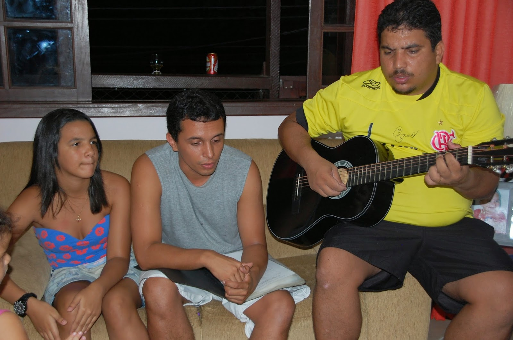
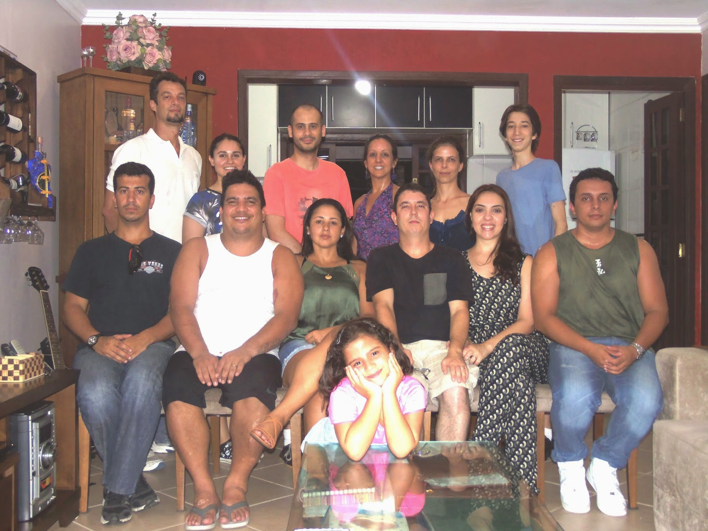
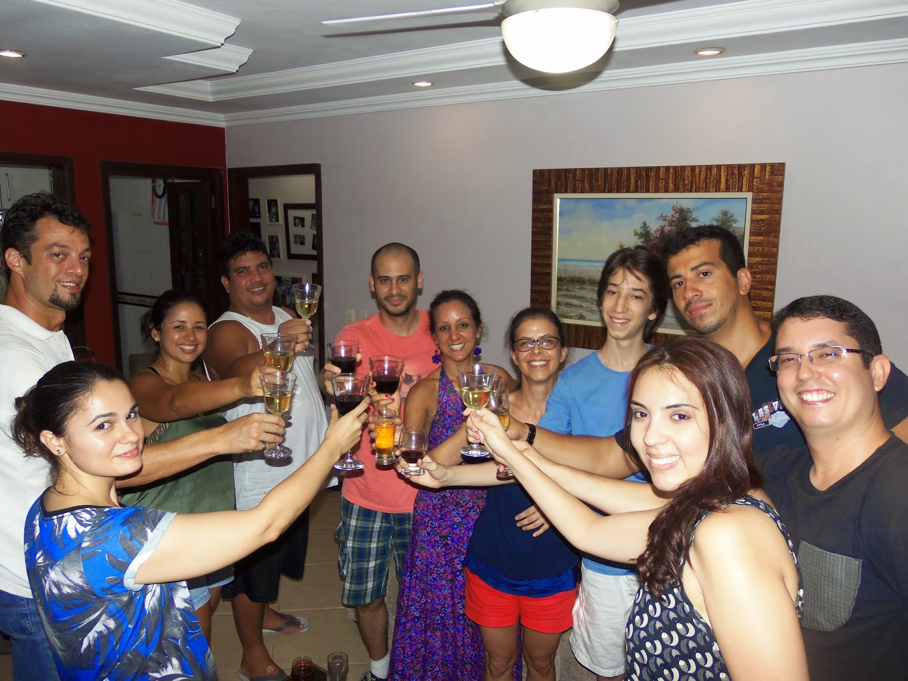
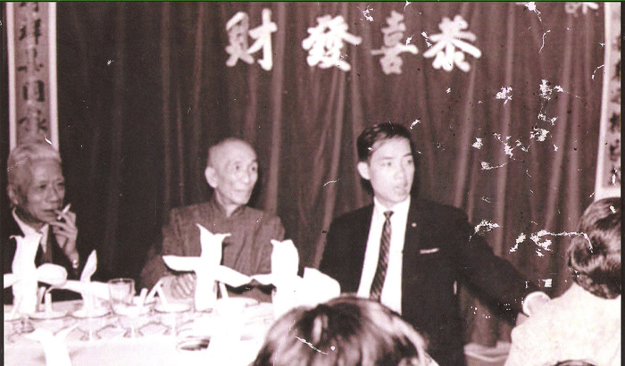
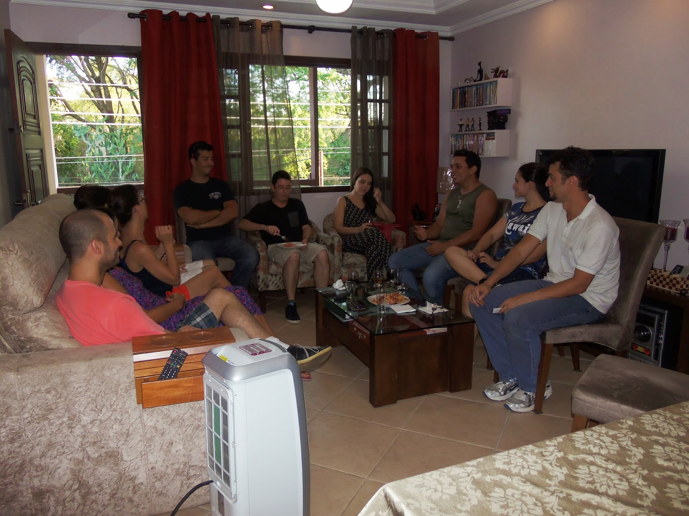
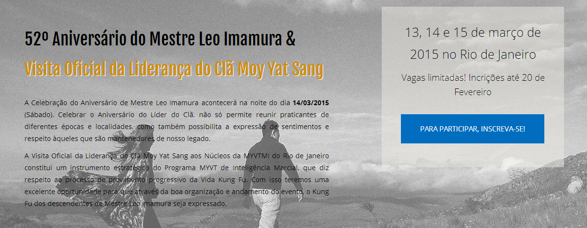
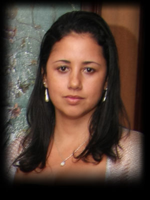

# SPECIAL BAAI SI MEETING AT MASTER URSULA´S HOME

*[Em Fevereiro de 2011 , estive na casa de Ursula Lima](http://moyfatlei.blogspot.com.br/2011/01/pizza-at-master-ursula-11g-vt-s-home.html)*, Mestra Qualificada pela Moy Yat Ving Tsun Martial Intelligence, pela primeira vez para um momento mais intimista que não fosse para resolver algum assunto mais decisivo da Família Kung Fu.  
Na ocasião meu Si Fu e sua filha Jade Camacho(foto acima) estiveram presentes. E tive a oportunidade de tocar um pouco de violão com Ricardo Lopes, marido de Mestra Ursula. Foi uma noite bem divertida.  
  
*[In February 2011, I was in the house of Ursula Lima](http://moyfatlei.blogspot.com.br/2011/01/pizza-at-master-ursula-11g-vt-s-home.html)*, Qualified Master by Moy Yat  Ving Tsun Martial Intelligence for the first time to a more intimate moment that was not to solve some more decisive subject of Kung Fu Family.  
At the time my Si Fu and his daughter Jade Camacho (photo above) were present. And I had the opportunity to play a little guitar with Ricardo Lopes, the husband of Master Ursula. It was a really fun night.

Na lógica confuciana tem-se os conceitos referentes a “Humanidade”(Jan 仁) nas ações, e também da importância dos “Ritos,Cerimônias,etc..”(Lai 禮). Um não existe sem o outro. Se você cumprir uma formalidade sem humanidade, é apenas um movimento ou ação vazia. Da mesma forma, a “Humanidade” pura e simplesmente pode não expressar a intenção por detrás. Por isso alguns sinólogos como Karyn L Lai (*An introduction to Chinese Philosophy*,2008) dizem que o conceito de “rito” ou “cerimonia” (Lai 禮) ajudam a por exemplo “*gostar de alguém da maneira apropriada*”: “...*Quando diz que compreender a profundidade do sentimento humano, é ser capaz de expressá-lo de modo apropriado; e a habilidade individual de expressar o sentimento humano, é uma indicação de maturidade emocional*...”   
  
In Confucian logic has the concepts relating to "Humanity" (Jan 仁) in daily life, and the importance of "Rites, Ceremonies, etc .." (Lai 禮). One can not exist without the other. If you do a formality without humanity, it's just a movement or empty action. Likewise, the "humanity" simply can not express the intention behind. So some Sinologists as Karyn L Lai  (*An introduction to Chinese Philosophy*, 2008) say that the concept of "rite" or "ceremony" (Lai 禮) help for example "*to like someone appropriately*", "... *when one says that to understand the depth of human feeling, is being able to express it appropriately; and an individual's ability to express human feeling, is an indication of emotional maturity* ... "

(Brinde na casa de Mestra Ursula .)

(Toast at Master Ursula's)

Por isso que para Marilia Coló, Inez Viegas , Caio Amado, Andre Villareal, Rodolpho Alcantra e Helena C Ribeiro. O convite para visitarem sua Si Fu em sua própria residência naquele Domingo, precisa ser entendido como algo especial.  
Durante nossas vidas, convidamos muitas pessoas a entrarem em nossas casas. Segundo o *[filme “Garotos Perdidos”(1987)](https://www.youtube.com/watch?v=U_lwtRMg0ts)*,vampiros só podem entrar na sua casa se forem convidados, portanto, evite vampiros.  
Mas fora esse caso, não é incomum que façamos esse procedimento varias e varias vezes, e muitas destas, sem critério.  
Na relação Kung Fu, este ato relacional (Humanidade) de abrir as portas de sua casa a alguém de fora de sua Família que reside ali, precisa ser “aproriado”(Lai 禮).  
  
So for Marilia Coló, Inez Viegas, Caio Amado, Andre Villareal, Rodolpho Alcantra and Helena C Ribeiro. The invitation to visit their Si Fu in her own home that Sunday, should be understood as something special.  
During our lives, we invite many people to come into our homes. *[According to the movie "The Lost Boys" (1987)](https://www.youtube.com/watch?v=U_lwtRMg0ts)*, vampires can only enter your home if they are invited, so avoid vampires.  
But outside this case, it is not uncommon for us to do this procedure over and over again, and many of these without discretion.  
In Kung Fu circles, this relational act (Humanity) to open the doors of your home to someone outside of your family live needs to be "appropriated" (Lai 禮).

Sobre este processo de se relacionar apropriadamente dentro do mundo das artes marciais chinesas, Grão-Mestre Moy Yat(foto) disse certa vez sobre sua relação com Ip Man(foto): “*Mesmo quando convidava meu si fu, Ip Man, para yam cha 飲茶(Tomar chá), ele se recusava polidamente. Talvez por que ele se sentisse desconfortável em sair com alguém que havia acabado de conhecer.**Ao longo dos anos, tivemos oportunidades de nos conhecermos melhor e pude oferecer minha habilidade e trabalho para a Família Kung Fu*.”  
  
About this process to relate appropriately within the world of Chinese martial arts, Grand Master Moy Yat (photo) once said about his relationship with Ip Man (photo): "*Even when I invited my Si fu Ip Man, for yam cha 飲茶 (drink tea), he refused politely. Perhaps because he felt uncomfortable going out with someone who had just known. Over the years, we had opportunities to know each other better and I could offer my skills and work for the Kung Fu Family*. "

Além destes seis To Dai que foram convidados, eu e mais dois Si Sok , Felipe Soares e Diego Guadelupe, ambos mestres qualificados foram também convidados. Além deles, a esposa de Felipe estava presente, Elisa Wanderley.  
A intenção era que pudéssemos promover uma discussão com os 6 Todai de Mestra Ursula sobre a Cerimônia de Baai Si: Experiências, histórias, o que para nós significava ser um discípulo . Além disso eles poderiam também fazer perguntas sobre o tema ou o que mais quisessem.  
Foram bons momentos. Alguns mais divertidos, outros mais tocantes. E acredito que tenhamos conseguido contemplar, a intenção de Mestra Ursula quando nos convidou naquela tarde.  
  
Beyond those six To Dai who were invited, I and two Si Sok:  Felipe Soares and Diego Guadelupe, both qualified Masters were also invited. Besides them, Felipe's wife was present, Elisa Wanderley.  
The intention was that we could have a discussion with the 6 Todai of Master Ursula on the Baai Si Ceremony: Experiences, stories,and what for us means to be a disciple. In addition they could also ask questions about the subject or what else they wanted.  
Those were good times. Some more fun, others more touching. And I believe that we have been able to contemplate the intention of Master Ursula when invited us that afternoon.

(PARA INFORMAÇÕES SOBRE O EVENTO E INSCRIÇÃO: *[aniversario.myvt-rio.org](http://www.aniversario.myvt-rio.org/))*

(for more info about this event visit:  [aniversario.myvt-rio.org](http://aniversario.myvt-rio.org/))

Mestra Ursula[foto] Lima é discípula do Mestre Senior Leo Imamura. Ela estará presente no evento internacional que ocorrerá nos dias 13,14 e 15 de Março no Rio de Janeiro. Para saber um pouco mais sobre sua história e entender a riqueza de que esta e outros Mestre, além do próprio Mestre Leo Imamura neste evento, poderão proporcionar, [*clique AQUI*](https://www.youtube.com/watch?v=xwV8Tsq7M1o) e assista um vídeo sobre sua história.

Master Ursula Lima[photo] is a disciple of Senior Master Leo Imamura. She will attend the international event that will take place on 13,14 and 15 March in Rio de Janeiro. To learn more about her history and understand the richness of this and other Masters, besides the Master Leo Imamura and what this event may provide *[CLICK HERE](https://www.youtube.com/watch?v=xwV8Tsq7M1o)* and watch a video about its history.

**THE DISCIPLE OF MASTER JULIO CAMACHO**

**Thiago Pereira "Moy Fat Lei"**

**moyfatlei.myvt@gmail.com**
