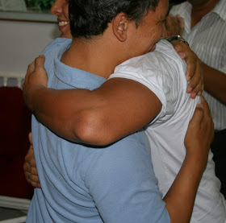
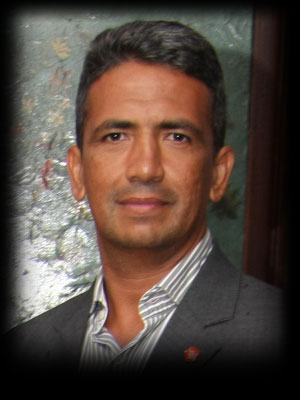

### New Legends of Kung Fu Masters: "The Kung Fu Hug"

("Abraço Kung Fu" meu com Si Fu)

("Kung Fu Hug": Me and Si Fu)

New Legends of Kung Fu Masters : “Abraço Kung Fu”

New Legends of Kung Fu Masters: "The Kung Fu Hug"

  
No ano 2000, eu participei de uma Cerimônia com a presença de Si Gung. Acredito que eu estivesse acessando o Segundo Domínio do Sistema chamado Cham Kiu .  Naquela oportunidade presenciei Si Sok Ricardo Queiroz, Diretor do Núcleo Centro, falando algumas palavras sobre o que sentiu durante certa vez quando Si gung o havia abraçado no início de sua prática.  
Si Sok e meu Si Fu ,que estava lá na frente com ele, ambos se emocionaram muito com aquele tema, e se abraçaram chorando bastante. Eu não consegui captar aquele sentimento nem de longe. Mas acompanhei os aplausos assim como os demais...  
Particularmente na minha família consanguínea não temos o costume de nos abraçarmos ou fazer ou dizer qualquer coisa relacionada a afeto abertamente. Por isso, cinco anos depois do episódio daquela Cerimônia, comentei com Si Fu que uma grande amiga minha da faculdade havia dito que eu mantinha uma distância das pessoas: “*O Thiago não abraça, não é muito carinhoso*”. Disse ela a seu irmão que praticava comigo à época e me fez saber da frase.  
Si Fu perguntou o que eu achava disso, e respondi já perto de descer do carro, que talvez pudesse praticar esse “tipo de procedimento” na Família Kung Fu. Ele riu, apertou minha mão e disse: “*Então conto com você.*”  
Anos depois, Si Fu me explicou sobre como se deve dar um abraço: “*As pessoas chegam, te dão um abraço de qualquer jeito e ainda te batem! (risos) Já reparou que tem gente que te dá um monte de tapas nas costas? (risos) Pra que serve isso? (risos)*”  
Si Fu explicou que quando se abraça, deve tocar o seu coração com o da outra pessoa.   
Então quando saímos para jantar numa noite, ele estava me falando novamente sobre sentimentos quando questionei que me sentia as vezes solitário nessa jornada do Kung Fu como meio de vida, já que ninguém de fora da Família me compreendia : “*Thiago, o Kung Fu é algo raro. Você não acha estranho estarmos sentados aqui comendo esse prato cheio de peixes crus e pagando uma grana por isso? Se você comprar um peixe e fizer em casa vai ter muito mais carne e sai muito mais barato. Mas por que isso não é estranho? Por que todo mundo faz?*” – Si Fu bebeu um gole d’agua e prosseguiu: “*Hoje em dia você vê por exemplo quando uma pessoa quer se declarar para outra, ela aluga helicóptero, joga pétalas de rosa, faz um monte de coisa... Mas você acha que essa pessoa faz isso pra outra pessoa ou pra plateia?*” – Respondi “*Pra plateia*” e Si Fu prosseguiu : “*O sentimento não precisa de platéia . Tem haver com você e a outra pessoa. Não precisa botar no facebook. Mas você vê, por isso o Kung Fu é algo raro. Nem todo mundo entende. Mas seu sentimento precisa de platéia?* “  
Finalmente, como disse acima, na minha família consanguínea não temos o costume de trocar dizeres e gestos de afeto. Mas lembro como se fosse hoje, do Reveillon que finalmente consegui dizer “Eu te amo” para o meu pai.  
Pra você que está lendo pode parecer pouca coisa, mas enquanto estouravam os fogos e eu ia andando em direção ao portão da vila onde meus pais moram e onde ele estava, sentia um frio na barriga. Meu pai não estava lá. Peguei meu telefone e quando ele atendeu, desejei “Feliz Ano novo”, e usando todos os anos de Kung Fu disse “*Pai, eu te amo*”.  
Fiquei tão bobo com esse “grande feito” que mandei uma mensagem para o Si Fu contando tudo na mesma hora. Ele teve a generosidade de no meio do seu próprio Reveillon tirar um tempo pra responder também por mensagem: “*Eu também te amo*”. Então naquela hora, tive a certeza de que o Si Fu sempre vai ser a “Platéia” que preciso, toda vez que eu conseguir dar um “abraço Kung Fu coração-com-coração” ou simplesmente dizer algo que nunca disse antes.  

In 2000, I attended a ceremony with the presence of Si Gung. I believe that I was accessing the Second Domain called Cham Kiu. At that time I witnessed Si Sok Ricardo Queiroz, Director of the MYVT Downtown School, speaking a few words about what he felt for once when Si gung had hug him early in his journey in Ving Tsun.

Si Sok and my Si Fu, who was there in front of him, both are very thrilled with that theme, and hug themselves crying a lot. I was unable to capture that feeling even remotely. But I followed the applause as well as others ...

Particularly in my consanguineous family we do not have the custom to hug each other or do or say anything related to affection openly. So five years after that episode from that ceremony, I commented to Si Fu that a good friend of mine from college had said I kept a distance from people, "*Thiago does not hug anybody, he is not very tender*." She said to her brother who practiced with me at the time and made me know what she said.

Si Fu asked what I thought of it, and answered already close to getting off the car, maybe I could practice this "type of protocol" in Kung Fu Family. He laughed, shook my hand and said, "*So I'm counting on you*."

Years later, Si Fu told me about how to give a hug: "*People come, give you a hug anyway and still hit you on your back! (Laughs) Have you noticed that there are people who give you a lot of slaps on the back? (Laughs) What is the meaning of that? (Laughs)* "

Si Fu explained that when you hug someone, should touch your heart with the other person's.

So when we go out for dinner one night, he was telling me again about feelings when I questioned that I felt sometimes lonely in this journey of Kung Fu for a living, since no one outside the family understood me: "*Thiago, Kung Fu is something rare. Do not you think we are weird sitting here eating this dish full of raw fish and paying some money for it? If you buy a fish and do at home will have more meat and is much cheaper. But why is not it strange? Why everybody does* "- Si Fu took a sip of water and continued," *Today you see for example when a person wants to declare his love to another, he or she rents a helicopter, throws rose petals, does a lot of stuff ? ... But do you think that person do it to the person itself or to the audience* "- I answered: " *To the audience*" "and Si Fu continued:" *The feeling does not need audience. It has to do with you and the other person. No need to put on facebook. But you see, so the Kung Fu is rare. Not everyone understands. But your feelings need audience?* "

Finally, as I said above, in my consanguineous family we do not have the custom of exchanging sayings and gestures of affection. But I remember like it was today, the New Year evenning when I finally managed to say "*I love you*" to my father.

For you who are reading may seem little, but as the fireworks popped and I was walking towards the gate of the village where my parents live and where he was, I felt the goose bumps. My father was not there. I grabbed my phone and when he answered, I wished "*Happy New Year*", and using all the years of Kung Fu I said "*Dad, I love you*."

I was feeling so great with this "great achievement" I sent a text message to Si Fu telling him all at the same time. He was generous enough to in the middle of his own New Year  Party take time to answer also trough text message  "*I love you too*." So at that time, I was sure that Si Fu will always be the "Audience" I need every time I m able to give a "Kung Fu heart-with-heart hug" or simply say something I never did before.  
  
  

Meu Si Fu Julio Camacho poderá compartilhar estas e outras visões sobre o Kung Fu na vida cotidiana durante o evento internacional nos dias 13,14 e 15 de Março no Rio de Janeiro que contará com a presença de Si Gung Leo Imamura e Si Taai Vanise Imamura,  Participe!  
  
My Si Fu Julio Camacho can share these and other views of Kung Fu in daily life during the international event on 13,14 and 15 March in Rio de Janeiro which will feature the presence of Si Gung Leo Imamura and Si Taai Vanise Imamura , Sign!  
  
  
  
  
  

  

(PARA INFORMAÇÕES SOBRE O EVENTO E INSCRIÇÃO:  [aniversario.myvt-rio.org](http://aniversario.myvt-rio.org/))

(for more info about this event visit:  [aniversario.myvt-rio.org](http://aniversario.myvt-rio.org/))

  

T**HE DISCIPLE OF MASTER JULIO CAMACHO**  
**Thiago Pereira "Moy Fat Lei"**  
**moyfatlei.myvt@mail.com**

[BLOG DO PEREIRA](http://www.blogger.com/profile/16153233145352960778 "author profile")

at
[00:48](http://moyfatlei.blogspot.com.br/2015/02/new-legends-of-kung-fu-masters-kung-fu.html?m=1 "permanent link")
