# 12 coisas que aprendo no Egito | Na Estrada #28

Comida, bebidas, lugares e comportamento de um lugar com cultura distante da nossa e com costumes tão parecidos. Um relato de 15 dias no Egito

Obviamente um país com problemas sociais e turismo em baixa, até um pobre mochileiro de calça rasgada vai parecer um saco de dinheiro ambulante e despertar o interesse de trabalhadores do turismo local. Mas os egípcios são muito (muito mesmo) hospitaleiros, tratam-lhe bem a todo momento, sendo prestativos com informações (em "arabenglish") e muitas vezes recusam ou ficam ofendidos com gorjetas.

Aprendi muito com esse povo que em 15 dias me apresentou um pouco da cultura e do mundo Árabe. Abaixo conto um pouco dessa história:

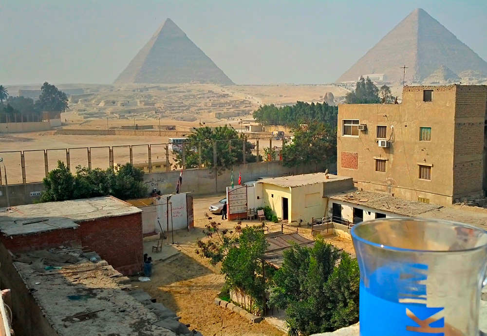

Vista das pirâmides de Gizé no Terraço do Pyramids Loft

### 1. O chá limpa o corpo (e a areia da boca)

Cerveja? Nem pensar em pedir isso em qualquer mercado de país islâmico (vai arranjar confusão, amigo). O chá é uma tradição milenar no Egito e é oferecido em todo e qualquer lugar que você esteja, gratuitamente ou por um preço justo (R$ 1 real no máximo). Tem outra coisa importante. A maioria da água no Egito é insalubre, assim, fervê-la (e não só esquentar) é um grande benefício!

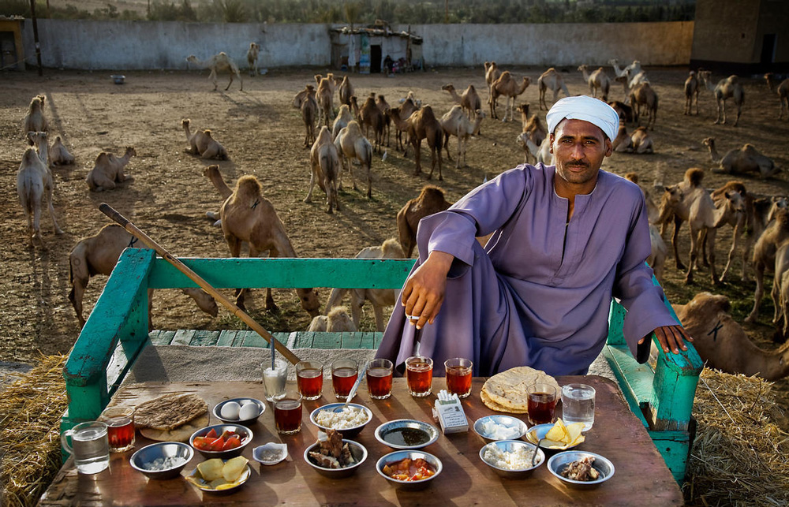

Um café da manhã no Egito com muito chá (Foto: Peter Menzel)

### 2. O koshary e a shawarma

Essas duas comidas são as mais encontradas nas ruas egípcias e por um preço mais do que justo (R$ 7 ou R$ 10 reais).

O [Koshary](http://en.wikipedia.org/wiki/Kushari) (ou Kushari) é uma mistura altamente nutritiva e calórica, com macarrão, arroz, lentinha, soja e carne seca. É a comida do trabalhador. O [Shawarma](http://pt.wikipedia.org/wiki/Shawarma) é o lanche preferido deles, que pode ser de carne bovina, frango ou porco. Os pratos são sempre de metal, dificilmente cerâmica ou plástico.

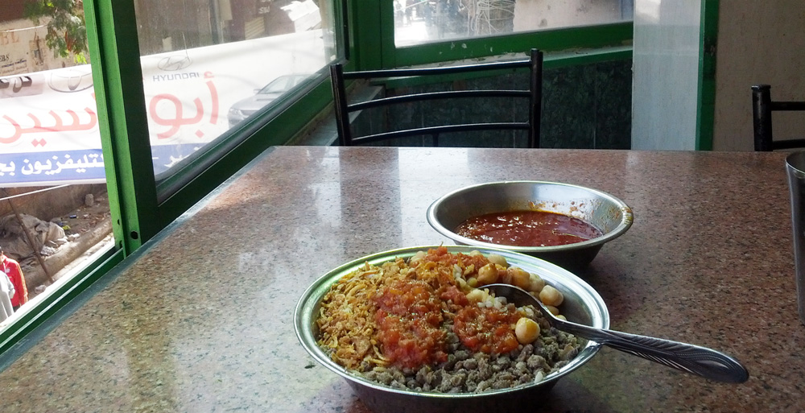

Prato de Koshary, a principal refeição Egípcia (arroz, lentinha, soja e carne seca )

### 3. Comércio, comércio e comércio

Prepare-se para tornar-se um especialista em barganha. Nas ruas, vende-se tudo: comida, papel higiênico, aparelhos eletrônicos, roupas, frutas, peixes. E eles vão querer que você compre tudo!

Não por maldade, obviamente é questão de sobrevivência. A economia do Egito vive um período muito rude devida a falta de turistas (assustados pela primavera Árabe) e fronteiras fechadas com Israel. Em todo caso, a palavra Shokrun (obrigado em Arábe) pode ajudar a esquivar-se.

### 4. Você realmente pode arranjar uma briga por comprar cerveja

Quer honrar as tradições brasileiras sem desrespeitar o Islã? Peça para o funcionário do hostel ou hotel em que você está hospedado comprar para você. A comprar não é ilegal, só não é bem vista pelos mais conservadores. Na regiões turísticas de [Dahab](http://en.wikipedia.org/wiki/Dahab) e [Sharm el Sheik](http://pt.wikipedia.org/wiki/Sharm_el-Sheikh) o consumo é livre.

Aliás, gorjeta é um modo de complementar seus baixos salários, então você vai ouvir “tips” a todo momento. Ande com bastante trocado para ajudar a economia local.

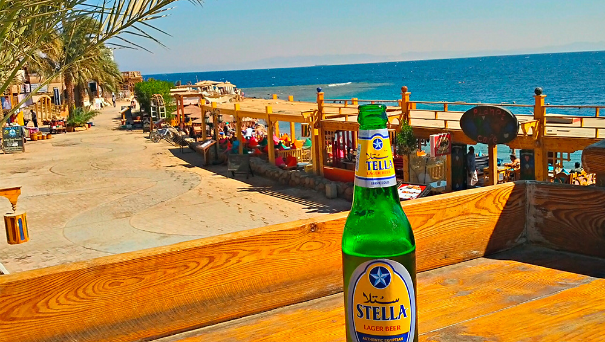

Cerveja Stella no Mar Vermelho em Dahab, no Egito

### 5. Confronto do futuro com o passado

Já dizia Dominique Quessada em seu livro *[O poder da publicidade na sociedade consumida pelas marcas](https://www.google.com.br/search?q=O+poder+da+publicidade+na+sociedade+consumida+pelas+marcas&oq=O+poder+da+publicidade+na+sociedade+consumida+pelas+marcas&aqs=chrome..69i57j69i64.136j0j7&sourceid=chrome&es_sm=122&ie=UTF-8)*:

> “Nos arredores do Cairo, uns cem metros da Esfinge de Gizé, ostensivamente instalado defronte a ela e já fazendo parte integrante do lugar, um restaurante da cadeia Pizza Hut monta guarda, com seu logotipo piramidóide voltado para os tetraedros funerários de Quéops, Quefren e Miquerinos. Desta forma, dois guarda-comidas se encaram, um pela eternidade, o outro pelos trinta minutos seguintes”

Cena única: camelos amarrados em frente ao Pizza Hut.

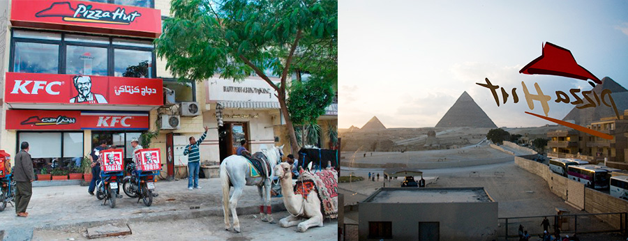

Pizza Hut e KFC em frente às pirâmides do Egito

### 6. O mundo todo é fodido e igual

Passados os eventos da praça de junho, percebe-se que o Brasil e Egito não são tão diferentes assim. O que eles querem: saúde, educação e segurança.

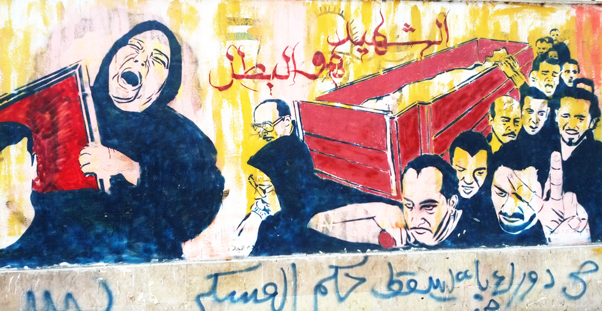

Arte urbana sobre atentados e mortes nas ruas do Egito

Em especial sobre segurança, em países islâmicos, atos como furto ou tráfico são puníveis de morte. Assim, você não terá nenhum tipo de problema como ser assaltado às 02h da madrugada. O perigo real é o terrorismo de grupos religiosos radicais como a [Irmandade Muçulmana](http://pt.wikipedia.org/wiki/Irmandade_Mu%C3%A7ulmana) ou ainda a [Jihad Islâmica](http://pt.wikipedia.org/wiki/Jihad_Isl%C3%A2mica). Essa última, mais famosa por atuar na Faixa de Gaza e norte do Iraque pós EUA. Só para que fique claro, a Faixa de Gaza fica a 350km do Cairo.

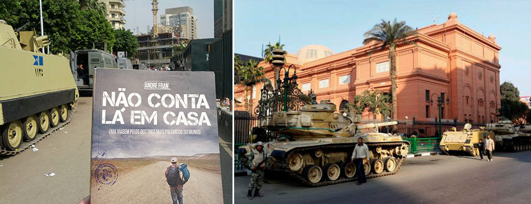

Blindados do exército em cordão para proteger o Museu Egípcio do Cairo (Praça Tahrir)

Assim, toda sexta-feira, milhares de estudantes se reúnem na [Tahrir Square](http://en.wikipedia.org/wiki/Tahrir_Square) para protestar. A Tahir é um local muito agradável, próximo a beira do rio Nilo, cercado por Mc Donalds, KFC e de frente ao majestoso e rosado [Museu Egípcio](http://pt.wikipedia.org/wiki/Museu_Eg%C3%ADpcio_%28Cairo%29). Essa bela vista só é ofuscada pelos mais de 20 blindados do exército que formam uma barreira de proteção ao majestoso museu egípcio.

### 7. O militarismo intrínseco no dia-a-dia

Por uma triste coincidência, quando estava me dirigindo para o [Monte Sinai](http://pt.wikipedia.org/wiki/Monte_Sinai), um ônibus com turistas japoneses sofreu [um ataque na cidade de Rafah](http://www.jpost.com/Middle-East/4-killed-as-tourist-bus-in-Egypts-Sinai-explodes-en-route-to-Israel-341586), fronteira de Egito com Israel (Faixa de Gaza). Essa região possui diversas cidades turísticas como Sharm El Sheik e Dahab e é uma das mais belas e visitadas do Egito. Não por acaso, os ataques terroristas para estes lados assusta todo o ramo turístico do país.

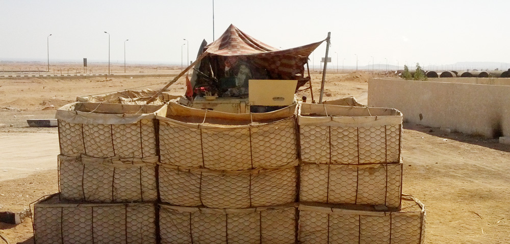

Posto de Controle com um blindado protegido no Monte Sinai

Fiz um trajeto de 900km de ônibus e fomos parados em mais de 15 postos de controle para vistoria de passaportes e averiguação de mochilas. Cachorros antibombas fazem esse trabalho. Como naquela semana dois ônibus turísticos haviam sido atacados, optei por viajar com um ônibus comum egípcio, uma experiência incrível de atravessar o deserto com a população local. Na TV do busão, uma produção de [Bolywood](http://pt.wikipedia.org/wiki/Bollywood) gerava o agito com dança e piadas no estilo Zorra Total. A estrada não tem iluminação ou placa e, nos paradeiros, um chá + narguilé para espantar os -5ºC do deserto.

### 8. "Take a picture! Take my picture, man!"

Como forma de presenteá-lo, os egípcios deixam você bater uma foto deles e levar consigo! E nem pense em não aceitar essa oferta.

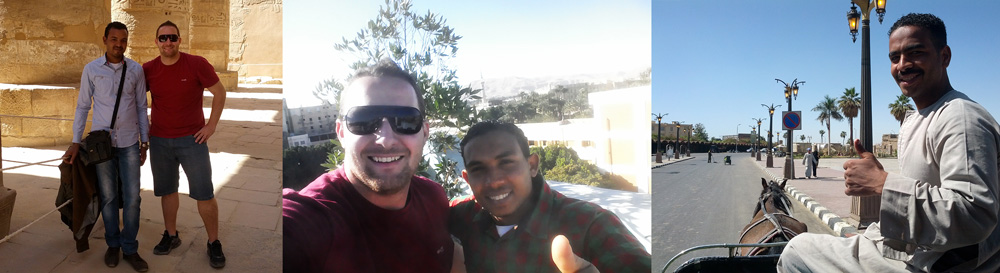

Alguns moradores locais do Cairo e em Luxor, que quiseram bater uma foto

### 9. O Brasil é o lugar e Kaká, Ronaldo e Pelé são os caras

É fascinante o poder e reações que a palavra Brasil (ou "Bréziu") podem causar aos serem mencionadas em um país como o Egito. Segundo eles, temos comida, água (será!?) e as 40 virgens prometidas! Mas, brincadeiras a parte, as marcas Pelé, Kaká e Ronaldo eram ditas toda vez que pronunciava o nome do meu país. Até mesmo Messi!

### 10. Take your time...

... and enjoy the moment.

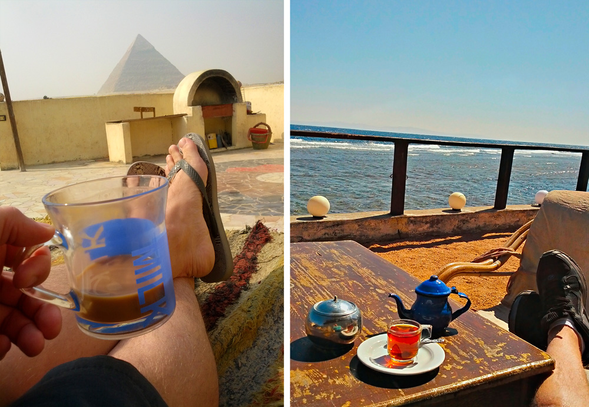

Gizé e Dahab, no Egito

### 11. Allahu Akbar (Deus é maior)

Disse Sócrates: existe apenas um bem, o saber, e apenas um mal, a ignorância. Houve uma tarde, no Cairo, [em que ouvi o bairro todo cantando](https://www.youtube.com/watch?v=99zadqmT6mw) a mesma coisa. Eram as mecas e vizinhos convidando todos a rezar.

Quando você conhece o Islão (Inglês: Islam) e seus dogmas, caem por Terra toda a baboseira e preconceito que vemos na TV e noticiários. Logicamente é perverso por exemplo o controle Talibã no Afeganistão e a radical [charia](http://pt.wikipedia.org/wiki/Charia) imposta por eles que oprime mulheres e destrói famílias.

O Egito é considerado o país muçulmano mais liberal de todos, muitas mulheres nas ruas do Cairo não usam véu. Algumas odeiam, outras tem orgulho em exibi-los.

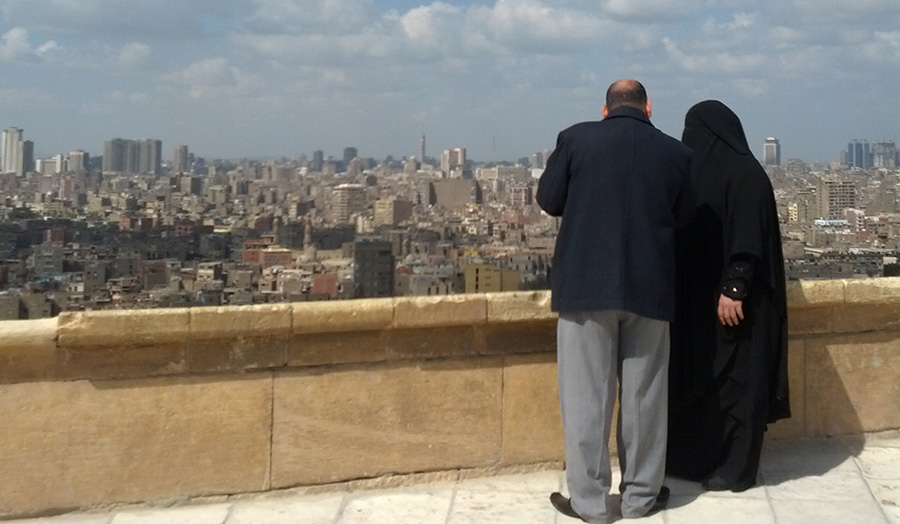

Mulher de burca no Cairo

Confesso que achei o Islamismo uma religião impressionante, o que aumentou ainda mais o meu respeito. Os cinco pilares do islão são cinco deveres básicos de cada muçulmano:

- a recitação e aceitação da crença (Chahada ou Shahada);
- orar cinco vezes ao longo do dia (Salá, Salat ou Salah);
- pagar esmola (Zakat ou Zakah);
- observar o jejum no Ramadão (Saum ou Siyam);
- fazer a peregrinação à Meca (Hajj), se tiver condições físicas e financeiras.

Aliás, sabem onde fica [a meca sagrada](http://pt.wikipedia.org/wiki/Meca) que o Fantástico exibe uma vez por ano? Arábia Saudita.

### 12. O Mar Vermelho. Nem só de múmias vive o Egito

O Montei Sinai é uma das regiões mais perigos do Oriente Médio, mas também um lugar fascinante, cheio de surpresas pra quem gosta de aventura e esportes.

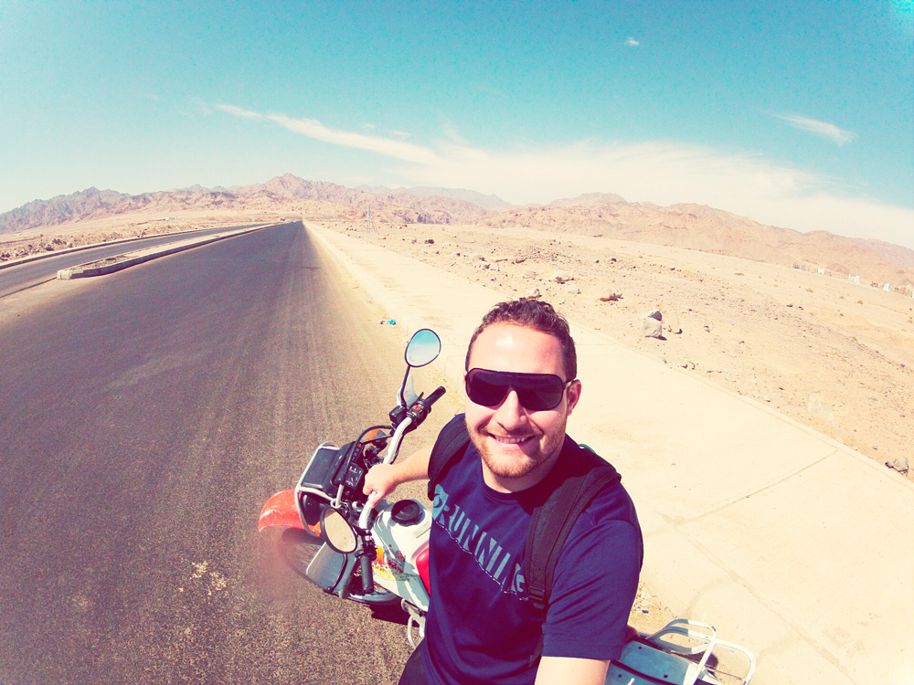

Rolê de motocross pelo deserto de Dahab

E mergulhos no Mar Vermelho:

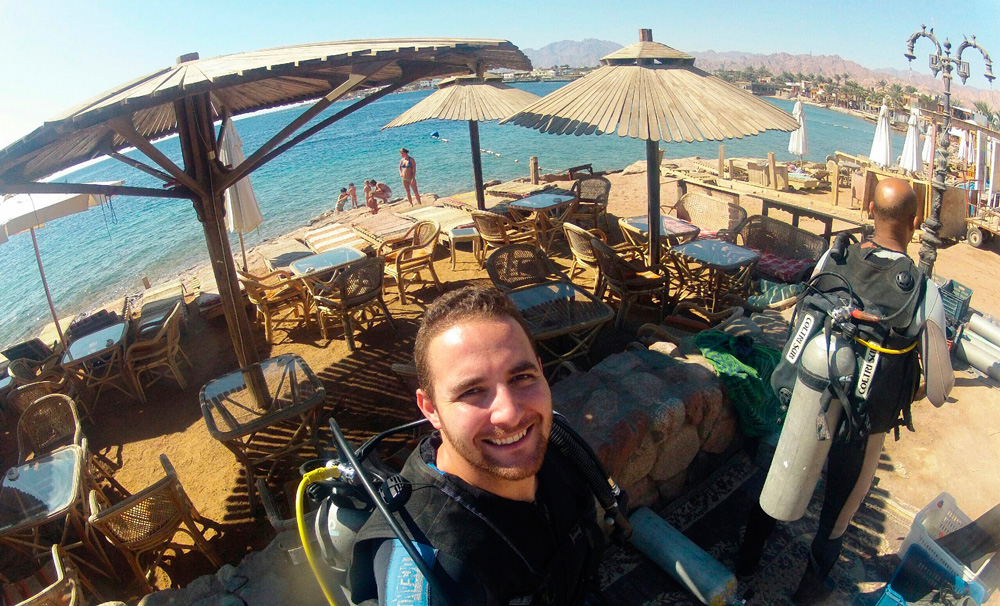

Preparativos para mergulhar em Dahab / Mar Vermelho

Meu querido dromedário, Michael Jackson.

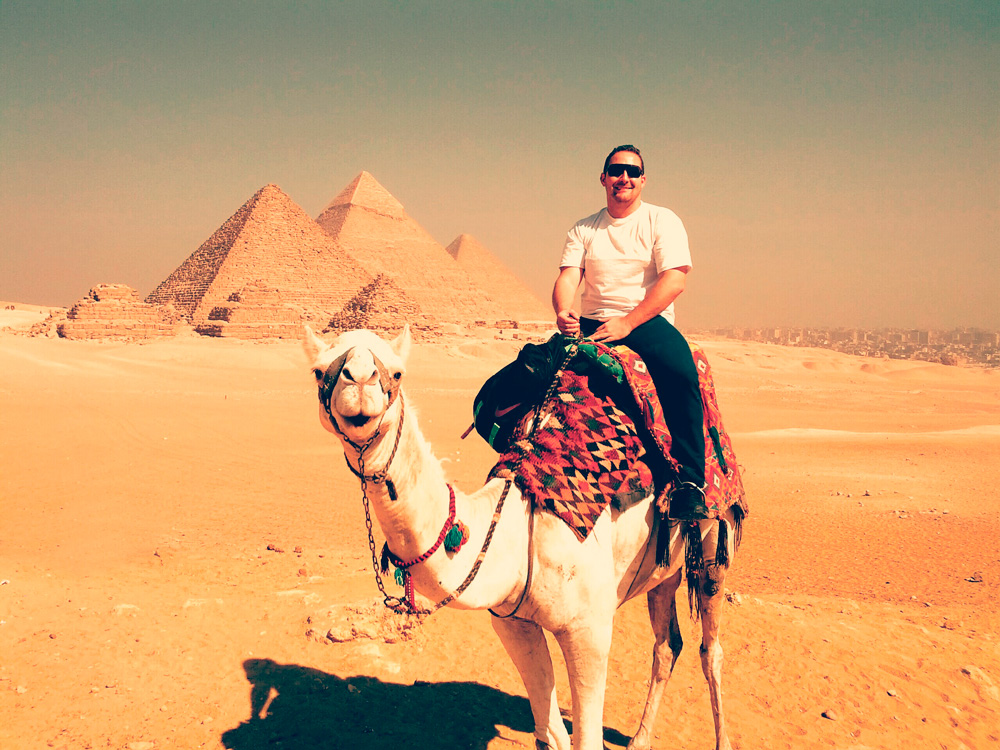

Eu e o Michael Jackson em frente às pirâmides de Gizé

### Meu roteiro de 15 loucos dias pelo Egito:

- Voo de São Paulo para Cairo com escala na Ethiopia – [Ethiopian Airlines](http://www.flyethiopian.com/en/default.aspx) (U$ 750 dólares)
- 3 dias em Giza hospedados nos [Pyramids Loft](https://www.facebook.com/PyramidsLoft) pelo [AIRBNB](https://www.airbnb.com.br/rooms/2324) (U$ 20 dólares / dia)
- Trem de Cairo para Luxor – [Watania Sleeping Trains](https://e7gezly.com/sleepingtrains/) (U$ 90 dólares) Pode ir de dia por U$ 10 dólares
- 3 dias em Luxor no [Bob Marley House Hostel](http://www.hostelworld.com/hosteldetails.php/Bob-Marley-House-Hostel/Luxor/17259) (U$ 15 dólares / dia)
- Ônibus de Luxor para Dahab (U$ 20 dólares e 24h de viagem)
- 2 dias em [Dahab Dorms](http://www.hostelworld.com/hosteldetails.php/Dahab-Dorms/Dahab/15567) (U$ 20 dólares/dia)
- 3 dias em [Penguin Village Dahab](http://www.booking.com/hotel/eg/penguin-village-dahab.pt-br.html?aid=356986;label=gog235jc-hotel-XX-eg-penguinNvillageNdahab-unspec-br-com-L%3Axb-O%3Aunk-B%3Aunk-N%3AXX-S%3Abo;sid=611e0e8d3f4256e842ba80b3677fb1c1;dcid=4;dist=0&type=total&) (U$ 20 dólares / dia)
- Mergulho com oxigênio em Dahab (U$ 50 dólares / 30min)
- Ônibus de Dahab para Cairo (U$ 15 dólares)
- 3 dias em Cairo no [Hostel Dahab](http://www.dahabhostel.com/) (U$ 15 dólares / dia)
- Taxi Cairo -> Aeroporto (U$ 20 dólares)

---

*publicado em 22 de Fevereiro de 2015, 09:00*
