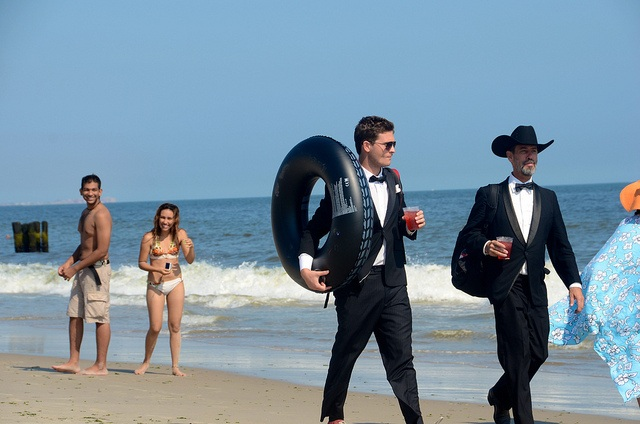

# Como fazer bons negócios no verão

Dizem que entre o ano novo e o carnaval o Brasil pára. Saiba como grandes empresários fazem para manter as engrenagens funcionando nesse período.

[Felipe Ramos](http://www.papodehomem.com.br/autores/felipehk#artigos)

[Trabalho e negócios](http://www.papodehomem.com.br/colecoes/trabalho)

- [**0**

  likes](http://www.papodehomem.com.br/como-fazer-bons-negocios-no-verao#)
- [**0**

  tweets](http://www.papodehomem.com.br/como-fazer-bons-negocios-no-verao#)
- [**0**

  google +](http://www.papodehomem.com.br/como-fazer-bons-negocios-no-verao#)
- [**0**

  comentários](http://www.papodehomem.com.br/como-fazer-bons-negocios-no-verao#disqus_thread)

Muitos dizem que o ano, efetivamente, só começa após o Carnaval. Como empresário, digo que se isso acontecesse, teríamos muito mais dificuldades para operar. Se você for pensar que o Carnaval pode acontecer no final de Fevereiro (ou mesmo início de Março), teríamos cerca de 2/12 do ano sem uma economia forte, o que nos prejudicaria demasiadamente em termos financeiros.

Há cerca de 15 meses, fui convidado, junto com alguns alunos brasileiros do curso [OPM de Harvard](http://www.exed.hbs.edu/programs/opm/Pages/default.aspx) (curso de educação executiva voltado para donos e presidentes de empresas na escola americana), para fundar o capítulo brasileiro de uma das principais entidades de empresários do mundo, o [Entrepreneur Organization](http://www.eonetwork.org/). O EO é uma ONG sem fins lucrativos que visa conectar donos de empresas ao redor do mundo a fim de criar uma cultura de aprendizado e crescimento. Hoje, o EO está presente em 46 países e conta com mais de 10 mil empresários, tornando-se assim uma das organizações de empresários mais importantes do mundo.

O capítulo de São Paulo congrega, hoje, 23 empresários dos mais diversos segmentos. Desde proprietários de agências de comunicação, shopping center a restaurantes e empresas de mineração.

Convidei alguns dos diretores da organização para contar suas experiências de como fazer negócios no verão, período mais crítico do ano para a economia.

### Felipe Ramos - Co-fundador do PapodeHomem / Diretor de Negócios

Para nós do PapodeHomem, que vivemos dentro do ambiente econômico de agências de publicidade, buscando campanhas publicitárias para gerar receita e tornar a empresa lucrativa, toda hora é hora. Precisamos ser criativos e ter soluções de comunicação para que diferentes marcas possam realizar ações digitais em diferentes momentos do ano.

PUBLICIDADE

Temos um histórico de termos trabalhado com um leque enorme de marcas dos mais variados segmentos. Já fizemos projetos sobre desenvolvimento masculino para Boticário, sobre amizades para Chivas, sobre futebol para Heineken,  sobre Fórmula 1 para o GP do Brasil. A lista é longa. Isso nos dá cancha. Nos faz ficar mais preparados para oferecer aos clientes, soluções ideais para os seus problemas de comunicação.

Sempre que o ano acaba, lá pelo dia 18 de Dezembro, fechamos o balanço financeiro e começamos o tão sonhado período de recesso. Junto com ele vem alegria, descanso, família, amor. Vem também o momento de começar a pensar no período entre o Reveillon e o Carnaval que é visto pelas pessoas em geral como um "momento de depressão de mercado", onde as coisas não acontecem e as oportunidades não surgem. 

Sempre volto ao trabalho no início de Janeiro com muitas idéias mas também um tanto apreensivo para saber como o mercado se comportará nesse período.

Mas o que eu faço de diferente nesta época?

As ações em si, não mudam. As agências são as mesmas, os clientes são os mesmos. O que vendemos (mídia e conteúdo) são as mesmas engrenagens. O que muda é o fôlego. Enquanto no final do ano, estamos tão cansados quanto um corredor no final de uma maratona, no início de Janeiro estamos atentos e em posição de batalha. Resiliência em alta. Foco para se desenvolver um trabalho de negócios que seja eficaz, afinal, todos os funcionários precisam receber seus salários em dia e a máquina precisa continuar faturando.

O exercício de encarar o início do ano com olhos que brilham é poderoso. Nos faz perceber que temos um longo e árduo caminho pela frente e que muitos obstáculos irão aparecer ao longo do ano.

Com a espada em riste, rumamos à batalha com os olhos penetrantes de [Miyamoto Musashi](http://pt.wikipedia.org/wiki/Miyamoto_Musashi), o mais famoso espadachim da história japonesa.

### Alex Brunello - Diretor [Ctratk](http://www.contraataque.net/%5D)

Sabemos que a veia empreendedora não pára, e que além dos empreendedores, muitos profissionais sofrem para fazer negócios nesses períodos.

A meu ver, algumas estratégias simples podem ajudar a mitigar esse problema:

**1. Planeje com antecedência:** Uma das formas para  conseguir se movimentar em Janeiro e Fevereiro vem dos frutos de sementes plantadas em Dezembro - ou antes. Aproveitar as infinitas festas de final de ano, reencontros com amigos, clientes ou fornecedores para alinhar algumas coisas para Janeiro e Fevereiro, sempre pode trazer algum resultado. Só tome cuidado para não abrir uma planilha Excel entre um drink e outro. Confie em mim, você não quer ser esse cara.

**2. Comunique a sua disponibilidade:** Se souberem que você está com as "portas abertas" e rodando à todo vapor, as chances de te procurarem aumentam consideravelmente. Em geral, as pessoas simplesmente partem do princípio de que ninguém está trabalhando e  isso pode inibir alguns que, assim como você. estão na ativa e querendo fazer negócios.

**3. "Enquanto uns choram, outros vendem lenços":** Mesmo que você efetivamente esteja de férias, muitas oportunidades podem surgir para você, seja num *resort* 5 estrelas, na praia da moda ou passeando no parque num fim de tarde, a chance de encontrar pessoas com interesses mútuos sempre existe.

A chave aqui é a moderação, não prospecte de forma ativa, aprenda a ser um bom ouvinte, esse é um bom caminho para conhecer novas culturas, pessoas, iniciar grandes amizades.

Se o tema surgir, até fale de negócios, mas lembre-se: você está de férias. Ao se enveredar por este caminho não se aprofunde em temas complexos: não fará bem nem para você nem para seu novo amigo. Mas quem sabe vocês não marcam uma reunião "para depois do carnaval?"

### Esteban Leiderman - CEO Brazilian Signature

Final de ano sempre apresenta um dilema no âmbito dos negócios: como organizar o nosso tempo e esforços nessa reta final? Pergunta válida para muitos de nos que estamos muito próximos de atingir as metas, porém ainda nos falta esse pouco para realmente proclamar o “conseguimos”. Já a partir dos dias entre 15 e 20 de dezembro, o Brasil entra no modo “férias” ou, se quiser, no modo “devagar”.

No início do ano o vendedor típico enxerga pela frente todo um ano para conseguir as suas metas, muito tempo. Porém, quando chega Outubro-Novembro, quando tem cumprido so 70% das metas, começa a se desesperar e correr atrás dos números.

Novembro, geralmente é um bom mês porque os comércios se enchem de mercadorias para atender os compradores Natalinos. Mas dezembro e janeiro, é osso. Isso sem falar de Carnaval!

A cultura do ritmo Brasileiro no final de ano entre dezembro até logo após o Carnaval é um fato pouco provável de se mudar - aliás, ja tentou falar de negócios com algum Frances em Agosto? É um bom desafio…

A questão passa por um bom e minucioso planejamento das metas entre Fevereio-Março e Novembro-Dezembro todo ano, de forma a incluir os hiatos. Passa por entender e assumir a realidade cultural e planejar as ações e números de acordo.

O que você não fez entre Carnaval e Novembro, dificilmente o fará neste período “cultural”.

### Leandro Tecotton - Gerente Comercial na [Tecotton Textil Ltda](http://www.tecotton.com.br/)

Para o comércio, os meses de janeiro e fevereiro são bem preocupantes, principalmente aqui no Brasil, onde todos nós sabemos que o ano só começa depois do Carnaval. Tem dias que o telefone nem toca... eu trabalho com moda, e muitos empresários estão de férias nesse período, e são eles que decidem as compras em suas empresas.

Tento ser o mais pró-ativo possível e uso esse período para direcionar minhas equipes (adminiatrativa/financeira/comercial/compras) conforme o planejamento. Ligo para os principais clientes e pesquiso quais os objetivos deles no ano e tento marcar algumas reuniões para iniciar as vendas. Faço algumas ações promocionais de preço para girar o estoque e ajudar no fluxo de caixa, assim como os vendedores ganham mais comissões nesses meses para incentivá-los na venda.

É um bimestre complicado, mas não posso me assustar, pois fica parado para muitas empresas e não apenas para mim. Se fosse um problema que afetasse apenas a minha empresa, aí sim, eu teria que me preocupar.

E além disso, eu medito todos os dias, lembro de respirar e sigo em frente.

### Cristiano Miano - Presidente do Conselho do [Grupo Digi](http://www.grupodigi.com.br/)

Tenho muitas evoluções pessoais nesta época e acredito muito que seja pela diminuição de interferências na agenda por parte de reuniões com terceiros. Na Publicidade, este periodo é por padrão um periodo de PRODUÇÃO. Tudo já foi planejado e vendido no final do ano anterior. Concorrências foram vencidas e há muito o que trabalhar para produzir o que se vendeu.

Acostumado com a diâmica do Brasil antes do carnaval, já nem levo mais em conta especial o período. Gosto muito de Janeiro e Fevereiro no Brasil pois as pessoas ainda estão esquentando as turbinas e você ganha a oportunidade de ter uma agenda um pouco mais tranquila para resolver e planejar assuntos internos. Aqui no Grupo Digi, fazemos planejamentos com antecedência de 2 a 3 anos e sempre atualizamos no final de cada ano. Logo, podemos usar Janeiro e Fevereiro para implantar processos, mudar padrões, treinar times e acompanhar o dia-a-dia da empresa de perto.

No lado comercial, acredito que se você precisa vender nestes meses, deve ser importante planejar e organizar muito bem sua agenda, já que muitos de seus interlocutores poderão estar viajando, planejando ou empenhados no seus seus descansos de férias ou em outras coisas.

\* \* \*

E vocês, como lidam com os hiatos e períodos de escassez no ano?

---

*publicado em 25 de Fevereiro de 2015, 17:54*
