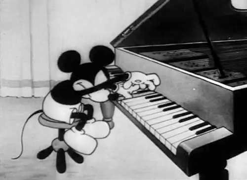

# Cultive disciplina | 23 dias para um homem melhor #22

Qual a importância de se manter firme nos hábitos, mesmo quando a motivação para tanto não ocorre?

Chegamos num ponto no qual a cultura do *“Faça o que você ama”* venceu. Ela está por todos os lados, em qualquer revista, blog ou post do Facebook. Algumas pessoas adoram dizer que amam o que fazem pelas timelines da vida, tornando público seu gosto e energia intermináveis ao executar a sua lista de tarefas diárias.

O que é ok, ninguém pode dizer que elas estão mentindo. Pode ser que, sim, essas pessoas provem de energia e constante êxtase ao sentarem-se na frente dos seus computadores e olharem seus e-mails ou atenderem seus clientes ou irem pra academia. Quem sou eu pra duvidar.

Mas, ainda que isso seja verdadeiro, talvez essas pessoas não consigam manter o mesmo pique para lavar a louça em casa, ir pra academia ou destravar aquele projeto que sempre quiseram fazer mas que, por qualquer motivo, nunca sentiram-se no ânimo correto pra colocar pra frente.

A verdade é que nem tudo na vida dá essa animação toda.

Mesmo os projetos mais empolgantes têm partes não tão interessantes. Aquele cara incrível que parece ter a vida dos sonhos, tem de responder e-mails chatos, com gente chata, para resolver problemas chatos. Os músicos mais famosos, que nos fazem sonhar com uma vida de glamour, têm de ensaiar, praticar, falar com produtores, quebrar cabeça para compor e tornar as ideias concretas. O mesmo vale para nós, que estamos todos os dias tentando levantar, nos debatendo na cama, antes de ir pro trabalho.

Assim, se você é do tipo que precisa sentir-se “no clima” pra fazer o que tem de fazer, provavelmente, você tem problemas.

### Uma boa notícia: já somos disciplinados

Para muitas coisas na vida nós já fazemos esforços sistemáticos e disciplinados. O exemplo mais claro disso que me vem à mente é quanto ao uso de internet e redes sociais.

Nós checamos nosso Facebook diariamente, lemos e respondemos nossas mensagens, vemos se os amigos estão postando algo de legal, consumimos uma ou outra informação, notícias, etc. Podemos passar algumas horas fazendo isso sem sequer sentir o tempo passar.

Ou seja, quando usamos a palavra “disciplina”, tendemos a pensar que ela se refere apenas a esforços estoicos e, imediatamente, já a associamos a uma sensação negativa, a de estarmos puxando um caminhão carregado. Mas nem sempre é assim. Conseguimos ser disciplinados sem, necessariamente, fazer um enorme esforço para isso.

O importante é: por que conseguimos colocar esse esforço sistemático em uma tarefa que não acaba nunca, demanda bastante energia e atenção e é basicamente inútil, como limpar nossas notificações de Facebook, mas não conseguimos colocar esse mesmo foco naquelas que podem ser bem mais satisfatórias?

Basicamente, [respondemos a incentivos](http://www.papodehomem.com.br/quem-manda-de-verdade-no-seu-dinheiro/). Algumas ações nos fazem ter a sensação de sermos recompensados muito mais depressa. É o caso de comer chocolate, jogar videogame, usar o Facebook ou o Instagram, etc.

Essas são atividades que disparam nosso sistema de recompensa e, por isso se tornam facilmente aditivas. Você acaba sendo naturalmente atraído por elas depois de algum tempo.

Assim, a gente evita se engajar em tarefas nas quais não visualizemos a recompensa chegando. Ou, mesmo que acabe vendo, cognitivamente, somos enganados pelo nosso movimento de energia, que acaba nos conduzindo pra essas ações não muito lucrativas no longo prazo.

Até faz algum sentido, afinal, se eu posso ter satisfação muito mais rápido, pra que diabos eu vou me engajar em algo bem mais demorado e chato?

No fundo, a gente gostaria de sentir esse impulso também pras coisas que nos beneficiariam mais. Quem não gostaria de sentir a mesma vontade que tem quando deseja comer um Doritos, só que pra escrever um livro, estudar pro vestibular ou ir pra academia?

Mas isso não vai acontecer.

Claro, alguns seres são famosos por encontrarem uma motivação mística e inabalável que os conduzem rumo ao seu grande destino, mas para a maioria de nós, tentar encontrar essa força antes de levantar e agir é um equívoco e mais nos atrapalha do que ajuda.

Publicamos um texto recente que toca bem nessa ferida.

> “A motivação, falando de modo geral, opera sob a presunção errônea de que é necessário um estado mental ou emocional particular para que uma tarefa seja realizada.
>
> Isso está completamente invertido.
>
> **A disciplina, em vez disso, separa o funcionamento externo dos sentimentos e mudanças de humor, e assim ironicamente, ao melhorar as emoções de modo consistente, evita o problema.**
>
> As implicações disso são enormes.
>
> Levar as tarefas a cabo efetivamente **causa** os estados interiores que procrastinadores crônicos acreditam que precisam para iniciar as tarefas em primeiro lugar.
>
> Colocando de forma mais simples, **não se deve esperar até se estar em boa forma para começar a treinar. Treina-se para se chegar à boa forma.**
>
> Quando a ação se condiciona pelas emoções, esperar um estado de humor ideal se torna uma forma particularmente insidiosa de procrastinação. Conheço isso muito bem, e gostaria que alguém tivesse me apontado isso vinte, quinze ou dez anos antes de eu acabar aprendendo a diferença ralando na vida.
>
> Quem espera até ter vontade de fazer as coisas para fazê-las, está fodido. É exatamente disso que surge o temido círculo vicioso de procrastinação.”

Apesar do texto acima ser bem enfático, contra o aspecto de motivação, acho que as duas coisas podem andar juntas, no sentido de se apoiarem. Na minha experiência, é muito difícil operar totalmente por motivação, assim como é extremamente sacrificante agir sempre por disciplina.

Acredito que há uma afinação possível de se obter, na qual começa a existir uma espécie de disciplina sem esforço. Mas essa, ao que tudo indica, só vem depois de bastante trabalho sistemático e contínuo, capaz de sobrepujar as nossas constantes oscilações de humor.

No nosso caso, para os dias em que a motivação está alta, fazemos uso dela e surfamos essa onda, sem exagero. Só por que você quer trabalhar em algum projeto pessoal por 10 horas seguidas, não significa que precisa fazer isso. Esse esforço excessivo logo de cara pode minar sua energia pelo resto do progresso.

Para os outros dias, nos quais a motivação estiver em baixar, você faz uso da disciplina. Assim, se você está, digamos, escrevendo um livro, você senta para escrever no mesmo horário de sempre, mesmo que não tenha nenhuma ideia, mesmo que não saia qualquer coisa que preste, mesmo que odeie cada minuto.

Operar dessa forma tende a fazer com que o precipício de desempenho entre os picos de motivação e a apatia/desinteresse comecem a diminuir, fazendo com que você, pela média, passe a ter um resultado mais consistente nas suas ações.

### Faça uma coisa chata por dez dias sem falhar

Para exercitar, sugiro escolher uma tarefa que esteja postergando, de preferência, algo que você realmente precise fazer e que traga benefícios concretos, como lavar a louça, meditar, praticar atividade física, e executá-la por dez dias.

Pra fins de garantir o sucesso do exercício, force-se a executá-lo sempre nos mesmos horários, garantindo a reserva da agenda e observando as oscilações de humor e motivação.

Caso não tenha [começado o exercício de prática de lucidez](http://www.papodehomem.com.br/aprenda-a-parar-e-cultive-mais-lucidez%20), lá no primeiro dia do desafio dos 23 dias, essa pode ser a chance.

***Nota:** esse texto faz parte da coleção "23 dias para um homem melhor". Você pode ler o primeiro texto que [explica o contexto e a proposta aqui](http://www.papodehomem.com.br/23-dias-para-um-homem-melhor) e pode ver a lista com [todos os artigos já publicados aqui](http://www.papodehomem.com.br/colecoes/23-dias-para-um-homem-melhor).*

***Nota 2:** Pretendemos
fazer um encontro na sede do PapodeHomem, na Rua Monte Alegre, 1370 –
São Paulo, no dia 27 de fevereiro, às 19hrs, para discutir essas
práticas e ouvir de quem aceitou os desafios quais os impactos gerados. E
aí, topam?*

### Mecenas: [O Boticário - Invista em você](http://mfa.btcr.predicta.net/mrm-ad/ad/url/?;c=2969;sc=7424;p=20;b=118817;)

*Investir
em si mesmo, não é apenas cuidar do corpo e da aparência, mas também da
nossa mente, das nossas relações, do nosso trabalho e do nosso estilo.*

*Por isso, em parceria com o PapodeHomem, [O Boticário](http://mfa.btcr.predicta.net/mrm-ad/ad/url/?;c=2969;sc=7424;p=20;b=118817;)será o Mecenas desse percurso de 23 dias.*

*Para dar uma força àqueles que querem renovar o visual e se dar bem, [O Boticário](http://mfa.btcr.predicta.net/mrm-ad/ad/url/?;c=2969;sc=7424;p=20;b=118817;)está
com mais de 100 itens da linha masculina com descontos de 15% em  todos
os seus canais de venda (revendedoras, loja online e lojas físicas).*

*No hotsite [“Invista em você”](http://mfa.btcr.predicta.net/mrm-ad/ad/url/?;c=2969;sc=7424;p=20;b=118817;)você poderá conferir os produtos em promoção e um bocado de dicas e conteúdos exclusivos para você cuidar   da sua beleza. [Vale a pena conferir.](http://mfa.btcr.predicta.net/mrm-ad/ad/url/?;c=2969;sc=7424;p=20;b=118817;)*

---

*publicado em 20 de Fevereiro de 2015, 12:49*
