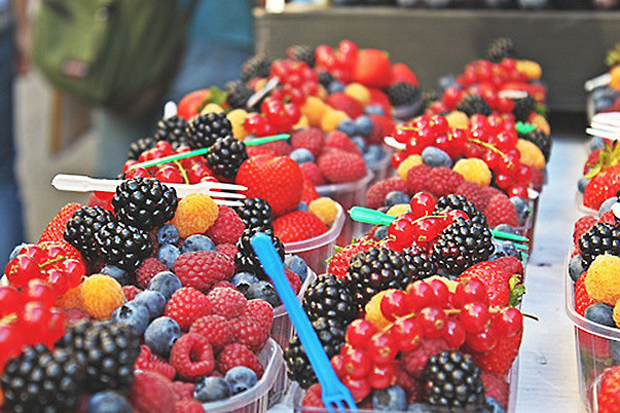
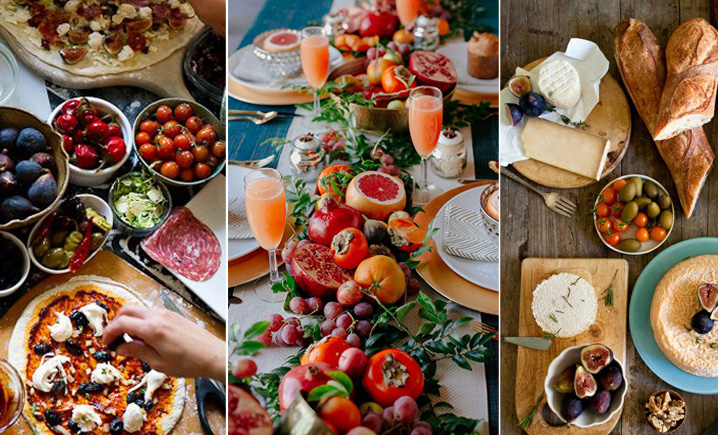
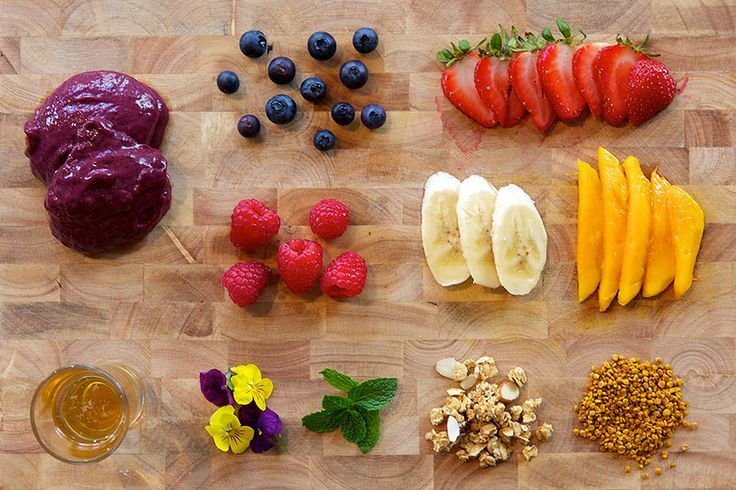

# Das duas folhas de alface do X-salada à Ortorexia

A busca por uma vida mais saudável e um corpo mais bonito levam podem levar a um transtorno alimentar: a ortorexia

Durante a efusiva tomada de conhecimento de que muitas das doenças da atualidade são influenciadas por nossos comportamentos, muitas pessoas estão a um passo de lidar com a chamada [Ortorexia](http://pt.wikipedia.org/wiki/Ortorexia).

A Ortorexia é um transtorno alimentar recentemente diagnosticado, e resumidamente ocorre quando uma pessoa se torna obsessiva quanto à qualidade e às corretas e minuciosas proporções de nutrientes, vitaminas e minerais que ingere.

Não posso. Muita frutose.

O ortoréxico ingere, engole, coloca um alimento para dentro de sua boca, sempre com uma funcionalidade planejada, o que está bem distante do conceito de comer, que deveria ser algo prazeroso, uma lambança, um arrepio no estômago, podendo ou não ser nutritivo.

Uma exagerada tentativa de controle. Os planejamentos alimentares ocupam todo o dia e o pensamento de uma pessoa ortoréxica, respaldados e incentivados por revistas e alguns profissionais da saúde que consideram tal esforço e prática como exemplares.

Nessa permissão de apenas alimentos saudáveis, funcionais e anti-câncer, essas vítimas escrutinam o conteúdo nutricional de cada elemento que ingerem. Calorias, vitaminas e nutrientes tornam-se o ponto focal da comida e qualquer coisa que contenha o mínimo vestígio do que está na lista do “não é permitido” não é consumido.

A indústria também se aproveita e coloca caríssimas 4 sementes de alguma coisa em um saquinho com rótulo de “funcional” a preços exorbitantes. Tudo vendido e venerado. O quilo do feijão custa por volta de 5 reais e deveria ser venerado tanto quanto.

Na ortorexia midiática, são inúmeras as fotos compartilhadas, coloridas, “orgânicas” em pratos lindos bem posicionados e iluminados. Líquidos verdes em garrafas especialíssimas. Quando estou prestes a comer, quero olhar para a minha comida, ter um momento de pura intimidade com ela, encher a boca, dizer "hummm" e repetir esse processo até que minha fome termine.

Parar para pensar se tenho diante de mim uma refeição digna de ser compartilhada e ostentada (muitas são preparadas com esse fim), encontrar o celular, pensar na louça, na luz, na disposição minuciosa dos alimentos, tirar uma foto e escolher filtros é, no mínimo, entediante e, no máximo, uma doença. E essa linha é tênue.

Estamos cercados por pessoas entediadas. Estamos vivenciando uma Ortorexia compartilhada e há quem bata palmas no final.

E tudo pode começar com uma simples dieta. De domingo para segunda, a pessoa passa do ato de comer apenas duas folhas diárias de alface que estavam no X-Salada para ser um Mister Orgânico que vai correndo à feira, às 5 da manhã.

Absolutamente nada contra os orgânicos. Mas comportamentos extremos não duram. Arrebentam e enlouquecem caso algo não ocorra conforme o planejado.

A dieta para emagrecer é o fator precipitante mais frequente nos transtornos alimentares. [Estudos longitudinais demonstram](http://www.scielo.br/scielo.php?script=sci_arttext&pid=S1516-44462002000700005) claramente que a dieta aumenta de modo considerável o risco desses problemas. Indivíduos que faziam dieta tiveram um risco 18 vezes maior ao desenvolvimento de transtornos alimentares quando comparados com indivíduos que não faziam, após um ano de seguimento.

A dieta isoladamente não é suficiente para iniciá-los. Ela precisa interagir com outros fatores de risco como baixa autoestima, depressão, tendência à obesidade, interações familiares, ideal social de magreza [entre outros](http://www.scielo.br/scielo.php?script=sci_arttext&pid=S1516-44462002000700005). Fatores que borbulham por aí, não?

Em contrapartida, sabe-se que apenas 10% da população brasileira atinge o [número preconizado](http://mdemulher.abril.com.br/saude/saude-e-vital/5-porcoes-de-frutas-e-hortalicas-por-dia-ajudam-a-evitar-qualquer-doenca) pela Organização Mundial da Saúde de comer cinco porções de frutas e vegetais todos os dias. O que é também assustador.

Não deveria ser tão difícil. É comer uma fruta no café da manhã, outras duas nos lanches da manhã e tarde, e comer folhas/verduras no almoço e no jantar. Como não gostar de banana com mel? Uvas gorduchas e geladas? Lasanha de Berinjela banhada por um molho de tomates caseiros (já são duas porções)? Abobrinha refogada com muito amor?

Brincadeiras à parte, é necessário reforçar que, ao iniciar uma dieta, é imprescindível o acompanhamento de um nutricionista, quando não de um psicólogo em casos mais delicados relacionados ao comportamento alimentar.

Os vídeos de alimentação na Internet não podem substituir esses profissionais. A dieta e rotinas de exercícios físicos desse pessoal (que podem ser bem interessantes) muitas vezes não servem para as nossas especificidades fisiológicas. Suas frases prontas em fotos anatômicas muitas vezes estão carregadas de preconceitos, pequenezas e pouca sensibilidade para com seus receptores. Diferente de quando um amigo compartilha uma receita gostosa, um restaurante charmoso ou um site compartilha informações educacionais sobre um alimento.

Daí, um belo dia [lê-se que 65% das diferenças](http://www.bbc.co.uk/portuguese/noticias/2015/01/150108_cancer_azar_duvidas_mdb) em risco de se desenvolver câncer em diferentes tecidos se deve às divisões celulares que deram errado, ou seja, "azar". E aí? Como esse extremo fica? E todos aqueles alimentos anti-câncer ingeridos? Tudo em vão? Seu mundo caiu?

Não. Todas as pesquisas científicas são passíveis de fragilidades metodológicas, de divulgação e, principalmente, de interpretação. Não sejamos analfabetos funcionais contadores de calorias.

E independentemente de pesquisas, sabemos, sentimos na pele quando os hormônios se alinham [pelos exercícios físicos](http://www.papodehomem.com.br/a-autoestima-as-autopercepcoes-e-os-exercicios-fisicos/), quando temos [uma alimentação equilibrada](http://www.papodehomem.com.br/matar-a-fome-comer-direito-nutricao-como-lidamos-com-a-nossa-alimentacao), e assim nos percebemos mais positivamente com esse zelo.

Nosso corpo [não é infinitamente maleável](http://www.saudepublica.ufc.br/imagens/uploads/dissertacoes/471c6331e8f556805146658fb034da85.pdf) a ponto de alcançar o ideal estético com dietas e exercícios, negligenciando-se as determinações biológicas e genéticas; e mesmo que nos digam que conseguimos atingir este “ideal”, isso não significa que teremos alcançado o sucesso em todos os aspectos de nossas vidas. Sejamos leves.

Que a alegria do pecado, da mesmice, do pão com ovo às vezes tome conta de nós. Ah, que delícia. "Quem se diz muito perfeito, na certa encontrou um jeito insosso, pra não ser de carne e osso".

Muito insosso.

---

*publicado em 03 de Fevereiro de 2015, 00:00*
