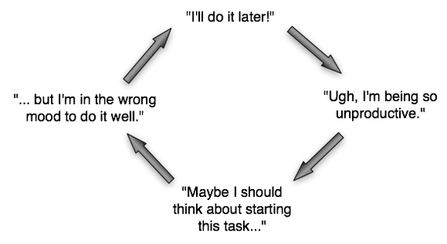

# Foda-se a motivação, o que você precisa é disciplina

Levar as tarefas a cabo causa os estados interiores que procrastinadores crônicos acreditam que precisam para iniciar as tarefas

Para fazer qualquer coisa, há basicamente duas formas de se colocar numa situação em que aquilo efetivamente vai ser feito.

A primeira opção, mais popular e devastadoramente errônea, é tentar se automotivar.

A segunda, uma escolha um tanto impopular e completamente correta, é cultivar a disciplina.

Trata-se de uma daquelas situações onde adotar uma perspectiva diversa redunda em resultados superiores imediatamente. Poucos usos do termo “mudança de paradigma” são realmente legítimos, mas aqui temos um deles. É como acender a lâmpada em cima da cabeça.

Qual é a diferença?

**A motivação, falando de modo geral, opera sob a presunção errônea de que é necessário um estado mental ou emocional particular para que uma tarefa seja realizada.**

Isso está completamente invertido.

**A disciplina, em vez disso, separa o funcionamento externo dos sentimentos e mudanças de humor, e assim ironicamente, *ao melhorar as emoções de modo consistente, evita o problema.***

As implicações disso são enormes.

Levar as tarefas a cabo efetivamente **causa** os estados interiores que procrastinadores crônicos acreditam que precisam para iniciar as tarefas em primeiro lugar.

Colocando de forma mais simples, **não se deve esperar até se estar em boa forma para começar a treinar. Treina-se para se chegar à boa forma.**

Quando a ação se condiciona pelas emoções, esperar um estado de humor ideal se torna uma forma particularmente insidiosa de procrastinação. Conheço isso muito bem, e gostaria que alguém tivesse me apontado isso vinte, quinze ou dez anos antes de eu acabar aprendendo a diferença ralando na vida.

Quem espera até ter vontade de fazer as coisas para fazê-las, está fodido. É exatamente disso que surge o temido círculo vicioso de procrastinação.

> **O ciclo da procrastinação**
>
> Mais tarde eu faço! -> Droga, não tô fazendo nada. -> Talvez eu deva considerar começar essa tarefa... -> ... mas não estou disposto o suficiente para fazê-la bem. (repete)

A essência de correr atrás da motivação é a insistência na fantasia infantil de que só devemos fazer as coisas que estamos a fim de fazer. O problema então se coloca da seguinte forma: “Como eu chego ao ponto de *estar a fim* de fazer o que eu racionalmente decidi fazer?” Isso é ruim demais.

A pergunta certa seria “Como deixo meu humor de lado e faço as coisas que conscientemente quero fazer, sem frescura?”

O ponto é cortar a ligação entre os sentimentos e as ações, e fazer a coisa de qualquer jeito. Você vai se sentir bem, energético e excitado **depois de agir**.

A motivação inverte tudo isso. Estou 100% convencido de que esta perspectiva defeituosa é o principal motor da epidemia de “sentar de cuecas jogando videogame e batendo punheta” que atualmente ataca os países desenvolvidos.

Também há problemas psicológicos na dependência da motivação.

A vida e o mundo reais algumas vezes exigem que se faça coisas com que ninguém em sã consciência conseguiria se entusiasmar, e assim a “motivação” se depara com o obstáculo insuperável de tentar produzir entusiasmo por aquilo que objetivamente jamais o mereceria. Fora a preguiça, a única solução é acabar com a sanidade das pessoas. Esse é um dilema horrível, e felizmente falacioso.

Tentar martelar o entusiasmo por atividades fundamentalmente chatas e miseráveis é literalmente uma forma de automutilação psicológica deliberada, uma insanidade voluntária: “GOSTO TANTO DESSAS PLANILHAS, MAL POSSO ESPERAR PARA PREENCHER A EQUAÇÃO PARA O VALOR FUTURO DA ANUIDADE, AMO TAAAAANTO MEU TRABALHO!”

Não considero episódios autoinfligidos de hipomania os melhores impulsionadores da atividade humana. É inevitável que ocorra algum tipo de compensação tímica com episódios de depressão, uma vez que o cérebro humano não tolera o abuso por tempo indetermiando. Estão presentes travas e válvulas de segurança. Ocorrem ressacas hormonais.

A pior coisa que pode acontecer é ser bem sucedido na coisa errada – temporariamente. Um cenário muito superior é reter a sanidade, o que infelizmente tende a ser confundido com fracasso moral: “Eu ainda não amo meu trabalho fútil de tirar um papel daqui e colocar ali, devo estar fazendo algo errado.” “Ainda prefiro comer bolo, e não brócolis, e assim não consigo perder peso, talvez eu seja fraco mesmo.” “Eu devia comprar outro livro sobre motivação.” Besteira. O erro crucial aqui é encarar essas questões em termos de presença ou ausência de motivação. A resposta é a disciplina, não a motivação.

Há outro problema prático com a motivação. Tem validade restrita, precisa ser constantemente revigorada.

A motivação é como dar corda manualmente numa manivela pesada para através disso obter uma grande força instantânea. No melhor dos casos, ela armazena e converte a energia para uma finalidade particular. Há situações onde ela é a atitude correta, exceções em que ficar superanimado e armazenar um montão de energia mental de antemão é o melhor a fazer. Corridas olímpicas ou fugas de prisões seriam casos assim. Mas fora esses casos limítrofes, ela é uma base terrível para o funcionamento regular cotidiano, e para qualquer coisa que exija resultados consistentes em longo prazo.

Em contraste a isso, a disciplina é como uma máquina que uma vez colocada em funcionamento, na verdade passa a **fornecer** energia ao sistema.

A produtividade não exige nenhum estado mental. Para resultados consistentes em longo prazo, a disciplina supera em muito a motivação, de fato a disciplina acaba correndo ao redor, humilhando a motivação.

Em resumo, a motivação é tentar encontrar aquela vontade de fazer as coisas. Disciplina é fazer mesmo se não se tem vontade.

Você se sente bem depois.

A disciplina, enfim, é um sistema que funciona, já a motivação é semelhante aos objetivos em si. Há uma simetria. A disciplina mais ou menos se autoperpetua e é constante, já a motivação é uma coisa meio aos solavancos.

Como se cultiva disciplina? Construindo hábitos – começando com coisas bem pequenas, com que se consegue lidar, coisas até mesmo microscópicas, e assim ganhando impulso, reinveste-se nela em mudanças cada vez maiores na rotina, dessa forma construindo um círculo virtuoso de retroalimentação positiva.

A motivação é uma atitude contraproducente. O que conta é a disciplina.

***Nota:** Este texto foi originalmente publicado no [Wisdomination.com](http://www.wisdomination.com/screw-motivation-what-you-need-is-discipline/).*

---

*publicado em 07 de Fevereiro de 2015, 15:56*
