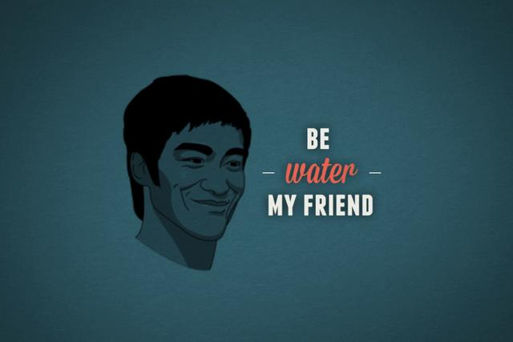

# O discurso completo do "be water, my friend" e o mais importante que Bruce Lee disse

A famosa citação vem de um monólogo maior e a parte cortada da famosa afirmação é ainda mais interessante e importante

A frase ficou famosa para cacete. Ser água, mutável, não reagir a situações. Há muita sabedoria na fala, a empolgação do Bruce Lee dá ainda mais vida à ela e sede a quem ouve [ou assiste ao vídeo da entrevista](https://www.youtube.com/watch?v=tHPsi4ugPho) em que ele diz "be water, my friend".

Seja água, amigo.

A frase original foi dita pelo mesmo Bruce Lee, mas interpretando Li Tsung, um traficante de antiguidades que apareceu em quatro episódios da série americana *[Longstreet](http://en.wikipedia.org/wiki/Longstreet_%28TV_series%29)*, uma trama investigativa que passou no canal ABC entre 1971 e 1972. Nela, Mike Longstreet fica cego e perde sua esposa após uma explosão. Decidido a investigar o que aconteceu, ele passa a aprender técnicas de artes marciais com Li Tsung.

Disso, vem a conversa:

> "Don’t make a plan of fighting.That is a very good way to lose your teeth.  
> [...]  
> If you try to remember you will lose! Empty your mind. Be formless, shapeless, like water. Put water into a cup, it becomes the cup. Put water into a teapot, it becomes the teapot. Water can flow or creep or drip or crash.   
> Be water, my friend."

Todos conhecem [a tradução dessa parte](http://www.papodehomem.com.br/nem-todo-lutador-e-um-artista-marcial/). Mas na série, a conversa que segue após a célebre afirmação é ainda mais interessante:

> Like everyone else you want to learn the way to win, but never to accept the way to lose — to accept defeat. To learn to die is to be liberated from it. So when tomorrow comes you must free your ambitious mind and learn the art of dying!

O corte famoso fala sobre adaptação para a vitória, é algo que empolga e que é de grande utilidade, mas facilmente causa distração. Ora, legal, vou ser água. Mas como?

Se vira, my friend

Um baita ensinamento que esvai pelos dedos e [cai em uma propaganda de cerveja](https://www.youtube.com/watch?v=CbepYeqvr6U). Mas o que vem depois, esse sim, bota a pulga atrás da orelha, aquela coçada no membro amputado, aquele comichão.

Em tradução livre:

> "Como todo mundo, você procura aprender como vencer, mas nunca como perder — como aceitar a derrota. Aprender a morrer é se libertar da morte. Então, quando amanhã chegar, você precisa se livrar da sua mente ambiciosa e aprender a arte da morte."

Agora sim. Agora estamos falando algo. Aprender a ser água e aprender a ser derrotado, a não buscar vitória como caminho único. Lidar com a morte. [Lembrar da morte](http://www.papodehomem.com.br/percursos/para-lembrar-da-morte).

Então, se você pensa em ser como água, lembre-se que ela também pode ser bloqueada e represada e maltratada, evaporada e faltar a beça.

---

*publicado em 05 de Fevereiro de 2015, 09:00*
