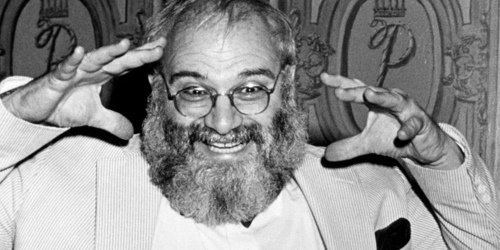

# Oliver Sacks diante da morte

Traduzimos na íntegra o texto do neurocientista para o The New York Times sobre seus últimos meses de vida após descobrir um câncer terminal

Muitos conhecem Oliver Sacks por livros como *O homem que confundiu sua mulher com um chapéu* e *Alucinações musicais* ou pelo filme *Tempo de despertar* (no qual Robin Williams interpreta o neurocientista). Ontem, mesmo quem não o conhecia ficou tocado por [seu texto no The New York Times](http://www.nytimes.com/2015/02/19/opinion/oliver-sacks-on-learning-he-has-terminal-cancer.html) sobre como está vivendo após descobrir um câncer terminal.

Assim que recebi o link da Isabella Ianelli (que nos últimos tempos está imersa no *O livro tibetano do viver e do morrer*, de Sogyal Rinpoche), cantei a bola para o Luciano Ribeiro, que pediu ao Eduardo Pinheiro para traduzir o texto inteiro.

Aqui está:

### Minha vida

> Um mês atrás, parecia que eu gozava de boa saúde, poderia se considerar até mesmo excelente. Aos 81 anos de idade, ainda nado 1500 metros por dia. Mas minha boa fortuna já havia se esgotado – algumas semanas atrás fiquei ciente de que tenho múltiplas metástases no fígado. Nove anos atrás descobrimos que eu tinha um raro tumor no olho, um melanoma ocular. Ainda que a radiação e o uso de lasers para remover o tumor me tenha deixado cego daquele olho, apenas em casos muito raros tumores deste tipo fazem metástase. Ainda assim, estou entre os 2% que não têm sorte.
>
> Sinto gratidão pelos nove anos de boa saúde e produtividade desde o primeiro diagnóstico, mas agora me deparo com a morte. O câncer ocupa um terço de meu fígado, e embora seu avanço possa ser desacelerado, não há como parar esse tipo particular de câncer.
>
> É só minha a decisão de como viver os meses que me restam. Tenho que viver da forma mais rica, profunda e produtiva que conseguir. E nisso me encorajo com as palavras de um de meus filósofos favoritos, David Hume, que, ao descobrir aos 65 anos de idade que uma doença o levaria à morte, escreveu uma curta autobiografia num único dia de abril de 1776. A ela ele deu o título de “Minha vida.”
>
> “Neste momento me deparo com uma dissolução muito rápida,” escreveu ele. “De minha condição, sofro muito pouco com dor, e o mais estranho é que, não obstante a grande derrocada de minha compleição, nunca cheguei a sofrer um momento sequer de esmorecimento do humor. Mantenho o mesmo ardor de sempre pelo estudo, e a mesma alegria na companhia dos outros.”
>
> Tenho sorte de passar dos 80, e os 15 anos que superaram as seis décadas e cinco anos de Hume me foram igualmente plenos de trabalho e amor. Nesse período publiquei cinco livros e completei uma autobiografia (um bocado maior do que as poucas páginas de Hume) a ser publicada nessa primavera; tenho vários outros livros quase prontos.
>
> Hume continuou, “Sou ... um homem de disposições brandas, em comando do meu próprio temperamento, de humor aberto, social e alegre, dado ao apego, mas pouco suscetível à inimizade, e de grande moderação em todas minhas paixões.”
>
> Nisso não sou como Hume. Embora eu tenha vivido relacionamentos amorosos e amizades, e não tenha inimigos verdadeiros, não posso dizer (nem ninguém que me conhece diria) que sou um homem de disposição branda. Pelo contrário, sou um homem de disposição veemente, de entusiasmos violentos, e extremamente desprovido de moderação com relação a todas as minhas paixões.
>
> Ainda assim, uma frase do ensaio de Hume me é marcante como especialmente verdadeira no meu caso: “É difícil”, escreveu ele, “alguém ter mais desapego pela vida do que neste momento.”Ao longo dos últimos dias, tenho sido capaz de ver minha vida como se de uma grande altitude, como uma espécie de paisagem distante, e com um sentido aprofundado da conexão entre todas as partes. E isso não significa que minha vida acabou.
>
> Pelo contrário, me sinto intensamente vivo, e quero e espero que no tempo que me sobra que eu aprofunde minhas amizades, diga adeus para aqueles que amo, escreva mais, viaje se tiver a força, e alcance novos níveis de entendimento e discernimento.
>
> Isso demandará audácia, clareza e conversas diretas; tentar acertar minhas contas com o mundo. Mas haverá tempo, também, para alguma diversão (e até mesmo para alguma bobeira, sem dúvida).
>
> Repentinamente me sinto possuidor de um foco muito claro, e de perspectiva. Não há mais tempo para nada que não seja essencial. Preciso focar em mim mesmo, no meu trabalho e nos meus amigos. Não vou mais assistir o jornal na TV todas as noites. Não vou mais prestar atenção para política ou para argumentos sobre aquecimento global.
>
> Não se trata de indiferença, mas de desapego – ainda me importo muito com o Oriente Médio, com o aquecimento global, com o crescimento da desigualdade, mas estas coisas não estão mais na minha alçada; pertencem ao futuro. Regozijo-me ao encontrar jovens capazes – até mesmo aqueles que fizeram minhas biópsias e diagnosticaram minhas metástases. Sinto que o futuro está em boas mãos.
>
> Cada vez estou mais consciente, nos últimos 10 anos mais ou menos, das mortes de meus contemporâneos. A minha geração está de saída, e senti cada morte como uma ruptura, como se parte de mim se rasgasse. Não haverá ninguém como nós quando nos formos, mas na verdade não há ninguém que seja como outro alguém, nunca houve. Quando as pessoas morrem, são insubstituíveis. Deixam buracos que não podem ser preenchidos, pois é o destino – o destino genético e neural – de cada ser humano ser um indivíduo único, encontrar seu próprio caminho, viver sua própria vida, e morrer sua própria morte.
>
> Não posso fingir que não tenho medo. Mas meu sentimento predominante é a gratidão. Amei e fui amado; ofereci muito, e recebi algo em troca; li, viajei, pensei e escrevi. Comuniquei-me com o mundo com a comunicação especial dos escritores e leitores.
>
> Acima de tudo, tenho sido um ser senciente, um animal pensante, nesse belo planeta, e isso por si só foi um enorme privilégio, e uma aventura.
>
> —Oliver Sacks

---

*publicado em 20 de Fevereiro de 2015, 11:10*
