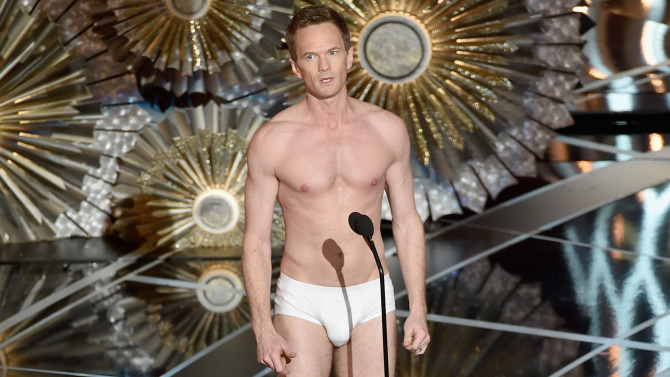
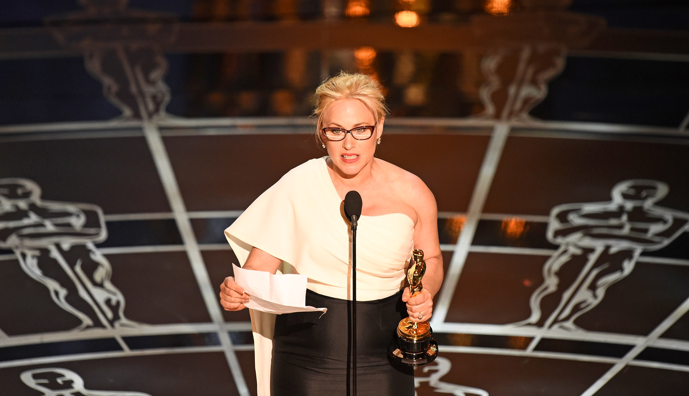
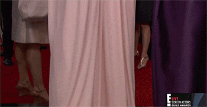
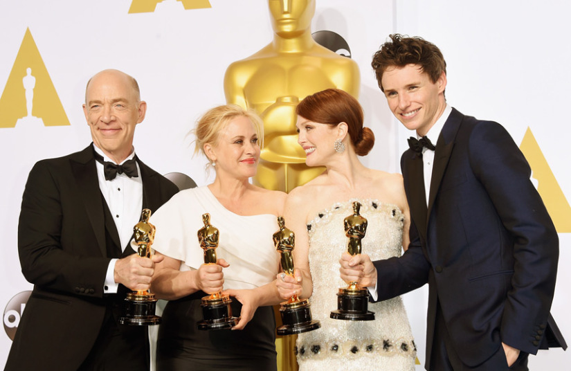
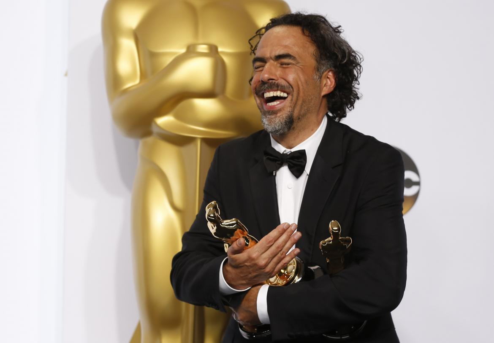

# Patricia Arquette e o melhor efeito manada da história do Oscar

ou "e o Oscar foi para… mexicanos, negros e direitos das mulheres"

Antes de tudo, sei o que você acha da cerimônia do Oscar.

Chata, demorada, sem graça, fria e com piadas educadas demais.

Neil Patrick Harris

Bem, nem eu nem boa parte das pessoas - incluindo aí até as que eventualmente gostam da ficar sentadas na frente da televisão por horas a fio - podemos negar nada disso. Acontece que, num raro alinhamento estelar, a 87ª edição do Academy Awards passou de desfile insosso de celebridades em trajes de gala a grito dos excluídos.

Pense rapidamente: você é rico - pode até não ser um megamilionário, mas se está no Oscar, algo na conta bancária está pingando -, famoso, tem uma horda de seguidores fanáticos no Twitter, contratos publicitários, agentes e toda a sorte de faz tudo que a vida mundana pode permitir. E aí que você fez um puta trabalho num filme cool e está cotado a levar a estatueta para casa.

O que toda essa estrutura faz com sua cabeça e o que provavelmente ela fez com a cabeça de muitos vencedores até este ano? Jogar o jogo. Fale bonito, agradeça à família, ao marido, à esposa, exalte os produtores, mande um beijo para os fãs, faça uma piadinha e é isso. Leve seu homenzinho de ouro para enfeitar a estante. Lembre-se que, acima de tudo e qualquer possibilidade, o seu agente vai pedir de maneira solene, mas insistente: “Sem política hoje, hein?”.

### 1° Ato: Alguém precisa começar

Com isso tudo a sua volta e talvez um último lembrete de cautela feito pelo agente, lá foi uma sorridente e emocionada [Patricia Arquette](http://www.imdb.com/name/nm0000099/), **vencedora do prêmio de Melhor Atriz Coadjuvante** pelo saboroso *[Boyhood](http://www.imdb.com/title/tt1065073/)*, em direção ao púlpito. Não sei ao certo porque, mas sempre que alguém caminha para a glória com um papel na mão algo me diz: “Vem coisa aí”. E veio:

> "A cada mulher que deu à luz cada cidadão e contribuinte desta nação, nós lutamos para os direitos iguais de todos. É hora de haver igualdade salarial de uma vez por todas para todas as mulheres nos Estados Unidos da América."

Booooom!

Da plateia, Meryl Streep, maior vencedora e também a mais indicada aos prêmios femininos em toda a história, vibrou: “Yes! Yeees! Yeeeees!”

A própria Meryl poderia ter lascado essa pedra na vidraça antes. Dez anos atrás. Vinte, talvez. Não o fez por vários motivos que nunca vamos saber. Patricia levou ao palco o discurso que rodeava as mentes da indústria desde o dia em que os indicados foram conhecidos no mês passado.

Os desconfortos pairavam e o mindset era de que faltava diversidade ao Oscar. A guerra das mulheres começara antes. Reese Whiterspoon, indicada ao prêmio de melhor atriz (que ficou com a ruiva Julianne Moore) encampou a hashtag [#askhermore](http://www.brasilpost.com.br/2015/02/22/oscar-machismo-vestido_n_6732372.html) na panaceia do Red Carpet, minutos antes entrar no Dolby Theater. Cate Blanchett, outra megavencedora em premiações, havia encarado um cameraman enquanto conversava com uma repórter do E!, dias antes, no SAG Awards. Enquanto respondia as mais absortas futilidades, o câmera percorria o corpo (ou o vestido) de Cate, que abriu a boca:Você faz isso com os homens?

Você faz isso com os homens?

### 2° Ato: o Comportamento de Manada

Não costumo ir ao Oscar. Aposto que você também não. Mas há entre o Oscar e as festas cotidianas, o bate-papo informal com os amigos e nos eventos sociais de uma forma geral a necessidade de se apresentar alegre, disposto, engraçado e, acima de tudo, não falar nada além do trivial e do esperado. Talvez você seja o alvo da interpelação ou talvez você costume fazê-la, mas tente lembrar quantas vezes já não ouviu o clássico: “Nossa, mas o papo está sério, né?”. Dê espaço e a necessidade de ser fútil vai vingar por toda sua existência.

Acontece que para o fim dos discursos monótonos, Patricia Arquette subiu ao palco cedo demais - o prêmio para atriz coadjuvante é sempre um dos primeiros da noite, numa espécie de preview do que virá. Fica aqui o meu agradecimento à produção e a todos que votaram na atriz do filmaço de Richard Linklater.

**O comportamento de manada é um dos ativos representantes dessa fase incrível e interconectada da nossa sociedade**. Olhe para as redes sociais com a atenção devida e perceba quantas vezes uma opinião forte, coercitiva ou impositiva - seja ela positiva ou negativa, humanista ou retrógrada - pesa sobre como vão reagir as outras pessoas.

Atores e atrizes vencedores da noite: J.K. Simmons (ator coadjuvante), Patricia Arquette (atriz coadjuvante), Julianne Moore (atriz) e Eddie Redmayne (ator)

O comportamento de manada sempre foi amplamente usado nas religiões, mas também é muito comum vê-lo brotar em torcedores num estádio de futebol americano, baseball ou basquete. Junte redes sociais, religião e a experiência esportiva e você terá um microcosmo americano informal delineado.

João Augusto Figueiró, psicoterapeuta da Faculdade de Medicina da Universidade de São Paulo (USP), explica o conceito [numa entrevista ao Estadão](http://www.estadao.com.br/noticias/geral,efeito-manada-motiva-massas,459245):

> Dentro da massa, os indivíduos deixam de lado a moral e a ética, que freiam a impulsividade. As circunstâncias fazem com que ele renuncie aos valores e embarque na proposta coletiva de um líder - e essa proposta circula rapidamente dentro de um grupo. Foi assim que Hitler convenceu os alemães sobre suas ideias contra os judeus. Da mesma forma, George W. Bush convenceu uma nação inteira de que o mal do mundo estava no Afeganistão e no Iraque.

Patricia foi lá, enfrentou o pensamento usual e saiu do palco vencedora com um discurso provocador retumbadamente aplaudido. Não é possível saber ao certo se todos os demais discursos progressistas e em favor das minorias tomariam forma na noite de ontem, mas algum peso o comportamento da atriz de *Boyhood* jogou no colo de seus pares. Patricia queria sorrir, brincar de ser feliz, mas queria também falar sério.

 O convite estava feito.

### 3° ato: a coisa vai melhorar

[Graham Moore](http://www.imdb.com/name/nm2441699/), dono do Oscar de Melhor Roteiro Adaptado por *[O Jogo da Imitação](http://www.imdb.com/title/tt2084970/?ref_=fn_al_tt_1)*, falou sobre se sentir estranho, que pode ser servir a quem está em desacordo com o corpo, com o gênero, com ser nerd ou um desajeitado social qualquer. [Moore afirmou que tentou o suícidio](http://revistamonet.globo.com/Premiacao/noticia/2015/02/roteirista-vencedor-do-oscar-revela-em-discurso-que-tentou-suicidio-na-adolescencia.html) aos 16 anos, mas a coisa acabou saindo melhor que o esperado. Lá estava ele, décadas depois, laureado por seu trabalho. Talvez a fala mais sensível de toda a premiação. Um golaço:

> “Continue estranho. Permaneça diferente. E quando for a sua vez e for você aqui neste palco, por favor diga o mesmo para a pessoa que vier”.

As poucas indicações e a falta de atenção recebida por *[Selma](http://www.imdb.com/title/tt1020072/)* também havia gerado desconforto. Também o fato de *[12 Anos de Escravidão](http://www.imdb.com/title/tt2024544/)* ter sido o grande vencedor do ano passado pode ter recaído como uma espécie de “vamos mudar um pouco de assunto”. O fato é que John Legend e Common, que também atua na película, venceram o secundário prêmio de Melhor Música Original com “Glory”.

Ainda que não seja lá uma canção grande, “Glory” tem trechos rimados. Mas não basta o rap começar a ruir com a estrutura secular de trilhas padrões vencedoras (lembre sempre de Celine Dion e “My Heart Will Go On”). Aquele seu tio reaça, que assiste Datena e fala sempre no Bolsa Prisão, ganharia um forte abraço forte de Legend. Era, veja só, a vez dos presidiários, do racismo velado no sistema prisional, ser enfrentado:

> “Vivemos no país com maior população carcerária no mundo. Há mais homens negros sob custódia da lei hoje que escravizados em 1850”.

### 4° Ato: o golpe final

Mulheres, a identidade de gênero e os “desajeitados”, os detentos… A manada caminhava espetacularmente no trajeto apontado por Patricia. Seguiria firme frente aos outros delitos (quase) invisíveis da cultura americana. Antes da derradeira estocada nos rednecks no pensamento padrão, houve espaço ainda para Edward Snowden, inimigo imperial de primeira leva, ter um discurso lido em seu nome lá do palco após a vitória do documentário Citizenfour.

> “Minha esperança é que este prêmio faça mais pessoas assistirem ao filme e serem tocadas pela mensagem de que cidadãos comuns, trabalhando juntos, podem mudar o mundo”.

Entre os cidadãos comuns, há alguns deles que sofrem mais que os outros. Não há uma escala de sofrimento de minorias, mas suponho que a comunidade latina - para além dos sonhos de uma parcela da elite brasileira de comprar uma casa com piscina e empregada em Miami - é a que mais rala nos Estados Unidos do dia a dia. Pois quis o destino que a onda progressista proposta três horas antes por Patricia Arquette fosse justamente quebrar na praia do mexicano [Alejandro González Iñárritu](http://www.imdb.com/name/nm0327944/).

> “Quem deu o green card a esse filho da puta?”

Iñárritu, o filho da puta com greencard

O anúncio aparentemente de mau gosto de Sean Penn (Lembra de *[21 Gramas](http://www.imdb.com/title/tt0315733/)*? Diretor e ator são amigos, não nos esqueçamos disso...) acabaria levantando a maior bola para Iñárritu: as restrições aos imigrantes. Com classe, mas sem deixar passar, já na terceira vez em que subia ao palco para agradecer, o diretor mexicano fez um lembrete pontual: o país foi dominado, os índios foram exterminados e a pátria se formou espelhada nas mais diversas colônias de imigrantes. Dos eslavos de Minnesota aos cubanos de Miami, ninguém é originariamente americano.

> “Que a geração que está vivendo nesse país possa ser tratada com o mesmo respeito e dignidade que aqueles que chegaram antes e ajudaram a construir esse país de imigrantes".

Era o boa noite para um Oscar que decidiu recompensar justamente Birdman, filme que entre outras coisas, zomba da indústria de blockbusters, do ego inflado, da individualidade e da possibilidade de a classe artística se enxergar dotada de um dom maior que a massa de trabalhadores comuns. A vida é recheada de gestos. Dos mais variados espectros.

E aqueles que, empunhados com uma estátua de ouro, conseguem olhar para a flagelo dos outros e esquecer por alguns segundos a bolha de Hollywood são grandes. E nós, compradores de entradas de cinema promocionais às quartas-feiras, devemos um enorme “Thank You” a Patricia Arquette por começar a rechear o pastel de vento da Academia com um pouco de realidade.

---

*publicado em 23 de Fevereiro de 2015, 16:28*
