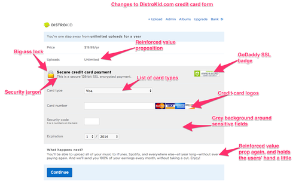
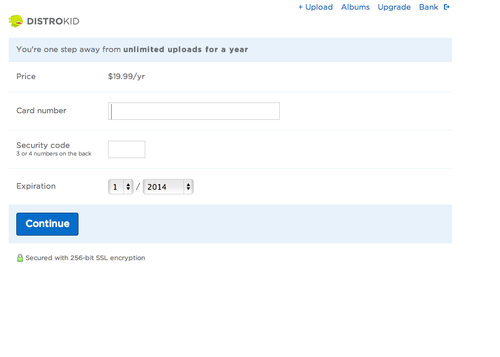
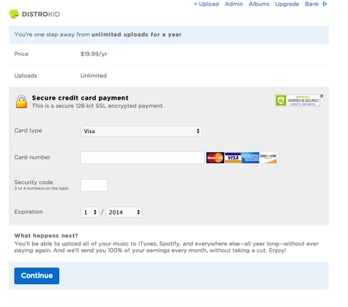

# How I increased conversion on my checkout form by 60% By Philip Kaplan

I run a service called [DistroKid](http://distrokid.com/?ref=tumblr2) that costs $19.99/yr. Musicians use it to get their music into iTunes, Spotify, and other stores.

I noticed that 75% of users were dropping out at the credit card form. A 25% conversion rate seemed okay to me, so I didn’t give it much thought for a year.

Then I randomly came across [an article](http://baymard.com/blog/visually-reinforce-sensitive-fields) about increasing conversion on credit card forms. I followed most of the suggestions and made some other minor changes — and was surprised by the results.

My average conversion rate went from 25% to 40%. That’s a 60% improvement\*.

Here’s what I added — and my armchair psychoanalysis for why they work:

1. **Big-ass lock icon** - The lock + words like “secure” (x2) and “encrypted” lets the user know that we care about security. We use SSL. And really, we use AJAX to transfer cc info directly to Stripe.com, so the numbers never even go through our pipes anyway.
2. **Gray background around sensitive fields** - I think this makes the user think, “anything I type into this gray box is safe.”
3. **Credit card logos** - Associates us with trusted financial brands.
4. **GoDaddy SSL badge** - Looks official and safety-like.
5. **Reinforced value prop** - It says 3 times on this page that you’re getting “unlimited uploads.” I got this idea from dating (and porn) sites where they put pics of attractive people on the cc form. You just might meet (or see) them if you subscribe!
6. **Added card-type dropdown** - *Adding* a field to the checkout flow seemed counter intuitive. But it seems most credit card forms have a dropdown for card-type, so now so do I. The default is Visa because it’s the most popular card. Maybe it makes people think “oh cool, the form is already partly filled-out for me.” Their selection isn’t stored or used for anything.
7. **Personal message** - There’s a personal-sounding message underneath the gray part. This reinforces the gray part, lets me say the value prop again, and makes the user feel coddled.

Before:

After:

\* Knowing the percentage is not very useful without knowing the volume. I’m not ready to disclose actual revenue numbers, but the volume is significant enough.
