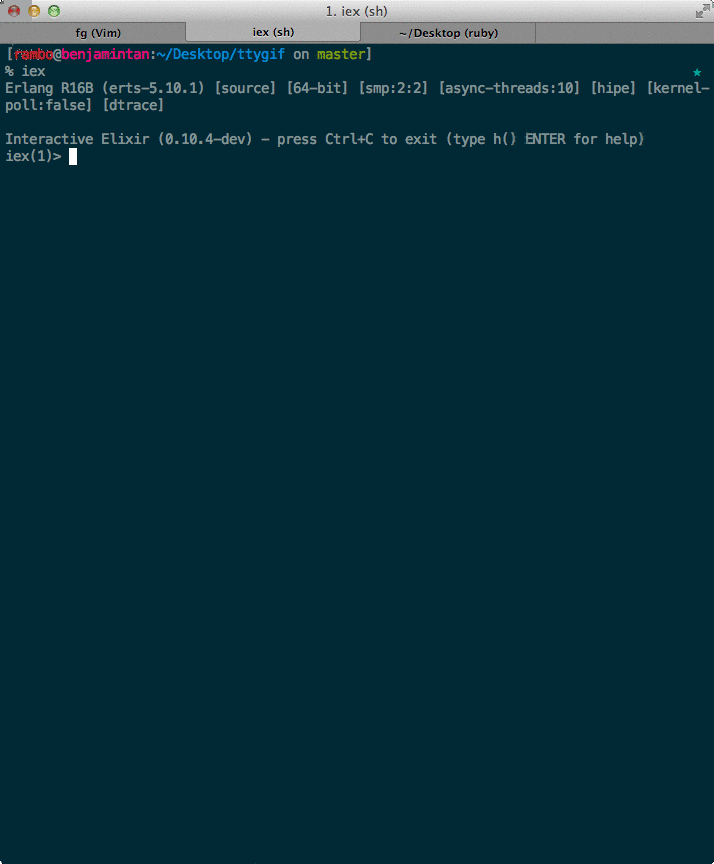

# Elixir – The Love Child of Ruby and Erlang

Published November 7, 2013

Elixir is a functional, meta-programmable language that is built on top of the Erlang VM. Created by Jose Valim in 2011, it has recently gained a lot of interest, especially amongst Ruby and Erlang programmers. Joe Armstrong, one of the inventors of Erlang, even [wrote](http://joearms.github.io/2013/05/31/a-week-with-elixir.html) nice things about Elixir.

For those who are not familiar with Jose, he is a core committer to the Ruby on Rails web framework, and author of popular Ruby gems like Devise. Therefore, it is not surprising to see some Ruby influence in the design of the language. As you wwill soon see, Elixir also borrows many ideas from various programming languages, such as Clojure, Haskell, and Python.

In this article, we take a whirlwind tour of some of best features of Elixir. Along the way, we look at a few short snippets of Elixir code. Let’s dive straight in!

## Prerequisites

If you want to follow the examples, you’ll need at least Elixir v0.10.4-dev installed. Installation instructions can be found [here](http://elixir-lang.org/getting_started/1.html).

I also assume that you are proficient in at least 1 programming language, and pretty comfortable with the terminal.

## 1. The Interactive Elixir Shell

Ruby programmers are familiar with `irb`, the interactive Ruby shell. The Elixir equivalent is `iex`. Out of the box, it presents some pretty nifty features, such as syntax highlighting and a beautiful documentation system.

Once you have Elixir installed, you can launch `iex` from the terminal:

|  |  |
| --- | --- |
|  | `Erlang` `R16B` `(erts-5.10.1) 1 [64-bit] [``smp:2``:2] [async-``threads:10``] [hipe] [kernel-``poll:false``] [dtrace]`  `Interactive` `Elixir` `(0.10.4-dev) - press` `Ctrl``+C to exit (type h()` `ENTER` `for help)`  `iex(1)>` |

### Getting Help

Aside from your editor, you’ll probably spend the most time in `iex`. Therefore, it is very handy to know that you can access Elixir’s documentation from the same environment.

For example, to access the documentation for the `Enum` module, type `h(Enum)`. Similarly, if I’m interested in the `reverse` function of the `Enum` module, then I enter `h(Enum.reverse)` instead.

Here it is in action:

Any code you see in this article can be copied and pasted in `iex`.

## 2. Functional

Elixir is a functional programming (FP) language. It has all the usual features that we have come to expect, such as:

#### Higher-Order Functions

Functions in Elixir are first class citizens. This means that functions can be passed along as arguments to other functions. This also means that functions can return other functions as values.

Here we define an anonymous function that squares a number. This function is assigned to the variable `square`. `Enum.map` takes 2 arguments. The first is a collection such as the sequence `(1..10)`, the second is a function that is applied to each element.

|  |  |
| --- | --- |
|  | `iex> square = fn x -> x * x` `end`  `#``Function``<6.17052888 in :erl_eval.expr/5>`  `iex>` `Enum``.map(1..10, square)`  `[1, 4, 9, 16, 25, 36, 49, 64, 81, 100]` |

#### List Comprehensions

Available in languages such as Haskell and Python, *list comprehensions* are useful when we need to build a list from another list. Here is the Elixir-flavored version:

|  |  |
| --- | --- |
|  | `iex> lc x inlist [1, 2], y inlist [3, 4], do: x * y`  `[3, 4, 6, 8]` |

While I really like list comprehensions, I have found that Elixir often has better functions (such as those from `List` and `Enum`) which are more flexible. This is because list comprehensions, as it name already implies, are only limited to lists.

#### Pattern Matching

Erlang was first written in Prolog. One of the coolest features inherited from Prolog is *pattern matching*. Elixir also has this feature:

|  |  |
| --- | --- |
|  | `iex> {[head | tail], {:atom, msg}} = {[1, 2, 3], {:atom,` `"PATTERN MATCHING FTW!"``}}`  `{[1, 2, 3], {:atom,` `"PATTERN MATCHING FTW!"``}}` |

The above showcases 4 kinds of data types in Elixir, some of which you have already encountered:

| Data Type | Example |
| --- | --- |
| List | `[1, 2, 3]` |
| Tuple | `{:atom, msg}` |
| Atom | `:atom` |
| String | `"FTW!"` |

Some might have seen `[ head | tail ]` in languages such as Haskell. The `|` is the cons operator. It is used to pattern match a list. `head` captures the first element in the list, while `tail` captures the remaining elements, that is also a list.

Let’s examine the contents of `head`, `tail` and `msg`:

|  |  |
| --- | --- |
|  | `iex> head`  `1`  `iex> tail`  `[2, 3]`  `iex> msg`  `"PATTERN MATCHING FTW!"` |

Pattern matching is very powerful, and provides for some very concise programs. It is also very often used in *message passing*, as you will see later.

#### Immutability and Recursion

##### Immutability

Being a FP language, Elixir has *no* loops, or at least the kind you might usually expect. The reason for this is traditional looping constructs such as `for` and `while` introduce *mutability*. In fact, all of Elixir’s data structures are *immutable*. This means, for example, that you cannot modify an existing list:

|  |  |
| --- | --- |
|  | `iex(1)> list = [:a, :b, :c]`  `[:a, :b, :c]`  `iex(2)>` `List``.delete(list, :b)`  `[:a, :c]`  `iex(3)> list`  `[:a, :b, :c]`  `iex(4)> list =` `List``.delete(list, :b)`  `[:a, :c]`  `iex(5)> list`  `[:a, :c]` |

When we call `List.delete` on `list`, the result is `[:a, :c]` – as expected. However, when we inspect the contents of `list`, we realize that `list` has not changed. The only way to capture this value is to assign it to another variable.

##### Recursion

It turns out that we do not need `for` loops at all. Here is a simple recursive program that calculates the length of a list:

|  |  |
| --- | --- |
|  | `defmodule` `MyList` `do`  `def length(the_list) do`  `length(the_list, 0)`  `end`  `def length([], count) do`  `count`  `end`  `def length([_head|tail], count) do`  `length(tail, count + 1)`  `end`  `end` |

Let’s execute it:

|  |  |
| --- | --- |
|  | `iex>` `MyList``.length([1, 2, 3])`  `3` |

No surprise here. But what is going on under the hood is interesting.

Firstly, all the functions are called `length`. The only difference lies in their arity, and the patterns of their arguments. Let’s trace the program:

`MyList.length([1, 2, 3])` calls `MyList.length([1, 2, 3], 0)`. Now, Elixir needs to pattern match a definition of `length` with a *non-empty* list and a number – only the 3rd definition fits the bill. The function calls itself, but this time, with one less element, and increasing `count` by 1.

Notice how the remainder of the list, `tail`, is extracted with the help of the `|` operator. After 2 more recursive calls, we eventually end up with an empty list and `count`, which now contains the actual length of the list we first started off with. Here, only the second definition of `length` will match.

#### Streams

You may have heard of lazy evaluation, which is supported in Haskell and Clojure. Recently, Ruby 2.0 has [lazy enumeration](http://ruby-doc.org/core-2.0/Enumerator/Lazy.html) built in. In Elixir, we have *streams*.

##### Greedy vs Lazy

Most of the functions from the `List` are greedy. That is, the entire result is returned once the function is invoked. That is obviously something we expect. However, consider how you would represent an infinite stream of data. How could you read data from a remote source if you have no knowledge when the data feed ends?

Streams handle these cases very elegantly – by being lazy.

Let’s create an infinite stream of randomly generated 1’s and 0’s.

|  |  |
| --- | --- |
|  | `iex>` `Stream``.repeatedly(fn -> :random.uniform(2) - 1` `end``)`  `#``Function``<6.80570171 in` `Stream``.repeatedly/1>` |

Let’s ask the stream for 5 values:

|  |  |
| --- | --- |
|  | `iex>` `Stream``.repeatedly(fn -> :random.uniform(2) - 1` `end``) |>` `Enum``.take 5`  `[1, 0, 0, 0, 1]` |

## 3. The |> operator

The pipe operator is a particularly interesting and useful operator. |> takes the result of the expression on the left and inserts it as the first parameter of the function call on the right.

In this example, the nested list is sent into `List.flatten` as the first parameter. The result (`[1, 2, 3, 4, 5]`) is then passed as the first parameter of `Enum.map`, where each element is cubed.

|  |  |
| --- | --- |
|  | `iex> [1, [2], [[3, 4], 5]] |>` `List``.flatten |>` `Enum``.map(fn x -> x * x * x` `end``)`  `[1, 8, 27, 64, 125]` |

Without the |> operator, the code would look like an absolute mess:

|  |  |
| --- | --- |
|  | `iex>` `Enum``.map(``List``.flatten([1, [2], [[3, 4], 5]]), fn x -> x * x * x` `end``)`  `[1, 8, 27, 64, 125]` |

Notice how you read this piece of code from outside in. See how using the |> operator makes the code more readable? Elixir programmers use the |> quite liberally. You will also see many examples of this in the official [documentation](http://elixir-lang.org/docs/master/).

## 4. Processes and Message Passing

In object-oriented languages, we create objects. In Elixir, we *spawn processes*. Each process can communicate with other processes via message passing. The receiver of the message can choose to act upon the message if it understands it. Otherwise, the message is simply ignored.

It is important to note that Elixir processes are not the same as operating system processes or threads. Elixir processes are very light-weight and are managed by the VM. It is pretty common for a program to spawn thousands of processes.

### Message Passing in Action

Let’s examine a short program to understand briefly how message passing works.

|  |  |
| --- | --- |
|  | `defmodule` `Greeter` `do`  `def greet do`  `receive` `do`  `{:english, name} ->`  `IO``.puts` `"Hello, #{name}."`  `greet`  `{:chinese, name} ->`  `IO``.puts` `"你好, #{name}."`  `greet`  `{:spanish, name} ->`  `IO``.puts` `"¡Hola!, #{name}."`  `greet`  `:exit ->`  `IO``.puts` `"Bye bye!"`  `_ ->`  `IO``.puts` `"I don't understand ... but Hello anyway!"`  `greet`  `end`  `end`  `end` |

The `receive` block is the most interesting bit. This tells you that this piece of code is meant to be run in a separate process. Once this is done, the process will sit around until it receives a message.

In this example, it understands 4 kinds of messages. Any time it receives a message it understands, it prints out a greeting, and recursively calls `greet` again, in order to prepare for the next message.

In the case where it receives the `:exit` message, the process will simply exit, since `greet` is not called.

For any other kinds of messages, it will simply print an apology, then call `greet` again.

Let’s spawn our very first process:

|  |  |
| --- | --- |
|  | `iex> greeter = spawn(``Greeter``, :greet, [])`  `#``PID``<0.52.0>` |

`spawn` creates a process. We give `spawn` the module (`Greeter`), function (`:greet`), and the arguments. The result is a process id, or *pid*, that is stored in `greeter`.

In order to send messages to `greeter`, we use the `<-` operator:

|  |  |
| --- | --- |
|  | `iex> greeter <- {:english,` `'Amy'``}`  `Hello``,` `Amy``.`  `{:english,` `'Amy'``}`  `iex> greeter <- {:chinese,` `'Ben'``}`  `{:chinese,` `'Ben'``}`  `你好,` `Ben``.`  `iex> greeter <- {:spanish,` `'Charlie'``}`  `{:spanish,` `'Charlie'``}`  `¡``Hola``!,` `Charlie``.` |

Let’s try sending a message that our process cannot understand:

|  |  |
| --- | --- |
|  | `iex(31)> greeter <- {:klingon,` `'David'``}`  `I don't understand ... but` `Hello` `anyway!` |

None of the patterns fit `{:klingon, 'David'}`. Therefore, it falls to the final case. `_` is like a catch-all pattern, therefore it matches *anything* which cannot be matched by the previous 4 patterns.

Finally, we tell `greeter` to exit:

|  |  |
| --- | --- |
|  | `iex(32)> greeter <- :exit`  `:exit`  `Bye` `bye!` |

## 5. Erlang Interoperability

Elixir is still Erlang under the hood – both of these languages share the same byte code. Therefore, you could call *any* Erlang code from Elixir without taking a performance hit:

|  |  |
| --- | --- |
|  | `iex> :erlang.localtime`  `{{2013, 10, 22}, {0, 14, 29}}`  `iex(9)> :random.uniform`  `0.7230402056221108` |

Both `:erlang.localtime` and `:random.uniform` are calls to Erlang functions. In Erlang, the functions would be invoked by `erlang:localtime().` and `random:uniform().` respectively. Erlang interoperability also means that the Elixir programmer is free to use *any* Erlang library, which could be a potential huge time-saver.

Elixir also has access to the full awesomeness of [Erlang’s OTP framework](http://en.wikipedia.org/wiki/Open_Telecom_Platform) – A set of battle-tested libraries that allow the Erlang (and Elixir!) programmer to build robust, concurrent and distributed applications.

## Next Steps

This article has just given you a whirlwind tour of some of the best features of Elixir. Hopefully it has given you a taste of the elegance and power of this exciting language.

Here are some additional resources for you to learn more:

- The official [documentation](http://elixir-lang.org/docs/master/) is indispensable.
- [Programming Elixir: Functional |> Concurrent |> Pragmatic |> Fun](http://pragprog.com/book/elixir/programming-elixir) is a relatively fast paced book for the experienced programmer.
- [Introducing Elixir: Getting Started in Functional Programming](http://shop.oreilly.com/product/0636920030584.do) is a slightly slower paced book, and a great book to start learning FP with.
- [Learn You Some Erlang for Great Good!](http://www.learnyousomeerlang.com/) is probably the most entertaining way to learn about Erlang.
- [Programming Erlang (2nd edition)](http://pragprog.com/book/jaerlang2/programming-erlang) written by one of the inventors of Erlang.
