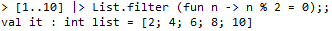
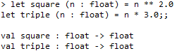
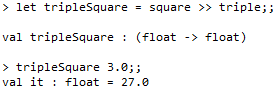
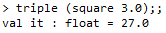
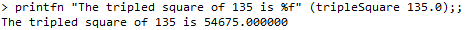
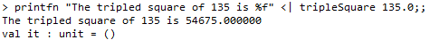
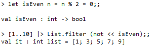

# Pipe Forward and Pipe Backward

I’m tak­ing a bit of time to brush up my knowl­edge of F# and see if I can write bet­ter F# code and one of the things I notice is that whilst I use **pipe-forward** oper­a­tor (**|>**) often when work­ing with col­lec­tions I don’t nearly use the **pipe-backward** oper­a­tor (**<|**) as fre­quently as I should. It makes sense as the pipe-forward oper­a­tor works sim­i­lar to the way and [IEnu­mer­able](http://msdn.microsoft.com/en-us/library/9eekhta0.aspx) works, just to remind myself and oth­ers like me how these work:

#### Pipe-forward oper­a­tor (|>)

Pipe-forward oper­a­tor lets you pass an inter­me­di­ate result onto the next func­tion, it’s defined as:

> **let (|>) x f = f x**

For instance, to apply a [fil­ter](http://msdn.microsoft.com/en-us/library/ee370294.aspx) (i.e. [IEnumerable.Where](http://msdn.microsoft.com/en-us/library/bb534803.aspx)) for even num­bers to a list of inte­gers from 1 to 10, you can write:

> 

You can add fur­ther pro­cess­ing steps to this inter­me­di­ate result:

> 

**For­ward com­po­si­tion operator (»)**

The for­ward com­po­si­tion oper­a­tor lets you ‘com­pose’ func­tions together in a way sim­i­lar to the way the pipe-forward oper­a­tor lets you chain func­tion del­e­gates together, it is defined as:

> **let (») f g x = g (f x)**

Now imag­ine if you have two functions:

> 

You can use them to build a high-order func­tion that returns triples the square of a float, n, using the » operator:

> 

This is syn­tac­ti­cally cleaner and eas­ier to read than:

> 

and it’s espe­cially use­ful when chain­ing together a large num­ber of functions.

#### Pipe-backward oper­a­tor (<|)

The pipe-backward oper­a­tor takes a func­tion on the left and applies it to a value on the right:

> **let (<|) f x = f x**

As unnec­es­sary as it seems, the pipe-backward oper­a­tor has an impor­tant pur­pose in allow­ing you to change oper­a­tor prece­dence with­out those dreaded paren­the­ses every­where and improve read­abil­ity of your code,.

For exam­ple:

> 

can be writ­ten as

> 

**Back­ward com­po­si­tion operator («)**

The inverse of the for­ward com­po­si­tion oper­a­tor, the « oper­a­tor takes two func­tions and applies the right func­tion first and then the left, it’s defined as:

> **let («) f g x = f (g x)**

Mostly I find it more suit­able than the for­ward com­po­si­tion oper­a­tor in cases where you want to negate the result of some func­tion, for exam­ple, to find the odd num­bers in a list:

> 

#### Share story
