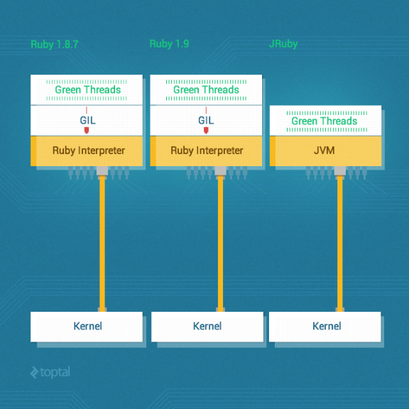
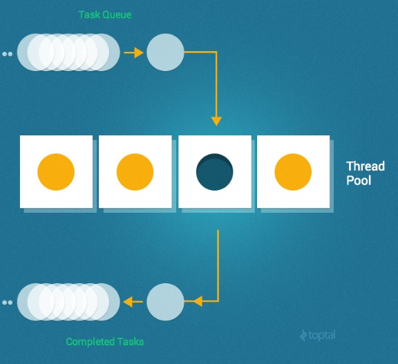

# Ruby Concurrency and Parallelism: A Practical Primer

[View all articles](http://www.toptal.com/blog)

Let’s start by clearing up an all-too-common point of confusion; namely: Concurrency and parallelism are *not* the same thing (i.e., concurrent != parallel).

In particular, **concurrency** is when two tasks can start, run, and complete in *overlapping* time periods. It doesn’t necessarily mean, though, that they’ll ever both be running at the same instant (e.g., multiple threads on a single-core machine). In contrast, **parallelism** is when two tasks literally run *at the same time* (e.g., multiple threads on a multicore processor).


The key point here is that concurrent processes and/or threads will *not necessarily* be running in parallel.

This post provides a practical (rather than theoretical) treatment of the various techniques and approaches that are available for concurrency and parallelism in Ruby.

## Our Test Case

For a simple test case, I’ll create a `Mailer` class and add a Fibonacci function (rather than the `sleep()` method) to make each request more CPU-intensive, as follows:

```
class Mailer

  .deliver(&block)
    mail = MailBuilder.new(&block).mail
    mail.send_mail
  

   = Struct.new(:from, , :subject, :body)  
    send_mail
      fib()
      puts "Email from: #{from}"
      puts "Email to  : #{to}"
      puts "Subject   : #{subject}"
      puts "Body      : #{body}"
    

    fib(n)
      n <  ? n  fib(n-) + fib(n-)
      
  

  class MailBuilder
    initialize(&block)
      @mail = .new
      instance_eval(&block)
    
    
    attr_reader :mail

    %w(from to subject body).each  |m|
      define_method(m)  |val|
        @mail.send(, val)
```

We can then invoke this `Mailer` class as follows to send mail:

```
Mailer.deliver  
      "eki@eqbalq.com"
        "jill@example.com"
  subject "Threading and Forking"
  body    "Some content"
```

*(Note: The source code for this test case is available [here](https://github.com/eqbal/threads_and_forks) on github.)*

To establish a baseline for comparison purposes, let’s begin by doing a simple benchmark, invoking the mailer 100 times:

```
puts Benchmark.measure{
  times  |i|
    Mailer.deliver  
          "eki_#{i}@eqbalq.com"
            "jill_#{i}@example.com"
      subject "Threading and Forking (#{i})"
      body    "Some content"
    
  
}
```

This yielded the following results on a quad-core processor with MRI Ruby 2.0.0p353:

```
15.250000   0.020000  15.270000 ( 15.304447)
```

## Multiple Processes vs. Multiple Threads

There is no “one size fits all” answer when it comes to deciding whether to use multiple processes or to multithread your application. The table below summarizes some of the key factors to consider.

| Processes | Threads |
| --- | --- |
| Uses more memory | Uses less memory |
| If parent dies before children have exited, children can become zombie processes | All threads die when the process dies (no chance of zombies) |
| More expensive for forked processes to switch context since OS needs to save and reload everything | Threads have considerably less overhead since they share address space and memory |
| Forked processes are given a new virtual memory space (process isolation) | Threads share the same memory, so need to control and deal with concurrent memory issues |
| Requires inter-process communication | Can "communicate" via [queues](http://www.ruby-doc.org/stdlib-1.9.3/libdoc/thread/rdoc/Queue.html) and shared memory |
| Slower to create and destroy | Faster to create and destroy |
| Easier to code and debug | Can be significantly more complex to code and debug |

Examples of Ruby solutions that use multiple processes:

- [Resque](https://github.com/resque/resque): A Redis-backed Ruby library for creating background jobs, placing them on multiple queues, and processing them later.
- [Unicorn](https://rubygems.org/gems/unicorn): An HTTP server for Rack applications designed to only serve fast clients on low-latency, high-bandwidth connections and take advantage of features in Unix/Unix-like kernels.

Examples of Ruby solutions that use multithreading:

- [Sidekiq](https://github.com/mperham/sidekiq/wiki): A full-featured background processing framework for Ruby. It aims to be simple to integrate with any modern Rails application and much higher performance than other existing solutions.
- [Puma](https://github.com/puma/puma): A Ruby web server built for concurrency.
- [Thin](https://github.com/macournoyer/thin/): A very fast and simple Ruby web server.

## Multiple Processes

Before we look into multithreading options, let’s explore the easier path of spawning multiple processes.

In Ruby, the `fork()` system call is used to create a “copy” of the current process. This new process is scheduled at the operating system level, so it can run concurrently with the original process, just as any other independent process can. (**Note:** `fork()` is a POSIX system call and is therefore not available if you are running Ruby on a Windows platform.)

OK, so let’s run our test case, but this time using `fork()` to employ multiple processes:

```
puts Benchmark.measure{
  times  |i|
    fork      
      Mailer.deliver  
            "eki_#{i}@eqbalq.com"
              "jill_#{i}@example.com"
        subject "Threading and Forking (#{i})"
        body    "Some content"
      
    
  
  Process.waitall
}
```

(`Process.waitall` waits for *all* child processes to exit and returns an array of process statuses.)

This code now yields the following results (again, on a quad-core processor with MRI Ruby 2.0.0p353):

```
0.000000   0.030000  27.000000 (  3.788106)
```

Not too shabby! We made the mailer ~5x faster by just modifying a couple of lines of code (i.e., using `fork()`).

Don’t get overly excited though. Although it might be tempting to use forking since it’s an easy solution for concurrency, it has a major drawback which is the amount of memory that it will consume. Forking is somewhat expensive, especially if a [Copy-on-Write (CoW)](http://en.wikipedia.org/wiki/Copy-on-write) is not utilized by the Ruby interpreter that you’re using. If your app uses 20MB of memory, for example, forking it 100 times could potentially consume as much as 2GB of memory!

Also, although multithreading has its own complexities as well, there are a number of complexities that need to be considered when using `fork()`, such as shared file descriptors and semaphores (between parent and child forked processes), the need to communicate via pipes, and so on.

## Multithreading

OK, so now let’s try to make the same program faster using multithreading techniques instead.

Multiple threads within a single process have considerably less overhead than a corresponding number of processes since they share address space and memory.

With that in mind, let’s revisit our test case, but this time using Ruby’s `Thread` class:

```
threads = []

puts Benchmark.measure{
  times  |i|
    threads << Thread.      
      Mailer.deliver  
            "eki_#{i}@eqbalq.com"
              "jill_#{i}@example.com"
        subject "Threading and Forking (#{i})"
        body    "Some content"
      
    
  
  threads.map(&:join)
}
```

This code now yields the following results (again, on a quad-core processor with MRI Ruby 2.0.0p353):

```
13.710000   0.040000  13.750000 ( 13.740204)
```

Bummer. That sure isn’t very impressive! So what’s going on? Why is this producing almost the same results as we got when we ran the code synchronously?

The answer, which is the bane of existence of many a Ruby programmer, is the *Global Interpreter Lock (GIL)*. Thanks to the GIL, CRuby (the MRI implementation) doesn’t really support threading.

The [Global Interpreter Lock](http://en.wikipedia.org/wiki/Global_Interpreter_Lock) is a mechanism used in computer language interpreters to synchronize the execution of threads so that only one thread can execute at a time. An interpreter which uses GIL will *always* allow exactly one thread and *one thread only to execute at a time*, even if run on a multi-core processor. Ruby MRI and CPython are two of the most common examples of popular interpreters that have a GIL.

So back to our problem, how can we exploit multithreading in Ruby to improve performance in light of the GIL?

Well, in the MRI (CRuby), the unfortunate answer is that you’re basically stuck and there’s very little that multithreading can do for you.

Concurrency without parallelism can still be very useful, though, for tasks that are IO-heavy (e.g., tasks that need to frequently wait on the network). So threads *can* still be useful in the MRI, for IO-heavy tasks. There is a reason threads were, after all, invented nd used even before multi-core servers were common.

But that said, if you have the option of using a version other than CRuby, you can use an alternative Ruby implementation such as [JRuby](http://jruby.org/) or [Rubinius](http://rubini.us/), since they don’t have a GIL and they do support real parallel threading.



To prove the point, here are the results we get when we run the exact same threaded version of the code as before, but this time run it on JRuby (instead of CRuby):

```
43.240000   0.140000  43.380000 (  5.655000)
```

Now we’re talkin’!

Like what you're reading?

Get the latest updates first.

No spam. Just great engineering posts.

## Threads Ain’t Free

The improved performance with multiple threads might lead one to believe that we can just keep adding more threads – basically infinitely – to keep making our code run faster and faster. That would indeed be nice if it were true, but the reality is that threads are not free and so, sooner or later, you will run out of resources.

Let’s say, for example, that we want to run our sample mailer not 100 times, but 10,000 times. Let’s see what happens:

```
threads = []

puts Benchmark.measure{
  _000.times  |i|
    threads << Thread.      
      Mailer.deliver  
            "eki_#{i}@eqbalq.com"
              "jill_#{i}@example.com"
        subject "Threading and Forking (#{i})"
        body    "Some content"
      
    
  
  threads.map(&:join)
}
```

Boom! I got an error with my OS X 10.8 after spawning around 2,000 threads:

```
can't create Thread: Resource temporarily unavailable (ThreadError)
```

As expected, sooner or later we start thrashing or run out of resources entirely. So the scalability of this approach is clearly limited.

## Thread Pooling

Fortunately, there is a better way; namely, thread pooling.

A thread pool is a group of pre-instantiated, reusable threads that are available to perform work as needed. Thread pools are particularly useful when there are a large number of short tasks to be performed rather than a small number of longer tasks. This prevents having to incur the overhead of creating a thread a large number of times.

A key configuration parameter for a thread pool is typically the number of threads in the pool. These threads can either be instantiated all at once (i.e., when the pool is created) or lazily (i.e., as needed until the maximum number of threads in the pool has been created).

When the pool is handed a task to perform, it assigns the task to one of the currently idle threads. If no threads are idle (and the maximum number of threads have already been created) it waits for a thread to complete its work and become idle and then assigns the task to that thread.



So, returning to our example, we’ll start by using `Queue` (since it’s a [thread safe](http://en.wikipedia.org/wiki/Thread_safety) data type) and employ a simple implementation of the thread pool:

require “./lib/mailer”
require “benchmark”
require ‘thread’

```
POOL_SIZE = 

jobs = Queue.

_0000.times{|i| jobs.push i}

workers = (POOL_SIZE).times.map 
  Thread. 
    begin      
      while x = jobs.pop()
        Mailer.deliver  
              "eki_#{x}@eqbalq.com"
                "jill_#{x}@example.com"
          subject "Threading and Forking (#{x})"
          body    "Some content"
        
      
    rescue ThreadError
    
  

workers.map(&:join)
```

In the above code, we started by creating a `jobs` queue for the jobs that need to be performed. We used `Queue` for this purpose since it’s thread-safe (so if multiple threads access it at the same time, it will maintain consistency) which avoids the need for a more complicated implementation requiring the use of a [mutex](http://en.wikipedia.org/wiki/Mutual_exclusion).

We then pushed the IDs of the mailers to the job queue and created our pool of 10 worker threads.

Within each worker thread, we pop items from the jobs queue.

Thus, the life-cycle of a worker thread is to continuously wait for tasks to be put into the job Queue and execute them.

So the good news is that this works and scales without any problems. Unfortunately, though, this is fairly complicated even for our simple example case.

## Celluloid

Thanks to the [Ruby Gem](https://rubygems.org/) ecosystem, much of the complexity of multithreading is neatly encapsulated in a number of easy-to-use Ruby Gems out-of-the-box.

A great example is Celluloid, one of my favorite ruby gems. Celluloid framework is a simple and clean way to implement actor-based concurrent systems in Ruby. [Celluloid](https://rubygems.org/gems/celluloid) enables people to build concurrent programs out of concurrent objects just as easily as they build sequential programs out of sequential objects.

In the context of our discussion in this post, I’m specifically focusing on the Pools feature, but do yourself a favor and check it out in more detail. Using Celluloid you’ll be able to build multithreaded programs without worrying about nasty problems like deadlocks, and you’ll find it trivial to use other more sophisticated features like Futures and Promises.

Here’s how simple a multithreaded version of our mailer program is using Celluloid:

```
require "./lib/mailer"
require "benchmark"
require "celluloid"

class MailWorker
  include Celluloid

  send_email(id)
    Mailer.deliver  
      from    "eki_#{id}@eqbalq.com"
      to      "jill_#{id}@example.com"
      subject "Threading and Forking (#{id})"
      body    "Some content"
           
  

mailer_pool = MailWorker.pool(size: )

10_000.times  |i|
  mailer_pool.async.send_email(i)
```

Clean, easy, scalable, and robust. What more can you ask for?

## Background Jobs

Of course, another potentially viable alternative, depending on your operational requirements and constraints would be to employ [background jobs](https://www.ruby-toolbox.com/categories/Background_Jobs). A number of Ruby Gems exist to support background processing (i.e., saving jobs in a queue and processing them later without blocking the current thread). Notable examples include [Sidekiq](http://sidekiq.org/), [Resque](https://github.com/resque/resque), [Delayed Job](https://github.com/collectiveidea/delayed_job), and [Beanstalkd](http://kr.github.io/beanstalkd/).

For this post, I’ll use [Sidekiq](http://sidekiq.org/) and [Redis](http://redis.io/) (an open source key-value cache and store).

First, let’s install Redis and run it locally:

```
brew install redis
redis-server /usr/local/etc/redisconf
```

With our local Redis instance running, let’s take a look at a version of our sample mailer program (`mail_worker.rb`) using Sidekiq:

```
require_relative "../lib/mailer"
require "sidekiq"

class MailWorker
  include Sidekiq::Worker
  
  perform(id)
    Mailer.deliver  
      from    "eki_#{id}@eqbalq.com"
      to      "jill_#{id}@example.com"
      subject "Threading and Forking (#{id})"
      body    "Some content"
```

We can trigger Sidekiq with the `mail_worker.rb` file:

```
sidekiq  -r ./mail_worker
```

And then from [IRB](http://www.ruby-doc.org/stdlib-2.0/libdoc/irb/rdoc/IRB.html):

```
⇒  irb
>> require_relative "mail_worker"
=>> 100.times{|i| MailWorker.perform_async(i)}
2014-12-20T02:42:30Z 46549 TID-ouh10w8gw INFO: Sidekiq client with redis options {}
=
```

Awesomely simple. And it can scale easily by just changing the number of workers.

Another option is to use [Sucker Punch](https://github.com/brandonhilkert/sucker_punch), one of my favorite asynchronous RoR processing libraries. The implementation using Sucker Punch will be very similar. We’ll just need to include `SuckerPunch::Job` rather than `Sidekiq::Worker`, and `MailWorker.new.async.perform()` rather `MailWorker.perform_async()`.

## Conclusion

High concurrency is not only achievable in Ruby, but is also simpler than you might think.

One viable approach is simply to fork a running process to multiply its processing power. Another technique is to take advantage of multithreading. Although threads are lighter than processes, requiring less overhead, you can still run out of resources if you start too many threads concurrently. At some point, you may find it necessary to use a thread pool. Fortunately, many of the complexities of multithreading are made easier by leveraging any of a number of available gems, such as Celluloid and its Actor model.

Another way to handle time consuming processes is by using background processing. There are many libraries and services that allow you to implement background jobs in your applications. Some popular tools include database-backed job frameworks and message queues.

Forking, threading, and background processing are all viable alternatives. The decision as to which one to use depends on the nature of your application, your operational environment, and requirements. Hopefully this article has provided a useful introduction to the options available.

[Hiring? Meet the Top 10 Ruby Developers for Hire in February 2015](http://www.toptal.com/ruby)
